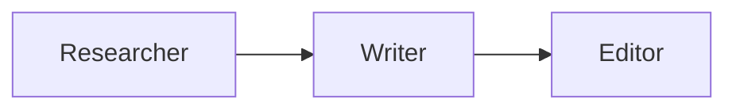
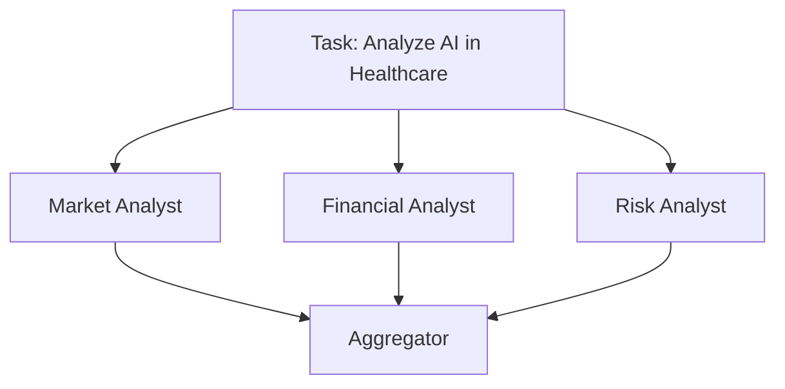
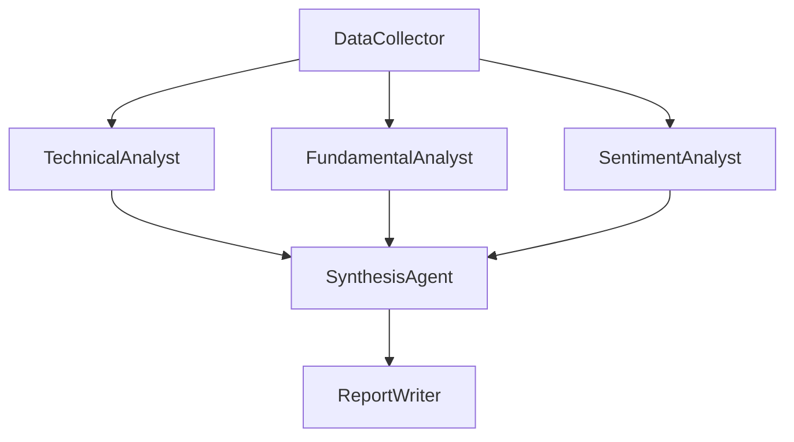

# Sequential, Concurrent, and Graph Workflows: The Three Shapes of Agent Orchestration

Agent orchestration patterns come in exactly three shapes: sequential (a line, where each agent's output feeds the next), concurrent (a fan-out, where independent agents run the same task in parallel and their results are aggregated), and graph (a directed acyclic graph, where some steps run in sequence, some in parallel, and results merge at defined points). Almost every multi-agent system you will ever build is one of these three topologies, or a combination of them nested inside a bigger graph. Picking the right one is not a stylistic choice — it changes latency, cost, failure behavior, and how easy the pipeline is to debug six months later.

This post is about the shapes themselves, independent of any particular tool for drawing or running them. If you want the visual editor for composing graph workflows on Swarms Cloud, see [Inside the Swarms Cloud Workflow Builder](/blog/workflow-builder-swarms-cloud). If you want a primer on what a multi-agent system is in the first place, see [What Is a Multi-Agent System?](/blog/what-is-a-multi-agent-system). This post assumes you already know agents exist and goes straight to how to wire them together.

## Why Topology Is the First Decision

Before picking models, prompts, or tools, every multi-agent design forces one structural question: does step two need step one's output, or can both run at once? The answer to that single question determines which of the three shapes you need. Get it wrong and the symptoms show up later as either wasted latency (running things in sequence that didn't need to be) or wasted compute and racing outputs (running things in parallel that actually depended on each other). The three shapes below map directly onto `SequentialWorkflow`, `ConcurrentWorkflow`, and `GraphWorkflow` in the Swarms framework, but the underlying logic applies regardless of what library or platform you use.

## Sequential Workflows: The Pipeline

A sequential workflow is a straight line. Agent A produces an output, that output becomes agent B's input, B's output becomes C's input, and so on. There is no branching and no parallelism — each step is a hard dependency on the one before it.



Use a sequential workflow whenever each stage genuinely needs the previous stage's finished output to do its job: a researcher gathers raw information, a writer turns that research into prose, an editor polishes the prose. Trying to parallelize this would mean the writer starts before there's anything to write about. In the Swarms framework, this maps directly to `SequentialWorkflow`:

```python
from swarms import Agent, SequentialWorkflow

researcher = Agent(
    agent_name="Researcher",
    system_prompt="Research the given topic and provide detailed information.",
    model_name="gpt-5.4",
    max_loops=1,
)

writer = Agent(
    agent_name="Writer",
    system_prompt="Transform research into an engaging article.",
    model_name="gpt-5.4",
    max_loops=1,
)

editor = Agent(
    agent_name="Editor",
    system_prompt="Edit and polish the article for publication.",
    model_name="gpt-5.4",
    max_loops=1,
)

workflow = SequentialWorkflow(
    agents=[researcher, writer, editor],
    max_loops=1,
)

result = workflow.run("The impact of AI on healthcare")
print(result)
```

`SequentialWorkflow` also exposes `run_batched()` for processing multiple tasks through the same pipeline, `run_async()` and `run_stream()` for asynchronous and token-streamed execution, and even `run_concurrent()` for firing several independent tasks through the same sequential chain at once. But the chain itself, agent to agent, always stays a line.

The tradeoff a sequential workflow makes is explicit: total latency is the sum of every step's latency, because nothing can start early. Three agents at ten seconds each is thirty seconds, no matter how much idle compute you have available. In exchange, you get the simplest possible failure model — if step two fails, you know exactly what state step one left behind, and there's no ambiguity about which output caused the problem. For pipelines where correctness depends on strict ordering, that predictability is worth more than the wall-clock time you'd save by running things in parallel.

## Concurrent Workflows: The Fan-Out

A concurrent workflow is the opposite shape: one input, several agents processing it independently and simultaneously, with no agent depending on another agent's output. This is the pattern for "give me N independent perspectives on the same input," where the value comes from diversity of analysis, not from any ordering between the analyses.



A market analyst, a financial analyst, and a risk analyst can all read the same brief and produce their own independent output at the same time — none of them needs to wait on the others, because none of them is building on another's conclusion. In Swarms, this is `ConcurrentWorkflow`:

```python
from swarms import Agent, ConcurrentWorkflow

market_analyst = Agent(
    agent_name="Market-Analyst",
    system_prompt="Analyze market trends and opportunities.",
    model_name="gpt-5.4",
)

financial_analyst = Agent(
    agent_name="Financial-Analyst",
    system_prompt="Provide financial analysis and projections.",
    model_name="gpt-5.4",
)

workflow = ConcurrentWorkflow(
    agents=[market_analyst, financial_analyst],
    max_loops=1,
    show_dashboard=True,
)

results = workflow.run("Analyze the potential impact of AI on healthcare")
print(results)
```

By default, `ConcurrentWorkflow` returns `output_type="dict-all-except-first"`, aggregating every agent's output into a single structure keyed by agent name, which is what the aggregation step in the diagram above is really doing under the hood — there's no separate "aggregator agent" required unless you want one to synthesize the parallel outputs into a single narrative. `show_dashboard=True` gives you a live view of each agent's progress as they run, which matters more here than in a sequential chain since several things are happening at once and you otherwise lose visibility into which one is slow. For running the same fan-out across many different inputs, `batch_run()` processes a list of tasks, executing the full concurrent fan-out for each one.

The tradeoff concurrency makes is the mirror image of sequential: wall-clock latency drops to roughly the slowest single agent instead of the sum of all of them, but you give up any ability for one agent's output to inform another's. If the financial analyst actually needed the market analyst's conclusion, running them concurrently would just mean the financial analyst works from stale or missing context. Concurrency only pays off when the parallel branches are genuinely independent.

## Graph Workflows: The DAG

Most real systems are neither a pure line nor a pure fan-out — they're both, in different places. A graph workflow expresses that directly: a directed acyclic graph where some agents run in sequence, some run in parallel, and results converge at defined merge points before continuing.



A single data collector gathers the raw input, three specialist analysts process it in parallel, and a synthesis agent waits for all three before producing a combined view, which then feeds a final report writer. That's a branch and a merge in the same graph, something neither a pure sequential chain nor a pure concurrent fan-out can express on its own. In Swarms, this is `GraphWorkflow`, built from nodes and edges rather than a flat list:

```python
from swarms import Agent
from swarms.structs.graph_workflow import GraphWorkflow

data_collector = Agent(
    agent_name="DataCollector",
    system_prompt="Collect and validate data from sources.",
    model_name="gpt-5.4",
)
technical_analyst = Agent(
    agent_name="TechnicalAnalyst",
    system_prompt="Analyze technical indicators and signals.",
    model_name="gpt-5.4",
)
fundamental_analyst = Agent(
    agent_name="FundamentalAnalyst",
    system_prompt="Analyze fundamentals and financial statements.",
    model_name="gpt-5.4",
)
sentiment_analyst = Agent(
    agent_name="SentimentAnalyst",
    system_prompt="Analyze market sentiment and news flow.",
    model_name="gpt-5.4",
)
synthesis_agent = Agent(
    agent_name="SynthesisAgent",
    system_prompt="Synthesize the three analyses into one view.",
    model_name="gpt-5.4",
)

workflow = GraphWorkflow(
    name="Market-Analysis-Pipeline",
    description="Collect data, fan out to analysts, then synthesize.",
)

for agent in [
    data_collector,
    technical_analyst,
    fundamental_analyst,
    sentiment_analyst,
    synthesis_agent,
]:
    workflow.add_node(agent)

# Branch: one node feeds three
workflow.add_edges_from_source(
    source="DataCollector",
    targets=["TechnicalAnalyst", "FundamentalAnalyst", "SentimentAnalyst"],
)

# Merge: three nodes feed one
workflow.add_edges_to_target(
    sources=["TechnicalAnalyst", "FundamentalAnalyst", "SentimentAnalyst"],
    target="SynthesisAgent",
)

workflow.compile()
result = workflow.run("Evaluate whether to increase healthcare-AI exposure")
print(result)
```

`add_edges_from_source()` writes the fan-out edges in one call instead of three, and `add_edges_to_target()` does the same for the fan-in. `GraphWorkflow` also supports a full-mesh helper, `add_parallel_chain()`, for connecting every node in one group to every node in another, and a tuple shorthand — `("agent1", ["agent2", "agent3"])` for a branch, `(["agent1", "agent2"], "agent3")` for a merge — when you'd rather describe edges declaratively than call methods one at a time. Calling `compile()` before `run()` lets the workflow validate the graph and precompute the execution order once, rather than re-resolving dependencies on every run.

The tradeoff a graph workflow makes is complexity in exchange for precision. You get to encode exactly the dependency structure your task actually has — no forced serialization where parallelism was possible, no forced parallelism where a real dependency existed — but you now own a graph: entry points, end points, and the possibility of a cycle or an orphaned node if it's built by hand instead of validated. That complexity is exactly what a visual editor like the [Swarms Cloud Workflow Builder](/blog/workflow-builder-swarms-cloud) is designed to manage, letting you see the DAG's shape instead of holding it in your head while writing `add_edge()` calls.

## Choosing Between Them

| Pattern | Shape | Latency | When to use |
| --- | --- | --- | --- |
| Sequential | Line | Sum of all steps | Each step strictly needs the previous step's output |
| Concurrent | Fan-out | Slowest single step | Independent perspectives on the same input |
| Graph | DAG | Sum along the critical path | Mixed dependencies: some steps parallel, some sequential |

In practice, the question to ask is simply: does this step need another step's output before it can start? If every step needs the one before it, you have a sequential workflow. If no step needs any other, you have a concurrent workflow. If the answer is "some do and some don't," you have a graph, whether or not you reach for a graph-specific class to build it — a hand-rolled combination of sequential and concurrent stages is a graph workflow in every sense except the name.

These shapes also compose. A node in a `GraphWorkflow` doesn't have to be a single agent; it can be an entire `ConcurrentWorkflow` or `SequentialWorkflow` running as one step in the larger graph, and any of the three can appear as a subgraph inside a bigger orchestration. The three-analyst fan-out in the example above is already a concurrent sub-workflow living inside a graph. Complex multi-agent systems are rarely one pure pattern all the way down; they're usually a graph whose nodes are, themselves, small sequential or concurrent workflows.

## Links and Resources

| Resource | Link |
| --- | --- |
| Sequential Workflow Docs | [docs.swarms.world/architectures/sequential-workflow](https://docs.swarms.world/architectures/sequential-workflow) |
| Concurrent Workflow Docs | [docs.swarms.world/architectures/concurrent-workflow](https://docs.swarms.world/architectures/concurrent-workflow) |
| Graph Workflow Docs | [docs.swarms.world/architectures/graph-workflow](https://docs.swarms.world/architectures/graph-workflow) |
| Architecture Overview | [docs.swarms.world/architectures/overview](https://docs.swarms.world/architectures/overview) |
| Visual Workflow Builder | [Inside the Swarms Cloud Workflow Builder](/blog/workflow-builder-swarms-cloud) |
| Documentation | [docs.swarms.ai](https://docs.swarms.ai) |
| Discord Community | [discord.gg/VapjxpSyHC](https://discord.gg/VapjxpSyHC) |

---

*Have questions or feedback? Join our [Discord community](https://discord.gg/VapjxpSyHC) or check out the [documentation](https://docs.swarms.ai).*

