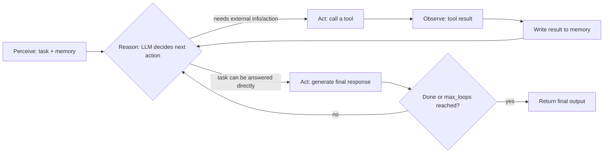

# Agentic AI Explained: How Autonomous Agents Actually Decide What to Do

Agentic AI refers to systems built around a large language model that can decide, on its own, what actions to take to complete a task, rather than simply returning one completion to one prompt. An agentic system perceives a task and its context, reasons about what step comes next, acts by calling a tool or producing output, and then observes the result of that action before deciding on the next step, repeating this loop until the task is done. The key distinction from a plain chatbot is control: a chatbot produces text and stops, while an agent produces actions, evaluates their outcomes, and keeps going until it decides it is finished.

That definition sounds simple, but the mechanics behind "decides on its own" are where most explanations get vague. This post goes past the marketing version of agentic AI and walks through the actual loop, using the real architecture Swarms agents run on: how an agent perceives a task, how it chooses between answering directly and calling a tool, how memory constrains and informs that choice, and why "how hard the agent thinks" is itself a setting you configure rather than a fixed trait of the underlying model.

## Agentic AI vs. a Single Completion

A single LLM completion is a function call: text in, text out. There is no loop, no state carried forward, and no mechanism for the model to check its own work or reach outside the context window. If the prompt asks for a calculation the model gets wrong, or a fact it doesn't know, or a file it can't see, the completion simply fails or hallucinates. There is nowhere for it to go to fix that.

An agent wraps that same underlying model in a loop with three things a single completion does not have: a memory of what has happened so far in this task, a set of tools it can invoke to affect or query the outside world, and control logic that decides whether to keep iterating or stop. A Swarms `Agent` combines exactly these three components: the LLM as the reasoning engine, tools that extend it beyond text generation, and a memory system that maintains context across the steps of a task. Everything that makes an agent "agentic" rather than "conversational" comes from that combination, not from the model itself getting smarter.

## The Perceive-Reason-Act Loop

Concretely, the Swarms agent lifecycle runs a structured, repeating cycle:

1. **Perceive** — the agent receives the task and pulls in relevant context from memory: the conversation so far, any prior tool results, and its system prompt.
2. **Reason** — the underlying LLM processes that input and decides what to do next: answer directly, or call one of its available tools, and if so, with what arguments.
3. **Act** — the agent executes the chosen action, whether that's generating a response or actually invoking a tool, and the result is written back into memory before the loop repeats.

This is not a metaphor for what's happening inside the model's weights, it's the literal control flow the agent runtime executes. The loop repeats until the task is judged complete or the agent hits its configured iteration limit, and every pass through it gives the agent a chance to notice something went wrong on the last step and correct course, since tool results feed straight back into the next reasoning pass rather than disappearing after use.



If you've read our companion piece on [what a multi-agent system is](/blog/what-is-a-multi-agent-system), this loop is the unit that gets composed into larger graphs: a multi-agent system is a network of these loops passing outputs between each other, rather than one loop running in isolation.

## Autonomy Is a Configuration, Not a Vibe

How long an agent is allowed to keep looping, and how it decides it's done, is a literal parameter, `max_loops`, not an emergent property of "how agentic" a model feels. Three modes matter in practice:

- **Fixed loops** (`max_loops=5`) — the agent gets exactly N passes through the reason-act cycle, useful when a task has a known, bounded number of steps.
- **Single execution** (`max_loops=1`) — the agent behaves like a single completion with tool access: one reasoning pass, one action, done. This is the right setting for straightforward, single-step requests where looping would just add latency.
- **Auto mode** (`max_loops="auto"`) — the agent determines for itself when the task is complete and exits the loop on its own judgment, rather than running a fixed count. This is what makes an agent feel "autonomous": it isn't a different model, it's the same reasoning loop with the stopping condition handed to the agent instead of hardcoded by the caller.

This matters because it means autonomy is tunable per task. A data-extraction agent that always does exactly one pass and a research agent that loops until it decides it has enough sources are running the identical architecture, just with a different value in one field.

## Tool Calling: How an Agent Reaches Outside the Model

The "act" step is where an agent stops being a text generator and starts being able to do things. In Swarms, tools are ordinary Python functions with type hints and a docstring; the framework converts them automatically into OpenAI-compatible function schemas via `BaseTool`, and you register them by passing a list to the agent:

```python
agent = Agent(
    agent_name="Weather-Assistant",
    model_name="claude-sonnet-4-6",
    tools=[get_weather, calculate, search_database],
)
```

During the reason step, the model is shown the schemas for every registered tool alongside the task, and it decides, using standard function-calling, whether to answer directly or emit a call to one of them with specific arguments. That decision is itself configurable through `tool_choice`: `"auto"` lets the model decide whether to use a tool at all, `"required"` forces it to call one, and `"none"` disables tool use for that pass. Once a call is made, the agent executes the selected function (with automatic retries on failure, `tool_retry_attempts`, default 3), and the result is fed straight back into the reasoning loop as new context for the next decision.

**A concrete example.** Say an agent with `tools=[get_weather, calculate]` and `tool_choice="auto"` is given the task "What's the weather in Austin, and if it's above 90°F, convert that to Celsius." On the first reason step, the model has no weather data yet, so it calls `get_weather(location="Austin, TX")`. That result ("94°F") is written to memory. On the second reason step, the model now has the temperature in context, recognizes the condition is met, and calls `calculate` to convert 94°F to Celsius. On the third pass, with both results in memory, it composes the final answer. Three reasoning passes, two tool calls, one final response, all inside the same loop, with no step requiring a human to manually chain the calls together.

## Memory: What the Agent Actually Sees at Each Step

Every reasoning pass is only as good as the context it's given, and Swarms agents manage that context across several layers rather than one flat transcript. In-process, `conversation_history` holds the messages for the current run. On disk, when `persistent_memory=True` (the default), the agent writes its active interaction log to a `MEMORY.md` file and reloads it if another process starts an agent with the same `agent_name`, so an agent's short-term memory can survive a restart. As a task runs long, a `ContextCompressor` can trigger automatic compaction: once token usage crosses a configured threshold relative to the model's context length, an LLM summarizes the transcript, the prior raw log is archived to `archive/history_<timestamp>.md`, and the active memory is replaced with the compressed summary, so the loop doesn't silently fall over once a task runs past the context window.

That's distinct from long-term memory in the retrieval-augmented sense: passing a `BaseVectorDatabase` as `long_term_memory` gives an agent the ability to pull relevant facts from an external document store or knowledge base mid-task, independent of its own conversation history. The rule of thumb worth keeping straight: `MEMORY.md` and conversation history are the agent remembering what it has already done; RAG is the agent looking something up it never did itself.

## Reasoning Strategy Is Also a Knob

The reason step doesn't have to be one plain LLM call either. Swarms exposes several distinct reasoning strategies through a `ReasoningAgentRouter`, each trading latency and cost for a different way of arriving at an answer:

| Strategy | Mechanism |
| --- | --- |
| Self-Consistency Agent | Runs multiple independent reasoning paths and aggregates them by majority vote |
| Reasoning Duo | Splits reasoning and execution across two separate agents |
| IRE Agent (Iterative Reflective Expansion) | Generates a hypothesis, simulates the path, reflects on errors, and revises |
| Reflexion Agent | Actor-evaluator-reflector loop that improves through experience across attempts |
| GKP Agent (Generated Knowledge Prompting) | Generates relevant background knowledge first, then reasons over it from multiple angles before answering |
| Agent Judge | Structured quality assessment and scoring of an output, rather than producing one |

None of these change the underlying model; they change how many reasoning passes happen and how their results get combined before the agent commits to an action. Configuration is straightforward: the router takes a `swarm_type` selecting the strategy, plus `num_samples` and `max_loops` to control how much reasoning budget to spend. This is the same principle as `max_loops="auto"` applied one level up: how thoroughly an agent reasons before acting is a parameter you set based on the task's stakes and latency budget, not a fixed characteristic of "agentic AI" in the abstract.

## Why the Mechanics Matter

The reason it's worth being this specific is that "agentic AI" gets used loosely enough to mean almost anything with an LLM behind it. The useful distinction is architectural: does the system loop, act, observe, and decide when to stop, or does it just complete a prompt once? A perceive-reason-act loop with tool access, persistent and compactable memory, and a configurable stopping condition is what makes an agent capable of multi-step, self-correcting work instead of one-shot generation. Everything covered here, `max_loops`, `tool_choice`, `MEMORY.md`, the `ReasoningAgentRouter`, is that loop made concrete and adjustable rather than left as an implicit property of "a smart enough model."

## Links and Resources

| Resource | Link |
| --- | --- |
| Agent Concepts | [docs.swarms.world/concepts/agents](https://docs.swarms.world/concepts/agents) |
| Reasoning Agents Overview | [docs.swarms.world/agents/reasoning-agents-overview](https://docs.swarms.world/agents/reasoning-agents-overview) |
| Agent Tools | [docs.swarms.world/agents/agent-tools](https://docs.swarms.world/agents/agent-tools) |
| Agent Memory | [docs.swarms.world/agents/agent-memory](https://docs.swarms.world/agents/agent-memory) |
| What Is a Multi-Agent System | [/blog/what-is-a-multi-agent-system](/blog/what-is-a-multi-agent-system) |
| Documentation | [docs.swarms.ai](https://docs.swarms.ai) |
| Discord Community | [discord.gg/VapjxpSyHC](https://discord.gg/VapjxpSyHC) |

---

*Have questions or feedback? Join our [Discord community](https://discord.gg/VapjxpSyHC) or check out the [documentation](https://docs.swarms.ai).*
