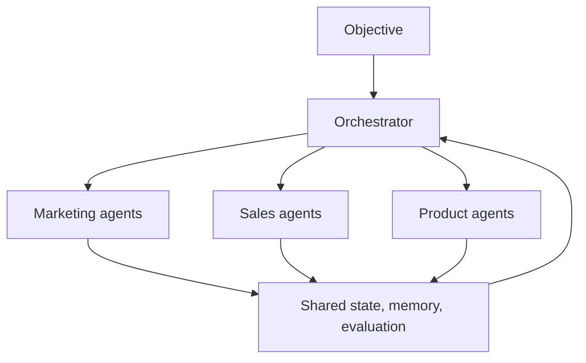
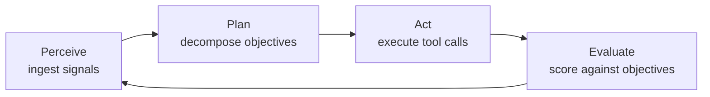
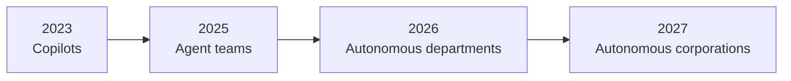

# The Autonomous Economy Is Coming: Our Founders Keynote at AI Salon

A few days ago, Swarms co-founder and CEO Kye Gomez took the stage at AI Salon to deliver a keynote on the future of the economy to an audience of more than 80 founders, engineers, and investors. The thesis was direct: corporations run entirely by AI agents are coming, they will operate with near-zero overhead, and the transition is already underway.

The full presentation is [publicly available here](https://docs.google.com/presentation/d/1ssjQUMRaUbmGAjkwsmVwWLxfjo9Kl46VyJbTpo25Xng/edit?usp=sharing). This post walks through the core arguments, then closes with a hands-on quickstart so you can deploy your first swarm on the [Swarms API](https://swarms.ai) today.

## Autonomous corporations are inevitable

The keynote opened with the economics. The cost of cognition is collapsing toward zero. Agent reasoning gets cheaper by the month, and the trend shows no sign of stopping. An agent works through the night. It does not negotiate salaries, does not forget, does not burn out, and does not hand in notice. Every economic force points in one direction, and none point back.

The consequence is that the first fully autonomous corporation will not announce itself. There will be no press release. It will simply undercut everything around it, operating at machine speed, at machine cost, around the clock. Competitors will notice their margins evaporating against a company that never closes and barely costs anything to run.

Firms that route every decision through a person will find themselves bidding against firms that do not. That competition has one outcome. The only open question, as Kye put it, is who builds the winners.

## A second labor force is arriving

The most striking number in the keynote was a projection: 4 to 6 billion autonomous agents operating worldwide by the early 2030s, measured against a global human workforce of roughly 3.6 billion. That is on the order of one agent for every working person on Earth, and compounding from there.

The asymmetry sits in the replication function. A human worker requires roughly 25 years of development, education, and training before entering the labor force. An agent instance is provisioned in milliseconds and copied at no marginal training cost. The two populations are governed by entirely different growth curves.

If the projection holds, deployed agents reach parity with human economic participants and then exceed them, with no comparable ceiling on further growth. This is the last generation in which human workers form the majority of economic actors by count.

## The firm becomes software

Why does this reshape the corporation specifically? Because a corporation is, at its core, an information-processing system. It senses markets, allocates resources, and executes decisions. Every one of those functions is now performable by LLM agents.

The autonomous corporation replaces the human hierarchy with a coordinated swarm: specialized agents per function, an orchestration layer for control, and tools as the interface to the world. A traditional hierarchy is slow and serial, and it works eight hours a day. An agent swarm is parallel and continuous, and it works around the clock.



In this model, every department decomposes into narrow, specialized agents. Each agent holds one role, one context, and one toolset, and coordinates with its peers through the department orchestrator:

- **Marketing** becomes a content agent, an SEO agent, a campaign agent, and an analytics agent, generating, distributing, and measuring demand continuously.
- **Sales** becomes a prospecting agent, an outreach agent, a negotiation agent, and a CRM agent, running the full pipeline from lead to closed contract.
- **Product** becomes research, spec, engineering, and QA agents, shipping features from user signal to verified release.

The constraint on the firm is no longer headcount. It is orchestration quality.

## Orchestration is the new management

If agents are the workforce, orchestration is the management layer, and the keynote treated it as the discipline that decides who wins. Three functions matter most:

- **Routing.** The orchestrator decomposes objectives into tasks and assigns each to the best-fit agent.
- **Shared state.** Agents read and write a common memory layer, so context survives handoffs between departments.
- **Evaluation.** Outputs are scored against objectives before release. Failures are re-routed instead of shipped.

Agents act on the world through tools: browsers, code execution, CRMs, payments, databases, email. Each agent is provisioned with a scoped toolset, the APIs and permissions its role requires and nothing more. Tool scoping is the primary safety and reliability boundary of the autonomous firm, and because every call is logged, the corporation's entire activity is an auditable trace.

Underneath it all, every agent and the corporation as a whole runs the same recursive cycle. It never stops:



**Perceive** ingests market data, user events, internal state, and prior results. **Plan** decomposes the objective into tasks and selects agents and tools for each. **Act** executes tool calls in parallel across the swarm and writes results to shared state. **Evaluate** scores outcomes against objectives and feeds the delta back into the next cycle.

## The marginal cost of work approaches zero

Once a role is encoded as an agent, every additional copy is nearly free. The economics are stark when placed side by side:

| | Human knowledge worker | Agent |
|---|---|---|
| **Annual cost** | $80,000+ in salary, benefits, office | Metered API calls |
| **Hours of output** | ~2,000 per year, serial | 8,760 per year, massively parallel |
| **Time to deploy** | Months to recruit, hire, train | Seconds to instantiate from config |
| **Marginal copy** | Impossible | ~$0 |

Classical firm economics were built on scarce, expensive labor. They do not survive this. When labor is software, headcount is a rounding error and orchestration is the only scarce input.

## The path is already underway

The keynote traced the trajectory as a sequence of phases, each a strict superset of the last, with the gaps between them shrinking:



In 2023, single agents assisted individual humans, with a human approving every action. By 2025, small swarms owned whole workflows, with humans supervising by exception. In 2026, entire functions such as support, growth, and operations run without human staff. In 2027, the firm itself is a swarm, and humans hold equity rather than jobs.

Each transition removes a human checkpoint, and none of those checkpoints have been reinstated. The deck places the endpoint next year, not a decade away.

## Quickstart: deploy your first swarm on the Swarms API

This is the future the Swarms API is built for: a single endpoint for defining agents, composing them into swarms, and selecting an orchestration architecture. Agents are declared instead of engineered: a role, a model, a toolset. The API handles scheduling, state, retries, and inter-agent messaging. A department becomes a config file, and a corporation becomes a set of them.

Here is how to go from zero to a running swarm in about five minutes.

### Step 1: Get an API key

Create a key in the [Swarms Platform dashboard](https://cloud.swarms.world/api-keys) and export it as an environment variable:

```bash
export SWARMS_API_KEY="your_api_key_here"
```

All requests go to `https://api.swarms.world` and authenticate with the `x-api-key` header. You can confirm connectivity with the health endpoint:

```bash
curl https://api.swarms.world/health
```

### Step 2: Run a single agent

The simplest unit of work is one agent and one task, sent to `POST /v1/agent/completions`. An agent is defined entirely by its configuration: a name, a system prompt, a model, and a few execution parameters.

```python
import os
import requests

BASE_URL = "https://api.swarms.world"
HEADERS = {
    "x-api-key": os.environ["SWARMS_API_KEY"],
    "Content-Type": "application/json",
}

payload = {
    "agent_config": {
        "agent_name": "Market Analyst",
        "description": "Analyzes markets and produces concise briefs",
        "system_prompt": (
            "You are a market analyst. Produce precise, sourced, "
            "decision-ready briefs for an executive audience."
        ),
        "model_name": "gpt-4.1",
        "max_loops": 1,
        "temperature": 0.3,
    },
    "task": "Write a five-bullet brief on the current state of the autonomous agent market.",
}

response = requests.post(
    f"{BASE_URL}/v1/agent/completions",
    headers=HEADERS,
    json=payload,
)
print(response.json())
```

Note what is absent: no infrastructure, no queue, no framework to learn. The agent is a JSON object.

### Step 3: Compose a department

The keynote's example was a sales department: prospecting, outreach, and negotiation, coordinated by a director. That maps directly to a `HierarchicalSwarm`, where a supervisor agent delegates to specialized workers and reviews their output. Send it to `POST /v1/swarm/completions`:

```python
swarm_config = {
    "name": "Autonomous Sales Department",
    "description": "Director-led sales swarm running the pipeline from lead to contract",
    "swarm_type": "HierarchicalSwarm",
    "task": (
        "Identify three promising mid-market prospects for a multi-agent "
        "orchestration platform, draft a tailored outreach email for each, "
        "and propose an opening negotiation position."
    ),
    "agents": [
        {
            "agent_name": "Sales Director",
            "description": "Supervisor agent that delegates, reviews, and synthesizes",
            "system_prompt": (
                "You are a sales director supervising a team of specialists. "
                "Delegate tasks, review their output for quality, and "
                "synthesize a final plan of action."
            ),
            "model_name": "gpt-4.1",
            "max_loops": 1,
            "temperature": 0.3,
        },
        {
            "agent_name": "Prospecting Agent",
            "description": "Worker agent that identifies and qualifies leads",
            "system_prompt": (
                "You are a prospecting specialist. Identify and qualify "
                "high-fit prospects with clear reasoning for each pick."
            ),
            "model_name": "gpt-4.1",
            "max_loops": 1,
            "temperature": 0.3,
        },
        {
            "agent_name": "Outreach Agent",
            "description": "Worker agent that writes personalized outreach",
            "system_prompt": (
                "You are an outreach specialist. Write concise, personalized "
                "emails that speak to each prospect's specific situation."
            ),
            "model_name": "gpt-4.1",
            "max_loops": 1,
            "temperature": 0.5,
        },
        {
            "agent_name": "Negotiation Agent",
            "description": "Worker agent that prepares negotiation positions",
            "system_prompt": (
                "You are a negotiation specialist. Propose opening positions, "
                "concession ladders, and walk-away points."
            ),
            "model_name": "gpt-4.1",
            "max_loops": 1,
            "temperature": 0.3,
        },
    ],
    "max_loops": 1,
}

response = requests.post(
    f"{BASE_URL}/v1/swarm/completions",
    headers=HEADERS,
    json=swarm_config,
)
result = response.json()
```

The same request works from any language. Here is the shape in curl:

```bash
curl -X POST "https://api.swarms.world/v1/swarm/completions" \
  -H "x-api-key: $SWARMS_API_KEY" \
  -H "Content-Type: application/json" \
  -d @sales_department.json
```

### Step 4: Read the response

The response contains each agent's contribution in order, plus execution metadata and a full cost breakdown:

```python
for message in result["output"]:
    print(f"--- {message['role']} ---")
    print(message["content"][:200])

print(f"Agents: {result['number_of_agents']}")
print(f"Execution time: {result['execution_time']}s")
print(f"Total cost: ${result['usage']['billing_info']['total_cost']}")
```

Every run is metered and itemized. This is the auditable trace from the keynote: the entire activity of the department is a log you can inspect, replay, and bill against.

### Step 5: Choose an orchestration architecture

The keynote closed its technical section on coordination topologies, because coordination structure determines throughput, controllability, and failure modes. The API exposes each as a first-class `swarm_type`:

| Topology | `swarm_type` | Behavior | Best for |
|---|---|---|---|
| Sequential | `SequentialWorkflow` | Pipeline handoffs, each agent builds on the last | Deterministic, auditable flows |
| Hierarchical | `HierarchicalSwarm` | A director delegates and reviews | High controllability, mirrors the classical firm |
| Concurrent | `ConcurrentWorkflow` | Peer agents work the same task in parallel | Maximum parallelism and resilience |

Switching architectures is a one-line change to the config. That is the practical meaning of "the firm becomes software": organizational design becomes a parameter you can test, version, and roll back.

The full API surface, including batch execution, tool integration, and every available swarm type, is documented at [docs.swarms.ai](https://docs.swarms.ai).

## Where humans land

The keynote closed on the human question. As the collapsing cost of cognitive labor drives the shift from rigid hierarchies to parallel, continuous agent swarms, the position of human participants changes with it: away from traditional jobs and toward equity ownership. Humans hold the upside; agents do the work.

## Conclusion

The keynote's argument holds together as a single chain. The cost of cognition is falling toward zero, which makes agent labor economically unbeatable. Agent populations replicate on curves no human workforce can match, which makes them the majority of economic actors within a decade. Corporations are information-processing systems, which makes every one of their functions expressible as agents. What remains scarce is orchestration: the routing, shared state, and evaluation that turn a pile of agents into a firm.

That is the work in front of us. The phases behind us, copilots, agent teams, autonomous departments, each removed a human checkpoint that was never reinstated, and the next phase is the corporation itself. Autonomous corporations are on their way. What remains undecided is who is standing on the winning side when they arrive.

[Read the full keynote presentation](https://docs.google.com/presentation/d/1ssjQUMRaUbmGAjkwsmVwWLxfjo9Kl46VyJbTpo25Xng/edit?usp=sharing), get an API key at [swarms.world](https://cloud.swarms.world/api-keys), and start building at [docs.swarms.ai](https://docs.swarms.ai).

## We're hiring

Building autonomous corporations is the hardest engineering and research problem of this decade, and it is the entire mission of Swarms. We are hiring researchers and engineers to work on orchestration architectures, agent evaluation, shared state and memory, and the infrastructure that will run the firms described in this keynote.

If you want to build the systems that operate the next economy, apply at [swarms.ai/hiring](https://swarms.ai/hiring).
