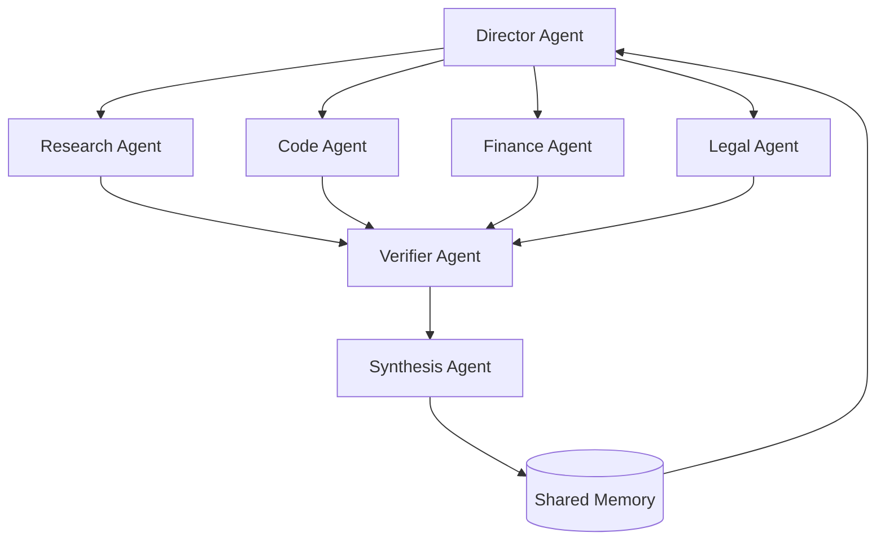

# Collective Superintelligence: Why CSI Will Surpass AGI and ASI

The entire AI industry is organized around a single bet: that intelligence scales as one mind. Make the model bigger, train it longer, and eventually you arrive at AGI, a single artificial mind that matches human generality. Push further and you reach ASI, a single mind that exceeds us.

We believe this framing is wrong, and not because the models won't get smarter. A single mind is simply the wrong unit of intelligence. The most powerful intelligences we have ever observed are not individuals. They are collectives. No human designed a modern economy, discovered the sum of scientific knowledge, or built the internet alone. Civilizations outperform geniuses, every time, on every horizon that matters.

The same will be true for machines. **Collective Superintelligence (CSI)**, large networks of specialized agents reasoning, coordinating, and correcting one another, will surpass AGI in both intelligence and capability, while creating far greater economic value. And unlike AGI, you don't have to wait for it. The primitives exist today.

## What CSI actually is

Collective Superintelligence is not "many copies of one chatbot." It is an architecture: heterogeneous agents, each specialized for a domain, connected by explicit coordination structures (hierarchies, debates, pipelines, markets) with shared memory and division of labor. The intelligence of the system lives as much in the *topology* as in the individual agents.

A single model, however large, is one reasoner with one context, one set of weights, and one failure domain. A collective is a different kind of object, and it wins for structural reasons that no amount of single-model scaling can buy back.

## The five structural advantages

### 1. Parallelism: a collective works on everything at once

A single model, even a superintelligent one, is fundamentally serial. It attends to one problem at a time, and its throughput is bounded by one inference stream. Queue ten thousand problems in front of an AGI and you get a very smart queue.

A collective has no such ceiling. Ten thousand agents pursue ten thousand tasks simultaneously, researching markets, reviewing code, monitoring infrastructure, negotiating contracts, and they coordinate only where their work intersects. Intelligence that cannot be everywhere at once loses, economically, to intelligence that can. Work scales horizontally with the number of agents, not vertically with the size of one mind.

### 2. Reasoning capacity: many minds compound, one mind plateaus

A single model's reasoning is one pass through one perspective. It anchors early, it doesn't genuinely challenge itself, and its errors are invisible to it. There is no second opinion inside one set of weights.

Collectives reason differently. One agent proposes, another attacks, a third verifies, a fourth synthesizes. Majority voting suppresses individual hallucinations. Debate surfaces hidden assumptions. Reflection loops catch errors before they compound downstream. This is the same mechanism that makes peer review stronger than any single reviewer and markets smarter than any single trader: independent perspectives with structured aggregation compound into conclusions no participant could reach alone. The reasoning capacity of a collective is not the maximum of its members; it is a function of their diversity and their coordination structure.

### 3. Fault tolerance: no single point of failure

An AGI is the ultimate single point of failure. One mind hallucinating, one mind misaligned, one mind offline, and everything built on it inherits the failure, silently and totally.

A collective fails the way the internet fails: partially, detectably, and recoverably. One agent produces a bad output; a verifier catches it; the task reroutes to a peer. One node goes down; the swarm redistributes its work. Reliability stops being a property you hope the model has and becomes a property you *engineer* into the topology: redundancy, cross-checking, graceful degradation. You cannot build civilization-scale infrastructure on a system that fails totally. You can build it on a system that fails like a network.

### 4. Memory: distributed, persistent, and effectively unbounded

A single model's working memory is its context window, and no context window will ever hold an enterprise. Everything outside it must be compressed, retrieved, or forgotten.

A collective's memory is architectural. Each agent maintains deep state for its own domain; shared memory layers hold what the group knows; RAG systems and databases extend recall indefinitely. The collective's total memory is the *sum* of its members' memories plus everything they share. It is sharded naturally along the lines of specialization, the way institutional knowledge lives across the people, documents, and systems of a company rather than in any single head. Collectives don't forget when the context rolls over.

### 5. Specialization: experts beat generalists, at everything

AGI is, by definition, a generalist: competent at everything, dominant at nothing. But every high-performing system we know is built from specialists. You don't want your cardiologist writing your legal contracts.

In a collective, each agent is tuned for one thing: one domain's vocabulary, one regulatory regime, one codebase, one customer. Specialists are individually cheaper, faster, and more accurate within their domain than any generalist, and composition does the rest. The collective is dominant at each task *simultaneously*, because "the collective" is never one mind stretched across every domain; it is the right expert, at the right position in the topology, every time.

## AGI vs. CSI, axis by axis

| Axis | AGI (one mind) | CSI (many, in concert) |
| --- | --- | --- |
| Throughput | Serial: one problem at a time | Parallel: thousands of tasks at once |
| Reasoning | One perspective, self-blind | Debate, verification, aggregation |
| Failure mode | Total, silent, correlated | Partial, detectable, recoverable |
| Memory | One context window | Distributed and effectively unbounded |
| Expertise | Generalist at everything | Specialist at each thing |
| Scaling | Vertical: bigger model | Horizontal: more agents, better topology |
| Availability | A research milestone | Deployable today |

## The economics: why CSI creates far greater value

Economic value comes from work performed, and the structure of work is collective. An economy is not one task. It is millions of concurrent, specialized, interdependent tasks, and that shape matches a swarm, not a single mind.

A single AGI, priced as the scarce pinnacle of intelligence, is a bottleneck you rent. A collective is an economy you grow: add agents where demand grows, specialize them where margins are thickest, connect them into pipelines that compound value at every hop. Marginal capacity costs one more agent, not one more training run. And because specialists are individually small and cheap, the collective delivers superhuman *system-level* performance at commodity unit economics.

This is also how an agent economy emerges: agents that buy from, sell to, and build on one another, discovering prompts, tools, and other agents in open marketplaces. The value of a network grows with the square of its participants. The value of one mind, however deep, grows linearly at best.

## ASI doesn't escape the argument

The usual response is that ASI, a single mind smarter than all humans combined, makes all of this irrelevant. It doesn't, for a simple reason: **every argument above is structural, not a claim about model quality.** Whatever the best single mind of any era looks like, a coordinated collective of minds at that same level is strictly more capable: more parallel, more fault-tolerant, more specialized, with more memory. If ASI arrives, the strongest configuration of ASI is a *collective of them*. The ceiling is always the network, never the node. CSI is not a rival to ASI; it is what any superintelligence becomes when it needs to act in the world at scale.

There is also a practical asymmetry: AGI and ASI are predictions, while CSI is an engineering discipline. Orchestration topologies, agent communication, shared memory, and verification layers are systems you can build, measure, and improve *now*, and they compound with every model generation underneath them. Better models don't make collectives obsolete; they make every node in the collective stronger.

## Building CSI, today

This is the thesis Swarms is built on. Everything in our stack is a primitive for collective intelligence:

- **[The Swarms framework](/framework)**: 15+ orchestration architectures (hierarchical swarms, mixture of agents, group chat, graph workflows, majority voting) as first-class primitives, in Python and Rust.
- **Swarms Cloud**: a hosted runtime for deploying and scaling swarms without managing infrastructure.
- **[The Marketplace](https://swarms.world)**: where specialized agents, prompts, and tools become an economy: discoverable, composable, and tradable.

The race to AGI is a race to build one mind. We are building the other thing, the thing that has always won.

Join Swarms and let's build CSI together: [swarms.ai](https://swarms.ai) · [GitHub](https://github.com/kyegomez/swarms) · [Discord](https://discord.gg/EamjgSaEQf)
