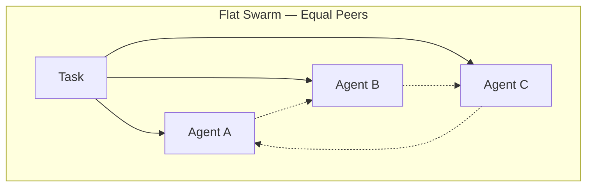
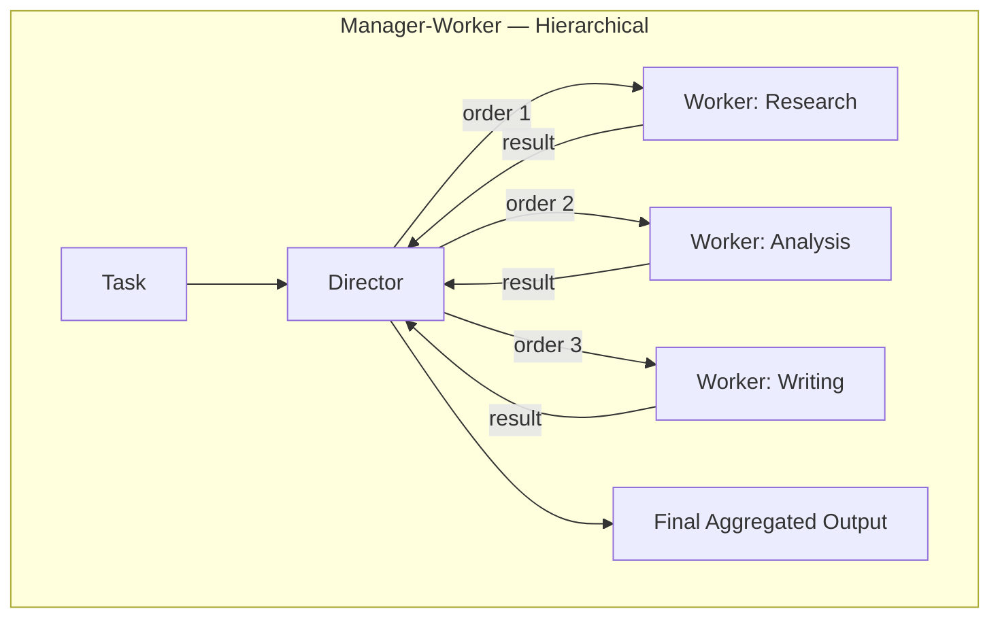
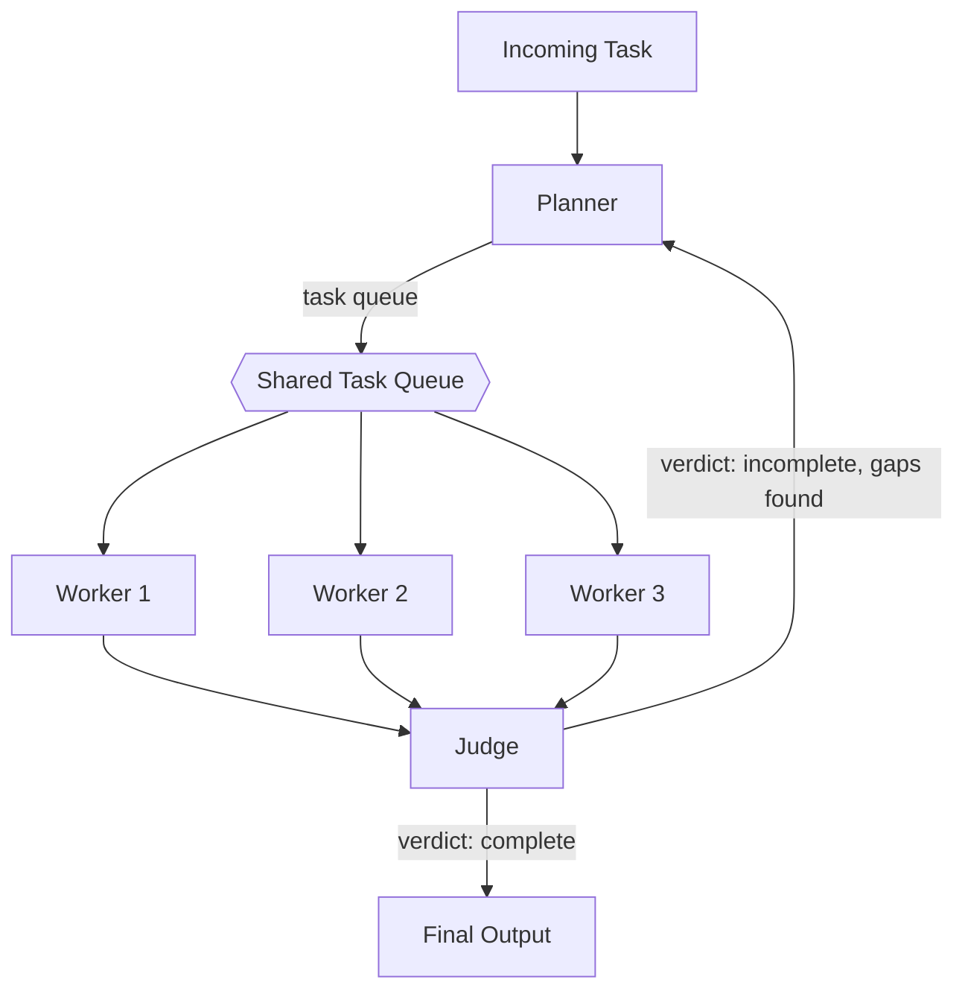

# Manager-Worker Agent Architectures: A Practical Introduction

Give one agent a broad, open-ended task and a large context window, and it will usually attempt the whole thing itself: research, analysis, and writing, all in one long run, all in one voice. That works for small tasks. It falls apart once a task has multiple distinct sub-problems that need different expertise, different tools, or genuinely independent execution, because a single agent has no way to work on more than one thread of the problem at a time, and no separation between "figuring out what to do" and "doing it."

A manager-worker architecture, sometimes called a director-worker or hierarchical pattern, fixes this by splitting a task into two distinct roles: one agent that plans and delegates, and a set of agents that execute. This post is about that split, the topology of who reports to whom and how a task moves through the hierarchy, not the messaging mechanics underneath it. If you want the details of how agents actually pass structured messages to each other, see [Advanced Agent-to-Agent Communication Protocols](/blog/agent-communication-protocols). This post assumes that layer exists and focuses on a different question: who decides what work happens, and who does it.

## What a Manager Agent Actually Does

"Manager" is doing a lot of work in that name, so it's worth being precise about the job. In Swarms' `HierarchicalSwarm`, the manager role is called the **director**, and it has four distinct responsibilities:

1. **Decomposition.** The director reads the incoming task and breaks it into concrete sub-tasks that map onto the worker agents available to it.
2. **Delegation.** It assigns each sub-task to a specific worker, producing a structured plan rather than a vague instruction.
3. **Aggregation.** Once workers finish, their outputs come back to the director, not to each other. The director is the only agent that sees the full picture.
4. **Judging (optional).** The director, or a separate judge agent, can evaluate whether the aggregated result actually satisfies the original task and send it back for another round if it doesn't.

Concretely, the director doesn't just emit free text. It produces a structured `SwarmSpec` object containing a `plan` (the overall strategy in prose) and a list of `HierarchicalOrder` objects, each one pairing a specific worker agent's name with the specific task it's being asked to do. That structure is what makes the pattern reliable: delegation is an explicit, inspectable data structure, not an implicit assumption baked into a prompt.

This is a meaningfully different shape from a flat swarm of equal peers. In a `ConcurrentWorkflow` or a round-robin discussion, every agent sees roughly the same input and contributes an opinion as an equal. There's no single agent responsible for deciding what the *right* decomposition of the problem even is, and no single point where the final output gets checked against the original ask. A manager-worker topology adds exactly that: a role with a view of the whole task, and accountability for the final result.

## Manager-Worker vs. a Flat Swarm





In the flat swarm, every agent talks to every other agent and there's no single owner of the outcome. In the hierarchical swarm, workers never need to know about each other at all; they only need to know the sub-task they were handed. That's a real simplification: adding a fourth specialist to the hierarchical version means adding one more edge from the director. Adding a fourth peer to the flat version means every existing peer potentially needs to account for one more voice in the room.

## A Worked Example: Decomposing a Research Task

Say the task is "produce a market report on the enterprise EV charging industry." Handed to a single agent, this produces one long, undifferentiated pass at research, analysis, and writing. Handed to a director, it gets split up front:

```python
from swarms import Agent
from swarms.structs.hiearchical_swarm import HierarchicalSwarm

research_agent = Agent(
    agent_name="Research-Agent",
    agent_description="Gathers market data, competitor landscape, and regulatory context.",
    model_name="gpt-5.4",
    max_loops=1,
)

analysis_agent = Agent(
    agent_name="Analysis-Agent",
    agent_description="Analyzes gathered data for trends, risks, and opportunities.",
    model_name="gpt-5.4",
    max_loops=1,
)

writing_agent = Agent(
    agent_name="Writing-Agent",
    agent_description="Synthesizes research and analysis into a structured report.",
    model_name="gpt-5.4",
    max_loops=1,
)

swarm = HierarchicalSwarm(
    name="Market-Report-Team",
    description="Director-led research pipeline for market reports",
    agents=[research_agent, analysis_agent, writing_agent],
    max_loops=2,
    planning_enabled=True,
    parallel_execution=True,
)

result = swarm.run(
    task="Produce a market report on the enterprise EV charging industry."
)
```

Under the hood, `swarm.run()` drives the director through a `step()`: the director reads the task, produces a `SwarmSpec` with sub-tasks like "gather current market size, key players, and regulatory context" for the research agent and "synthesize findings into a structured report with an executive summary" for the writing agent, and dispatches those as `HierarchicalOrder`s. Because `parallel_execution=True` by default, independent orders run concurrently rather than waiting on each other, so research and any independent analysis work can happen at the same time instead of serially.

The workers execute their narrow sub-tasks and return results to the director, not to each other, which matters here: the writing agent never has to reason about how the research was gathered, and the research agent never has to know that a writing pass is coming. The director aggregates the three outputs, and because `max_loops=2`, it can look at the first-pass result, decide the analysis section is thin, and issue a second round of orders asking specifically for that gap to be filled before producing the final synthesized report.

## Adding a Judge: Planner-Worker-Judge

For tasks where quality control matters more than a director simply re-reading its own workers' output, Swarms has a related pattern, `PlannerWorkerSwarm`, which splits the loop into three distinct phases instead of two: a planner decomposes the goal into a prioritized task queue, worker agents claim and execute tasks concurrently from that shared queue, and a separate judge agent scores the combined results and decides whether another cycle is needed.



The judge's output, a `CycleVerdict`, is explicit about why a cycle passed or failed: a completion flag, a quality score from 0 to 10, a list of identified gaps, and follow-up instructions for the next planning pass. That verdict is what flows back up to the planner, not a vague "try again." A notable design constraint here is that workers claim tasks from the queue via atomic operations and never coordinate with each other directly, which the docs call out specifically as a way to avoid deadlocks between agents. All of the coordination logic lives in the planner and judge roles, and the workers stay simple and stateless with respect to each other, similar in spirit to the escalation path in the diagram above, where a worker or judge routes a problem back up rather than resolving it laterally with a peer.

## When It's Worth the Complexity

A manager-worker topology is not free. It adds a director agent that has to be run, prompted, and (usually) paid for on every loop, and it adds latency for the planning and aggregation steps that a single agent skips entirely. It's worth reaching for when most of the following are true:

- **The task has genuinely distinct sub-problems** that benefit from different system prompts, tools, or models, not just "do more of the same thing."
- **Sub-tasks can run independently**, so parallel dispatch actually saves wall-clock time instead of just adding overhead.
- **The final output needs a check against the original ask** before it ships, rather than trusting whatever the last agent in a chain happened to produce.
- **The shape of the work isn't fully known up front**, so a fixed sequence can't be hand-written and something needs to decide the plan at runtime.

If none of that applies, and the task is really just "step one produces the input to step two," a plain sequential workflow is simpler to reason about and cheaper to run. If the sub-tasks are independent but don't need a plan or an aggregation step, a `ConcurrentWorkflow` gets you the parallelism without a director in the loop. The manager-worker pattern earns its overhead specifically when you need a single accountable role deciding what work happens and judging whether the result is good enough, not just more agents in parallel. For a broader map of where hierarchical patterns sit relative to sequential and concurrent workflows, see [Agent Orchestration Patterns](/blog/agent-orchestration-patterns), and for the more basic question of whether you need more than one agent at all, see [Single Agent vs. Multi-Agent Systems](/blog/single-agent-vs-multi-agent).

## Links and Resources

| Resource | Link |
| --- | --- |
| HierarchicalSwarm Architecture Overview | [docs.swarms.world/architectures/hierarchical-swarm](https://docs.swarms.world/architectures/hierarchical-swarm) |
| HierarchicalSwarm API Reference | [docs.swarms.world/api/hierarchical-swarm](https://docs.swarms.world/api/hierarchical-swarm) |
| PlannerWorkerSwarm API Reference | [docs.swarms.world/api/planner-worker-swarm](https://docs.swarms.world/api/planner-worker-swarm) |
| Agent-to-Agent Communication Protocols | [/blog/agent-communication-protocols](/blog/agent-communication-protocols) |
| Agent Orchestration Patterns | [/blog/agent-orchestration-patterns](/blog/agent-orchestration-patterns) |
| Documentation | [docs.swarms.ai](https://docs.swarms.ai) |
| Discord Community | [discord.gg/VapjxpSyHC](https://discord.gg/VapjxpSyHC) |

---

*Have questions or feedback? Join our [Discord community](https://discord.gg/VapjxpSyHC) or check out the [documentation](https://docs.swarms.ai).*
