# Migrating from LangGraph to Swarms: A Working Guide

LangGraph and Swarms GraphWorkflow describe agent pipelines the same way: nodes connected by directed edges. The differences are in what a node is, how state moves between nodes, and what it costs to execute the graph. This guide covers how GraphWorkflow runs a graph, maps LangGraph's concepts onto it, and then builds fourteen common patterns in both, each with a diagram, working code, and a note on what changes. It closes with a feature-by-feature comparison, the cost model, a migration checklist, and an FAQ.

## The measured case

The [GraphWorkflow systems paper](/blog/graphworkflow-research-paper) benchmarks the GraphWorkflow execution engine head to head with LangGraph 1.0.4 across five topologies at 10 to 200 nodes, 15 topology and size configurations in total.

| Measurement | GraphWorkflow vs LangGraph 1.0.4 |
| --- | --- |
| Compiled graph execution, geometric mean over 15 configurations | 7.0x faster |
| 200-node chains | 62.5x faster (0.29 ms vs 18.15 ms) |
| Shallow wide graphs | 2.7x to 4x faster |
| Graph compilation | 21.6x to 31.3x faster |
| Cold build, compile, and execute path | 7.9x faster |

Every number is a median of 9 samples with 95% confidence intervals. The full harness, the raw sample data, and the analysis pipeline are [published](https://github.com/The-Swarm-Corporation/GraphWorkflow-Paper/tree/main/benchmarks), so you can run the suite on your own hardware before you port a line of code. Every benchmark node is a no-op function, so every microsecond measured is framework overhead and none of it is model latency. In a real pipeline the model calls dominate wall-clock time; the overhead matters most at high request volume, on deep graphs, and on cold starts.

### Why the gap widens with depth

The spread from 2.7x to 62.5x follows directly from the two architectures.

LangGraph executes on a Pregel-style superstep loop with channel-based state, reducer functions, and checkpoint hooks consulted at every step. That machinery is re-derived on every run and charged to every node, whether or not your workflow uses cycles, conditional edges, or durable execution. The paper prices it at roughly 90 microseconds per superstep on a chain, and a single-coefficient per-node model fits LangGraph's entire benchmark grid at about 107 microseconds per node with an R-squared of 0.97. Cost scales with the number of steps, so it compounds with depth.

GraphWorkflow compiles once. Entry and exit points are inferred from node degrees, topological generations are computed with Kahn's algorithm, adjacency maps are materialized in one pass, and a per-layer execution plan is frozen with every node pre-resolved. The run loop then sweeps a precomputed list, with singleton layers running inline on the calling thread instead of paying a queue handoff. Compiled artifacts are cached with explicit invalidation, so repeated runs pay compilation exactly once.

Shallow graphs have few layers to amortize over, so the win is modest. Deep graphs have hundreds, and LangGraph pays its per-superstep cost on every one. At a thousand executions of that 200-node chain, cumulative orchestration overhead is roughly 0.3 seconds for GraphWorkflow against 18.2 seconds for LangGraph.

The paper is explicit about scope: the comparison covers static DAGs. Graphs that need cycles or conditional edges are where LangGraph's per-step machinery buys capability that GraphWorkflow does not have, and the comparison section below gives the GraphWorkflow approach for each of those cases.

## How GraphWorkflow works

A GraphWorkflow is a directed acyclic graph of agents.

- **Nodes are agents.** Each agent's `agent_name` is its node ID, so names must be unique. Every node carries its own `system_prompt`, `model_name`, and generation settings.
- **Edges are dicts.** `{"source": "A", "target": "B"}`, with an optional free-form `metadata` dict. Each `source` and `target` must match an `agent_name` exactly, or the request fails with a 400. List and tuple shorthands such as `["A", "B"]` fail request validation with a 422.
- **Boundaries are explicit.** `entry_points` lists the nodes where execution starts, and `end_points` lists where it finishes. The docs recommend always setting both.
- **Compilation is automatic.** With `auto_compile` on (the default), the graph is validated and compiled into a per-layer execution plan before it runs.

When the graph runs, entry-point agents start from the `task`. The compiler groups nodes into layers, and every node in a layer runs concurrently. A node with several parents runs once all of them have finished, and their outputs are added to its context: branches run in parallel and rejoin wherever two edges meet the same node. A node receives the outputs of its direct parents, so if a later node needs something an earlier node produced, draw an edge from that earlier node.

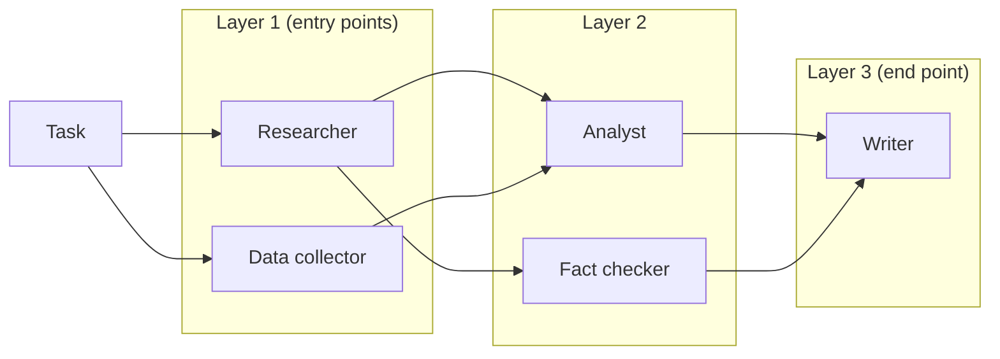

In this graph the Researcher and Data collector run together, the Analyst and Fact checker run together once their parents finish, and the Writer runs last with both of their outputs in context.

### The request

`POST https://api.swarms.world/v1/graph-workflow/completions`, authenticated with an `x-api-key` header.

| Field | Type | Default | Purpose |
| --- | --- | --- | --- |
| `name` | string | none | Identifier for the workflow |
| `description` | string | none | What the workflow does |
| `agents` | list of AgentSpec | required | The nodes |
| `edges` | list of edge dicts | none | `source`, `target`, and optional `metadata` |
| `entry_points` | list of strings | none | Agent names where execution starts |
| `end_points` | list of strings | none | Agent names where execution ends |
| `task` | string | none | The input the workflow runs on |
| `max_loops` | integer | 1 | Maximum execution loops for the workflow |
| `img` | string | none | Optional image URL for vision-capable agents |
| `auto_compile` | boolean | true | Compile the graph before running |
| `verbose` | boolean | false | Detailed logging |

The AgentSpec fields you will use most are `agent_name`, `system_prompt`, `model_name` (default `claude-sonnet-5`), `fallback_models` and `fallback_model_name`, `max_tokens` (default 16,000), `temperature`, `max_loops`, `reasoning_effort`, and `mcp_url` for giving a node the tools of an MCP server.

### The response

Every node's output comes back, keyed by agent name, with a flat usage block:

```json
{
  "job_id": "graph-workflow-abc123xyz",
  "name": "Research-Analysis-Workflow",
  "description": "A simple sequential workflow for research and analysis",
  "status": "success",
  "outputs": {
    "ResearchAgent": "Research findings on AI trends...",
    "AnalysisAgent": "Analysis of research findings..."
  },
  "usage": {
    "input_tokens": 1250,
    "output_tokens": 3200,
    "total_tokens": 4450,
    "total_cost": 0.087325,
    "cost_per_agent": 0.02
  },
  "timestamp": "2024-01-15T10:30:45.123456+00:00"
}
```

### Plan, limits, and timeouts

The Graph Workflow endpoint is available on Pro, Ultra, and Premium plans; free-tier keys receive a 403. Premium keys get 2,000 requests per minute, 10,000 per hour, and 100,000 per day, reported in `X-RateLimit-*` response headers. Model calls make graph runs long-lived, so set your client timeout by graph size: the docs suggest 300 seconds for simple workflows, 600 for medium ones, and 900 or more for complex ones.

### The same engine, in the framework

The API runs the same `GraphWorkflow` engine that the benchmarks measure, which also ships in the open-source framework (`pip install swarms`) for running graphs in your own process:

```python
from swarms import Agent, GraphWorkflow

wf = GraphWorkflow(auto_compile=True)
for name in ["research", "summarize", "critique", "editor"]:
    wf.add_node(Agent(agent_name=name, model_name="gpt-4.1", max_loops=1))

wf.add_edge("research", "summarize")
wf.add_edge("research", "critique")
wf.add_edge("summarize", "editor")
wf.add_edge("critique", "editor")

wf.set_entry_points(["research"])
wf.set_end_points(["editor"])

results = wf.run(task="Assess the market for solid-state batteries.")
print(results["editor"])
```

The rest of this guide uses the API form.

### Setup used by every example

Three small helpers keep the patterns readable. Define them once:

```python
import os

import httpx

BASE_URL = "https://api.swarms.world"
HEADERS = {
    "x-api-key": os.environ["SWARMS_API_KEY"],
    "Content-Type": "application/json",
}


def agent(name, prompt, model="claude-sonnet-5", **extra):
    """One graph node."""
    return {
        "agent_name": name,
        "system_prompt": prompt,
        "model_name": model,
        "max_loops": 1,
        **extra,
    }


def edge(source, target, **metadata):
    """One directed edge, with optional metadata tags."""
    e = {"source": source, "target": target}
    if metadata:
        e["metadata"] = metadata
    return e


def run_graph(name, task, agents, edges, entry_points, end_points):
    """POST /v1/graph-workflow/completions and return the parsed JSON."""
    response = httpx.post(
        f"{BASE_URL}/v1/graph-workflow/completions",
        headers=HEADERS,
        json={
            "name": name,
            "task": task,
            "agents": agents,
            "edges": edges,
            "entry_points": entry_points,
            "end_points": end_points,
            "max_loops": 1,
            "auto_compile": True,
        },
        timeout=900.0,
    )
    response.raise_for_status()
    return response.json()
```

The LangGraph examples share this setup:

```python
from operator import add
from typing import Annotated, Literal

from langchain_openai import ChatOpenAI
from langgraph.graph import END, START, StateGraph
from pydantic import BaseModel
from typing_extensions import TypedDict

llm = ChatOpenAI(model="gpt-4.1")
```

## Concept mapping

| LangGraph | GraphWorkflow | Notes |
| --- | --- | --- |
| `StateGraph(State)` | The JSON body of `POST /v1/graph-workflow/completions` | No state schema to declare |
| `add_node("name", fn)` | An entry in `agents` | `agent_name` is the node ID; the node is an agent with a prompt and a model |
| `add_edge("a", "b")` | `{"source": "a", "target": "b"}` in `edges` | Dict form only |
| `add_edge(["a", "b"], "c")` | Two edges into `c` | A node with several parents waits for all of them |
| `START` | `entry_points` | Entry-point agents start from the `task` |
| `END` | `end_points` | Several end points are allowed |
| `.compile()` | `auto_compile: true` (the default) | The compiled plan is cached |
| `graph.invoke(inputs)` | The POST, with the input in `task` | |
| State keys and reducers | `outputs`, keyed by agent name | Each node sees its parents' outputs as context |
| `add_conditional_edges` | Gating in prompts, or choosing the graph in your code | Every declared edge fires |
| `Send` (map-reduce) | Nodes generated in Python before the request | The list length is known when you build the payload |
| Cycles and `recursion_limit` | Unrolled rounds, or repeated runs from your code | GraphWorkflow is acyclic |
| Checkpointer and `thread_id` | Your own storage, keyed by `job_id` | Each request is stateless |
| `interrupt()` and `Command(resume=...)` | Two graph runs with a human step between them | |
| Compiled subgraph as a node | A Python function that returns agents and edges | Composed before submission |
| A chat model client per node | `model_name` per agent, plus `fallback_models` | One key covers every vendor |

The short version: nodes and edges carry over one to one, and state disappears, because a node's inputs are defined by its incoming edges. Your prompts carry over unchanged.

## The patterns

Each pattern below has a diagram, the LangGraph version, the GraphWorkflow version, and a note on what changes.

### Pattern 1: Linear pipeline

Research feeds analysis, analysis feeds writing.

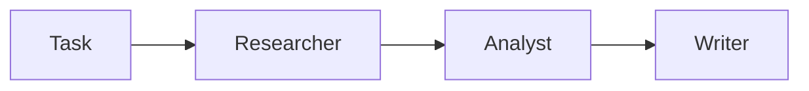

**LangGraph**

```python
class ChainState(TypedDict):
    task: str
    research: str
    analysis: str
    report: str


def research(state: ChainState):
    return {"research": llm.invoke(f"Research: {state['task']}").content}


def analyze(state: ChainState):
    return {"analysis": llm.invoke(f"Analyze:\n{state['research']}").content}


def write(state: ChainState):
    return {"report": llm.invoke(f"Write a brief from:\n{state['analysis']}").content}


builder = StateGraph(ChainState)
builder.add_node("research", research)
builder.add_node("analyze", analyze)
builder.add_node("write", write)
builder.add_edge(START, "research")
builder.add_edge("research", "analyze")
builder.add_edge("analyze", "write")
builder.add_edge("write", END)

graph = builder.compile()
print(graph.invoke({"task": "Assess the EV battery market"})["report"])
```

**GraphWorkflow**

```python
result = run_graph(
    "Research pipeline",
    "Assess the EV battery market",
    agents=[
        agent("Researcher", "Research the topic thoroughly and cite your sources."),
        agent("Analyst", "Analyze the research you receive and draw conclusions."),
        agent("Writer", "Write a one-page brief from the analysis you receive."),
    ],
    edges=[edge("Researcher", "Analyst"), edge("Analyst", "Writer")],
    entry_points=["Researcher"],
    end_points=["Writer"],
)
print(result["outputs"]["Writer"])
```

**What changes:** the state schema, the per-node `llm.invoke`, and the `START` and `END` sentinels disappear, and each node's instructions move into its `system_prompt`.

### Pattern 2: Fan-out

One node produces a draft, and several nodes work on it in parallel. Each branch is a deliverable.

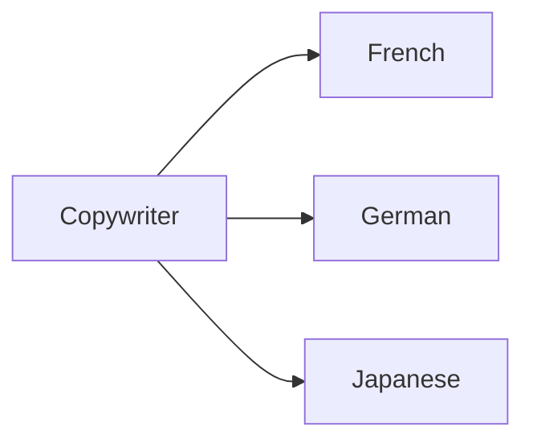

**LangGraph**

```python
class LocaleState(TypedDict):
    brief: str
    copy: str
    fr: str
    de: str
    ja: str


def copywriter(state: LocaleState):
    return {"copy": llm.invoke(f"Write launch copy for: {state['brief']}").content}


def translator(key: str, language: str):
    def node(state: LocaleState):
        return {key: llm.invoke(f"Translate into {language}:\n{state['copy']}").content}
    return node


builder = StateGraph(LocaleState)
builder.add_node("copywriter", copywriter)
builder.add_edge(START, "copywriter")
for key, language in [("fr", "French"), ("de", "German"), ("ja", "Japanese")]:
    builder.add_node(key, translator(key, language))
    builder.add_edge("copywriter", key)
    builder.add_edge(key, END)

graph = builder.compile()
out = graph.invoke({"brief": "A home battery that pays for itself in six years"})
print(out["fr"], out["de"], out["ja"])
```

**GraphWorkflow**

```python
languages = ["French", "German", "Japanese"]
translators = [
    agent(f"Translator-{lang}", f"Translate the copy you receive into {lang}. Keep the tone.", model="gpt-4.1-mini")
    for lang in languages
]

result = run_graph(
    "Localization fan-out",
    "Write launch copy for a home battery that pays for itself in six years.",
    agents=[agent("Copywriter", "Write short, concrete launch copy for the product.")] + translators,
    edges=[edge("Copywriter", t["agent_name"]) for t in translators],
    entry_points=["Copywriter"],
    end_points=[t["agent_name"] for t in translators],
)
for t in translators:
    print(result["outputs"][t["agent_name"]])
```

**What changes:** a fan-out is one edge per downstream target with the same `source`, and each branch can be listed as an end point. The branches can run on a cheaper model than the node that feeds them.

### Pattern 3: Fan-in with multiple entry points

Independent research streams start together and converge on one synthesizer.

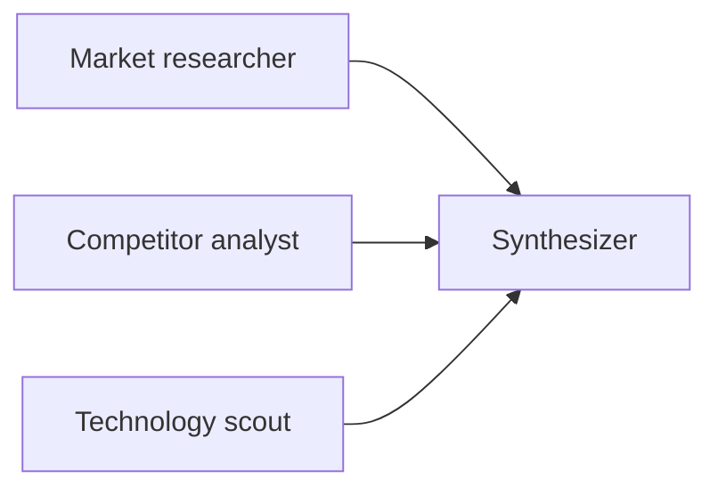

**LangGraph**

```python
class FanInState(TypedDict):
    topic: str
    notes: Annotated[list[str], add]
    report: str


def researcher(focus: str):
    def node(state: FanInState):
        return {"notes": [llm.invoke(f"Research {focus} for {state['topic']}").content]}
    return node


def synthesize(state: FanInState):
    return {"report": llm.invoke("Synthesize:\n\n" + "\n\n".join(state["notes"])).content}


builder = StateGraph(FanInState)
builder.add_node("synthesize", synthesize)
sources = {"market": "market trends", "competitors": "competitor strategies", "technology": "emerging technology"}
for name, focus in sources.items():
    builder.add_node(name, researcher(focus))
    builder.add_edge(START, name)
builder.add_edge(list(sources), "synthesize")
builder.add_edge("synthesize", END)

graph = builder.compile()
print(graph.invoke({"topic": "AI-powered SaaS"})["report"])
```

**GraphWorkflow**

```python
researchers = [
    agent("MarketResearcher", "Analyze market trends and identify opportunities."),
    agent("CompetitorAnalyst", "Analyze competitor strategies and market positioning."),
    agent("TechnologyScout", "Identify emerging technologies and innovations."),
]

result = run_graph(
    "Parallel research synthesis",
    "Strategic analysis of the AI-powered SaaS market",
    agents=researchers + [agent("StrategicSynthesizer", "Combine the research streams you receive into strategic insights.")],
    edges=[edge(r["agent_name"], "StrategicSynthesizer") for r in researchers],
    entry_points=[r["agent_name"] for r in researchers],
    end_points=["StrategicSynthesizer"],
)
print(result["outputs"]["StrategicSynthesizer"])
```

**What changes:** LangGraph needs a reducer (`Annotated[list, add]`) so parallel writes to one key accumulate. In GraphWorkflow the synthesizer waits for its three parents and receives all three outputs with no reducer involved.

### Pattern 4: Diamond (fan-out, then fan-in)

One researcher feeds two parallel reviewers, and an editor merges both.

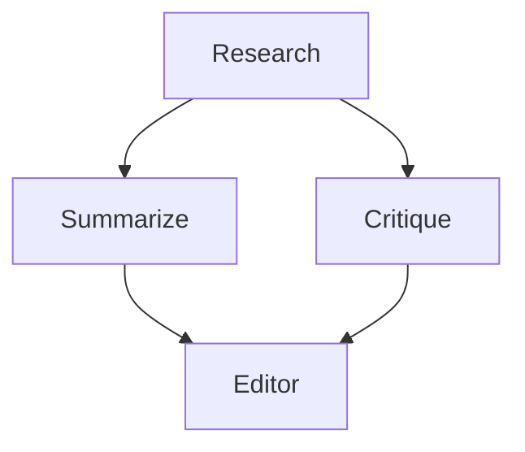

**LangGraph**

```python
class DiamondState(TypedDict):
    topic: str
    research: str
    reviews: Annotated[list[str], add]
    final: str


def research(state: DiamondState):
    return {"research": llm.invoke(f"Research {state['topic']}").content}


def summarize(state: DiamondState):
    return {"reviews": [llm.invoke(f"Summarize:\n{state['research']}").content]}


def critique(state: DiamondState):
    return {"reviews": [llm.invoke(f"Critique:\n{state['research']}").content]}


def editor(state: DiamondState):
    return {"final": llm.invoke("Write the final piece from:\n\n" + "\n\n".join(state["reviews"])).content}


builder = StateGraph(DiamondState)
for name, fn in [("research", research), ("summarize", summarize), ("critique", critique), ("editor", editor)]:
    builder.add_node(name, fn)
builder.add_edge(START, "research")
builder.add_edge("research", "summarize")
builder.add_edge("research", "critique")
builder.add_edge(["summarize", "critique"], "editor")
builder.add_edge("editor", END)

graph = builder.compile()
print(graph.invoke({"topic": "solid-state batteries"})["final"])
```

**GraphWorkflow**

```python
result = run_graph(
    "Diamond",
    "Assess the market for solid-state batteries.",
    agents=[
        agent("Research", "Research the topic and list the key facts with sources."),
        agent("Summarize", "Summarize the research you receive in ten bullets."),
        agent("Critique", "Find gaps, weak sources, and missing counterarguments in the research."),
        agent("Editor", "Write the final piece from the summary and the critique you receive."),
    ],
    edges=[
        edge("Research", "Summarize"),
        edge("Research", "Critique"),
        edge("Summarize", "Editor"),
        edge("Critique", "Editor"),
    ],
    entry_points=["Research"],
    end_points=["Editor"],
)
print(result["outputs"]["Editor"])
```

**What changes:** the shape is four edges in both frameworks. GraphWorkflow puts Summarize and Critique in the same layer and runs them concurrently, and the Editor gets both outputs without a shared list in state.

### Pattern 5: Layered all-to-all

Every node in a layer feeds every node in the next: collectors, analysts, validators, then one synthesis node. This is the three-layer shape from the Graph Workflow docs.

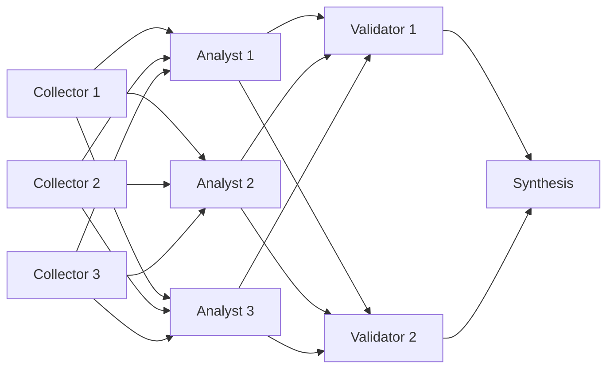

**LangGraph**

```python
class MeshState(TypedDict):
    topic: str
    data: Annotated[list[str], add]
    analyses: Annotated[list[str], add]
    validations: Annotated[list[str], add]
    report: str


def collector(i: int):
    def node(state: MeshState):
        return {"data": [llm.invoke(f"Collect data on {state['topic']} from source {i}").content]}
    return node


def analyst(i: int):
    def node(state: MeshState):
        return {"analyses": [llm.invoke(f"Analysis {i} of:\n" + "\n".join(state["data"])).content]}
    return node


def validator(i: int):
    def node(state: MeshState):
        return {"validations": [llm.invoke(f"Validation {i} of:\n" + "\n".join(state["analyses"])).content]}
    return node


def synthesis(state: MeshState):
    return {"report": llm.invoke("Final report from:\n" + "\n".join(state["validations"])).content}


builder = StateGraph(MeshState)
collectors = [f"collector_{i}" for i in range(1, 4)]
analysts = [f"analyst_{i}" for i in range(1, 4)]
validators = [f"validator_{i}" for i in range(1, 3)]
for i, name in enumerate(collectors, 1):
    builder.add_node(name, collector(i))
    builder.add_edge(START, name)
for i, name in enumerate(analysts, 1):
    builder.add_node(name, analyst(i))
for i, name in enumerate(validators, 1):
    builder.add_node(name, validator(i))
builder.add_node("synthesis", synthesis)
for a in analysts:
    builder.add_edge(collectors, a)
for v in validators:
    builder.add_edge(analysts, v)
builder.add_edge(validators, "synthesis")
builder.add_edge("synthesis", END)

graph = builder.compile()
print(graph.invoke({"topic": "renewable energy markets"})["report"])
```

**GraphWorkflow**

```python
collectors = [agent(f"DataCollector{i}", f"Gather data on the topic from source {i}.", model="gpt-4.1-mini") for i in range(1, 4)]
analysts = [agent(f"Analyst{i}", "Analyze the data you receive and extract key insights.") for i in range(1, 4)]
validators = [agent(f"Validator{i}", "Check the analyses you receive for accuracy and completeness.") for i in range(1, 3)]
synthesis = agent("SynthesisAgent", "Combine the validated analyses you receive into a final report.")


def all_to_all(sources, targets):
    return [edge(s["agent_name"], t["agent_name"]) for s in sources for t in targets]


result = run_graph(
    "Layered mesh",
    "Research renewable energy markets: collect, analyze, validate, synthesize.",
    agents=collectors + analysts + validators + [synthesis],
    edges=all_to_all(collectors, analysts) + all_to_all(analysts, validators) + all_to_all(validators, [synthesis]),
    entry_points=[c["agent_name"] for c in collectors],
    end_points=["SynthesisAgent"],
)
print(result["outputs"]["SynthesisAgent"])
print(result["usage"]["cost_per_agent"])  # 9 agents x $0.01
```

**What changes:** the 17 edges come from one helper, and the compiler turns the mesh into four layers of concurrent nodes. Because every node's output is in `outputs`, you can audit any single analyst or validator after the run.

### Pattern 6: Multi-entry, multi-exit DAG

Three independent reviews start together, and the graph produces two deliverables from different subsets of them.

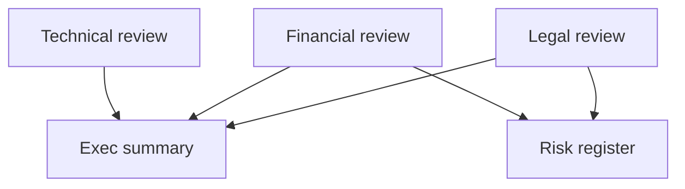

**LangGraph**

```python
class DealState(TypedDict):
    deal: str
    legal: str
    financial: str
    technical: str
    summary: str
    risks: str


def review(key: str, focus: str):
    def node(state: DealState):
        return {key: llm.invoke(f"{focus} review of this deal: {state['deal']}").content}
    return node


def summary(state: DealState):
    notes = f"{state['legal']}\n\n{state['financial']}\n\n{state['technical']}"
    return {"summary": llm.invoke(f"Executive summary:\n{notes}").content}


def risks(state: DealState):
    return {"risks": llm.invoke(f"Risk register:\n{state['legal']}\n\n{state['financial']}").content}


builder = StateGraph(DealState)
for key, focus in [("legal", "Legal"), ("financial", "Financial"), ("technical", "Technical")]:
    builder.add_node(key, review(key, focus))
    builder.add_edge(START, key)
builder.add_node("summary", summary)
builder.add_node("risks", risks)
builder.add_edge(["legal", "financial", "technical"], "summary")
builder.add_edge(["legal", "financial"], "risks")
builder.add_edge("summary", END)
builder.add_edge("risks", END)

graph = builder.compile()
out = graph.invoke({"deal": "Acquisition of a 40-person robotics startup"})
print(out["summary"], out["risks"])
```

**GraphWorkflow**

```python
result = run_graph(
    "Deal review",
    "Acquisition of a 40-person robotics startup",
    agents=[
        agent("Legal", "Review the deal for legal exposure."),
        agent("Financial", "Review the deal's valuation and financial risk.", model="gpt-4.1"),
        agent("Technical", "Review the target's technology and team.", model="gpt-4.1"),
        agent("ExecSummary", "Write a one-page executive summary from the reviews you receive."),
        agent("RiskRegister", "Build a risk register table from the reviews you receive."),
    ],
    edges=[
        edge("Legal", "ExecSummary"),
        edge("Financial", "ExecSummary"),
        edge("Technical", "ExecSummary"),
        edge("Legal", "RiskRegister"),
        edge("Financial", "RiskRegister"),
    ],
    entry_points=["Legal", "Financial", "Technical"],
    end_points=["ExecSummary", "RiskRegister"],
)
print(result["outputs"]["ExecSummary"])
print(result["outputs"]["RiskRegister"])
```

**What changes:** both deliverables and all three reviews come back in one `outputs` dict, and the risk register only sees the two reviews you connected to it.

### Pattern 7: Map-reduce over a list

One worker per item in a list, then a reducer. In LangGraph the list is expanded at runtime with `Send`; in GraphWorkflow it is expanded in Python while you build the payload.

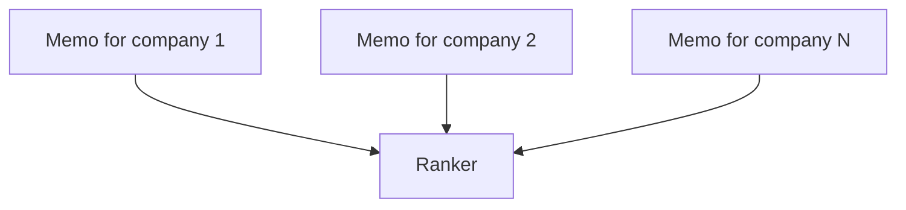

**LangGraph**

```python
from langgraph.types import Send


class MapState(TypedDict):
    companies: list[str]
    memos: Annotated[list[str], add]
    ranking: str


class MemoState(TypedDict):
    company: str


def fan_out(state: MapState):
    return [Send("write_memo", {"company": c}) for c in state["companies"]]


def write_memo(state: MemoState):
    memo = llm.invoke(f"One-paragraph investment memo on {state['company']}.").content
    return {"memos": [memo]}


def rank(state: MapState):
    return {"ranking": llm.invoke("Rank these companies:\n\n" + "\n\n".join(state["memos"])).content}


builder = StateGraph(MapState)
builder.add_node("write_memo", write_memo)
builder.add_node("rank", rank)
builder.add_conditional_edges(START, fan_out, ["write_memo"])
builder.add_edge("write_memo", "rank")
builder.add_edge("rank", END)

graph = builder.compile()
companies = ["CATL", "QuantumScape", "Solid Power", "Northvolt"]
print(graph.invoke({"companies": companies})["ranking"])
```

**GraphWorkflow**

```python
companies = ["CATL", "QuantumScape", "Solid Power", "Northvolt"]

mappers = [
    agent(
        f"Memo-{i}",
        f"Write a one-paragraph investment memo on {company}: moat, risks, recent news.",
        model="gpt-4.1-mini",
    )
    for i, company in enumerate(companies)
]
ranker = agent("Ranker", "You receive one memo per company. Rank the companies in a table and justify the order.")

result = run_graph(
    "Memo map-reduce",
    "Evaluate these battery companies as long-term investments.",
    agents=mappers + [ranker],
    edges=[edge(m["agent_name"], "Ranker") for m in mappers],
    entry_points=[m["agent_name"] for m in mappers],
    end_points=["Ranker"],
)
print(result["outputs"]["Ranker"])
```

**What changes:** every entry point receives the same `task`, so each mapper's item goes into its own `system_prompt`. The list must be known when you build the request, which covers the usual cases (one worker per document, ticker, or section). If a model has to decide the list, run a small planning graph first and build the map-reduce graph from its output.

### Pattern 8: Model ensemble (a jury)

The same question goes to jurors on three different vendors in parallel, and a judge weighs their answers. Models from different families make different mistakes, so disagreement between them is a useful signal.

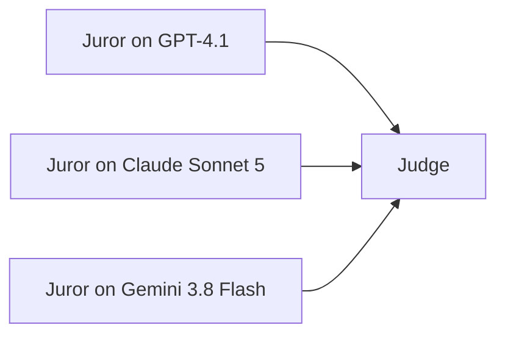

**LangGraph**

```python
from langchain_anthropic import ChatAnthropic
from langchain_google_genai import ChatGoogleGenerativeAI

jurors = {
    "gpt": ChatOpenAI(model="gpt-4.1"),
    "claude": ChatAnthropic(model="claude-sonnet-5").with_fallbacks([ChatOpenAI(model="gpt-4.1")]),
    "gemini": ChatGoogleGenerativeAI(model="gemini-3.8-flash"),
}


class JuryState(TypedDict):
    question: str
    verdicts: Annotated[list[str], add]
    ruling: str


def make_juror(name: str, model):
    def juror(state: JuryState):
        answer = model.invoke(f"Answer and justify: {state['question']}").content
        return {"verdicts": [f"{name}: {answer}"]}
    return juror


def judge(state: JuryState):
    return {"ruling": llm.invoke("Weigh these answers and rule:\n\n" + "\n\n".join(state["verdicts"])).content}


builder = StateGraph(JuryState)
builder.add_node("judge", judge)
for name, model in jurors.items():
    builder.add_node(name, make_juror(name, model))
    builder.add_edge(START, name)
builder.add_edge(list(jurors), "judge")
builder.add_edge("judge", END)

graph = builder.compile()
print(graph.invoke({"question": "Is this clause enforceable in California?"})["ruling"])
```

**GraphWorkflow**

```python
juror_prompt = "Answer the question and justify your answer. End with a one-line verdict."
jurors = [
    agent("Juror-GPT", juror_prompt, model="gpt-4.1", fallback_models=["gpt-4.1-mini"]),
    agent("Juror-Claude", juror_prompt, model="claude-sonnet-5", fallback_models=["gpt-4.1"]),
    agent("Juror-Gemini", juror_prompt, model="gemini-3.8-flash", fallback_models=["claude-sonnet-5"]),
]
judge = agent(
    "Judge",
    "You receive three independent answers. Note where they agree and disagree, then give a final ruling.",
    model="claude-opus-5",
)

result = run_graph(
    "Jury",
    "Is a 24-month non-compete clause enforceable for a California employee?",
    agents=jurors + [judge],
    edges=[edge(j["agent_name"], "Judge") for j in jurors],
    entry_points=[j["agent_name"] for j in jurors],
    end_points=["Judge"],
)
print(result["outputs"]["Judge"])
```

**What changes:** in LangGraph each vendor is a separate client package, API key, and bill. In GraphWorkflow `model_name` is a string on each node, one key covers every vendor (the catalog held 1,858 model IDs on September 25, 2026), and `fallback_models` gives each juror an ordered list of backups it retries through if its primary model errors.

### Pattern 9: Debate with cross rebuttals and a judge

Pro and Con open in parallel, each side rebuts the other's opening, and a judge reads both rebuttals.

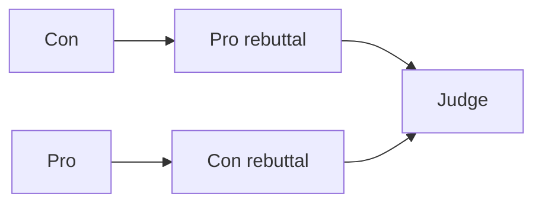

**LangGraph**

```python
class DebateState(TypedDict):
    motion: str
    pro: str
    con: str
    rebuttals: Annotated[list[str], add]
    verdict: str


def pro(state: DebateState):
    return {"pro": llm.invoke(f"Argue for: {state['motion']}").content}


def con(state: DebateState):
    return {"con": llm.invoke(f"Argue against: {state['motion']}").content}


def pro_rebuttal(state: DebateState):
    return {"rebuttals": ["PRO: " + llm.invoke(f"Rebut this, arguing for the motion:\n{state['con']}").content]}


def con_rebuttal(state: DebateState):
    return {"rebuttals": ["CON: " + llm.invoke(f"Rebut this, arguing against the motion:\n{state['pro']}").content]}


def judge(state: DebateState):
    return {"verdict": llm.invoke("Decide which side won:\n\n" + "\n\n".join(state["rebuttals"])).content}


builder = StateGraph(DebateState)
for name, fn in [("pro", pro), ("con", con), ("pro_rebuttal", pro_rebuttal), ("con_rebuttal", con_rebuttal), ("judge", judge)]:
    builder.add_node(name, fn)
builder.add_edge(START, "pro")
builder.add_edge(START, "con")
builder.add_edge("con", "pro_rebuttal")
builder.add_edge("pro", "con_rebuttal")
builder.add_edge(["pro_rebuttal", "con_rebuttal"], "judge")
builder.add_edge("judge", END)

graph = builder.compile()
print(graph.invoke({"motion": "Cities should ban gas-powered leaf blowers"})["verdict"])
```

**GraphWorkflow**

```python
result = run_graph(
    "Debate",
    "Motion: cities should ban gas-powered leaf blowers.",
    agents=[
        agent("Pro", "Argue for the motion in five strong points.", model="gpt-4.1"),
        agent("Con", "Argue against the motion in five strong points.", model="claude-sonnet-5"),
        agent("ProRebuttal", "You argue for the motion. Rebut the opposing argument you receive, point by point.", model="gpt-4.1"),
        agent("ConRebuttal", "You argue against the motion. Rebut the opposing argument you receive, point by point.", model="claude-sonnet-5"),
        agent("Judge", "You receive a rebuttal from each side of a debate. Decide which side argued better and explain why.", model="gemini-3.8-flash"),
    ],
    edges=[
        edge("Con", "ProRebuttal"),
        edge("Pro", "ConRebuttal"),
        edge("ProRebuttal", "Judge"),
        edge("ConRebuttal", "Judge"),
    ],
    entry_points=["Pro", "Con"],
    end_points=["Judge"],
)
print(result["outputs"]["Judge"])
```

**What changes:** the cross edges decide what each rebuttal sees, so ProRebuttal reads only Con's opening. Putting each side on a different vendor, and the judge on a third, keeps one model family from arguing with itself. To let the judge read the openings too, add `Pro → Judge` and `Con → Judge`.

### Pattern 10: Planner, workers, and reviewer

LangGraph teams often build a supervisor that picks the next worker at runtime with `Command`. When the team and its jobs are known up front, the same work fits a DAG: a planner writes the plan, workers carry out their sections in parallel, and a reviewer checks the result against the plan.

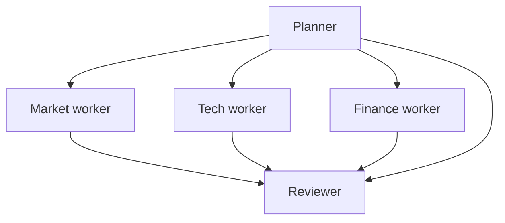

**LangGraph (supervisor)**

```python
from langgraph.types import Command


class TeamState(TypedDict):
    task: str
    notes: Annotated[list[str], add]


class Next(BaseModel):
    next: Literal["researcher", "analyst", "FINISH"]


def supervisor(state: TeamState) -> Command[Literal["researcher", "analyst", "__end__"]]:
    decision = llm.with_structured_output(Next).invoke(
        f"Task: {state['task']}\nWork so far: {state['notes']}\nWho acts next, or FINISH?"
    )
    return Command(goto=END if decision.next == "FINISH" else decision.next)


def researcher(state: TeamState) -> Command[Literal["supervisor"]]:
    note = llm.invoke(f"Research for: {state['task']}").content
    return Command(update={"notes": [note]}, goto="supervisor")


def analyst(state: TeamState) -> Command[Literal["supervisor"]]:
    note = llm.invoke(f"Analyze: {state['notes']}").content
    return Command(update={"notes": [note]}, goto="supervisor")


builder = StateGraph(TeamState)
builder.add_node("supervisor", supervisor)
builder.add_node("researcher", researcher)
builder.add_node("analyst", analyst)
builder.add_edge(START, "supervisor")

graph = builder.compile()
result = graph.invoke({"task": "Competitive analysis of the AI chip market"}, config={"recursion_limit": 12})
print(result["notes"][-1])
```

**GraphWorkflow**

```python
workers = [
    agent("MarketWorker", "You receive a research plan. Carry out only its market section."),
    agent("TechWorker", "You receive a research plan. Carry out only its technology section."),
    agent("FinanceWorker", "You receive a research plan. Carry out only its financial section."),
]

result = run_graph(
    "Planner and workers",
    "Competitive analysis of the AI chip market",
    agents=[agent("Planner", "Write a research plan with market, technology, and financial sections.", model="claude-opus-5")]
    + workers
    + [agent("Reviewer", "Check the three sections you receive against the plan, fix gaps, and write the final analysis.")],
    edges=[edge("Planner", w["agent_name"]) for w in workers]
    + [edge(w["agent_name"], "Reviewer") for w in workers]
    + [edge("Planner", "Reviewer")],
    entry_points=["Planner"],
    end_points=["Reviewer"],
)
print(result["outputs"]["Reviewer"])
```

**What changes:** the supervisor decides the order at runtime and can revisit workers; the DAG fixes the team and the order before the run, runs the three workers concurrently in one pass, and has a known number of agents, so the per-agent part of the bill is known in advance. The `Planner → Reviewer` edge gives the reviewer the plan to check against.

### Pattern 11: Reflection, unrolled

A writer drafts, a critic reviews, and the writer revises. LangGraph expresses this as a cycle with a conditional exit. GraphWorkflow graphs are acyclic, so the rounds are unrolled into a fixed sequence.

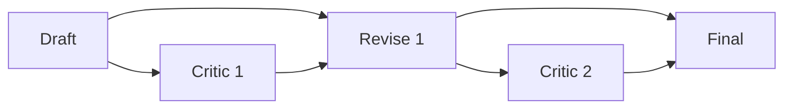

**LangGraph (cycle)**

```python
class LoopState(TypedDict):
    product: str
    draft: str
    feedback: str
    grade: str


class Feedback(BaseModel):
    grade: Literal["pass", "revise"]
    feedback: str


def generate(state: LoopState):
    prompt = f"Write a 120-word product description for {state['product']}."
    if state.get("feedback"):
        prompt += f"\nRevise using this feedback: {state['feedback']}"
    return {"draft": llm.invoke(prompt).content}


def evaluate(state: LoopState):
    result = llm.with_structured_output(Feedback).invoke(f"Grade this draft:\n{state['draft']}")
    return {"grade": result.grade, "feedback": result.feedback}


builder = StateGraph(LoopState)
builder.add_node("generate", generate)
builder.add_node("evaluate", evaluate)
builder.add_edge(START, "generate")
builder.add_edge("generate", "evaluate")
builder.add_conditional_edges(
    "evaluate",
    lambda state: END if state["grade"] == "pass" else "generate",
    ["generate", END],
)

graph = builder.compile()
print(graph.invoke({"product": "a home battery"}, config={"recursion_limit": 10})["draft"])
```

**GraphWorkflow (two unrolled rounds)**

```python
result = run_graph(
    "Unrolled reflection",
    "Write a 120-word product description for a home battery.",
    agents=[
        agent("Draft", "Write the requested copy.", model="gpt-4.1"),
        agent("Critic1", "List the three biggest weaknesses of the copy you receive.", model="claude-sonnet-5"),
        agent("Revise1", "You receive a draft and a critique. Rewrite the draft to fix every weakness.", model="gpt-4.1"),
        agent("Critic2", "List any remaining weaknesses in the copy you receive. Be strict.", model="claude-sonnet-5"),
        agent("Final", "You receive copy and a critique. Produce the final copy with every issue fixed.", model="gpt-4.1"),
    ],
    edges=[
        edge("Draft", "Critic1"),
        edge("Draft", "Revise1"),
        edge("Critic1", "Revise1"),
        edge("Revise1", "Critic2"),
        edge("Revise1", "Final"),
        edge("Critic2", "Final"),
    ],
    entry_points=["Draft"],
    end_points=["Final"],
)
print(result["outputs"]["Final"])
```

**What changes:** each reviser has two parents (the text it revises and the critique of it), because a node only sees its direct parents' outputs. The number of rounds is fixed in the graph, which also fixes the cost. If you need to stop on a verdict, have the last node end with a verdict token and call `run_graph` again from your code until it passes or you hit your own round limit.

### Pattern 12: Conditional routing by gating

A classifier decides which specialist should answer. LangGraph picks one branch with a conditional edge. GraphWorkflow has no conditional edges: every declared edge fires, so every branch runs, and the branches that do not apply reply `SKIPPED`.

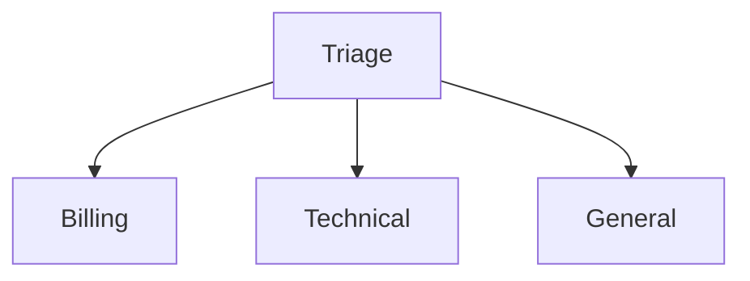

**LangGraph**

```python
class RouteState(TypedDict):
    ticket: str
    route: str
    reply: str


class Route(BaseModel):
    step: Literal["billing", "technical", "general"]


def classify(state: RouteState):
    return {"route": llm.with_structured_output(Route).invoke(f"Classify: {state['ticket']}").step}


def specialist(role: str):
    def node(state: RouteState):
        return {"reply": llm.invoke(f"As the {role} team, answer: {state['ticket']}").content}
    return node


builder = StateGraph(RouteState)
builder.add_node("classify", classify)
for role in ["billing", "technical", "general"]:
    builder.add_node(role, specialist(role))
    builder.add_edge(role, END)
builder.add_edge(START, "classify")
builder.add_conditional_edges("classify", lambda state: state["route"], ["billing", "technical", "general"])

graph = builder.compile()
print(graph.invoke({"ticket": "I was charged twice this month."})["reply"])
```

**GraphWorkflow**

```python
routes = {
    "Billing": "payments, invoices, refunds, or duplicate charges",
    "Technical": "bugs, API errors, or integration problems",
    "General": "anything else",
}

result = run_graph(
    "Gated support routing",
    "I was charged twice this month.",
    agents=[
        agent(
            "Triage",
            "Restate the customer's message, then end with exactly one line: ROUTE: BILLING, ROUTE: TECHNICAL, or ROUTE: GENERAL.",
            model="gpt-4.1-mini",
        )
    ]
    + [
        agent(
            name,
            f"You handle {scope}. If the input you receive does not end with ROUTE: {name.upper()}, "
            "reply with the single word SKIPPED. Otherwise, answer the customer.",
            model="gpt-4.1-mini",
        )
        for name, scope in routes.items()
    ],
    edges=[edge("Triage", name) for name in routes],
    entry_points=["Triage"],
    end_points=list(routes),
)
answer = next(v for v in result["outputs"].values() if str(v).strip() != "SKIPPED")
print(answer)
```

**What changes:** all three specialists run and all three are billed (tokens plus $0.01 each), including the two that reply `SKIPPED`, so put gated branches on a small model and keep their prompts short. When a skipped branch would be expensive, route in your code: make one classification call, then submit only the graph for the chosen branch.

### Pattern 13: Subgraphs from Python fragments

Two research teams, each a small graph of its own, feed one writer.

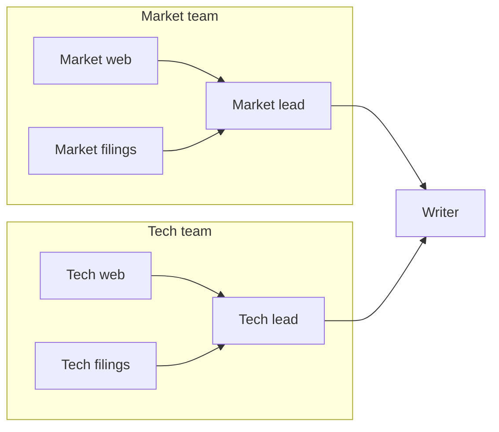

**LangGraph**

```python
class ResearchState(TypedDict):
    topic: str
    findings: Annotated[list[str], add]


def web(state: ResearchState):
    return {"findings": [llm.invoke(f"Web research on {state['topic']}").content]}


def filings(state: ResearchState):
    return {"findings": [llm.invoke(f"Filings research on {state['topic']}").content]}


team = StateGraph(ResearchState)
team.add_node("web", web)
team.add_node("filings", filings)
team.add_edge(START, "web")
team.add_edge(START, "filings")
team.add_edge("web", END)
team.add_edge("filings", END)
research_team = team.compile()


def write_report(state: ResearchState):
    return {"findings": [llm.invoke("Write the report:\n" + "\n\n".join(state["findings"])).content]}


parent = StateGraph(ResearchState)
parent.add_node("research_team", research_team)
parent.add_node("write", write_report)
parent.add_edge(START, "research_team")
parent.add_edge("research_team", "write")
parent.add_edge("write", END)

graph = parent.compile()
print(graph.invoke({"topic": "sodium-ion batteries"})["findings"][-1])
```

**GraphWorkflow**

```python
def research_team(prefix, focus):
    workers = [
        agent(f"{prefix}-web", f"Research {focus} using public web sources.", model="gpt-4.1-mini"),
        agent(f"{prefix}-filings", f"Research {focus} using filings and papers.", model="gpt-4.1-mini"),
    ]
    lead = agent(f"{prefix}-lead", f"Merge your team's {focus} research into one briefing.")
    return {
        "agents": workers + [lead],
        "edges": [edge(w["agent_name"], lead["agent_name"]) for w in workers],
        "entry": [w["agent_name"] for w in workers],
        "exit": lead["agent_name"],
    }


teams = [research_team("market", "the market"), research_team("tech", "the technology")]
writer = agent("Writer", "Write the final report from the team briefings you receive.")

result = run_graph(
    "Nested research",
    "Sodium-ion batteries",
    agents=[a for t in teams for a in t["agents"]] + [writer],
    edges=[e for t in teams for e in t["edges"]] + [edge(t["exit"], "Writer") for t in teams],
    entry_points=[n for t in teams for n in t["entry"]],
    end_points=["Writer"],
)
print(result["outputs"]["Writer"])
```

**What changes:** a subgraph is a function that returns agents, edges, and its own entry and exit nodes, and composing subgraphs is list concatenation with prefixed names to keep node IDs unique. The compiler sees the flattened graph, so both teams' workers land in the same concurrent layer.

### Pattern 14: Edge metadata

Tag edges with priority, audit labels, or cost centers so your own systems can filter and attribute graph runs.

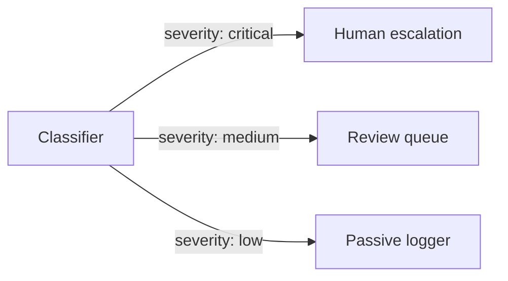

**LangGraph**

LangGraph edges carry no data of their own. The closest equivalent is run-level tags and metadata passed in the config, which your tracing backend records for the whole run:

```python
# graph: any compiled StateGraph, such as one from the patterns above
graph.invoke(
    {"ticket": "Suspicious login from a new country"},
    config={"tags": ["trust-and-safety"], "metadata": {"cost_center": "support"}},
)
```

**GraphWorkflow**

```python
edges = [
    edge("Classifier", "HumanEscalation", severity="critical", priority="p0", audit_tag="trust_and_safety", cost_center="support"),
    edge("Classifier", "ReviewQueue", severity="medium", priority="p2", cost_center="support"),
    edge("Classifier", "PassiveLogger", severity="low", priority="p4", cost_center="ops"),
]

result = run_graph(
    "Moderation",
    "Suspicious login from a new country, followed by a password change.",
    agents=[
        agent("Classifier", "Classify the event's severity as critical, medium, or low, and explain why."),
        agent("HumanEscalation", "If the classification you receive is critical, draft an escalation note. Otherwise reply SKIPPED."),
        agent("ReviewQueue", "If the classification you receive is medium, write a review ticket. Otherwise reply SKIPPED."),
        agent("PassiveLogger", "If the classification you receive is low, write a one-line log entry. Otherwise reply SKIPPED."),
    ],
    edges=edges,
    entry_points=["Classifier"],
    end_points=["HumanEscalation", "ReviewQueue", "PassiveLogger"],
)

edge_index = {(e["source"], e["target"]): e.get("metadata", {}) for e in edges}
for (source, target), meta in edge_index.items():
    print(target, meta.get("priority"), str(result["outputs"].get(target, ""))[:80])
```

**What changes:** metadata keys are free-form and travel with each edge. The response does not echo them back, so keep the `edges` list you submitted and join it against `outputs` on your side, as `edge_index` does above. Usage is reported for the whole workflow, so per-cost-center attribution is also something you compute from those tags.

## Where the two differ

| Capability | LangGraph | GraphWorkflow, and the practical approach |
| --- | --- | --- |
| Cycles | Supported, bounded by `recursion_limit` | Acyclic graphs only. Unroll a fixed number of rounds (Pattern 11), or call the graph again from your code until a verdict passes. |
| Conditional edges | `add_conditional_edges` and `Command(goto=...)` | Every declared edge fires. Gate branches in prompts and accept that they run and bill (Pattern 12), or choose which graph to submit in your code. |
| Dynamic fan-out | `Send` expands a list at runtime | Generate the nodes in Python before the request (Pattern 7); if a model must choose the list, run a planning graph first. |
| Typed state and reducers | `TypedDict` state with reducers such as `operator.add` | No shared state. Each node receives its parents' outputs as context; ask end nodes for JSON when a consumer needs structure. |
| Checkpointing and persistence | Checkpointers and `thread_id` resume a run from any step | Each request is stateless and runs to completion. Store `outputs` keyed by `job_id` in your own database. |
| Human-in-the-loop | `interrupt()`, resumed with `Command(resume=...)` | Split into two graph runs: run up to the review point, persist `outputs`, and pass the reviewed text as the second run's `task`. |
| Streaming | Several stream modes, such as `values` and `updates` | The documented response is one JSON body with every node's output when the run finishes. |
| Hosting | Your own Python process (LangChain also sells a managed platform) | One HTTPS request to Swarms infrastructure, or the open-source framework in your own process. |
| Models per node | One client per vendor, each with its own key and bill | `model_name` per agent, one key for every vendor in the catalog. |
| Failover | `with_fallbacks` on each client | `fallback_models` (ordered) and `fallback_model_name` per agent. |
| Edge data | None; tags and metadata apply to the whole run | Free-form `metadata` on every edge. |
| Pricing | Free library; each provider bills its own rates | $6.50 per million input tokens and $18.50 per million output tokens on every model, plus $0.01 per agent. Requires a Pro, Ultra, or Premium plan. |
| Cost per run | Joined from provider invoices and your tracing tool | `usage.total_cost` in every response. |
| Compile and execution overhead | Per-superstep work on every run | 7.0x faster execution on average, 21.6x to 31.3x faster compilation, per the paper. |

## Cost and observability

Every graph response carries its own bill. `usage` is a flat object with `input_tokens`, `output_tokens`, `total_tokens`, `total_cost`, and `cost_per_agent`, and `total_cost` is the full charge for the run: input and output token costs plus the per-agent fee.

The rates are the same for every model: **$6.50 per million input tokens, $18.50 per million output tokens, and $0.01 per agent in the graph.** The docs' two-agent example works out exactly: 1,250 input tokens ($0.0081) plus 3,200 output tokens ($0.0592) plus two agents ($0.02) is $0.0873. The nine-agent layered mesh in Pattern 5 carries $0.09 in agent fees before tokens. Swarms' 50% overnight token discount does not apply to graph workflows.

Three habits keep graph costs predictable:

- **Size models per node.** Collectors, translators, mappers, and gated branches rarely need a frontier model; judges, planners, and final writers usually do.
- **Count gated branches.** Every declared branch runs, so a router with five gated specialists pays for five agents on every request.
- **Cap output length.** `max_tokens` defaults to 16,000 per agent; set it lower on nodes that only need a paragraph.

For history, every graph run is recorded in your account log (`GET /v1/account/logs`) and browsable at [cloud.swarms.world/history](https://cloud.swarms.world/history), with per-run costs and CSV export. Rate-limit headers (`X-RateLimit-Remaining-Minute`, `X-RateLimit-Remaining-Day`, `X-RateLimit-Reset`) come back on every response. Usage is reported per workflow; for per-team or per-feature attribution, tag edges with a `cost_center` (Pattern 14) and split the total on your side.

## Migration checklist

1. List every LangGraph graph and its nodes, edges, and conditional edges.
2. Mark anything that uses cycles, `interrupt()`, checkpointers, or `Send`; those need the redesigns above. Port the rest first.
3. Turn each node into an agent: `agent_name` from the node name, `system_prompt` from the node's prompt, `model_name` from its client.
4. Rewrite state reads as instructions about upstream context ("You will receive research notes; use them to...").
5. Translate each `add_edge` into a `{"source", "target"}` dict, and each list-form edge into one edge per parent.
6. Set `entry_points` from the nodes after `START` and `end_points` from the nodes before `END`.
7. Check what each node needs to see, and add edges from earlier nodes where a node needs more than its direct parent's output.
8. Replace conditional edges with gating or a routing call in your code, and unroll or externalize loops.
9. Add `fallback_models` to the nodes that matter most, and put reviewers and judges on a different vendor from the nodes they review.
10. Set the client timeout by graph size (300, 600, or 900 or more seconds).
11. Run both versions on the same inputs, compare `outputs` node by node and `usage.total_cost` per run, then cut over.

## FAQ

**Can a GraphWorkflow contain cycles?**
No. GraphWorkflow runs directed acyclic graphs, which is what makes compile-once execution possible. Unroll a fixed number of rounds, or run the graph again from your code until a verdict passes.

**How do I express a conditional edge?**
Every declared edge fires when its source finishes. Gate branches in their prompts so irrelevant ones reply `SKIPPED` (they still run and are billed), or make a classification call first and submit only the graph for the chosen branch.

**What does a node with several parents receive?**
It runs once all of its parents have finished, with all of their outputs added to its context. Entry-point agents start from the `task`.

**Which edge formats does the API accept?**
Dicts with `source` and `target`, optionally with `metadata`. List and tuple shorthands fail validation with a 422, and a name that does not match an `agent_name` returns a 400.

**Does the response include intermediate results?**
Yes. `outputs` contains every node's output keyed by agent name, so you can inspect any node after the run.

**Can every node use a different model or vendor?**
Yes. `model_name`, `fallback_models`, and `fallback_model_name` are set per agent, and one Swarms API key covers the whole catalog.

**What replaces the LangGraph checkpointer?**
Your own storage. Each request is stateless and runs to completion, and each run is recorded in `GET /v1/account/logs`. For resumable flows, persist `outputs` keyed by `job_id` and start the next graph run from them.

**Is the Graph Workflow endpoint on the free tier?**
No. It requires a Pro, Ultra, or Premium plan; free-tier keys receive a 403. The open-source framework's `GraphWorkflow` runs locally without a plan.

**How long does a port take?**
A linear or fan-out graph is usually an afternoon. Graphs built around cycles, interrupts, or heavy reducer logic take longer, because those parts need the redesigns described above.

## Where to start

Port one graph, starting with your most linear one. Write it as a GraphWorkflow payload, run it next to the LangGraph version on real inputs, and compare the outputs node by node along with `usage.total_cost`. Then move to a fan-in or diamond graph, and leave cycles and interrupts for last.

If you prefer to draw the graph first, the [Workflow Builder](https://cloud.swarms.world/workflow-builder) is a no-code canvas for GraphWorkflow: lay out agents as nodes, draw the edges, run the graph, and open the Code panel to copy the exact request. New accounts get a free credit on signup.

Keep reading: [Swarms GraphWorkflow vs LangGraph](/blog/swarms-graphworkflow-vs-langgraph) for the framework-level comparison, [the GraphWorkflow research paper](/blog/graphworkflow-research-paper) for the full benchmark method, and [What Is Swarms Cloud?](/blog/what-is-swarms-cloud) for the platform the Graph Workflow API runs on.

---

*Have questions or feedback? Join our [Discord community](https://discord.gg/VapjxpSyHC) or check out the [documentation](https://docs.swarms.ai).*
