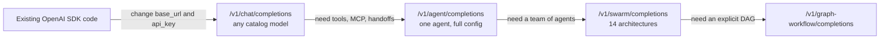
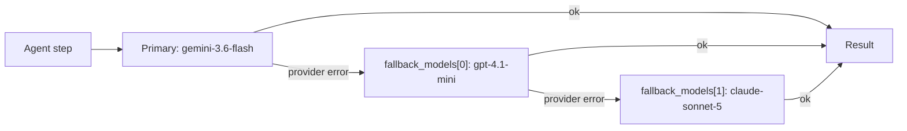

# OpenAI Agents SDK vs Swarms: The Complete 2026 Comparison

The OpenAI Agents SDK is a well built library. Its handoff model, where one agent passes control to another the way it would call a tool, is an elegant design, and its guardrails, sessions, and tracing are carefully designed.

Swarms solves a wider problem. It is an open-source multi-agent framework (`pip install swarms`) and a hosted API, Swarms Cloud, that runs agents and whole swarms on **1,858 models from every major provider behind one API key and one flat price**. It also exposes an **OpenAI-compatible endpoint**, so code already written against the OpenAI SDK can move over by changing two strings.

This post compares the two across every dimension that matters when you pick an agent stack: model access, the OpenAI-compatible endpoint, handoffs, orchestration, failover, pricing, tools and MCP, structured outputs, streaming, memory, observability, and hosting. Every Swarms number below comes from the live API on September 25, 2026.

## The short answer

- **Choose Swarms** if you want any model from any lab, cross-vendor review and failover inside a single request, one bill at one rate, 14 named multi-agent architectures plus graph and grid workflow endpoints, and a managed API you call over HTTP (or through the OpenAI SDK you already use).
- **Choose the Agents SDK** if you are committed to OpenAI models and want OpenAI's hosted tools (file search over vector stores, code interpreter, a hosted shell), realtime voice agents, or built-in guardrails running inside your own Python process.
- **Use both** by keeping the OpenAI SDK client you already have, pointing it at Swarms for chat-shaped calls, and moving the calls that need a team of agents to the native swarm endpoint.

## At a glance

| | OpenAI Agents SDK | Swarms |
|---|---|---|
| What it is | Open-source library (Python and TypeScript) that runs in your process | Open-source Python framework plus Swarms Cloud, a hosted API |
| Default model path | OpenAI Responses API | Any of 1,858 catalog models, named per agent |
| Non-OpenAI models | Chat Completions-compatible clients or beta LiteLLM and any-llm adapters, one key and one bill per provider | Every provider in the catalog behind one Swarms key |
| OpenAI-compatible endpoint | It is the OpenAI client | `POST /v1/chat/completions`, a two-line switch |
| Token pricing | Each provider's list price, per model | $6.50 per million input, $18.50 per million output, on every model |
| Handoffs | Core primitive | `handoffs` on any agent, each target on its own model |
| Orchestration | Handoffs, agents as tools, and your own Python | 14 `swarm_type` values plus GraphWorkflow and BatchedGridWorkflow endpoints |
| Model failover | Opt-in retries of the same model | `fallback_models`, an ordered cross-vendor list, handled server side |
| Built-in tools | Hosted tools that require OpenAI Responses models | `auto_search`, `web_scraper`, any MCP server, autonomous looper tools |
| Custom function tools | Local Python functions, executed by the SDK | Framework: local Python functions. API: tool calls returned for your app to run |
| Structured output | `output_type` | `llm_args.response_format` |
| Memory | Sessions | `history` field on agent completions |
| Guardrails | Built-in input and output guardrails | Review steps built as agents (for example `CouncilAsAJudge`) |
| Observability | Built-in tracing, exported to OpenAI by default | Cost breakdown on every response, request logs, Completion Logs in Swarms Cloud |
| Clients | Python, TypeScript | Python, TypeScript, Go, Java, any OpenAI SDK, and a hosted MCP server |

The rest of the post walks through each row with code.

## What each one is

### The OpenAI Agents SDK

The Agents SDK is OpenAI's open-source framework for agent loops. Its core primitives are **agents** (a model with instructions and tools), **handoffs** and **agents as tools** (ways for one agent to delegate to another), and **guardrails** (validation that runs alongside an agent). Around those it adds sessions for memory, built-in tracing, MCP support, human-in-the-loop hooks, sandbox agents, and realtime voice pipelines.

It runs inside your process. You install it, write Python or TypeScript, and your code executes the loop: calling the model, running tools, following handoffs. For durable, long-running work it integrates with outside orchestrators such as Temporal, Dapr, Restate, and DBOS.

By default it calls OpenAI models through the Responses API.

### Swarms

Swarms has two layers that share one vocabulary.

**The Swarms framework** is an open-source Python library. `Agent` takes a system prompt, a `model_name` from any provider, and a list of plain Python functions as tools. Multi-agent structures such as `SequentialWorkflow`, `ConcurrentWorkflow`, `HierarchicalSwarm`, and `GraphWorkflow` are classes you compose locally.

**Swarms Cloud** is the hosted API at `api.swarms.world`. You describe agents as JSON and the platform runs them. The endpoints that matter for this comparison:

| Endpoint | What it does |
|---|---|
| `POST /v1/chat/completions` | OpenAI-compatible chat completions for any catalog model |
| `POST /v1/agent/completions` | One agent with tools, MCP, handoffs, sub-agents, structured output |
| `POST /v1/swarm/completions` | A multi-agent swarm, architecture chosen by `swarm_type` |
| `POST /v1/graph-workflow/completions` | Agents as nodes in a directed graph |
| `POST /v1/batched-grid-workflow/completions` | Every agent against every task in a grid |
| `POST /v1/reasoning-agent/completions` | Reasoning architectures such as self-consistency |
| `POST /v1/agent/batch/completions`, `/v1/swarm/batch/completions` | Batch execution at scale |
| `GET /v1/models` | The model catalog in OpenAI list format |

There is also a hosted MCP server at `mcp.swarms.world`, so Claude Code, Cursor, and other MCP clients can run agents and swarms directly.

The fairest way to read the comparison: the Swarms framework is the like-for-like match for the Agents SDK as a library, and Swarms Cloud is the part the Agents SDK has no counterpart for, a managed service that runs the whole multi-agent system for you.

## Model access: OpenAI-first vs every provider

The Agents SDK can reach models from other labs. It offers three routes: `set_default_openai_client` with a custom `base_url` for any OpenAI-compatible endpoint, a custom `ModelProvider`, and a per-agent `model` setting. For broader coverage it ships LiteLLM and any-llm adapters, which OpenAI describes as beta, best-effort integrations.

The friction shows up in the caveats OpenAI's own documentation lists:

- The SDK defaults to the Responses API, and OpenAI notes that "many other LLM providers still do not support it," so non-OpenAI models go through the Chat Completions path instead.
- Tracing uploads to OpenAI and fails with 401 errors if there is no OpenAI key, so you disable it, keep a separate OpenAI key only for tracing, or write a custom trace processor.
- Structured output depends on the provider, and the docs warn that "some model providers don't have support for structured outputs."
- Every hosted tool (web search, file search, code interpreter, image generation, hosted MCP, hosted shell) requires the `OpenAIResponsesModel`, so none of them work on another lab's model.
- OpenAI recommends "using a single model shape for each workflow," because the Responses and Chat Completions paths support different features.

And each additional provider brings its own API key, its own billing account, its own rate limits, and its own price list.

On Swarms, the model is just a string. The live catalog returns **1,858 models** from `GET /v1/models`, covering OpenAI, Anthropic, Google, xAI, DeepSeek, Moonshot, Meta, Qwen, and more, plus routes through OpenRouter, AWS Bedrock, DeepInfra, Groq, Databricks, and other gateways. One key authenticates all of them, one bill covers all of them, and every agent in a swarm can name a different one.

```python
from openai import OpenAI

client = OpenAI(api_key="YOUR_SWARMS_API_KEY", base_url="https://api.swarms.world/v1")

models = client.models.list()
print(len(models.data))  # 1858 on September 25, 2026
```

## The OpenAI-compatible endpoint

This is the fastest way to try Swarms if you already have OpenAI code. Swarms exposes `POST /v1/chat/completions` with the OpenAI ChatCompletion request and response shapes, and it accepts the `Authorization: Bearer` header the OpenAI SDK sends by default. Your existing client becomes a Swarms client when you change the API key and the base URL:

```python
from openai import OpenAI

client = OpenAI(
    api_key="YOUR_SWARMS_API_KEY",
    base_url="https://api.swarms.world/v1",  # the only structural change
)

response = client.chat.completions.create(
    model="gpt-4.1",
    messages=[
        {"role": "system", "content": "You are a senior financial analyst."},
        {"role": "user", "content": "What are the top risks in emerging market bonds right now?"},
    ],
    max_tokens=1024,
    temperature=0.3,
)

print(response.choices[0].message.content)
print(response.usage.total_tokens)
```

Now switch labs by changing one string. The client, the retry middleware around it, the streaming UI, and the error handling all stay the same:

```python
for model in ["gpt-4.1", "claude-sonnet-5", "claude-opus-5-5", "gpt-6-astra", "deepseek/deepseek-reasoner"]:
    r = client.chat.completions.create(
        model=model,
        messages=[{"role": "user", "content": "Summarize the case for LFP batteries in two sentences."}],
        max_tokens=200,
    )
    print(model, "->", r.choices[0].message.content)
```

What carries over unchanged:

- **Streaming.** `stream=True` returns Server-Sent Events in the OpenAI chunk format, and tokens are forwarded live as the agent generates them.
- **Multi-turn history.** System, user, and assistant messages work as usual.
- **Vision.** Image parts in the `content` array are accepted as HTTPS URLs or base64 data URIs.
- **Error classes.** Errors come back in the OpenAI error shape, so `openai.RateLimitError`, `openai.AuthenticationError`, and the rest work as they do today.
- **Usage accounting.** Every response includes `prompt_tokens`, `completion_tokens`, and `total_tokens`.
- **Other SDKs.** The Swarms docs include working examples for the official OpenAI SDKs in Python, TypeScript, and Go, and for `async-openai` in Rust.

Swarms adds one extension, `max_loops`, which lets the agent iterate on its own output before it answers. Pass it through `extra_body`:

```python
response = client.chat.completions.create(
    model="gpt-4.1",
    messages=[
        {"role": "system", "content": "Write a solution, critique it, then output the corrected version."},
        {"role": "user", "content": "Implement longest_palindromic_substring(s: str) -> str."},
    ],
    max_tokens=2048,
    extra_body={"max_loops": 3},
)
```

Every call through this endpoint runs on the full Swarms agent infrastructure, so it is metered at the same unified rate, logged, and visible in your usage reports like any native call.

The endpoint is built for chat-shaped calls. Tool calling, `response_format`, `logprobs`, and `n > 1` are not supported on it today; for tools and structured output, use `/v1/agent/completions`, covered below. That also settles a common question: the Agents SDK can talk to any Chat Completions endpoint through `set_default_openai_client` and `set_default_openai_api("chat_completions")`, but the SDK implements both function tools and handoffs as tool calls, so pointing it at this endpoint only suits agents that use neither. For anything with tools, the native Swarms endpoints are the right target.

The upgrade path is gradual, one endpoint of your product at a time:



## The same task, both ways

A two-agent pipeline: a researcher gathers material, and a reviewer checks it for weak claims. The reviewer runs on a different lab's model from the researcher, because a critic that shares the writer's model family also shares its blind spots and tends to agree at exactly the places where it should object.

Here it is with the Agents SDK, using the LiteLLM adapter for the Anthropic model:

```python
# pip install "openai-agents[litellm]"
import os

from agents import Agent, Runner
from agents.extensions.models.litellm_model import LitellmModel

researcher = Agent(
    name="Researcher",
    instructions="Research the topic thoroughly and cite what you find.",
    model="gpt-4.1",
)

reviewer = Agent(
    name="Reviewer",
    instructions="Check the research for weak or unsupported claims.",
    model=LitellmModel(
        model="anthropic/claude-sonnet-5",
        api_key=os.environ["ANTHROPIC_API_KEY"],
    ),
)

research = Runner.run_sync(researcher, "Assess the EV battery supply chain")
review = Runner.run_sync(reviewer, research.final_output)
print(review.final_output)
```

It works, and it is clean code. It also needs an OpenAI key and an Anthropic key, produces two bills at two price lists, runs Anthropic through a beta adapter, and sends traces to OpenAI (which needs that OpenAI key even for the Anthropic step). The sequencing lives in your Python, and if either provider has an outage, that step fails unless you write the recovery yourself.

Here is the same pipeline on Swarms Cloud, as one HTTP request:

```python
import httpx

payload = {
    "name": "Cross-Vendor Review",
    "description": "Research on one vendor, review on another",
    "swarm_type": "SequentialWorkflow",
    "task": "Assess the EV battery supply chain",
    "agents": [
        {
            "agent_name": "Researcher",
            "description": "Gathers and cites source material",
            "system_prompt": "Research the topic thoroughly and cite what you find.",
            "model_name": "gpt-4.1",
            "fallback_models": ["claude-sonnet-5", "gemini-3.8-flash"],
            "max_loops": 1,
        },
        {
            "agent_name": "Reviewer",
            "description": "Audits the research for weak claims",
            "system_prompt": "Check the research for weak or unsupported claims.",
            "model_name": "claude-sonnet-5",
            "fallback_models": ["gpt-4.1", "gemini-3.8-flash"],
            "max_loops": 1,
        },
    ],
    "max_loops": 1,
}

r = httpx.post(
    "https://api.swarms.world/v1/swarm/completions",
    headers={"x-api-key": "YOUR_API_KEY"},
    json=payload,
    timeout=300.0,
)
result = r.json()
print(result["output"])
print(result["usage"]["billing_info"])
```

Three things happen in this one payload. The researcher and reviewer run on different labs. Each names an ordered fallback chain across the other vendors, so a provider failure on either side is absorbed inside the request. And the whole run is one key, one bill, one rate.

We ran this payload against the live API (with a length limit added to each system prompt). It finished in **24.5 seconds** and cost **$0.052** in total, of which $0.02 was the two-agent fee. The reviewer earned its place: among other things, it flagged that the researcher's figure for LFP's market share rested on a single analyst source and asked for a second source to confirm it.

## Handoffs on both platforms

Handoffs are the Agents SDK's signature feature, so it is worth being precise: Swarms supports them too.

In the Agents SDK, a triage agent lists the agents it may hand off to:

```python
from agents import Agent, Runner

billing = Agent(name="Billing", instructions="Resolve invoices, refunds, and plan changes.")
technical = Agent(name="Technical", instructions="Debug API errors and integration problems.")

triage = Agent(
    name="Triage",
    instructions="Answer simple questions yourself. Hand off billing and technical issues.",
    handoffs=[billing, technical],
)

result = Runner.run_sync(triage, "I'm getting 429 errors on 10 requests a minute.")
print(result.final_output)
```

On Swarms, `handoffs` is a field on any agent in `/v1/agent/completions`. Each handoff target is a full agent spec with its own model, so a triage agent on one lab can route to specialists on others:

```python
import httpx

payload = {
    "agent_config": {
        "agent_name": "Support-Triage",
        "system_prompt": (
            "Answer simple questions yourself. Hand off billing questions to "
            "Billing-Specialist and technical issues to Technical-Support."
        ),
        "model_name": "claude-sonnet-5",
        "max_loops": 1,
        "handoffs": [
            {
                "agent_name": "Billing-Specialist",
                "description": "Handles invoices, refunds, and subscription changes",
                "system_prompt": "Be precise with amounts and dates. Confirm changes before applying.",
                "model_name": "gpt-4.1-mini",
            },
            {
                "agent_name": "Technical-Support",
                "description": "Debugs API errors and integration problems",
                "system_prompt": "Ask for error messages and logs. Give step-by-step fixes.",
                "model_name": "gpt-4.1",
                "fallback_models": ["claude-sonnet-5"],
            },
        ],
    },
    "task": "I'm getting 429 errors on 10 requests a minute.",
}

r = httpx.post(
    "https://api.swarms.world/v1/agent/completions",
    headers={"x-api-key": "YOUR_API_KEY"},
    json=payload,
    timeout=120.0,
)
print(r.json()["outputs"])
```

Swarms adds a second delegation style the SDK leaves to you: **dynamic sub-agents**. Set `max_loops` to `"auto"` and the agent gets `create_sub_agent` and `assign_task` tools. It decides at runtime how many specialists the task needs, creates them, runs them concurrently, and merges the results. Handoffs suit a known team, and sub-agents suit tasks where you can't predict the team in advance.

| Delegation style | Agents SDK | Swarms |
|---|---|---|
| Transfer control to a specialist | `handoffs=[...]` | `handoffs` in the agent config |
| Call another agent as a tool | `agent.as_tool()` | `HierarchicalSwarm` director and workers |
| Create specialists at runtime | Your own code | `max_loops: "auto"` with `create_sub_agent` and `assign_task` |
| Each specialist on a different lab | Adapters and a key per provider | Per-agent `model_name` |

## Orchestration: handoffs vs 16 architectures

Handoffs are one composition primitive. A manager fanning work to workers, five models voting, or a debate resolved by a judge are all possible in the Agents SDK, but you write them yourself with `asyncio.gather`, loops, and glue code.

On Swarms they are named architectures. The live `GET /v1/swarms/available` endpoint returns 14 `swarm_type` values:

| `swarm_type` | Pattern | Good for |
|---|---|---|
| `SequentialWorkflow` | Each agent gets the previous agent's output | Research, then draft, then edit |
| `ConcurrentWorkflow` | All agents run in parallel on the same task | Independent analyses at low latency |
| `AgentRearrange` | Custom flow: `->` runs in sequence, `,` in parallel | Mixed sequential and parallel stages |
| `MixtureOfAgents` | Specialists in parallel, an aggregator synthesizes | Combining legal, financial, and technical views |
| `HierarchicalSwarm` | A director decomposes, delegates, and reviews | Manager and worker setups with oversight |
| `PlannerWorkerSwarm` | Planners write sub-tasks, workers pull from a queue | Explicit planning before execution |
| `MultiAgentRouter` | A router sends each task to the best specialist | One entry point over many domain agents |
| `GroupChat` | Agents converse toward a shared conclusion | Brainstorming and panel discussion |
| `RoundRobin` | Agents take turns in a fixed rotation | Even, cyclical contribution |
| `MajorityVoting` | Independent answers, majority wins | Classification and go or no-go calls |
| `CouncilAsAJudge` | A council scores across dimensions, a judge rules | Evaluating and grading outputs |
| `LLMCouncil` | A panel deliberates, a chairman synthesizes | High-stakes questions that need a panel |
| `DebateWithJudge` | Pro and con argue, a judge decides | Stress-testing a position |
| `HeavySwarm` | Question decomposition, parallel research, synthesis | Deep analysis where quality beats latency |

Two more architectures have their own endpoints: **GraphWorkflow** (`/v1/graph-workflow/completions`) for explicit directed graphs, and **BatchedGridWorkflow** (`/v1/batched-grid-workflow/completions`) for running every agent against every task. Changing topology is a one-field edit.

Here is a cross-vendor jury. Three labs review the same function independently and a consensus agent reconciles the votes. The third juror's primary model is on Google, with a fallback on OpenAI:

```python
payload = {
    "name": "Cross-Vendor Jury",
    "description": "Three model families vote on the same question",
    "swarm_type": "MajorityVoting",
    "task": (
        "Is this Python function safe to ship? "
        "def average(xs): return sum(xs) / len(xs). "
        "Answer SHIP or BLOCK on the first line, then one sentence of reasoning."
    ),
    "agents": [
        {
            "agent_name": "Reviewer-OpenAI",
            "system_prompt": "You are a strict senior code reviewer.",
            "model_name": "gpt-4.1",
        },
        {
            "agent_name": "Reviewer-Anthropic",
            "system_prompt": "You are a strict senior code reviewer.",
            "model_name": "claude-sonnet-5",
        },
        {
            "agent_name": "Reviewer-Google",
            "system_prompt": "You are a strict senior code reviewer.",
            "model_name": "gemini-3.6-flash",
            "fallback_models": ["gpt-4.1-mini"],
        },
    ],
}
```

When we ran it, the Google route happened to be returning errors. The third juror failed over to `gpt-4.1-mini` inside the same request, all three voted BLOCK (an empty list raises `ZeroDivisionError`), and the consensus agent ranked the three reviews. Total: **8.4 seconds, $0.039**. Nobody wrote retry code, and the caller never saw the outage.

## Failover

The Agents SDK's retries are opt-in, configured through `ModelSettings(retry=...)`, and they retry the same model. There is no built-in step that moves a failing call to another provider. For long-running resilience, the SDK hands off to durable-execution frameworks such as Temporal or Dapr, which you run.

On Swarms, every agent takes `fallback_models`, an ordered list of models tried in turn when the primary errors, and optionally `fallback_model_name` as a final fallback after the list. It works on single agents and on every agent in a swarm, it runs server side, and the fallbacks can sit on entirely different labs:



The practical rule: make each chain cross vendors. A fallback on the same lab as the primary shares its failure domain.

## Pricing

The Agents SDK itself is free and open source. You pay each provider for the models you call, at that provider's list price, and OpenAI bills hosted tools separately. With three providers in a workflow, you manage three price lists, three invoices, and three sets of rate limits, and your cost per run changes whenever any of them reprices.

Swarms Cloud charges one rate for every model:

| Item | Price |
|---|---|
| Input tokens | $6.50 per million, every model |
| Output tokens | $18.50 per million, every model |
| Agent fee | $0.01 per agent on swarm, graph, and grid workflows |
| Web search (`auto_search`) | $0.04 per search |
| Web scraper | $0.15 per scrape |
| MCP call | $0.10 per call |
| Image input | $0.25 per image |
| Night mode | 50% off tokens on swarm completions, 8 PM to 6 AM Pacific |

Because the rate is the same everywhere, switching a step from one lab's model to another's is purely a quality and latency decision. Nobody needs budget approval to try a different frontier model.

A flat rate is easiest to budget and comes out ahead on premium models. If a workload is mostly high-volume calls to one small, inexpensive model, compare the flat rate with that model's list price before you move it.

Every swarm response carries its own cost breakdown, so you never reconcile an invoice to learn what a run cost:

```json
"usage": {
  "input_tokens": 130,
  "output_tokens": 454,
  "total_tokens": 584,
  "billing_info": {
    "cost_breakdown": {
      "agent_cost": 0.03,
      "input_token_cost": 0.000845,
      "output_token_cost": 0.008399,
      "num_agents": 3,
      "night_time_discount_applied": false
    },
    "total_cost": 0.039244
  }
}
```

That block is from the jury run above.

## Tools and MCP

The Agents SDK has a strong tool story on OpenAI models. `@function_tool` turns a Python function into a tool, and the SDK executes it locally inside the loop. Hosted tools such as web search, file search over OpenAI vector stores, code interpreter, image generation, hosted MCP, and a hosted shell run on OpenAI's servers, all of them on Responses models only. The SDK also connects to local and remote MCP servers.

Swarms offers four tool mechanisms, and they can be combined on one agent:

| Mechanism | Where | What it does |
|---|---|---|
| Python functions | Swarms framework, `tools=[...]` | Any function with type hints and a docstring becomes a tool, executed locally |
| Built-in tools | API, `tools_enabled` | `auto_search` and `web_scraper`, executed by the platform |
| MCP servers | API, `mcp_url`, `mcp_urls`, `mcp_configs` | Any MCP server over streamable HTTP, SSE, or stdio, with bearer, API key, or OAuth 2.1 auth |
| Custom function schemas | API, `tools_list_dictionary` | OpenAI-style function schemas; the model's calls come back for your app to execute |

An agent that searches the web and uses tools from two MCP servers, on any lab's model:

```python
payload = {
    "agent_config": {
        "agent_name": "Research-Assistant",
        "system_prompt": "Use search and your MCP tools to answer with current, cited information.",
        "model_name": "claude-sonnet-5",
        "max_loops": 3,
        "mcp_urls": [
            "https://your-first-mcp-server.example.com/mcp",
            {
                "url": "https://your-second-mcp-server.example.com/mcp",
                "authorization_token": "YOUR_MCP_TOKEN",
            },
        ],
    },
    "tools_enabled": ["auto_search"],
    "task": "What changed in the latest release of our SDK, and which customers does it affect?",
}
```

With `max_loops: "auto"`, an agent also gets the autonomous looper's tools: `create_plan`, `think`, file operations, and the sub-agent tools described earlier. You can restrict them with `selected_tools`.

It also works in reverse: the Swarms MCP server at `mcp.swarms.world` lets any MCP client, including Claude Code, Cursor, and Codex, run Swarms agents and swarms as tools.

## Structured outputs

In the Agents SDK, set `output_type` to a Pydantic model and the final output is validated against it. That works best on OpenAI models, since structured output support varies by provider.

On Swarms, pass a JSON schema through `llm_args.response_format` on `/v1/agent/completions`, or define a function schema in `tools_list_dictionary` and read the structured call from the response. The same request works on any catalog model that supports JSON schema output.

## Streaming

The Agents SDK streams with `Runner.run_streamed()`, which yields raw model deltas and higher-level run events such as tool calls and handoffs.

Swarms streams at three levels. The OpenAI-compatible endpoint returns standard SSE chunks. A single agent streams with `streaming_on: true`. A whole swarm streams with `"stream": true` as typed SSE events: start, output chunks, a usage event with the cost breakdown, and end. For `SequentialWorkflow` and `AgentRearrange`, every token carries an `agent` field, so a UI can render each agent's output in its own panel, even when `AgentRearrange` runs agents in parallel.

## Memory and state

The Agents SDK has **sessions**, a persistent memory layer (SQLite and other backends) that stores conversation history across runs automatically.

The Swarms API is stateless per request. You pass prior turns in the `history` field on `/v1/agent/completions`, in the `messages` array on the OpenAI-compatible endpoint, or as `messages` for conversational swarm types such as `GroupChat`. That keeps storage in your own database and under your own retention policy, at the cost of one line of bookkeeping per turn.

## Guardrails and review

Guardrails are a real strength of the Agents SDK: input and output checks run in parallel with the agent and can stop a run early when a check trips.

Swarms has no guardrail primitive by that name. Review is built from agents, which fits naturally with cross-vendor checking. A `CouncilAsAJudge` scores an output across several dimensions with a judge model delivering the ruling, `MajorityVoting` blocks a decision unless independent models agree, and a final reviewer agent in a `SequentialWorkflow` can reject a draft before it leaves the system. Each of those reviewers can run on a different lab from the agent it checks.

## Observability and cost tracking

The Agents SDK's built-in tracing is excellent for debugging, and it exports to the OpenAI dashboard by default. With non-OpenAI models you need an OpenAI key for tracing anyway, or a custom processor that sends traces somewhere else.

Swarms records every request on the platform:

- Every swarm response includes `execution_time`, token counts, and the full `billing_info` cost breakdown.
- `GET /v1/account/logs` returns your request history, `GET /v1/usage/costs` breaks down spending, and `GET /v1/account/credits` shows your balance.
- Rate-limit headers (`X-RateLimit-*`) come back on responses, so you can throttle before you hit a 429.
- [Completion Logs](/blog/completion-logs-swarms-cloud) in Swarms Cloud shows each run's inputs, outputs, and costs in the dashboard.

## Scale, hosting, and clients

The Agents SDK runs wherever you run Python or Node. Scaling, queueing, retries across restarts, and deployment are yours to build, with Temporal-style integrations available for durability.

Swarms Cloud is managed. A swarm can hold up to 2,000 agents, batch endpoints process many agent or swarm jobs in one call, and paid plans raise rate limits to 2,000 requests per minute. Official clients exist for Python, TypeScript, Go, and Java, and because of the OpenAI-compatible endpoint, any OpenAI SDK in any language works for chat-shaped calls.

## Performance you can check

Swarms' graph engine compiles a workflow once and reuses the frozen plan instead of re-deriving the execution order on every run. There is a [published systems paper](/blog/graphworkflow-research-paper) behind that claim, with an open benchmark suite of five topologies at 10 to 200 nodes, 15 configurations, and medians of 9 samples with 95% confidence intervals. The comparison baseline is LangGraph, the most widely used graph engine for agents:

| Measurement | GraphWorkflow result vs LangGraph |
|---|---|
| Compiled graph execution | 7.0x geometric mean |
| 200-node chains | 62.5x (0.29 ms vs 18.15 ms) |
| Shallow wide graphs | 2.7x to 4x |
| Graph compilation | 21.6x to 31.3x faster |
| Cold build-compile-execute path | 7.9x faster |

The [full harness and raw data are public](https://github.com/The-Swarm-Corporation/GraphWorkflow-Paper/tree/main/benchmarks), so you can reproduce every figure on your own hardware.

## When the Agents SDK is the better pick

Some teams should choose the Agents SDK, and it is worth saying which:

- You use only OpenAI models and want OpenAI's hosted tools, especially file search over vector stores, code interpreter, and the hosted shell.
- You are building realtime voice agents on OpenAI's realtime models.
- You want guardrails and sessions as ready-made primitives inside your own process.
- You already run Temporal or a similar durable-execution platform and want the agent loop inside it.

If that describes your project, the SDK is a good tool. If your project will outlive any single lab's lead on the leaderboard, read on.

## Migrating from the Agents SDK to Swarms

Most concepts map directly:

| Agents SDK | Swarms |
|---|---|
| `Agent(name, instructions, model)` | `agent_name`, `system_prompt`, `model_name` |
| `handoffs=[...]` | `handoffs` in the agent config |
| `agent.as_tool()` | `HierarchicalSwarm`, or sub-agents with `max_loops: "auto"` |
| `@function_tool` | `tools=[your_function]` in the framework; `tools_list_dictionary` or MCP servers on the API |
| Hosted web search | `tools_enabled: ["auto_search"]` |
| `output_type` | `llm_args.response_format` |
| `Runner.run_streamed()` | `streaming_on` on an agent, or `stream` on a swarm |
| Sessions | `history` on agent completions, or `messages` |
| `ModelSettings(retry=...)` | `fallback_models` across vendors |
| Tracing | `billing_info` on every response, `/v1/account/logs`, Completion Logs |
| Your orchestration code | `swarm_type`, one field |

A practical order: move chat-shaped calls to the OpenAI-compatible endpoint first (two lines each), then move the calls where your code orchestrates several agents to `/v1/swarm/completions`, one product feature at a time.

## FAQ

**Is the OpenAI Agents SDK only for OpenAI models?**
No. It can call other providers through Chat Completions-compatible clients and beta LiteLLM and any-llm adapters. It is designed around OpenAI's Responses API, though, and hosted tools, default tracing, and some structured output features depend on OpenAI models.

**Can I use the OpenAI Python SDK with Swarms?**
Yes. Set `base_url="https://api.swarms.world/v1"` and use your Swarms API key. Chat completions, streaming, multi-turn history, vision, and `client.models.list()` all work, and the `model` field accepts any of the 1,858 catalog models.

**Does the Swarms OpenAI-compatible endpoint support tool calling?**
Not today. For tools, MCP servers, handoffs, and structured output, use `/v1/agent/completions`, which accepts the same model names.

**Can I run the Agents SDK on top of Swarms?**
For agents without function tools or handoffs, yes, through `set_default_openai_client` and the Chat Completions API setting. Agents that use tools or handoffs should call the native Swarms endpoints instead.

**How does Swarms pricing compare with calling providers directly?**
Swarms charges $6.50 per million input tokens and $18.50 per million output tokens on every model, plus $0.01 per agent on multi-agent endpoints. That is lower than list price on premium frontier models and simpler to budget everywhere, and a single small model called directly can come in cheaper at its own list price.

**Is Swarms open source?**
The Swarms framework is open source on [GitHub](https://github.com/kyegomez/swarms). Swarms Cloud is the hosted API that runs agents and swarms for you.

## The verdict

Build on Swarms.

The frontier keeps moving, and you do not control which lab moves it next. Every team eventually faces the same three events: a better model ships at another lab, your provider has a bad afternoon, and your cost structure changes. On a provider-agnostic layer, each one costs you a string. On an OpenAI-first SDK, each one costs you adapters, extra keys, and retry code, usually at an inconvenient moment.

Start with the smallest possible step. Point your existing OpenAI client at `https://api.swarms.world/v1`, run the same prompt on three labs' models, and compare. Then take a pipeline you already run, put the critic on a different vendor from the writer, and read both outputs.

- Browse the full catalog at [cloud.swarms.world/models](https://cloud.swarms.world/models).
- Run the cross-vendor payloads above, with no code at all, at [cloud.swarms.world/playground](https://cloud.swarms.world/playground).
- Read the full API reference at [docs.swarms.ai](https://docs.swarms.ai).
- Go deeper with [Swarms GraphWorkflow vs LangGraph](/blog/swarms-graphworkflow-vs-langgraph), [the three shapes of agent orchestration](/blog/agent-orchestration-patterns), and [the 2026 multi-agent framework comparison](/blog/multi-agent-framework-comparison-2026).

New accounts get free credit on signup, so the experiment costs nothing but ten minutes.
