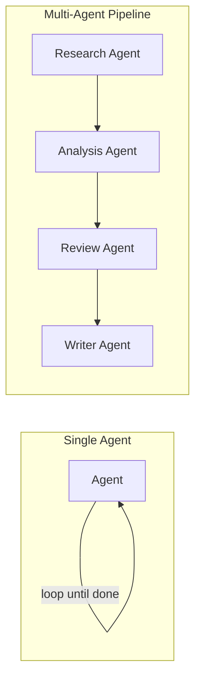

# Single Agent vs. Multi-Agent: When One AI Isn't Enough

The most common mistake teams make when adopting agentic AI is not under-building, it's over-building. A single agent, given the right tools and a large enough context window, can already do a surprising amount: read files, call APIs, query a database, search the web, and reason over the results in a loop until the task is done. Reaching for a five-agent hierarchy when a single agent with two tools would have worked adds latency, cost, and failure surface for no real benefit. This post is a straightforward framework for telling the difference, using what a Swarms `Agent` can already do on its own as the baseline, and the specific signals that mean you've actually outgrown it.

## What a Single Agent Already Handles

A Swarms `Agent` is not a bare prompt-response wrapper. It combines three things: an LLM for reasoning and decision-making, a set of tools it can call, and memory that spans the conversation. Concretely, a single agent already supports:

- **Tool use.** Function calling for external APIs, database queries, file operations, web scraping, and search, plus whatever custom business logic you register as a tool. The agent decides on its own whether a tool is needed and with what parameters.
- **Looping.** Execution runs through a configurable loop, from a single pass (`max_loops=1`) to fully autonomous operation (`max_loops="auto"`), where the agent keeps calling tools, folding results back into memory, and continuing until it decides the task is complete.
- **Memory.** Short-term conversation history plus long-term memory backed by a vector database for RAG, with automatic context window management so long-running tasks don't silently lose earlier context.
- **Multi-modal input, streaming, and fallback models.** An agent can process images alongside text, stream partial responses, and fall back to a secondary model if the primary one fails or errors out.

That is a lot of ground covered by one process, one prompt, and one thread of memory. If your task is single-specialty, bounded, and reasoning over it in one continuous context is natural, a single agent is very often the right and cheapest answer. The instinct to reach for multi-agent because it sounds more sophisticated is exactly the instinct this framework is meant to check.

## The Signals You've Actually Outgrown One Agent

Multi-agent architectures earn their overhead when one of these becomes true, not before:

**1. The task needs genuinely distinct expertise or roles.** A single system prompt has to represent one point of view. If a task actually requires a security reviewer's mindset and a performance reviewer's mindset and those two personas would give conflicting advice on the same code, that's a role split, not just a subtask split. Splitting agents lets each one hold a narrower, sharper prompt instead of one prompt trying to be everything.

**2. The task parallelizes and latency matters.** If five independent pieces of research or five independent document extractions have to happen and don't depend on each other's output, one agent looping through them sequentially is strictly slower than five agents (or one concurrent workflow) running them at once. This is a throughput argument, not a quality argument.

**3. You need failure isolation.** In a single agent, one bad tool call, one hallucinated intermediate result, or one context corruption can poison everything downstream in that same thread. Splitting a pipeline into separate agents with their own scoped context means a failure in the extraction step doesn't have to also corrupt the formatting step; you can inspect, retry, or swap out one stage without redoing the whole run.

**4. Context window pressure.** A single agent's context accumulates everything: the original task, every tool call and result, every intermediate reasoning step. On a long enough pipeline, earlier and highly relevant information starts competing for space with recent, less relevant tool output. Splitting stages into separate agents means each one only carries the context it actually needs for its own job, not the full history of everyone else's.

**5. Generation and review need to be separated.** An agent that wrote a piece of code, a plan, or a document is a bad judge of its own output; it's biased toward believing what it just produced is correct. A separate reviewing or critiquing agent, one that never wrote the draft and has no stake in defending it, catches things a self-review pass reliably misses.

If none of these five apply, adding more agents usually just adds coordination overhead: more round trips, more places for the task description to get lost in translation between agents, and more surface area for cost and latency to creep up without a matching quality gain.

## A Task That Looks Like It Needs Multi-Agent (But Doesn't)

Consider: "Summarize this customer support ticket, check our internal knowledge base for a relevant policy, and draft a reply." It's tempting to split this into a summarizer agent, a knowledge-base-lookup agent, and a drafting agent because it has three verbs. But look at the five signals: there's no real role conflict (one competent support-oriented persona can do all three steps), no parallelism (the lookup depends on the summary, and the draft depends on the lookup, so nothing runs concurrently anyway), no meaningful failure isolation benefit (if the summary is wrong, the whole ticket response is wrong regardless of which agent produced it), no context pressure (a single ticket and one KB lookup is small), and no adversarial review need. This is a single agent with a knowledge-base search tool, running with `max_loops` set to a small number. Splitting it into three agents here just adds two extra network round trips and two more places for the ticket's context to get diluted.

## A Task That Genuinely Needs It

Now consider: "Take this incoming feature request, produce a technical design doc, have it reviewed for security and for performance independently, then have a separate agent finalize the doc incorporating both sets of feedback." Here, the signals actually apply: security review and performance review are distinct expertise with potentially conflicting priorities (signal 1), the two reviews don't depend on each other so they can run at the same time (signal 2), a bad or overly aggressive security review shouldn't be able to derail the performance review's independent output (signal 3), and critically, the reviewers must not be the same agent that wrote the design doc, or their reviews will be biased toward approving their own draft (signal 5). This maps naturally onto a concurrent workflow for the two independent reviewers, feeding into a hierarchical or sequential step for the finalizing agent, closer to what a [manager/worker agent architecture](/blog/manager-worker-agent-architectures) is built for.

## The Architectures, Briefly

Once the signals point toward multi-agent, Swarms provides several built-in architectures rather than requiring you to hand-write orchestration logic: **sequential workflow** for linear, dependent steps; **concurrent workflow** for independent work that should run in parallel; **agent rearrange** for custom, mixed sequential/parallel flow patterns; **mixture of agents** for parallel experts whose outputs get aggregated into one synthesis; **hierarchical swarm** for director/worker coordination with refinement cycles; **graph workflow** for DAG-based execution with branches that converge; **group chat** for debate-style, conversational problem-solving between agents; **heavy swarm** for multi-phase deep research; and **swarm router** for dynamically picking a strategy at runtime. For a full walkthrough of what each one is for, see [what is a multi-agent system](/blog/what-is-a-multi-agent-system). If none of the built-in patterns fit your coordination logic exactly, Swarms also supports fully custom architectures built from three primitives, an agent structure, a swarm container that orchestrates them, and a shared conversation system for persistence, so you're not boxed into the pre-built list.

## How to Decide: A Checklist

Before adding a second agent to a task, work through this in order:

1. **Can one well-tooled agent, looping with `max_loops` set high enough, plausibly finish this end to end?** If yes, build that first and measure it before assuming it won't work.
2. **Does the task require two or more genuinely conflicting expert perspectives on the same input?** If not, one sharper system prompt usually beats a role split.
3. **Is there real independent work that could run in parallel, not just sequential steps that feel like separate concerns?** If the steps are hard-dependent on each other's output, parallelism buys you nothing.
4. **Would isolating one stage's failures from another actually change how you'd operate this in production?** If a failure anywhere means the whole task failed regardless, isolation isn't the bottleneck.
5. **Is the single agent's context window actually under pressure**, with earlier relevant information crowded out by tool output, **or is this a hypothetical concern?**
6. **Does correctness depend on a reviewer that has no stake in the draft it's reviewing?** Self-critique from the same agent that generated the output is measurably weaker than independent review.

If you answered yes to at least one of 2 through 6, a multi-agent architecture is earning its complexity. If you didn't, ship the single agent, it will be faster, cheaper, and easier to debug, and you can always split it later once a real signal shows up in production rather than in speculation.

## Links and Resources

| Resource | Link |
| --- | --- |
| Multi-Agent Architectures Overview | [docs.swarms.world/architectures/overview](https://docs.swarms.world/architectures/overview) |
| Agent Concepts | [docs.swarms.world/concepts/agents](https://docs.swarms.world/concepts/agents) |
| Custom Architectures | [docs.swarms.world/concepts/custom-architectures](https://docs.swarms.world/concepts/custom-architectures) |
| What Is a Multi-Agent System | [/blog/what-is-a-multi-agent-system](/blog/what-is-a-multi-agent-system) |
| Manager/Worker Agent Architectures | [/blog/manager-worker-agent-architectures](/blog/manager-worker-agent-architectures) |
| Documentation | [docs.swarms.ai](https://docs.swarms.ai) |
| Discord Community | [discord.gg/VapjxpSyHC](https://discord.gg/VapjxpSyHC) |

---

*Have questions about which architecture fits your task? Join our [Discord community](https://discord.gg/VapjxpSyHC) or check out the [documentation](https://docs.swarms.ai).*
