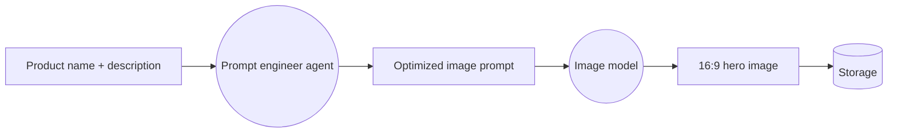
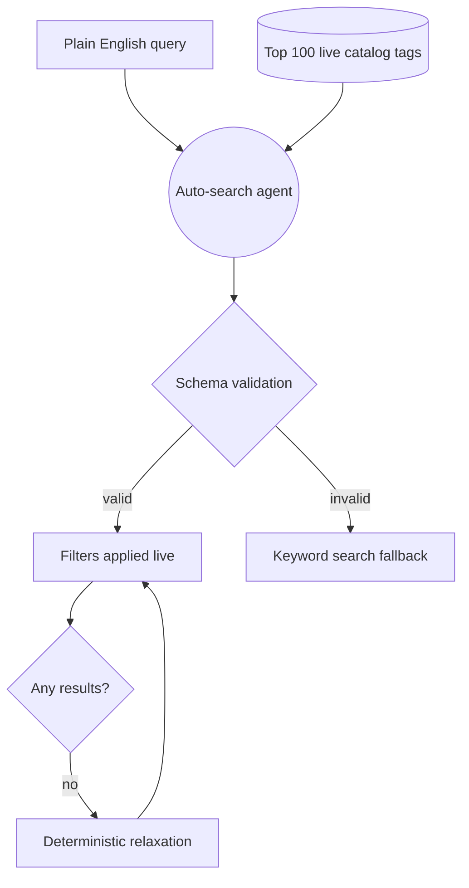
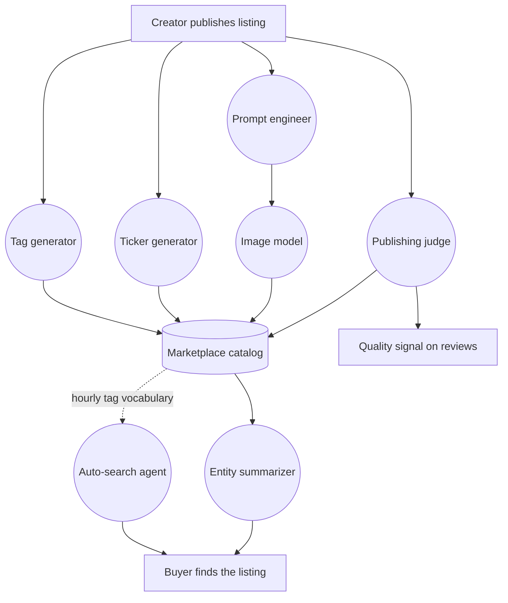

# The Micro Agents Running the Swarms Marketplace

The Swarms Marketplace sells autonomous agents. It would be strange if the marketplace itself were not built out of them.

Over the past several months we have been quietly replacing marketplace chores with small, specialized agents. Not one large assistant that tries to do everything, but a set of narrow workers that each do a single job well: name a token, write a summary, tag a listing, render a hero image, translate a sentence into a database query. Every one of them removes a form field, a decision, or a blank text box from somebody's day.

This post is the complete inventory. What each agent does, how they chain together, and what the pattern adds up to.

## What Counts as a Micro Agent

A micro agent has three properties. It does exactly one thing. It runs on a model chosen for that specific job rather than a general-purpose default. And it degrades gracefully, meaning that when it fails, the feature it supports still works, just with less help.

That third property is the one that matters most in production, and it is the one we will keep returning to. An agent that produces excellent results 95% of the time and a broken page the other 5% is worse than no agent at all. Every agent described below has a defined answer to the question "what happens when the model returns nothing useful?"

## The Publishing Agents

These run while you are creating a listing. Publishing an agent used to mean filling in a name, a description, a tag list, a ticker symbol, and an image. Five decisions, four of which most people did not want to make.

### Tag Generator

Tags are how your listing gets found, and they are the single most skipped field on the launch form. People write "ai, tool, useful" and move on, which helps nobody.

Type a name and a description, click one button, and the tag generator proposes between 5 and 16 kebab-case tags. The interesting part is the constraint we put on it. The agent is explicitly told to choose its own tag count and not to pad with weak tags to reach a target, and it works from a blocklist of filler terms: `ai`, `tool`, `helper`, `useful`, `amazing`. It is also required to mix categories, so you get industry tags, agent-type tags, and capability tags rather than five synonyms for the same idea.

Everything the model returns passes through a strict client-side parser before it reaches your form. Brackets and quotes are stripped, the list is split on commas or newlines, each candidate is validated against a slug pattern, duplicates are dropped, and anything over 30 characters is discarded. A misbehaving model cannot put junk in your tag field.

### Ticker Generator

If you are launching a tokenized agent, you need a ticker symbol. This is a genuinely hard naming problem compressed into two to ten characters, and it is the step where most people stall.

The ticker agent is prompted as a senior crypto branding strategist and returns three to five candidates. The requirement that makes the output useful is that each candidate must use a **different derivation strategy**: initials, phonetic compression, mascot, portmanteau, thematic. You get a spread of genuinely different options instead of five variations on the same abbreviation. The guiding rule in the prompt is that a reader who knows the project should be able to map ticker back to project in under two seconds.

Two blocklists run on the output. One rejects generic symbols like TOKEN, COIN, AGENT, and BOT. The other rejects collisions with 23 major tickers such as BTC, ETH, and SOL, so your launch does not ship with a symbol that will confuse every exchange listing and price bot that sees it.

If the model returns prose instead of JSON, a fallback extractor tokenizes the raw text and pulls candidates out anyway. This happens rarely, and when it does you never see it.

### Image Generator

This is our clearest example of an agent chain, because it is two agents in sequence, each doing a job the other could not.

Most people are bad at prompting image models. Not because they lack taste, but because image models want a very specific kind of input: dense visual description, explicit lighting and composition, a stated aspect ratio. A product description is not that.

So the first agent is a prompt engineer. It reads your product name and description and writes a proper image prompt: style direction, color palette, lighting, composition, negative space. It knows the output will be displayed in a 16:9 hero container, so it composes for a wide frame with a clear central subject. The second agent is an image model that takes that prompt and renders it.

Banner mode generates two images per request so you can pick, logo mode generates one. Banner mode also carries a negative constraint list, because promotional artwork with garbled AI text in it is worse than no artwork.

The failure handling here has three layers, and it is worth spelling out because it shows what graceful degradation means in practice. If the prompt engineer returns nothing usable, the route falls back to a template prompt built from your product details, and you still get an image. If storage upload fails, the image comes back inline and the client re-uploads it. And if image generation itself fails, the request returns successfully with an error message rather than a server error, so the page shows a clear explanation instead of a crash.

### Publishing Judge

The hardest problem any marketplace faces is quality. Open publishing is what makes a marketplace worth visiting, and it is also what fills it with things nobody should buy. Human review does not scale past the first few thousand listings. Star ratings only work after someone has already wasted money.

So we built a judge. It reads a complete submission, the name, description, and full body content, and scores it from 0.0 to 5.0 in half point increments, returning a written rationale for the score rather than a bare number. The rationale matters as much as the score: a rejection that explains itself is feedback, and a rejection that does not is just a wall.

Two details in its design are worth drawing out.

The first is that the bar depends on what you are asking for. A free listing needs to clear 2.5. A paid listing needs to clear 3.5. Charging money for something is a higher claim than offering it, and the threshold reflects that. The judge is also constrained to strict structured output, a schema of score plus rationale, with the rationale capped at roughly 40 words, so its verdict is always machine readable and always human readable.

The second is the fallback, which is the most interesting fallback in this entire post. If the judge cannot be reached, the system does not fail open and it does not fail closed. It falls back to **reputation**: it looks at whether you have published listings that real buyers have rated four stars or better, and lets established creators through on the strength of their track record. A model outage should not punish someone with fifty well-reviewed agents. New creators publishing free content are also let through, because the cost of a bad free listing is low and the cost of blocking a first-time creator is high.

The judge also feeds the review system directly. Its assessment is written into the marketplace as a review, so an automated quality judgment becomes part of the same public signal that human ratings contribute to, rather than a hidden score in a database.

Quality scoring is the most computationally expensive thing we do at publish time, and it lands in the one place where latency is most visible: the seconds between clicking Publish and your wallet asking for a signature. That tension, between how thoroughly we can evaluate a listing and how fast we can get you through checkout, is the thing we are actively engineering around as we roll this out more broadly. Judging well is easy. Judging well without making you wait is the actual problem.

## The Discovery Agents

These run while people are browsing, and they are the ones changing fastest.

### Entity Summarizer

Agent listings are often long. A good one might include a full system prompt, configuration, and code samples. That is exactly what you want when you have decided to use it, and exactly what you do not want when you are deciding whether to care.

The Summary tab runs a summarizer that reads the entire listing and produces two to four sentences in plain third person. It detects what kind of listing it is looking at by inspecting what the listing actually contains, so a listing with code, a payable endpoint, and an MCP URL is described differently from a bare prompt.

This agent has the most defensive design of anything we run, for a reason worth explaining. It reads user-submitted content, and that content is very often **itself a prompt**, written to instruct a language model. Summarizing a marketplace of prompts means routinely feeding the summarizer text engineered to redirect a model's behavior.

So the listing body is fenced inside explicit delimiters that mark it as data rather than instructions, with a system prompt that forbids adopting the listing's persona and a reminder repeated after the fence. There is also an echo guard: if the returned summary contains fragments of our own scaffolding, we reject it rather than store it. A prompt that tries to hijack the summarizer produces no summary, never a hijacked one.

Summaries cache for 12 hours, so the first person to open a tab pays the generation cost and everyone after reads it instantly.

### Registry Auto-Search

The [registry](https://swarms.world/platform/registry) has seven filter controls: item type, pricing model, exclusions, industry, sort order, date range, and keyword. Powerful once learned, and a wall for everyone else.

Auto-search lets you skip all of it. Describe what you want in plain English and an agent translates your sentence into filter state, then applies each filter in front of you with a narrated status line.

Two design details make it work better than a naive implementation would.

First, the agent's vocabulary is refreshed from the live catalog. Every hour it recomputes the 100 most common tags actually attached to marketplace listings and injects them into the prompt. When you search for something specific, it maps your words onto terms that genuinely exist in the catalog instead of inventing keywords that match nothing. The catalog teaches the agent what it contains.

Second, its output is validated against a strict schema before anything touches the page. The agent proposes, the schema disposes. A model that returns an unexpected filter value cannot inject it into your session.

The zero-result recovery is deliberately **not** an agent. If the filters match nothing, the client progressively relaxes them in a fixed order: date range first, then industry, then keyword, stopping the moment results appear, narrating each step. We wrote this as plain deterministic code because it needs to be fast, predictable, and free. Not every problem in an agentic product should be solved by adding another model call, and knowing where to stop is part of the design.

### Yuki

Yuki is the marketplace's support agent, available in the corner of every page and full screen at [swarms.world/yuki/chat](https://swarms.world/yuki/chat).

Yuki answers questions about how the marketplace works: pricing models, publishing, tokenization, where a given setting lives. It streams responses token by token, and it is given a map of the site plus context about whatever you are currently looking at, so asking "how do I buy this?" on a listing page gets an answer about that listing rather than a generic explanation.

Yuki is deliberately the least autonomous agent we run. It has no tools and cannot call other agents or take actions on your behalf. Everything it knows is assembled server-side before the conversation starts. That is a deliberate constraint: a support agent that can act is a support agent that can act wrongly, and the failure modes of a confidently incorrect action are much worse than those of a confidently incorrect sentence.

## How They Compose

The agents are independent, but their outputs feed each other in ways we did not fully plan.

The loop worth noticing runs along the dotted line. The tag generator writes tags at publish time. Those tags become part of the catalog. Every hour, the auto-search agent rebuilds its vocabulary from that catalog. So one agent's output silently becomes another agent's prompt context, and search gets better as publishing gets better, without anyone connecting the two.

This is what compounding looks like in an agentic system. Not one agent becoming smarter, but the exhaust of one becoming the input of another.

## What This Adds Up To

Take the launch flow. Publishing a tokenized agent used to require you to write a description, invent a tag list, invent a ticker, and find or make an image. Today, three of those four are one click each, and the fourth is the only one that genuinely needs you.

Take discovery. Finding a specific kind of agent used to require learning seven filter controls. Today it requires a sentence.

Take evaluation. Deciding whether a listing was worth your time used to mean reading a wall of configuration. Today it means reading three sentences.

None of these is a dramatic feature. Individually each one removes a few minutes of friction. Together they change what kind of person can use the marketplace at all, which was always the point. The measure of an agentic product is not how impressive any single agent is. It is how much of the work has quietly stopped being yours.

## What Is Next

We are pushing quality evaluation further, so that more of what the judge learns about a listing becomes visible to buyers before they spend anything, without adding a second to the publish flow. We are also extending auto-search from filter translation toward genuine recommendation, and giving Yuki carefully scoped abilities beyond conversation.

You can see the current lineup at [swarms.world/micro-agents](https://swarms.world/micro-agents) and try them yourself on [the marketplace](https://swarms.world).

## Conclusion

The marketplace gets more autonomous in a way that is difficult to notice from the outside, because progress here does not look like a new feature appearing. It looks like a field disappearing.

There was no single moment when the Swarms Marketplace became agentic. There was a tag field nobody wanted to fill in, then a ticker nobody wanted to invent, then an image nobody wanted to source, then seven filter controls nobody wanted to learn. Each one got handed to a small agent whose entire job was that one problem. What is left, for a creator, is the part that was always genuinely theirs: knowing what they built and why it is worth using.

That is the direction of travel. Not one agent that does everything, but a growing number of agents that each do one thing so completely that the work stops registering as work at all. A creator publishing today makes four decisions where they once made a dozen. A buyer today describes what they want in a sentence instead of learning a filter system. Neither of them thinks about the agents involved, which is the strongest signal we have that the design is right.

If you are building something similar, three things carried us further than anything else. Make each agent small enough that you can describe its job in one sentence. Choose the model per job rather than picking one default for everything. And decide what happens on failure before you ship, because the agents people actually trust are the ones that fail quietly.

The marketplace sells autonomous agents. Increasingly, it runs on them too.
