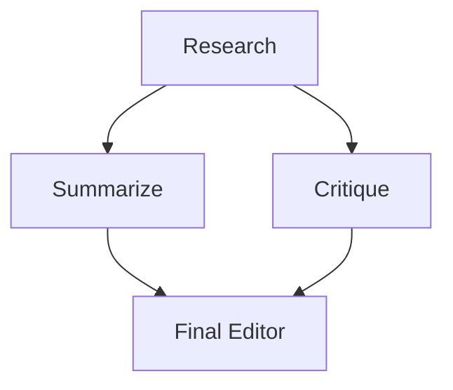

# Swarms GraphWorkflow vs LangGraph: A Simpler, Faster Way to Build Agent Graphs

Most non-trivial multi-agent systems are a graph: some steps run in sequence, some fan out in parallel, and their outputs converge at a join. Two frameworks make that graph explicit: **LangGraph** and **[Swarms `GraphWorkflow`](https://docs.swarms.ai/docs/documentation/multi-agent/graph_workflow#graphworkflow)**. Both are capable. But when you sit down to build the same pipeline in each, the difference in effort is hard to miss.

This post builds one concrete workflow in both frameworks: a research node fans out to a **summarizer** and a **critic** running in parallel, and both feed a **final editor**. That fan-out/fan-in shape is the single most common non-linear pattern in agentic systems, and it is exactly where the two frameworks diverge in ergonomics and performance.



## The same graph in LangGraph

LangGraph models a workflow as a state machine. You declare a typed state schema, write each node as a function that reads that state and returns a partial update, add nodes and edges by string name, and compile. Here is the fan-out/fan-in graph:

```python
import operator
from typing import Annotated, TypedDict

from langchain_openai import ChatOpenAI
from langgraph.graph import StateGraph, START, END

llm = ChatOpenAI(model="gpt-4o-mini")

# Parallel branches both write to `notes`, so it needs a reducer or
# LangGraph raises InvalidUpdateError on the concurrent write.
class State(TypedDict):
    task: str
    research: str
    notes: Annotated[list, operator.add]
    final: str

def research(state: State):
    out = llm.invoke(f"Research: {state['task']}").content
    return {"research": out}

def summarize(state: State):
    out = llm.invoke(f"Summarize:\n{state['research']}").content
    return {"notes": [f"SUMMARY: {out}"]}

def critique(state: State):
    out = llm.invoke(f"Critique:\n{state['research']}").content
    return {"notes": [f"CRITIQUE: {out}"]}

def final(state: State):
    out = llm.invoke(f"Write the final brief from:\n{state['notes']}").content
    return {"final": out}

builder = StateGraph(State)
builder.add_node("research", research)
builder.add_node("summarize", summarize)
builder.add_node("critique", critique)
builder.add_node("final", final)

builder.add_edge(START, "research")
builder.add_edge("research", "summarize")
builder.add_edge("research", "critique")
builder.add_edge("summarize", "final")
builder.add_edge("critique", "final")
builder.add_edge("final", END)

graph = builder.compile()
result = graph.invoke({"task": "Assess the EV battery market", "notes": []})
print(result["final"])
```

It works, and it is a reasonable design. But look at what you had to hold in your head:

- A **`TypedDict` state schema** that every node reads and writes.
- The **`Annotated[list, operator.add]` reducer** on `notes`. This is the sharp edge: the two parallel branches both write `notes`, and without a reducer LangGraph throws `InvalidUpdateError: multiple nodes writing to the same key`. New users hit this exact error the first time they build a fan-in, and the fix is non-obvious.
- **`START` and `END`** sentinel constants, an explicit `.compile()` step, and manual `llm.invoke()` calls inside every node.
- You initialize `notes` to `[]` in the invoke call, because the schema does not do it for you.

None of this is hard once you know it. All of it is friction you pay before you write a single line of actual agent logic.

## The same graph in Swarms

Swarms treats **agents as nodes and dependencies as edges**. There is no separate state schema, no reducer, and no manual LLM plumbing. An `Agent` already knows how to run itself, and the graph passes each node's output to its successors automatically.

```python
from swarms import Agent, GraphWorkflow

def node(name, prompt):
    return Agent(
        agent_name=name,
        system_prompt=prompt,
        model_name="gpt-4o-mini",
        max_loops=1,
    )

research = node("Research", "Research the given topic thoroughly.")
summarize = node("Summarize", "Summarize the research into key points.")
critique = node("Critique", "Critique the research and flag weak claims.")
final = node("Final", "Write the final brief from the summary and critique.")

wf = GraphWorkflow(name="Analysis", auto_compile=True)

for agent in (research, summarize, critique, final):
    wf.add_node(agent)

wf.add_edge(research, summarize)
wf.add_edge(research, critique)
wf.add_edge(summarize, final)
wf.add_edge(critique, final)

result = wf.run(task="Assess the EV battery market")
print(result["Final"])
```

That is the whole program. The differences are structural, not cosmetic:

- **No state schema.** Your nodes are agents; their configuration *is* the persona. You define what each agent is, not how state flows between dictionaries.
- **No reducer, ever.** The summarizer and critic both feed the final editor, and Swarms merges their outputs into the join node automatically. The `InvalidUpdateError` class of bug simply does not exist here.
- **Agents are first-class edge endpoints.** `wf.add_edge(research, summarize)` takes the agent objects directly, so there are no stringly-typed node names to keep in sync and no `START`/`END` constants.
- **`auto_compile=True`** validates and prepares the graph for you; there is no separate compile step to remember.
- **`run()` returns a dict keyed by agent name**, so `result["Final"]` is the editor's output and every intermediate is there too for inspection.

Every code example in this post was run against the current framework, and the Swarms version above executes end to end and returns `{"Research", "Summarize", "Critique", "Final"}`.

## Parallel by default: the performance story

Ease of use is the visible difference. The performance difference is under the hood.

Swarms `GraphWorkflow` computes the graph's **topological generations**, the layers of nodes that have no dependency on each other, and runs each layer concurrently on a thread pool (`ContextThreadPoolExecutor`). In the pipeline above, `summarize` and `critique` do not depend on each other, so they run **at the same time**, not one after the other. You did not configure this; it is the default.

Here is the measured effect. Using a stubbed 0.5-second-per-node model so the numbers are about scheduling, not the LLM, a root node fanning out to three independent branches and back into a join:

```
5 nodes, 3 parallel branches @ 0.5s each
sequential would be:  ~2.5s
Swarms actual:         1.52s   ← the three branches overlapped
```

The root (0.5s), the three overlapping branches (0.5s together, not 1.5s), and the join (0.5s) sum to ~1.5s instead of 2.5s. On a wider fan-out, ten independent research agents say, the gap grows linearly with the branch count. Because agent runs are I/O-bound (they spend their time waiting on the model API), the GIL is released during the wait and the thread pool delivers real overlap.

LangGraph can run branches in parallel too, but you have to earn it: the state reducers exist precisely because concurrent writes are a hazard you must design around, and you tune parallelism through the graph's structure and config. Swarms makes the safe, parallel path the *default* path. Independent work overlaps automatically, and there is no shared-state write to get wrong.

Two more optimizations come for free in `GraphWorkflow`: the compiled graph is **cached** so repeated runs skip recompilation, and you can bound resource use with `max_parallel_nodes` when a fan-out is wider than you want to run at once.

## Run the whole graph in one API request with Swarms Cloud

Everything above runs on your own machine. When you are ready to ship, you do not have to host anything, manage a thread pool, or keep a process alive. **Swarms Cloud runs the exact same graph as a single API request** and returns every node's output plus token usage and cost in one JSON response.

There is no framework to install on your server and no infrastructure to babysit. You `POST` a description of the graph (the agents and the edges) and the platform compiles it, runs the independent branches in parallel on managed compute, and sends back the results. Here is the same research → summarize + critique → final graph as one call:

```python
import httpx

headers = {
    "x-api-key": "YOUR_API_KEY",
    "Content-Type": "application/json",
}

workflow = {
    "name": "Analysis",
    "task": "Assess the EV battery market",
    "agents": [
        {"agent_name": "Research",  "system_prompt": "Research the given topic thoroughly.",           "model_name": "gpt-4.1"},
        {"agent_name": "Summarize", "system_prompt": "Summarize the research into key points.",         "model_name": "gpt-4.1"},
        {"agent_name": "Critique",  "system_prompt": "Critique the research and flag weak claims.",      "model_name": "gpt-4.1"},
        {"agent_name": "Final",     "system_prompt": "Write the final brief from summary and critique.", "model_name": "gpt-4.1"},
    ],
    "edges": [
        {"source": "Research",  "target": "Summarize"},
        {"source": "Research",  "target": "Critique"},
        {"source": "Summarize", "target": "Final"},
        {"source": "Critique",  "target": "Final"},
    ],
    "entry_points": ["Research"],
    "end_points": ["Final"],
    "auto_compile": True,
}

response = httpx.post(
    "https://api.swarms.world/v1/graph-workflow/completions",
    headers=headers,
    json=workflow,
    timeout=300.0,
)

result = response.json()
print(result["outputs"]["Final"])
print(f"Total tokens: {result['usage']['total_tokens']}, cost: ${result['usage']['token_cost']:.4f}")
```

One request, and you get back:

```json
{
  "job_id": "graph-workflow-abc123xyz",
  "status": "success",
  "outputs": {
    "Research": "Research findings on the EV battery market...",
    "Summarize": "Key points...",
    "Critique": "Weak claims flagged...",
    "Final": "Final brief..."
  },
  "usage": {
    "input_tokens": 1250,
    "output_tokens": 3200,
    "total_tokens": 4450,
    "token_cost": 0.0400,
    "cost_per_agent": 0.02
  },
  "timestamp": "2026-07-27T10:30:45.123456+00:00"
}
```

That is the whole production story: **no servers, no orchestration code, no scaling to think about**, just the same directed graph, executed on managed infrastructure, billed by the token, with per-run cost returned to you. The branches still run in parallel; you just no longer own the machine they run on. The same endpoint scales from this four-node graph to multi-layer pipelines with dozens of agents, and it works from any language that can send an HTTP request.

To run the graph above, sign up at [cloud.swarms.world](https://cloud.swarms.world) and grab an API key, then drop it into the `x-api-key` header. Graph Workflow on the API is available on the Pro, Ultra, and Premium plans. See the [full GraphWorkflow reference](https://docs.swarms.ai/docs/documentation/multi-agent/graph_workflow#graphworkflow) for the complete schema, vision support, and edge metadata.

## Where LangGraph earns its complexity

A fair comparison names the trade-off. LangGraph's explicit state model is genuinely powerful when you need **fine-grained control over a shared, evolving state**: cyclic graphs with conditional routing, human-in-the-loop interrupts that pause and resume mid-graph, token-level streaming from arbitrary nodes, and deep integration with the broader LangChain ecosystem. If your application is a long-running, stateful machine with complex branching logic, that control is worth the ceremony.

Swarms optimizes for the far more common case: **wire up agents into a graph and run it, fast, without a state-management course first.** For research pipelines, review-and-critique loops, fan-out analysis, and staged report generation, `GraphWorkflow` gets you from idea to running system in a fraction of the code, and runs the independent parts in parallel by default.

## The bottom line

Same graph, two frameworks:

| | LangGraph | Swarms `GraphWorkflow` |
|---|---|---|
| State schema | Required `TypedDict` | None, agents are nodes |
| Parallel fan-in | Manual reducers (`Annotated + operator.add`) | Automatic, no reducers |
| Edge endpoints | String node names | Agent objects directly |
| Compile step | Explicit `.compile()` | `auto_compile=True` |
| LLM wiring | Manual `llm.invoke()` per node | Handled by the `Agent` |
| Parallel execution | Available, must be structured for | Default, topological layers |
| Managed hosting | Self-host | One API request on Swarms Cloud |
| Lines for our example | ~45 | ~20 |

Swarms `GraphWorkflow` is the shorter path to a correct, parallel agent graph. You describe *what* the agents are and *how* they depend on each other, and the framework handles compilation, scheduling, parallelism, and result collection, either locally or as a single API call on Swarms Cloud when you go to production.

## Conclusion

The fan-out/fan-in graph in this post is about 45 lines in LangGraph and about 20 in Swarms, and the 25-line gap is almost entirely infrastructure: a state schema, a reducer, sentinel constants, a compile call, and an `llm.invoke()` in every node. Swarms removes that layer by making the agent the node, so the only thing you write is the part that is actually specific to your problem.

The second half of the story is what you get without asking. Because `GraphWorkflow` schedules by topological generation, independent branches overlap on a thread pool by default, which turned a 2.5-second sequential pipeline into a 1.52-second run in the benchmark above. Parallelism is not a feature you opt into and tune; it is the shape the framework already runs in.

LangGraph remains the better tool when you need cycles, conditional routing, mid-graph interrupts, or tight LangChain integration, and it is worth reaching for when your system really is a stateful machine. For the far more common case of wiring agents into a DAG and running it, `GraphWorkflow` gets you there in less code and less time.

The fastest way to judge this is to run it. Install with `uv add swarms`, paste the twenty-line example above, swap in your own agents and prompts, and watch the independent branches execute at the same time with none of the boilerplate.

## Frequently Asked Questions

**Do I need to define a state schema to use GraphWorkflow?**
No. Agents are the nodes and edges are the dependencies, so there is no `TypedDict` to declare and no shared state dictionary to design around. Each node's output is passed to its successors automatically.

**What happens when two parallel nodes feed the same downstream node?**
Swarms merges their outputs into the join node for you. There are no reducers to configure, so the `InvalidUpdateError: multiple nodes writing to the same key` class of bug does not arise.

**Is the parallelism real, or does the GIL block it?**
It is real. Agent runs are I/O-bound because they spend nearly all of their time waiting on the model API, and the GIL is released during that wait, so the thread pool delivers genuine overlap. The benchmark above measured 1.52s against a 2.5s sequential baseline.

**Can I limit how many nodes run concurrently?**
Yes. Set `max_parallel_nodes` on the `GraphWorkflow` when a fan-out is wider than you want executing at once, for example to stay inside a provider rate limit.

**Do I have to compile the graph myself?**
No. Pass `auto_compile=True` and the graph is validated and prepared for you. The compiled graph is also cached, so repeated runs skip recompilation.

**How do I read the intermediate outputs, not just the final one?**
`run()` returns a dict keyed by agent name. In the example above, `result["Final"]` is the editor's output, and `result["Research"]`, `result["Summarize"]`, and `result["Critique"]` are all available for inspection or logging.

**Can different nodes use different models?**
Yes. `model_name` is set per `Agent`, so you can put a cheap fast model on the summarizer and a stronger one on the final editor inside the same graph.

**Does GraphWorkflow support cycles and conditional routing?**
`GraphWorkflow` is built around directed acyclic graphs, which covers fan-out, fan-in, and staged pipelines. If your application needs cyclic graphs with conditional routing or human-in-the-loop interrupts that pause and resume mid-graph, that is the case where LangGraph's explicit state model earns its extra ceremony.

**Should I migrate an existing LangGraph project?**
Only if the DAG shape fits. If you are using LangGraph mainly for fan-out/fan-in pipelines, the port is usually a large net deletion of code. If you depend on cycles, interrupts, or deep LangChain integration, stay where you are.

## Links and Resources

| Resource | Link |
| --- | --- |
| GraphWorkflow Reference | [docs.swarms.ai/docs/documentation/multi-agent/graph_workflow](https://docs.swarms.ai/docs/documentation/multi-agent/graph_workflow#graphworkflow) |
| Swarms Cloud (get an API key) | [cloud.swarms.world](https://cloud.swarms.world) |
| Concurrent Workflow Docs | [docs.swarms.world/architectures/concurrent-workflow](https://docs.swarms.world/architectures/concurrent-workflow) |
| Sequential Workflow Docs | [docs.swarms.world/architectures/sequential-workflow](https://docs.swarms.world/architectures/sequential-workflow) |
| Architecture Overview | [docs.swarms.world/architectures/overview](https://docs.swarms.world/architectures/overview) |
| Agent Class Reference | [docs.swarms.ai](https://docs.swarms.ai) |
| Runnable Examples | [github.com/kyegomez/swarms/examples](https://github.com/kyegomez/swarms/tree/master/examples) |
| Swarms on GitHub | [github.com/kyegomez/swarms](https://github.com/kyegomez/swarms) |
| Agent Orchestration Patterns | [Agent Orchestration Patterns](/blog/agent-orchestration-patterns) |
| Discord Community | [discord.gg/VapjxpSyHC](https://discord.gg/VapjxpSyHC) |

---

*Have questions or feedback? Join our [Discord community](https://discord.gg/VapjxpSyHC) or check out the [documentation](https://docs.swarms.ai).*
