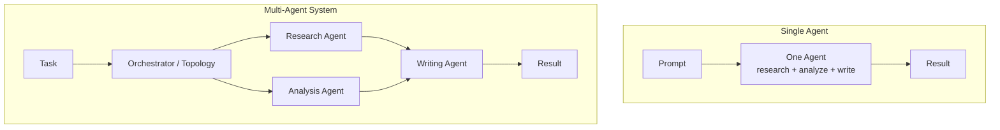

A multi-agent system is a group of independent AI agents, each with its own role, instructions, and often its own model, that communicate and coordinate through a defined structure to complete a task no single agent handles well alone. Instead of one prompt trying to research, analyze, write, and fact-check in a single pass, the work is split across specialized agents, and an orchestration layer decides the order they run in, what each one sees, and how their outputs combine into a final result. The point isn't more agents for their own sake; it's matching the shape of a task to the shape of the system solving it.

That definition covers the mechanics, but the more useful question is why this pattern exists at all, and when it actually beats just calling a single, very good model.

## Why a Single LLM Call Hits a Ceiling

A single prompt to a single model works well for tasks with one clear goal and a bounded amount of context: summarize this document, classify this ticket, draft this email. It starts to strain once a task has multiple, semi-independent sub-goals that each demand a different kind of attention.

Ask one agent to research a market, analyze the findings, and write a polished report, and you're asking one system prompt and one context window to hold research instructions, analytical rigor, and prose quality simultaneously. In practice this tends to produce a blended, average result: research that's a bit shallow because the model is also thinking about tone, and writing that's a bit stilted because it's also holding onto raw data. Context windows fill with irrelevant intermediate reasoning, error correction has nowhere to happen (there's no separate step that can catch the research agent's mistake before it reaches the writer), and there's no way to swap in a cheaper or faster model for the parts of the task that don't need your most expensive one.

A multi-agent system fixes this by decomposition. A research agent's entire system prompt, context, and toolset can be built around finding and organizing information. An analysis agent only ever sees clean research output, not the process of gathering it. A writing agent only sees conclusions, not raw data. Each agent gets a narrower job, which means a shorter, more focused prompt, a smaller relevant context, and a place where a human or another agent can review the work before it moves downstream.

## What a Multi-Agent System Is Made Of

Strip away any specific framework's terminology and a multi-agent system reduces to four ingredients:

- **Agents.** The individual unit of work. In the Swarms framework, an `Agent` is defined as "the fundamental building block," combining an LLM (reasoning), tools (external functions and APIs), and memory (conversation history and context) into one autonomous entity. Each agent has a system prompt that defines its role, its own model choice, and its own loop count, so it can be tuned independently of every other agent in the system.
- **Roles.** What each agent is actually responsible for. A role isn't just a label, it's a boundary: a "researcher" agent's system prompt should not also try to enforce final formatting, and a "reviewer" agent's job is to critique output, not generate it from scratch. Clear role boundaries are what keep a multi-agent system from collapsing back into one giant, unfocused prompt split across several API calls.
- **Communication.** How output from one agent becomes input to another. This can be as simple as passing one agent's text response directly into the next agent's prompt, or as structured as a shared message log that every agent in a conversation can read from, as in a group-chat pattern. The mechanics of that handoff, what gets passed, what gets summarized, what gets dropped, matter a lot in practice; we cover this in depth in [Advanced Agent-to-Agent Communication Protocols](/blog/agent-communication-protocols).
- **Orchestration and topology.** The layer that decides which agent runs when, what it receives, and how results converge. This is the actual architecture of the system, and it's the piece most people mean when they say "multi-agent system design." Swarms frames this directly: a swarm is "a collection of multiple agents working together to accomplish complex tasks," extending the idea that just as an individual agent combines LLM, tools, and memory, a swarm combines multiple agents with different specializations, perspectives, and capabilities to solve problems too difficult for any one agent alone.

## The Common Topologies, at a Glance

The orchestration layer can be wired in a handful of recurring shapes. Swarms implements each of these as a distinct, named construct, which is a useful way to see the pattern space concretely rather than abstractly:

- **Sequential.** Agents run in a fixed order, each one building on the previous agent's output, A produces something B consumes, B produces something C consumes. Swarms calls this a `SequentialWorkflow`.
- **Concurrent.** Multiple agents run in parallel against the same input, each contributing an independent perspective before results are gathered back together. Swarms' `ConcurrentWorkflow` is built for exactly this.
- **Graph / DAG.** A more general version of sequential, where agents form a directed graph rather than a straight line, allowing branching and fan-in/fan-out patterns that a strict sequence can't express. Swarms exposes this as graph-based workflow execution, the same model the [Swarms Cloud Workflow Builder](/blog/workflow-builder-swarms-cloud) lets you compose visually.
- **Hierarchical.** A director or manager agent coordinates a set of specialized worker agents, assigning subtasks and integrating their results, rather than every agent talking to every other agent directly. Swarms' `HierarchicalSwarm` follows this director-worker model.
- **Mixture of Agents.** Several "expert" agents process the same input in parallel, each from a different angle, and a dedicated aggregator agent synthesizes their outputs into one answer. Swarms implements this as `MixtureOfAgents`.
- **Group chat.** Agents participate in a shared conversation thread, able to see and respond to what other agents have said, useful for tasks that benefit from debate or back-and-forth discussion rather than a strict handoff. Swarms' `GroupChat` construct is built for this.
- **Dynamic / arbitrary routing.** Some systems don't fit a fixed shape at all: which agent runs next depends on the content of what came before. Swarms' `AgentRearrange` supports custom, non-linear flow patterns for exactly this case, and a `SwarmRouter` construct can dynamically select which of these architectures to use for a given task.

None of these is universally "best." A document-processing pipeline where each stage strictly depends on the last is naturally sequential. A panel of specialist reviewers checking the same code change for security, style, and correctness is naturally concurrent, or mixture-of-agents if their outputs need synthesizing. A large research task with an unpredictable number of sub-investigations is naturally hierarchical, since a manager agent can spin up workers as it discovers what's needed rather than the whole graph being drawn up front.

## Where Multi-Agent Systems Are Actually Used

This isn't a hypothetical architecture pattern; it shows up anywhere a task has natural sub-goals that benefit from different expertise or different models:

- **Research and synthesis.** A research agent gathers and organizes information, an analysis agent draws conclusions from it, and a writing agent produces a final report, each stage using a prompt and model suited to its specific job.
- **Document and data pipelines.** An extraction agent pulls structured data out of unstructured input, a validation agent checks it against business rules, and a formatting agent produces the final output, with each step independently inspectable and swappable.
- **Multi-perspective review.** A single piece of work, code, a document, a design, is reviewed in parallel by specialist agents (a security reviewer, a style reviewer, a correctness reviewer), with a summarizing agent consolidating their verdicts into one recommendation.
- **Customer-facing workflows with escalation.** A first-line agent handles routine requests directly and hands off anything outside its scope to a more capable or more specialized agent, mirroring how human support teams triage and escalate.
- **Open-ended, exploratory tasks.** When the exact shape of the work isn't known ahead of time, a manager agent can dynamically create and assign sub-agents at runtime rather than requiring the whole pipeline to be hand-drawn in advance, useful for research tasks or investigations whose scope only becomes clear partway through.

## The Trade-Off to Keep in Mind

Multi-agent systems aren't free. Every additional agent in a pipeline adds latency (more sequential LLM calls) and cost (more total tokens processed), and a badly decomposed system, one where roles overlap or agents pass along noisy, unfiltered context, can end up worse than a single well-prompted call. The decision to go multi-agent should follow from the shape of the task: distinct sub-goals that benefit from different prompts, different models, or independent verification are a good sign; a task that's really just "one thing, done well" usually isn't.

## Links and Resources

| Resource | Link |
| --- | --- |
| Swarms Concepts: Agents | [docs.swarms.world/concepts/agents](https://docs.swarms.world/concepts/agents) |
| Swarms Concepts: Swarms | [docs.swarms.world/concepts/swarms](https://docs.swarms.world/concepts/swarms) |
| Architecture Overview | [docs.swarms.world/architectures/overview](https://docs.swarms.world/architectures/overview) |
| Workflow Builder Deep Dive | [/blog/workflow-builder-swarms-cloud](/blog/workflow-builder-swarms-cloud) |
| Agent Communication Protocols | [/blog/agent-communication-protocols](/blog/agent-communication-protocols) |
| Documentation | [docs.swarms.ai](https://docs.swarms.ai) |
| Discord Community | [discord.gg/VapjxpSyHC](https://discord.gg/VapjxpSyHC) |

---

*Have questions or feedback? Join our [Discord community](https://discord.gg/VapjxpSyHC) or check out the [documentation](https://docs.swarms.ai).*
