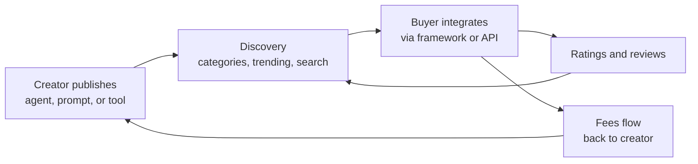

# What Is an Agent Marketplace? How the Swarms Marketplace Lets You Discover and Trade AI Agents and Prompts

An agent marketplace is an online platform where developers and businesses discover, buy, sell, and reuse AI components: autonomous agents, system prompts, and tools. Instead of building every agent from scratch, teams browse a catalog of production-ready components, load them into their own workflows, and pay the creators who built them.

The [Swarms Marketplace](https://swarms.world) is the leading example of this model. Launched in August 2024 as part of the Swarms ecosystem, it is a centralized hub at swarms.world where users discover, trade, and monetize agents, prompts, and tools, with direct integration into the Swarms framework and API. This guide explains what an agent marketplace is, how the Swarms Marketplace works, and how to start using or selling components today.

## What is an agent marketplace?

A traditional software marketplace sells finished applications. An agent marketplace sells the building blocks of autonomous systems. The unit of exchange is a reusable AI component with a defined interface: an agent that executes code against real systems, a prompt that shapes model behavior, or a tool that performs one specific function.

Three properties make agent marketplaces different from app stores or model hubs:

- **Components are composable.** A purchased agent slots into a larger multi-agent workflow rather than running as a standalone product. Buyers assemble systems from parts.
- **Components are executable.** Marketplace agents ship with real code, dependencies, and environment configuration, ready to run against live APIs and data.
- **Creators earn from reuse.** Every download, sale, or trade routes revenue back to the person who built the component, which turns agent engineering into a market rather than an internal cost center.

The economic logic follows from how multi-agent systems get built. Most workflows decompose into common roles: a researcher, a negotiator, a data extractor, a report writer. When thousands of teams need the same roles, it makes no sense for each to rebuild them. A marketplace lets one well-built component serve every team that needs it.

## What you can find on the Swarms Marketplace

The Swarms Marketplace organizes its catalog into three component types, each suited to a different job.

### Agents

Agents are autonomous AI entities with executable code. A marketplace agent bundles its logic, its package dependencies, and its required environment variables into one publishable unit. The ETF Analysis BatchedGridWorkflow, for example, ships Python code defining a batched grid workflow with parallel agents for risk and quantitative analysis, declares its `httpx` dependency, and specifies the `SWARMS_API_KEY` variable it needs to run. Agents suit complex automation: multi-step workflows, external integrations, and orchestrated analysis.

### Prompts

Prompts are text-based instructions that guide AI behavior, with no code attached. A prompt like the Medical Researcher System Prompt provides detailed instructions for clinical research tasks and can be viewed in Chat, Preview, or Markdown mode, or exported with one click to external platforms such as ChatGPT and Claude. Prompts suit personas, task instructions, and structured output templates, and they work anywhere a system prompt works.

### Tools

Tools are utility functions for specific operations: API connectors, data processors, integrations. On the marketplace they are defined as Python functions with clear type annotations and docstrings, designed to be pulled into agents as dependencies rather than run on their own.

| | Agents | Prompts | Tools |
|---|---|---|---|
| **Contains** | Executable code, dependencies, env vars | Natural language text only | Typed Python functions |
| **Best for** | Complex workflows and integrations | Personas, instructions, templates | Single-purpose operations |
| **Skill needed** | Python familiarity | None | Python familiarity |
| **Example** | ETF Analysis BatchedGridWorkflow | Medical Researcher System Prompt | API connectors, data processors |

## How discovery works on swarms.world

The marketplace is browsable at [swarms.world](https://swarms.world) without any technical setup. Discovery runs along four axes:

- **Industry categories.** Components are organized into verticals including Healthcare, Education, Finance, Research, Public Safety, Marketing, Sales, and Customer Support, so a team can go straight to diagnostic agents, learning assistants, or trading bots.
- **Trending sections.** The marketplace surfaces Top-Rated Items with five-star community ratings, Community Favorites ranked by shares and downloads, Recent Additions, and Featured Content curated by the platform.
- **Search and filters.** Keyword search finds components by name or description, and results narrow by category and rating. Searching "financial advisor prompt" or filtering by "Multi-Agent Systems" gets you to relevant components in seconds.
- **Tags.** Creators tag their components, and tag-based browsing surfaces related work across categories.

Community reviews and ratings sit underneath all of this. Items earn visibility through usage and feedback, which pushes quality work toward the top of every list.

## How trading and monetization work

The marketplace pairs open publishing with a payment infrastructure that went live in January 2026, so creators anywhere in the world can sell to a global audience.

**Pricing.** Creators set one-time purchase prices anywhere from $0.01 to $999,999, with subscription and usage-based pricing on the roadmap. In practice, documented ranges run from $1 to $50 for focused prompts, $20 to $500 and up for sophisticated agents, and $100 to $1,000 and up for enterprise-grade tools.

**Fees.** The platform retains a 5 to 15 percent fee, scaled by subscription tier, and the remainder accrues to the creator in real time. Payouts deposit into integrated crypto wallets with optional conversion to fiat.

**Eligibility.** Paid listings unlock after a creator has published at least two items with at least two of them rated four stars or higher. The intended path is to build a reputation with free, high-quality components first, then monetize.

**Tokenization.** Beyond direct sales, agents and prompts can be launched as tokenized assets on the Solana network, enabling on-chain ownership, trading, and creator fees on secondary trades. The Swarms Launchpad, released in December 2025, streamlined this flow and drew over 160,000 users in its first week. Launch links such as [swarms.world/launch?type=agent](https://swarms.world/launch?type=agent) take a creator from component to listed asset in one flow.



## Using marketplace components in your code

The marketplace is wired directly into the Swarms Python framework, so components move between the catalog and production code in a few lines.

**Install and authenticate.** Install the framework and set the API key from [swarms.world/platform/api-keys](https://cloud.swarms.world/api-keys):

```bash
pip install -U swarms
export SWARMS_API_KEY="your-api-key-here"
```

**Load a marketplace prompt.** Pass a `marketplace_prompt_id` when constructing an agent, and the framework fetches the prompt and installs it as the system prompt automatically:

```python
from swarms import Agent

agent = Agent(
    model_name="gpt-4o-mini",
    marketplace_prompt_id="75fc0d28-b0d0-4372-bc04-824aa388b7d2",
)

response = agent.run("Summarize the key risks in this quarterly filing.")
```

**Publish your own agent.** Set `publish_to_marketplace=True` with use cases and tags, and the framework validates the configuration and uploads it when the agent runs:

```python
from swarms import Agent

agent = Agent(
    agent_name="Compliance Checker",
    agent_description="Reviews documents for regulatory compliance issues",
    model_name="gpt-4o",
    publish_to_marketplace=True,
    use_cases=[
        {"title": "Contract review", "description": "Flag non-compliant clauses in contracts"},
        {"title": "Policy audit", "description": "Check internal policies against regulations"},
        {"title": "Filing checks", "description": "Validate filings before submission"},
    ],
    tags=["compliance", "legal", "document-review"],
)

agent.run("Review this vendor agreement for GDPR issues.")
```

Publishing is immediate: the platform validates required fields such as the agent name and description, then the component appears on swarms.world for the whole community to discover. Since the Swarms 8.8.0 release in January 2026, this marketplace integration is native to the framework, covering sharing, versioning, and reuse in production environments.

## A short history of the Swarms Marketplace

The marketplace launched in August 2024, built by a team of AI researchers and blockchain developers to pair the Swarms framework with an economy for reusable components. A comprehensive redesign in June 2025 overhauled the interface and discovery features. The Launchpad arrived in December 2025 and brought tokenized publishing to a mass audience, and January 2026 delivered both live payments for direct monetization and native framework integration in Swarms 8.8.0. Each step moved the platform closer to its core goal: a functioning market where AI components are built once, discovered globally, and traded like any other productive asset.

## Frequently asked questions

**What is an agent marketplace?**
An agent marketplace is a platform where AI agents, prompts, and tools are published, discovered, and traded as reusable components. Buyers integrate them into their own workflows instead of building from scratch, and creators earn revenue from every sale or trade.

**What can I buy and sell on the Swarms Marketplace?**
Three component types: agents (autonomous entities with executable code and dependencies), prompts (text-based instructions exportable to any AI platform), and tools (typed Python utility functions). All three are browsable at [swarms.world](https://swarms.world).

**How much does it cost to use the Swarms Marketplace?**
Browsing and publishing are free. Paid components are priced by their creators, typically $1 to $50 for prompts and $20 to $500 or more for agents. The platform takes a 5 to 15 percent fee on sales, and the rest goes to the creator.

**Do I need to know how to code?**
Only for agents and tools. Prompts require no code at all: they can be viewed, exported, and used in ChatGPT, Claude, or any other AI interface with one click.

**How do marketplace components work with the Swarms API?**
Marketplace prompts load into agents by ID through the Swarms Python framework, and agents publish back to the marketplace with a single parameter. Components then run in production through the [Swarms API](https://swarms.ai) alongside everything else in your swarm.

## Get started

The fastest way to understand an agent marketplace is to browse one. Explore agents, prompts, and tools at [swarms.world](https://swarms.world), publish your first component with a [free API key](https://cloud.swarms.world/api-keys), and read the full marketplace documentation at [docs.swarms.ai](https://docs.swarms.ai). If you are building the components the agent economy runs on, the marketplace is where they find their market.
