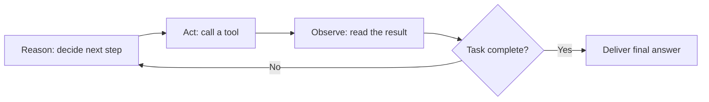

# What Is an AI Agent? LLM, Tools, Memory, and a Loop

"Agent" has become the most overloaded word in AI. Vendors call chatbots agents. Scripts that call an API twice get called agents. The word is doing so much marketing work that its engineering meaning has almost disappeared.

The engineering meaning is worth recovering, because it is precise. An agent is made of exactly four things:

1. **An LLM**: the reasoning core.
2. **Tools**: the ability to act on the world.
3. **Memory**: state that survives beyond a single prompt.
4. **A looping structure**: the cycle of reasoning, acting, and observing that repeats until the task is done.

Remove any one of them and you have something else: a chatbot, a pipeline, a search engine. Put all four together and you get the thing everyone is actually talking about: a system you can hand a *goal* instead of an instruction.

## Component 1: The LLM, the reasoning core

At the center of every agent is a large language model. It is the part that reads the task, forms a plan, decides what to do next, and interprets what came back. Everything else in the architecture exists to feed this core better information and carry out its decisions.

Two properties matter in practice:

- **The LLM is a decision-maker, not a database.** Its job inside an agent is not to know everything. Its job is to decide the next step given the task, the memory, and the last observation. Knowledge lives in tools and memory; judgment lives in the model.
- **The core is swappable.** A well-built agent is model-agnostic. The same agent definition should run on GPT, Claude, Gemini, or a local model, and upgrade to the next generation without a rewrite. The intelligence of the agent rises with every model release for free.

## Component 2: Tools, the hands

An LLM alone can only produce text. Tools are what turn text into consequences: searching the web, querying a database, reading and writing files, calling an internal API, executing code, sending a message.

Mechanically, a tool is just a function with a described interface. The model is shown the function's name, its parameters, and what it does; when the model decides that function is the right next step, it emits a structured call, the runtime executes it, and the result is fed back in. Standards like MCP (Model Context Protocol) take this further, letting any agent connect to entire servers of tools without custom integration.

Tools define an agent's *reach*. An agent with no tools can only advise. An agent with tools can do.

## Component 3: Memory, the state that persists

A raw LLM forgets everything the moment a conversation ends, and even within one, it can only hold what fits in its context window. Agents need more, in two layers:

- **Short-term memory** is the working state of the current task: the steps taken so far, tool results, and intermediate conclusions. This lives in the context and is what keeps step 7 consistent with step 2.
- **Long-term memory** survives across tasks and sessions: vector databases and RAG layers that let the agent recall past projects, learned preferences, and domain documents on demand, long after they scrolled out of the context window.

Memory is what separates an agent that improves from one that starts from zero every morning. It is also, at the system level, where an agent's identity accumulates: what it has seen, decided, and learned.

## Component 4: The loop, what makes it autonomous

The first three components are ingredients. The loop is the architecture. It is the part most explanations skip, and it is the actual answer to "what makes an agent an agent."

A chatbot's lifecycle is one pass: prompt in, answer out. An agent's lifecycle is a cycle:



The model reasons about what to do, acts through a tool, observes the result, updates its memory, and then *decides again*, with each iteration informed by everything that came before. Failed API call? Retry differently. Search came back empty? Reformulate. Subtask finished? Move to the next one. Nobody re-prompts the system between steps; the loop does.

The loop is what enables the agent to be *autonomous*. Autonomy is not a mystical property of a bigger model. It is a control structure: the ability to keep going, adapt to what just happened, and stop when the goal is met rather than when the output ends. In practice the loop also carries the safety rails: iteration limits, budget caps, and completion checks that decide when to exit.

## What is not an agent

The definition earns its keep by what it excludes:

- **A chatbot** has an LLM and maybe memory, but no tools and no loop. It answers; it does not act.
- **A one-shot tool call** (ask the model, run one function, return) has an LLM and tools but no loop. It cannot recover from a bad first step.
- **A fixed pipeline** (prompt A feeds prompt B feeds prompt C) has structure but no decisions. The path never changes, so nothing is being decided.

None of these are lesser systems; they are often the right choice. But they behave fundamentally differently from an agent, because they cannot adapt mid-task.

## Building one

In the [Swarms framework](/framework), the four components map directly onto the `Agent` class:

```python
from swarms import Agent

agent = Agent(
    agent_name="Research-Agent",
    model_name="gpt-4o",              # the LLM core, swappable
    system_prompt="You are a meticulous research assistant.",
    tools=[web_search, read_pdf],      # plain Python functions
    max_loops=5,                       # the looping structure
)

result = agent.run(
    "Find the three most cited papers on multi-agent systems "
    "from the last year and summarize each in two sentences."
)
```

The `model_name` is the reasoning core, `tools` are ordinary Python functions the agent may call, memory is built in and extensible with RAG, and `max_loops` bounds the reason-act-observe cycle. Set `max_loops` to 1 and you have a one-shot assistant; give it room to iterate and it becomes an agent.

## From one agent to many

One agent is the atom. The interesting chemistry starts when specialized agents are connected into coordination structures: pipelines, hierarchies, debates, and swarms that reason and verify each other's work. That is where [multi-agent systems](/blog/what-is-a-multi-agent-system) begin, and where the road to [Collective Superintelligence](/blog/what-is-collective-superintelligence) starts.

But it all rests on this four-part foundation. An LLM to think, tools to act, memory to remember, and a loop to keep going until the job is done.

**We're hiring to build CSI.** Join our research team: [swarms.ai/hiring](/hiring)

Start building with us: [swarms.ai](https://swarms.ai) · [GitHub](https://github.com/kyegomez/swarms) · [Discord](https://discord.gg/EamjgSaEQf)
