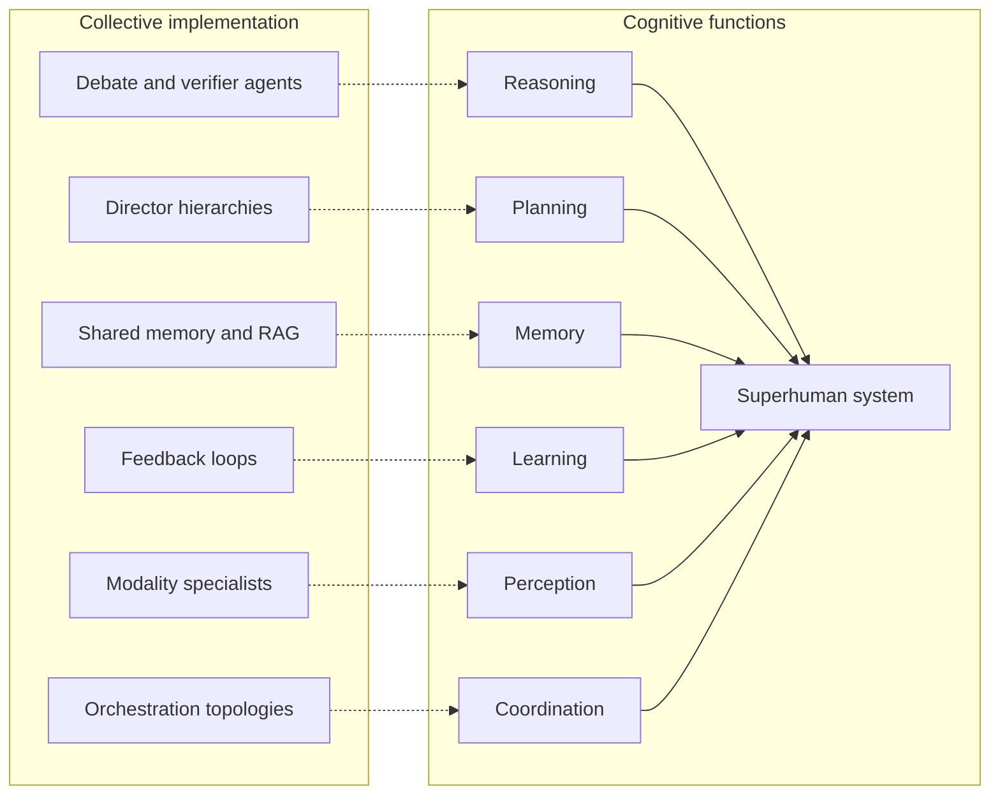

# What Is Cognitive Superintelligence?

"Superintelligence" gets used loosely. Sometimes it means a chatbot that writes better emails than you. Sometimes it means a godlike machine from science fiction. Neither definition is useful for people actually building AI systems.

Cognitive superintelligence is a more precise idea. It describes a system that exceeds the best human minds not at one task, and not on one benchmark, but across the core cognitive functions themselves: reasoning, planning, learning, memory, perception, and coordination. Intelligence is not a single dial. It is a stack of distinct capabilities, and superintelligence is what you get when a system is superhuman across the whole stack at once.

This post defines the term properly, separates it from AGI and ASI, breaks down the cognitive functions that matter, and explains why we believe the first cognitively superintelligent systems will be collectives of specialized agents rather than one enormous model.

## The definition

**Cognitive superintelligence is a system whose performance exceeds the best individual human, and the best human organizations, across every core cognitive function, simultaneously and sustainably.**

Each word in that definition is doing work:

- **Every core function.** Being superhuman at chess or protein folding is narrow superintelligence. Cognitive superintelligence requires the full stack: reasoning, planning, memory, learning, perception, and coordination, all at once.
- **Best human organizations, not just individuals.** The real cognitive frontier on Earth is not a genius. It is a research lab, a company, a market. A system that beats one person but loses to a well-run team is not superintelligent in any meaningful sense.
- **Simultaneously.** A system that must be reconfigured to switch from legal reasoning to financial planning does not have general cognition. It has swappable narrow cognition.
- **Sustainably.** Cognition that degrades as the context fills up, or that fails silently under load, does not clear the bar. Superhuman means superhuman in production, not in a demo.

## How it differs from AGI and ASI

The familiar ladder goes: narrow AI, then AGI, then ASI. That ladder describes *how smart one mind is*. Cognitive superintelligence is a different measurement: it describes *what the system can actually do across the functions of cognition*, and it is agnostic about whether the system is one mind or many.

| Term | What it claims | Unit of analysis |
| --- | --- | --- |
| Narrow AI | Superhuman at one task | One model |
| AGI | Human-level generality | One mind |
| ASI | Beyond human at everything | One mind |
| Cognitive superintelligence | Superhuman across every cognitive function | The system, regardless of how many minds it contains |

This distinction matters because the "one mind" framing smuggles in an assumption: that the path to superintelligence is making a single model bigger. But nothing in the definition of superhuman cognition requires a single model. It requires superhuman *function*. And functions can be engineered.

## The six functions of cognition

If superintelligence means beating humans across the cognitive stack, we should be explicit about what the stack is.

1. **Reasoning.** Drawing correct conclusions from evidence, catching contradictions, and knowing when a conclusion is not warranted. The hard part is not producing chains of thought. It is verifying them.
2. **Planning.** Decomposing goals into steps, sequencing them under constraints, and replanning when the world changes. Planning quality is what separates useful work from plausible-sounding activity.
3. **Memory.** Retaining what happened, what was learned, and what was decided, across sessions, projects, and years. Human organizations solve this with documents, databases, and institutions. Single models solve it with a context window, which is to say: they don't.
4. **Learning.** Improving from feedback without retraining from scratch. A system that repeats yesterday's mistake is not superintelligent, whatever its benchmark scores say.
5. **Perception.** Ingesting the world in every modality that matters: text, code, images, tables, telemetry, market data. Perception is the input bandwidth of cognition.
6. **Coordination.** The most underrated function. Splitting work, resolving disagreements, aggregating partial results into a coherent whole. Every large-scale human achievement is a coordination achievement. Any system that cannot coordinate cannot scale its cognition beyond one thread of attention.

Notice something about this list: humans do not achieve peak performance on any of these functions individually. We achieve it *institutionally*. Peer review is engineered reasoning. Project management is engineered planning. Libraries are engineered memory. Markets are engineered coordination. The best cognition on Earth is already collective.

## Why the first cognitive superintelligence will be a collective

That observation points directly at the architecture. There are two candidate paths to superhuman cognition:

**Path one: scale a single model until it is superhuman at everything.** This path fights physics and economics at every step. One context window caps memory. One inference stream caps throughput. One set of weights means one failure domain, one perspective, and no internal second opinion. Even if the model itself becomes brilliant, the *system* built on it inherits all of these ceilings.

**Path two: engineer each cognitive function explicitly, out of many specialized agents.** Reasoning becomes a debate between a proposer, a critic, and a verifier. Planning becomes a director agent decomposing goals across a hierarchy. Memory becomes shared stores and RAG layers that never roll over. Learning becomes updating prompts, tools, and routing rather than retraining weights. Perception becomes specialist agents for each modality. Coordination becomes the orchestration topology itself.

On path two, superhuman function is not an emergent hope. It is an engineering target. You can measure the reasoning layer's error rate, the memory layer's recall, the planner's replanning latency, and improve each independently. This is [the collective superintelligence thesis](/blog/collective-superintelligence): the ceiling is always the network, never the node. Cognitive superintelligence is what a well-built collective *has*; collective superintelligence is how you *get* it.

## How you would know it when you see it

Benchmarks will not announce cognitive superintelligence, because benchmarks test narrow slices under lab conditions. The real test is economic and operational:

- The system completes multi-week, multi-domain projects end to end, at a quality level the best human team cannot match at any price.
- Its error rate goes *down* as the workload goes up, because verification capacity scales with the swarm.
- It remembers everything relevant from every past engagement, and its performance visibly compounds from that memory.
- Removing any single component degrades it gracefully instead of breaking it.

When those things are true of a system, arguing about whether it is "really" superintelligent will be as academic as arguing whether a market is "really" smarter than a trader. The output settles the question.

## Building toward it

Every primitive in the Swarms stack maps to one of the six functions: [15+ orchestration architectures](/framework) for coordination and planning, multi-agent debate and majority voting for reasoning, shared memory and RAG integration for memory, and an [open marketplace](https://swarms.world) where specialized agents for perception and every domain skill can be discovered and composed.

Cognitive superintelligence is not a prophecy to wait for. It is a system property to engineer, function by function, agent by agent. That is what we are building.

**We're hiring to build CSI.** Join our research team: [swarms.ai/hiring](/hiring)

Start building with us: [swarms.ai](https://swarms.ai) · [GitHub](https://github.com/kyegomez/swarms) · [Discord](https://discord.gg/EamjgSaEQf)
