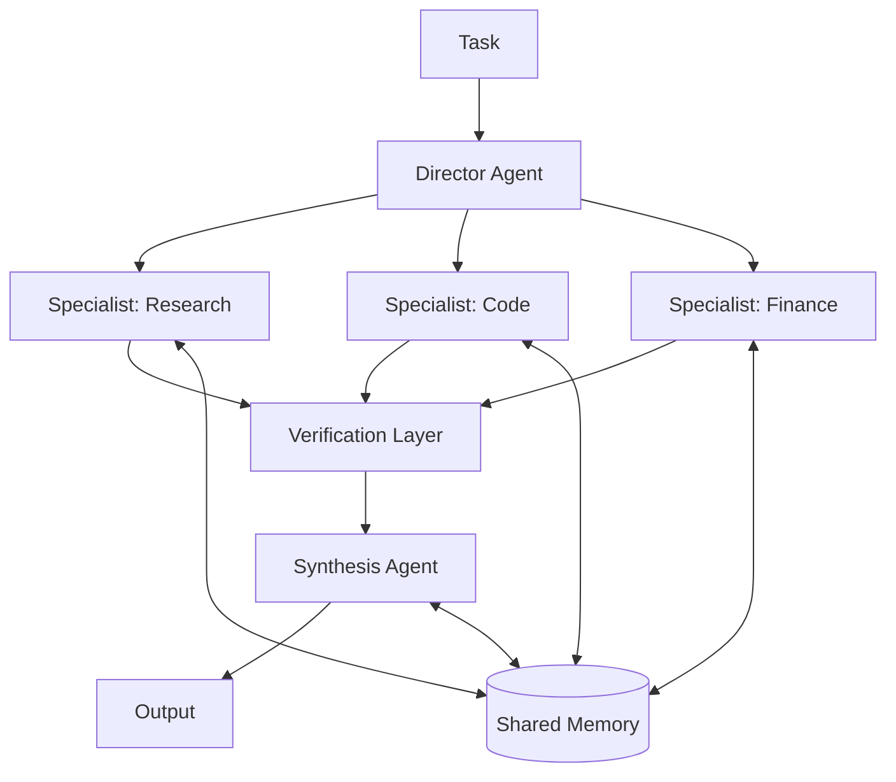

# What Is Collective Superintelligence?

Ask ten people what superintelligence means and you will get ten versions of the same picture: one enormous artificial mind, smarter than any human, sitting somewhere in a datacenter. That picture has shaped the entire AI race. It is also, we believe, the wrong picture.

Collective Superintelligence (CSI) is a different idea. Instead of one mind that is superhumanly smart, CSI is a *network* of specialized AI agents whose combined intelligence exceeds not only any single model, but any single mind that could ever be built. The intelligence does not live in any one agent. It lives in the system: the division of labor, the debate, the verification, the shared memory, and the coordination structure that binds thousands of agents into one coherent whole.

This post is the definitional guide: what CSI is, what it is made of, how it differs from AGI and ASI, how it actually produces superhuman results, and how to start building it. For the full argument on why CSI will win, read the companion essay: [Collective Superintelligence: Why CSI Will Surpass AGI and ASI](/blog/collective-superintelligence).

## The definition

**Collective Superintelligence is a system of many specialized AI agents, connected by explicit coordination structures and shared memory, whose combined capability exceeds that of any single model or any single mind, on real work, sustainably and at scale.**

The key move in this definition is where intelligence is located. In the AGI framing, intelligence is a property of one model, and the system around it is plumbing. In the CSI framing, the system *is* the intelligence. A collective of mid-sized specialist agents, correctly orchestrated, produces reasoning, memory, and throughput that the largest single model cannot match, for the same reason a hospital outperforms even the world's best doctor working alone.

This is not a new phenomenon. It is the oldest one we know. Markets, science, and civilization itself are collective intelligences: systems whose outputs (prices, theories, cities) exceed what any participant could produce or even fully understand. CSI applies that same architecture to machine intelligence, deliberately, with engineering rather than evolution.

## What a collective is made of

CSI is a specific architecture with four kinds of components. If you are missing one, you have a demo, not a collective.

1. **Specialized agents.** The atomic unit. Each agent is tuned for a narrow job: one domain, one skill, one modality. A legal-clause reviewer, a Rust performance auditor, a market-data summarizer. Specialists are individually cheaper and more accurate within their domain than any generalist, and the collective inherits all of their peaks at once.
2. **Coordination structures.** The topology that turns agents into a system: hierarchies where a director decomposes goals and delegates; pipelines where each stage refines the last; debates where proposers and critics argue before a verdict; voting where independent agents check each other's conclusions. The topology is a design choice, and it is where most of the system's intelligence comes from.
3. **Shared memory.** Stores that outlive any single context window: vector databases, RAG layers, knowledge bases that every agent can read and write. This is what lets a collective remember every project, every decision, and every mistake, indefinitely.
4. **Verification layers.** Agents whose entire job is to check other agents: fact-checkers, output validators, adversarial critics. Verification is what converts many fallible workers into one reliable system, the same way peer review converts fallible scientists into reliable science.

## How it differs from AGI and ASI

The familiar ladder goes: narrow AI, then AGI, then ASI. Every rung of that ladder measures the same thing: how smart *one mind* is. CSI is not a rung on that ladder. It is a different axis entirely, because it changes the unit of analysis from the mind to the system.

| Term | What it claims | Unit of analysis | Status |
| --- | --- | --- | --- |
| Narrow AI | Superhuman at one task | One model | Here today |
| AGI | Human-level generality | One mind | A prediction |
| ASI | Beyond human at everything | One mind | A prediction |
| CSI | Combined capability beyond any single mind | The network | An engineering discipline, buildable now |

Two things follow from this table. First, CSI does not compete with model progress; it consumes it. Every better model that ships makes every node in a collective stronger, so collectives compound on top of the very progress the AGI race produces. Second, CSI does not stop mattering if ASI arrives. A single superintelligent mind is still serial, still one failure domain, still one perspective. The strongest configuration of any future mind, however smart, is a coordinated collective of them. The ceiling is always the network, never the node.

## Where the extra intelligence comes from

Calling a system "superintelligent" is a strong claim, so it is worth being mechanical about where the surplus comes from. A collective beats its best member through four concrete mechanisms:

- **Aggregation.** Independent agents make independent errors. Voting and consensus cancel uncorrelated mistakes, which is why an ensemble's error rate can be driven far below any member's. One model's hallucination becomes a collective's outvoted anomaly.
- **Division of cognitive labor.** No single mind, human or artificial, can hold peak expertise in every domain at once. A collective does not have to. It routes each subtask to the agent whose entire existence is tuned for it, so system-level performance approaches the *maximum* of each specialty rather than the average of a generalist.
- **Adversarial refinement.** Ideas that survive attack are stronger than ideas that were merely generated. Proposer-critic-verifier loops inside a collective apply the logic of peer review at machine speed, catching errors upstream of consequences.
- **Parallel search.** A collective explores many hypotheses, designs, or strategies simultaneously and keeps the best. A single mind explores one path at a time, however brilliantly. Breadth of search is a form of intelligence that only a population can have.

None of these mechanisms is speculative. Each one already works in production multi-agent systems today. CSI is what you get when they are engineered together, deliberately, at scale.

## What it looks like in practice

Strip away the grand terminology and a working collective is recognizable, and measurable:

- A task arrives and is decomposed by a director agent into a graph of subtasks, each routed to a specialist.
- Specialists work in parallel, reading from and writing to shared memory as they go.
- Every consequential output passes through verification before anything downstream depends on it.
- Failures are local: a bad output is caught and rerouted, a dead node's work is redistributed, and the system degrades gracefully instead of breaking.
- The system's performance *compounds*: every completed project enriches the shared memory that every future project draws on.

You know you are looking at CSI rather than a chatbot with extra steps when the system completes multi-domain work end to end at a quality no single model can match, and when its reliability goes *up* with scale, because verification capacity grows with the swarm.

## How to start building it

CSI is not a product you wait for. It is a system property you engineer, and every primitive already exists in the Swarms stack:

- **[The Swarms framework](/framework)**: 15+ coordination structures (hierarchical swarms, mixture of agents, group chat, graph workflows, majority voting) as first-class primitives, in Python and Rust, plus shared memory and RAG integration.
- **Swarms Cloud**: a hosted runtime for deploying and scaling swarms without managing infrastructure.
- **[The Marketplace](https://swarms.world)**: where specialized agents, prompts, and tools are discovered, composed, and traded, the raw material of every collective.

Start small: three agents and a verifier beat one agent on real work, today. Then grow the topology, deepen the memory, and let the collective compound.

**We're hiring to build CSI.** Join our research team: [swarms.ai/hiring](/hiring)

Start building with us: [swarms.ai](https://swarms.ai) · [GitHub](https://github.com/kyegomez/swarms) · [Discord](https://discord.gg/EamjgSaEQf)
