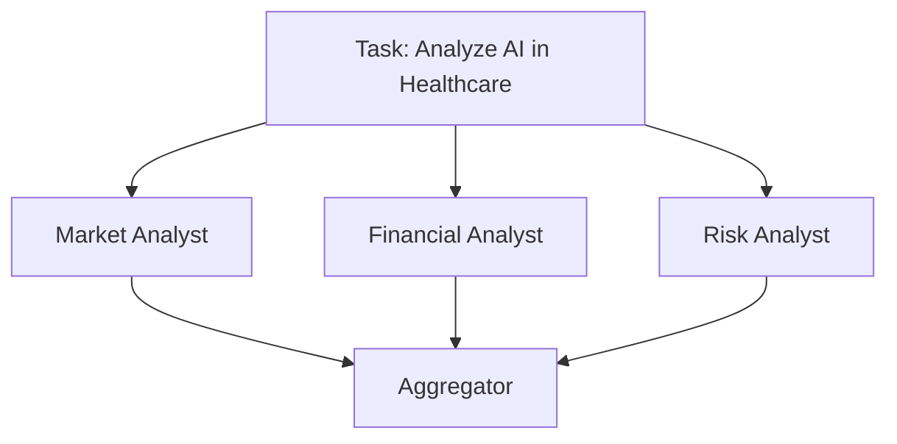
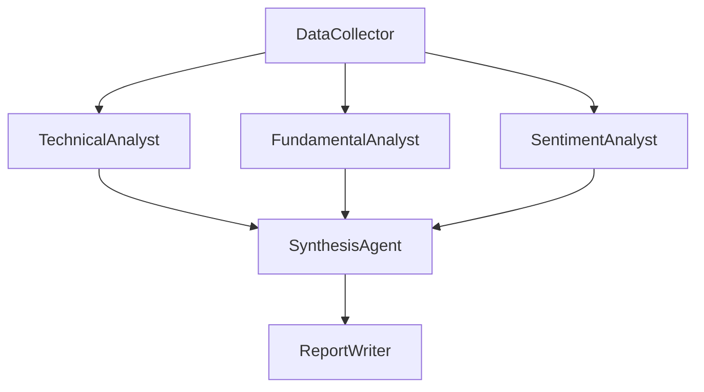

# 顺序、并发与图工作流：智能体编排的三种基本形态

智能体编排模式（Agent Orchestration Patterns）恰好只有三种基本形态：顺序型（Sequential，一条直线，每个智能体的输出作为下一个的输入）、并发型（Concurrent，一次扇出，多个独立的智能体并行处理同一任务，结果再汇总）、以及图型（Graph，一个有向无环图，部分步骤按顺序执行，部分并行执行，结果在特定节点汇合）。你未来会构建的几乎每一个多智能体系统，要么就是这三种拓扑结构中的一种，要么是它们以嵌套形式组合成的一个更大的图。选对拓扑结构不是一个风格问题——它会直接影响延迟、成本、故障表现，以及六个月后这条流水线是否还容易调试。

本文关注的是这些形态本身,与具体使用哪个工具来绘制或运行它们无关。如果你想了解 Swarms Cloud 上用于搭建图工作流的可视化编辑器，请参阅[深入了解 Swarms Cloud 工作流构建器](/blog/workflow-builder-swarms-cloud)。如果你想先了解什么是多智能体系统，请参阅[什么是多智能体系统？](/blog/what-is-a-multi-agent-system)本文假定你已经知道智能体（Agent）是什么，直接切入如何将它们连接在一起。

## 为什么拓扑结构是第一个要做的决定

在挑选模型、提示词或工具之前，任何多智能体设计都必须先回答一个结构性问题：第二步是否需要第一步的输出，还是两者可以同时运行？这一个问题的答案，就决定了你需要三种形态中的哪一种。如果答错了，后续症状要么表现为浪费掉的延迟（把本可以并行的事情串行执行），要么表现为浪费掉的算力和产生竞态的输出（把实际上相互依赖的事情并行执行）。下面这三种形态直接对应 Swarms 框架中的 `SequentialWorkflow`、`ConcurrentWorkflow` 和 `GraphWorkflow`，但其底层逻辑在你使用任何库或平台时都同样适用。

## 顺序工作流：流水线

顺序工作流（Sequential Workflow）就是一条直线。智能体 A 产出一个输出，这个输出成为智能体 B 的输入，B 的输出又成为 C 的输入，依此类推。没有分支，也没有并行——每一步都硬性依赖于前一步。


只要每个阶段确实需要上一阶段已完成的输出才能开展工作，就应该使用顺序工作流：研究员收集原始信息，写手把这些研究转化为文字，编辑再对文字进行润色。如果试图把这个过程并行化，就意味着写手在还没有任何可写内容时就开始动笔了。在 Swarms 框架中，这直接对应 `SequentialWorkflow`：

```python
from swarms import Agent, SequentialWorkflow

researcher = Agent(
    agent_name="Researcher",
    system_prompt="Research the given topic and provide detailed information.",
    model_name="gpt-5.4",
    max_loops=1,
)

writer = Agent(
    agent_name="Writer",
    system_prompt="Transform research into an engaging article.",
    model_name="gpt-5.4",
    max_loops=1,
)

editor = Agent(
    agent_name="Editor",
    system_prompt="Edit and polish the article for publication.",
    model_name="gpt-5.4",
    max_loops=1,
)

workflow = SequentialWorkflow(
    agents=[researcher, writer, editor],
    max_loops=1,
)

result = workflow.run("The impact of AI on healthcare")
print(result)
```

`SequentialWorkflow` 还提供了 `run_batched()`，用于让同一条流水线处理多个任务；`run_async()` 和 `run_stream()` 分别用于异步执行和 token 流式输出；甚至还有 `run_concurrent()`，可以一次性通过同一条顺序链发起多个相互独立的任务。但这条链本身，从智能体到智能体，始终保持一条直线的形态。

顺序工作流所做的取舍是显而易见的：总延迟等于每一步延迟之和，因为没有任何一步可以提前开始。三个智能体各耗时十秒，总计就是三十秒，无论你手头还闲置着多少计算资源都无济于事。作为交换，你得到的是最简单的故障模型——如果第二步失败，你能准确知道第一步留下了什么状态，也完全不会对是哪个输出导致了问题产生歧义。对于正确性依赖严格顺序的流水线来说，这种可预测性，比并行执行所能节省的那点实际耗时更有价值。

## 并发工作流：扇出

并发工作流（Concurrent Workflow）是相反的形态：一份输入，由多个智能体独立且同时处理，没有任何一个智能体依赖另一个的输出。这正是"给我 N 个关于同一输入的独立视角"这种模式所需要的，其价值来自分析的多样性，而不是分析之间的先后顺序。



市场分析师、财务分析师和风险分析师可以同时阅读同一份简报，并各自独立、同步地产出自己的输出——没有人需要等待其他人，因为没有人是在别人的结论基础上继续推进的。在 Swarms 中，这就是 `ConcurrentWorkflow`：

```python
from swarms import Agent, ConcurrentWorkflow

market_analyst = Agent(
    agent_name="Market-Analyst",
    system_prompt="Analyze market trends and opportunities.",
    model_name="gpt-5.4",
)

financial_analyst = Agent(
    agent_name="Financial-Analyst",
    system_prompt="Provide financial analysis and projections.",
    model_name="gpt-5.4",
)

workflow = ConcurrentWorkflow(
    agents=[market_analyst, financial_analyst],
    max_loops=1,
    show_dashboard=True,
)

results = workflow.run("Analyze the potential impact of AI on healthcare")
print(results)
```

默认情况下，`ConcurrentWorkflow` 返回的是 `output_type="dict-all-except-first"`，把每个智能体的输出汇总进一个以智能体名称为键的单一结构中——这其实正是上面那张图里"聚合"这一步在底层实际做的事情，除非你想要一个专门用来把并行输出综合成单一叙述的"聚合智能体"，否则并不需要单独设置这样一个角色。`show_dashboard=True` 能让你实时查看每个智能体的运行进度，这在这里比在顺序链中更重要，因为多件事情在同时发生，否则你会失去对"哪个智能体运行得慢"的可见性。若要在多个不同输入上运行同一种扇出模式，`batch_run()` 可以处理一整个任务列表，对每一个任务都执行完整的并发扇出。

并发所做的取舍，恰好与顺序工作流相反：实际耗时（Wall-Clock Latency）大致降到了最慢那个智能体单独运行的时间，而不是所有智能体耗时之和，但代价是完全放弃了让一个智能体的输出影响另一个智能体的可能性。如果财务分析师其实需要市场分析师的结论，那么并发运行只会导致财务分析师基于陈旧或缺失的上下文工作。只有当并行的各个分支确实相互独立时，并发才能真正带来收益。

## 图工作流：DAG

大多数真实系统既不是纯粹的一条直线，也不是纯粹的一次扇出——它们在不同地方兼而有之。图工作流（Graph Workflow）直接表达了这一点：一个有向无环图（DAG），其中一些智能体按顺序运行，一些并行运行，结果在预先定义好的汇合点合并后继续往下走。



一个数据采集智能体负责收集原始输入，三位专项分析师并行处理这些数据，一个综合智能体则等待这三者全部完成后再产出一个综合视图，随后交给最终的报告撰写智能体。这就是同一张图里既有分支又有合并，而这是纯顺序链或纯并发扇出都无法单独表达的。在 Swarms 中，这就是 `GraphWorkflow`，它由节点和边构建而成，而不是一个扁平的列表：

```python
from swarms import Agent
from swarms.structs.graph_workflow import GraphWorkflow

data_collector = Agent(
    agent_name="DataCollector",
    system_prompt="Collect and validate data from sources.",
    model_name="gpt-5.4",
)
technical_analyst = Agent(
    agent_name="TechnicalAnalyst",
    system_prompt="Analyze technical indicators and signals.",
    model_name="gpt-5.4",
)
fundamental_analyst = Agent(
    agent_name="FundamentalAnalyst",
    system_prompt="Analyze fundamentals and financial statements.",
    model_name="gpt-5.4",
)
sentiment_analyst = Agent(
    agent_name="SentimentAnalyst",
    system_prompt="Analyze market sentiment and news flow.",
    model_name="gpt-5.4",
)
synthesis_agent = Agent(
    agent_name="SynthesisAgent",
    system_prompt="Synthesize the three analyses into one view.",
    model_name="gpt-5.4",
)

workflow = GraphWorkflow(
    name="Market-Analysis-Pipeline",
    description="Collect data, fan out to analysts, then synthesize.",
)

for agent in [
    data_collector,
    technical_analyst,
    fundamental_analyst,
    sentiment_analyst,
    synthesis_agent,
]:
    workflow.add_node(agent)

# Branch: one node feeds three
workflow.add_edges_from_source(
    source="DataCollector",
    targets=["TechnicalAnalyst", "FundamentalAnalyst", "SentimentAnalyst"],
)

# Merge: three nodes feed one
workflow.add_edges_to_target(
    sources=["TechnicalAnalyst", "FundamentalAnalyst", "SentimentAnalyst"],
    target="SynthesisAgent",
)

workflow.compile()
result = workflow.run("Evaluate whether to increase healthcare-AI exposure")
print(result)
```

`add_edges_from_source()` 一次调用就能写出所有扇出边，而不必调用三次；`add_edges_to_target()` 对扇入边做的是同样的事情。`GraphWorkflow` 还提供了一个全连接的辅助方法 `add_parallel_chain()`，用于把一组节点中的每一个都连接到另一组节点中的每一个；此外还有一种元组简写形式——`("agent1", ["agent2", "agent3"])` 表示分支，`(["agent1", "agent2"], "agent3")` 表示合并——如果你更喜欢以声明式的方式描述边，而不是逐个调用方法。在 `run()` 之前调用 `compile()`，可以让工作流验证图结构，并一次性预先计算好执行顺序，而不必在每次运行时都重新解析依赖关系。

图工作流所做的取舍，是用复杂度换取精确度。你可以精确地编码任务实际所具有的依赖结构——不会在本可并行的地方被迫串行，也不会在真实存在依赖关系的地方被迫并行——但代价是你现在要自己维护一整张图：入口点、出口点，以及如果这张图是手工搭建而非经过校验的，还可能出现环路或孤立节点。这种复杂度，正是像 [Swarms Cloud 工作流构建器](/blog/workflow-builder-swarms-cloud)这样的可视化编辑器所要解决的问题，它让你能够直接看到 DAG 的形状，而不必在编写一串 `add_edge()` 调用的同时,在脑子里默默维护这张图。

## 如何在三者之间做选择

| 模式 | 形态 | 延迟 | 适用场景 |
| --- | --- | --- | --- |
| 顺序（Sequential） | 直线 | 所有步骤耗时之和 | 每一步都严格需要上一步的输出 |
| 并发（Concurrent） | 扇出 | 最慢那一步的耗时 | 对同一输入的多个独立视角 |
| 图（Graph） | DAG | 沿关键路径的耗时之和 | 依赖关系混合：部分步骤并行，部分顺序 |

实践中，要问的问题很简单：这一步是否需要在开始前拿到另一步的输出？如果每一步都需要前一步，你需要的就是顺序工作流。如果没有任何一步依赖其他步骤，你需要的就是并发工作流。如果答案是"有些需要，有些不需要"，那你需要的就是一张图，无论你是否用一个专门的图类来构建它——用顺序阶段和并发阶段手工拼装出来的组合，本质上就是一个图工作流，只是没有用这个名字而已。

这些形态也可以相互组合。`GraphWorkflow` 中的一个节点不必是单个智能体；它可以是一整个作为大图中一个步骤运行的 `ConcurrentWorkflow` 或 `SequentialWorkflow`，而这三种形态中的任何一种，都可以作为一个更大编排结构中的子图出现。上面示例中那个三位分析师的扇出结构，本身就已经是一个存在于图内部的并发子工作流。复杂的多智能体系统很少会从头到尾都是单一的纯模式；它们通常是一张图，而图的节点本身，又是一个个小型的顺序或并发工作流。

## 相关链接与资源

| 资源 | 链接 |
| --- | --- |
| 顺序工作流文档 | [docs.swarms.world/architectures/sequential-workflow](https://docs.swarms.world/architectures/sequential-workflow) |
| 并发工作流文档 | [docs.swarms.world/architectures/concurrent-workflow](https://docs.swarms.world/architectures/concurrent-workflow) |
| 图工作流文档 | [docs.swarms.world/architectures/graph-workflow](https://docs.swarms.world/architectures/graph-workflow) |
| 架构总览 | [docs.swarms.world/architectures/overview](https://docs.swarms.world/architectures/overview) |
| 可视化工作流构建器 | [深入了解 Swarms Cloud 工作流构建器](/blog/workflow-builder-swarms-cloud) |
| 官方文档 | [docs.swarms.ai](https://docs.swarms.ai) |
| Discord 社区 | [discord.gg/VapjxpSyHC](https://discord.gg/VapjxpSyHC) |

---

*有任何问题或反馈？欢迎加入我们的 [Discord 社区](https://discord.gg/VapjxpSyHC)，或查阅[官方文档](https://docs.swarms.ai)。*

