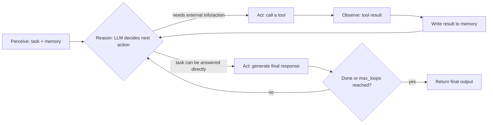

# 智能体式AI详解：自主智能体究竟如何决定下一步行动

智能体式AI（Agentic AI）指的是这样一类系统：它们以大语言模型（LLM）为核心，能够自主决定为完成任务需要采取哪些行动，而不是仅仅针对一次提示词返回一次补全结果。一个智能体系统会先感知任务及其上下文，推理出下一步该做什么，然后通过调用工具或生成输出来行动，接着观察这次行动的结果，再决定下一步，如此循环往复，直到任务完成。它与普通聊天机器人的核心区别在于控制权：聊天机器人生成一段文本就停下了，而智能体（Agent）会产生行动、评估行动结果，并持续运行，直到自己判断任务已经完成。

这个定义听起来很简单，但"自主决定"背后的具体机制，恰恰是大多数介绍语焉不详的地方。本文将跳过智能体式AI的营销话术，深入讲解 Swarms 智能体所运行的真实架构：智能体如何感知任务、如何在直接作答和调用工具之间做选择、记忆如何约束并影响这个选择，以及为什么"智能体思考得有多深入"本身就是一个可配置的参数，而不是底层模型固定不变的特性。

## 智能体式AI与单次补全的区别

一次单独的 LLM 补全本质上是一次函数调用：输入文本，输出文本。这个过程中没有循环、没有向前传递的状态，模型也无法检查自己的工作成果，或者获取上下文窗口之外的信息。如果提示词要求进行一次模型算错的计算，或者涉及模型不知道的事实，或者需要读取模型看不到的文件，这次补全就只会简单地失败或产生幻觉（Hallucination）。它没有任何纠错的余地。

智能体则是把同一个底层模型包裹在一个循环中，赋予它单次补全所不具备的三样东西：一份记录本次任务至今发生了什么的记忆、一组可以调用来影响或查询外部世界的工具，以及决定是继续迭代还是停止的控制逻辑。Swarms 的 `Agent` 恰好组合了这三个组件：作为推理引擎的 LLM、让它突破纯文本生成能力边界的工具，以及在任务各步骤之间维持上下文的记忆系统。让一个智能体真正做到"智能体式"而非仅仅"对话式"的，正是这种组合方式，而不是模型本身变得更聪明。

## 感知-推理-行动循环

具体来说，Swarms 智能体的生命周期运行的是一套结构化、可重复的循环：

1. **感知（Perceive）**——智能体接收任务，并从记忆中调取相关上下文：目前为止的对话内容、此前任何工具调用的结果，以及它的系统提示词（System Prompt）。
2. **推理（Reason）**——底层 LLM 处理这些输入，决定下一步该做什么：是直接作答，还是调用某个可用工具，如果是后者，需要传入什么参数。
3. **行动（Act）**——智能体执行所选定的动作，无论是生成一段回复，还是真正调用某个工具，结果会在循环重新开始之前被写回记忆。

这并不是对模型权重内部运作方式的一种比喻，而是智能体运行时（Runtime）实际执行的控制流程。这个循环会一直重复，直到任务被判定完成，或者智能体达到了配置的迭代上限；每一次循环都给了智能体一个机会，去发现上一步是否出了问题并纠正方向，因为工具调用的结果会直接反馈进入下一轮推理，而不是用完即弃。



如果你读过我们介绍[什么是多智能体系统（Multi-Agent System）](/blog/what-is-a-multi-agent-system)的姊妹篇文章，就会知道这个循环正是被组合进更大规模图结构中的基本单元：一个多智能体系统，就是由许多这样的循环相互传递输出所构成的网络，而不是单个循环孤立运行。

## 自主性是一种配置，而非一种感觉

一个智能体被允许持续循环多久、它如何判断自己已经完成，这些都由一个实实在在的参数 `max_loops` 决定，而不是模型"有多智能体化"这种玄而又玄的涌现属性。实践中有三种模式值得关注：

- **固定循环**（`max_loops=5`）——智能体恰好获得 N 次推理-行动循环的机会，适用于步骤数量已知且有限的任务。
- **单次执行**（`max_loops=1`）——智能体表现得像一次带工具调用能力的单次补全：一次推理、一次行动，结束。对于直接、单步骤的请求，这是正确的设置，循环只会白白增加延迟。
- **自动模式**（`max_loops="auto"`）——智能体自行判断任务何时完成，并凭自己的判断退出循环，而不是运行固定的次数。这正是让智能体显得"自主"的原因所在：它并非换了一个不同的模型，而是同一套推理循环，只是把停止条件交给了智能体本身，而不是由调用方写死。

这一点之所以重要，是因为它意味着自主性是可以按任务调节的。一个每次都恰好执行一次的数据提取智能体，和一个循环到自认为收集了足够信源为止的研究智能体，运行的是完全相同的架构，只是某个字段的取值不同而已。

## 工具调用：智能体如何触及模型之外的世界

"行动"这一步，正是智能体从一个纯文本生成器，转变为能够真正"做事"的关键所在。在 Swarms 中，工具就是带有类型提示（Type Hint）和文档字符串（Docstring）的普通 Python 函数；框架会通过 `BaseTool` 自动将它们转换为与 OpenAI 兼容的函数 Schema，你只需将一个列表传给智能体即可完成注册：

```python
agent = Agent(
    agent_name="Weather-Assistant",
    model_name="claude-sonnet-4-6",
    tools=[get_weather, calculate, search_database],
)
```

在推理这一步中，模型会看到每个已注册工具的 Schema 以及任务本身，并借助标准的函数调用（Function Calling）机制，自行决定是直接作答，还是携带特定参数调用其中某个工具。这个决策本身也可以通过 `tool_choice` 配置：`"auto"` 让模型自行决定是否使用工具，`"required"` 强制它必须调用某个工具，而 `"none"` 则在这一轮中禁用工具调用。一旦发起调用，智能体就会执行所选函数（失败时会自动重试，参数为 `tool_retry_attempts`，默认值为 3），其结果会直接作为新的上下文反馈进推理循环，供下一次决策使用。

**一个具体的例子。** 假设一个智能体拥有 `tools=[get_weather, calculate]` 且 `tool_choice="auto"`，被赋予的任务是"查询奥斯汀的天气，如果温度高于 90°F，就把它换算成摄氏度"。在第一次推理步骤中，模型还没有天气数据，于是调用 `get_weather(location="Austin, TX")`。该结果（"94°F"）被写入记忆。在第二次推理步骤中，模型此时已经在上下文中拿到了温度值，识别出条件已满足，于是调用 `calculate` 将 94°F 换算为摄氏度。到第三轮，两个结果都已在记忆中，模型据此组织出最终答案。三次推理、两次工具调用、一次最终回复，全部发生在同一个循环之内，全程无需人工手动把这些调用串联起来。

## 记忆：智能体在每一步实际看到了什么

每一次推理的质量，都取决于它所获得的上下文，而 Swarms 智能体管理这些上下文的方式是分层的，而不是一份扁平的对话记录。在进程内，`conversation_history` 保存的是当前这次运行中的消息。在磁盘上，当 `persistent_memory=True`（默认值）时，智能体会把当前的交互日志写入一个 `MEMORY.md` 文件，如果另一个进程以相同的 `agent_name` 启动智能体，就会重新加载这份记忆，这样智能体的短期记忆就能在重启后依然保留。当任务运行时间较长时，`ContextCompressor` 可以触发自动压缩：一旦 token 使用量相对于模型上下文长度超过了配置的阈值，一个 LLM 会对对话记录进行摘要，此前的原始日志被归档到 `archive/history_<timestamp>.md`，而当前记忆则被替换为压缩后的摘要，这样一来，当任务运行超出上下文窗口限制时，循环也不会悄无声息地崩溃。

这与检索增强生成（Retrieval-Augmented Generation）意义上的长期记忆是两回事：将 `BaseVectorDatabase` 作为 `long_term_memory` 传入,可以让智能体在任务执行过程中从外部文档库或知识库中调取相关事实，独立于它自身的对话历史。这里有一条值得牢记的经验法则：`MEMORY.md` 和对话历史，记录的是智能体自己做过什么；而 RAG，则是智能体去查找一件它自己从未亲历过的事情。

## 推理策略同样是一个可调参数

推理这一步也不一定非得是一次普通的 LLM 调用。Swarms 通过 `ReasoningAgentRouter` 提供了多种不同的推理策略，每一种都在延迟、成本与得出答案的方式之间做出不同的权衡：

| 策略 | 机制 |
| --- | --- |
| 自洽性智能体（Self-Consistency Agent） | 运行多条独立的推理路径，并通过多数投票的方式汇总结果 |
| 推理二人组（Reasoning Duo） | 将推理与执行拆分给两个独立的智能体分别承担 |
| IRE 智能体（迭代反思扩展，Iterative Reflective Expansion） | 生成一个假设，模拟其路径，反思其中的错误，再进行修订 |
| 反思智能体（Reflexion Agent） | 执行者-评估者-反思者循环，通过多次尝试积累的经验不断改进 |
| GKP 智能体（生成式知识提示，Generated Knowledge Prompting） | 先生成相关的背景知识，再从多个角度进行推理，最后作答 |
| 智能体裁判（Agent Judge） | 对一份输出进行结构化的质量评估与打分，而不是生成新的输出 |

这些策略都不会改变底层模型；它们改变的是推理发生的次数，以及在智能体最终确定行动之前，这些推理结果如何被汇总。配置方式很直接：路由器接受一个 `swarm_type` 参数来选择策略，再配合 `num_samples` 和 `max_loops` 控制愿意投入多少推理预算。这与 `max_loops="auto"` 是同一个原则在更高一层的体现：智能体在行动前推理得有多深入，是一个你根据任务的重要程度和延迟预算来设置的参数，而不是抽象意义上"智能体式AI"固有不变的特性。

## 为什么这些机制值得深究

之所以值得把话说得这么具体，是因为"智能体式AI"这个词已经被用得太宽泛，几乎可以指代任何背后挂着 LLM 的东西。真正有意义的区分在于架构层面：这个系统是否会循环、行动、观察并自行决定何时停止，还是仅仅完成一次提示词补全？一个具备工具调用能力、拥有可持久化并可压缩的记忆、以及可配置停止条件的感知-推理-行动循环，正是让智能体能够完成多步骤、可自我纠正的工作，而不是一次性生成的关键所在。本文所讲的一切——`max_loops`、`tool_choice`、`MEMORY.md`、`ReasoningAgentRouter`——都是把这个循环变得具体、可调整，而不是把它留作"一个足够聪明的模型"这种隐含属性的产物。

## 相关链接与资源

| 资源 | 链接 |
| --- | --- |
| 智能体概念 | [docs.swarms.world/concepts/agents](https://docs.swarms.world/concepts/agents) |
| 推理智能体概览 | [docs.swarms.world/agents/reasoning-agents-overview](https://docs.swarms.world/agents/reasoning-agents-overview) |
| 智能体工具 | [docs.swarms.world/agents/agent-tools](https://docs.swarms.world/agents/agent-tools) |
| 智能体记忆 | [docs.swarms.world/agents/agent-memory](https://docs.swarms.world/agents/agent-memory) |
| 什么是多智能体系统 | [/blog/what-is-a-multi-agent-system](/blog/what-is-a-multi-agent-system) |
| 官方文档 | [docs.swarms.ai](https://docs.swarms.ai) |
| Discord 社区 | [discord.gg/VapjxpSyHC](https://discord.gg/VapjxpSyHC) |

---

*有任何问题或反馈？欢迎加入我们的 [Discord 社区](https://discord.gg/VapjxpSyHC)，或查阅[官方文档](https://docs.swarms.ai)。*
