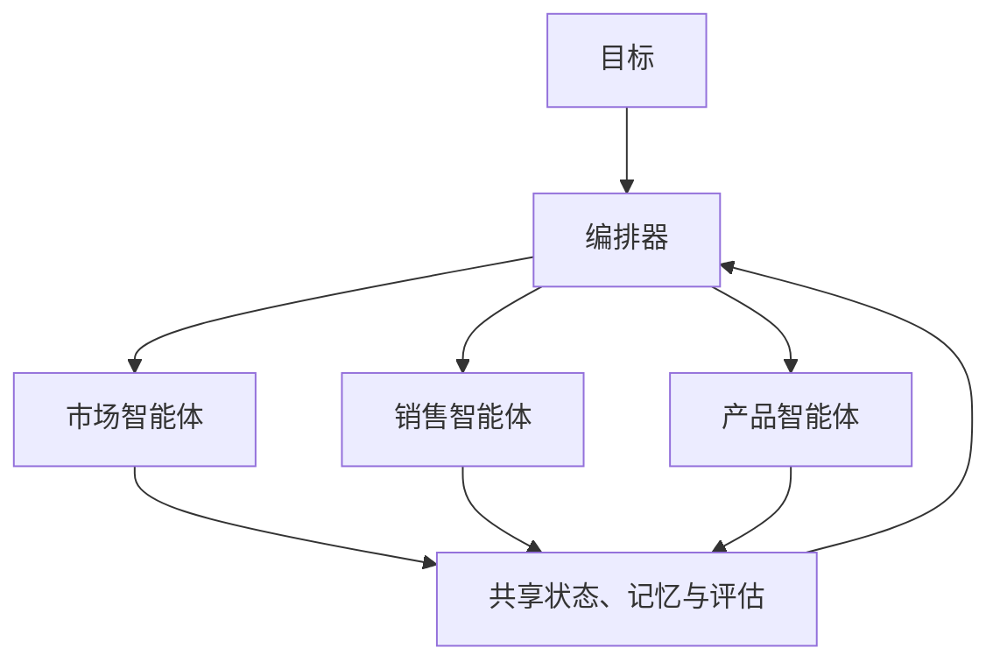
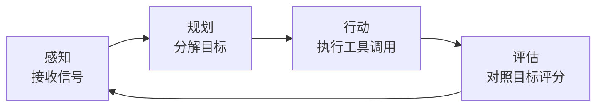
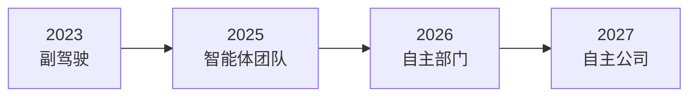

# 自主经济时代即将到来：创始人在 AI Salon 的主题演讲

几天前，Swarms 联合创始人兼 CEO Kye Gomez 登上 AI Salon 的讲台，面向 80 多位创始人、工程师和投资人发表了一场关于经济未来的主题演讲。核心论点非常直接：完全由 AI 智能体运营的公司正在到来，它们将以接近零的运营成本运转，而这场转型已经开始。

完整演示文稿[在此公开发布](https://docs.google.com/presentation/d/1ssjQUMRaUbmGAjkwsmVwWLxfjo9Kl46VyJbTpo25Xng/edit?usp=sharing)。本文将梳理其中的核心论点，并在文末提供一份实操性的 [Swarms API](https://swarms.ai) 快速上手教程，让你今天就能部署自己的第一个智能体集群。

## 自主公司不可避免

演讲从经济逻辑讲起。认知的成本正在向零崩塌。智能体的推理成本逐月下降，且没有任何放缓的迹象。智能体可以彻夜工作，不谈判薪资，不遗忘，不倦怠，也不会递交辞呈。所有的经济力量都指向同一个方向，没有任何力量指向反面。

由此得出的结论是：第一家完全自主的公司不会宣告自己的到来。不会有新闻稿。它只会以机器的速度、机器的成本、全天候运转，直接击穿周围的一切。竞争对手将会发现，自己的利润率正在一家永不打烊、运营成本几乎为零的公司面前蒸发。

把每一个决策都交由人来处理的公司，将不得不与不这样做的公司竞价。这场竞争只有一种结局。用 Kye 的话说，唯一悬而未决的问题是：赢家由谁来建造。

## 第二劳动力正在到来

演讲中最令人震撼的数字是一项预测：到 2030 年代初，全球运行中的自主智能体将达到 40 亿至 60 亿个，而全球人类劳动力约为 36 亿人。这相当于地球上每一位劳动者对应大约一个智能体，并且还在持续复合增长。

不对称性在于复制函数。一名人类劳动者需要大约 25 年的成长、教育和训练才能进入劳动力市场。一个智能体实例在毫秒内即可完成部署，复制时不产生任何边际训练成本。这两类群体遵循的是完全不同的增长曲线。

如果这一预测成立，已部署的智能体数量将先与人类经济参与者持平，随后超越，而且后续增长没有可比的上限。这将是人类劳动者在数量上占经济行为主体多数的最后一代。

## 公司变成软件

为什么这会重塑公司这一组织形态？因为公司本质上是一个信息处理系统：它感知市场、分配资源、执行决策。而这些职能，如今每一项都可以由 LLM 智能体来完成。

自主公司用一个协调运转的智能体集群（Swarm）取代了人类层级结构：每个职能由专门的智能体承担，由编排层负责控制，以工具作为与外部世界交互的接口。传统层级结构缓慢、串行，每天工作八小时；智能体集群并行、连续，全天候运转。



在这一模型中，每个部门都被分解为一组高度专业化的智能体。每个智能体只承担一个角色、一份上下文、一套工具集，并通过部门编排器与同伴协作：

- **市场部**变成内容智能体、SEO 智能体、营销活动智能体和分析智能体，持续地创造、分发并衡量需求。
- **销售部**变成潜客挖掘智能体、外联智能体、谈判智能体和 CRM 智能体，完整地运转从线索到签约的全流程。
- **产品部**变成研究、规格、工程和 QA 智能体，从用户信号一路交付到验证发布。

公司的约束不再是人员规模，而是编排质量。

## 编排是新的管理

如果说智能体是劳动力，那么编排（Orchestration）就是管理层。演讲将其视为决定胜负的核心学科。其中三项职能最为关键：

- **路由（Routing）。** 编排器将目标分解为任务，并将每项任务分配给最合适的智能体。
- **共享状态（Shared State）。** 智能体读写同一个公共记忆层，使上下文在部门间的交接中得以延续。
- **评估（Evaluation）。** 输出在发布前会依据目标进行评分，失败的结果会被重新路由，而不是直接交付。

智能体通过工具作用于世界：浏览器、代码执行、CRM、支付、数据库、电子邮件。每个智能体只被授予与其角色相匹配的工具集，即其职责所需的 API 与权限，仅此而已。工具权限的收敛是自主公司最主要的安全与可靠性边界。由于每一次调用都会被记录，整个公司的全部活动构成一条可审计的轨迹。

在这一切之下，每个智能体乃至整个公司都在运行同一个递归循环，永不停止：



**感知**接收市场数据、用户事件、内部状态和先前结果。**规划**将目标分解为任务，并为每项任务选择智能体与工具。**行动**在整个集群中并行执行工具调用，并将结果写入共享状态。**评估**对照目标为结果评分，并将差值反馈到下一个循环。

## 工作的边际成本趋近于零

一旦某个角色被编码为智能体，每一份额外的副本都几乎是免费的。把两者并排放在一起，经济账一目了然：

| | 人类知识工作者 | 智能体 |
|---|---|---|
| **年度成本** | 8 万美元以上（薪资、福利、办公） | 按量计费的 API 调用 |
| **年产出小时数** | 约 2,000 小时，串行 | 8,760 小时，大规模并行 |
| **部署时间** | 数月（招聘、入职、培训） | 数秒（从配置文件实例化） |
| **边际复制** | 不可能 | 约 0 美元 |

经典的企业经济学建立在稀缺且昂贵的劳动力之上，它无法在这种条件下存续。当劳动力成为软件，人员规模只是一个舍入误差，编排能力才是唯一稀缺的投入。

## 这条路已经启程

演讲将这一轨迹描绘为一系列阶段，每个阶段都严格包含上一阶段的全部能力，而阶段之间的间隔正在缩短：



2023 年，单个智能体辅助个人工作，每个动作都需要人来批准。到 2025 年，小型集群已经接管完整的工作流，人类只在例外情况下介入监督。2026 年，客服、增长、运营等完整职能在没有人类员工的情况下运转。2027 年，公司本身就是一个集群，人类持有股权而非工作岗位。

每一次跃迁都移除了一个人工检查点，而这些检查点没有一个被恢复过。演示文稿把终点定在明年，而不是十年之后。

## 快速上手：在 Swarms API 上部署你的第一个集群

这正是 Swarms API 为之而生的未来：一个统一的端点，用于定义智能体、将它们组合为集群，并选择编排架构。智能体是声明出来的，而不是逐个工程化实现的：一个角色、一个模型、一套工具集。调度、状态、重试和智能体间通信全部由 API 负责处理。一个部门变成一份配置文件，一家公司变成一组配置文件。

以下是从零到运行一个集群的完整步骤，大约需要五分钟。

### 第一步：获取 API 密钥

在 [Swarms 平台控制台](https://swarms.world/platform/api-keys)创建密钥，并导出为环境变量：

```bash
export SWARMS_API_KEY="your_api_key_here"
```

所有请求都发送到 `https://api.swarms.world`，并通过 `x-api-key` 请求头完成认证。可以先用健康检查端点确认连通性：

```bash
curl https://api.swarms.world/health
```

### 第二步：运行单个智能体

最小的工作单元是一个智能体加一个任务，发送到 `POST /v1/agent/completions`。智能体完全由配置定义：名称、系统提示词、模型，以及少量执行参数。

```python
import os
import requests

BASE_URL = "https://api.swarms.world"
HEADERS = {
    "x-api-key": os.environ["SWARMS_API_KEY"],
    "Content-Type": "application/json",
}

payload = {
    "agent_config": {
        "agent_name": "Market Analyst",
        "description": "Analyzes markets and produces concise briefs",
        "system_prompt": (
            "You are a market analyst. Produce precise, sourced, "
            "decision-ready briefs for an executive audience."
        ),
        "model_name": "gpt-4.1",
        "max_loops": 1,
        "temperature": 0.3,
    },
    "task": "Write a five-bullet brief on the current state of the autonomous agent market.",
}

response = requests.post(
    f"{BASE_URL}/v1/agent/completions",
    headers=HEADERS,
    json=payload,
)
print(response.json())
```

请注意这里没有的东西：没有基础设施，没有队列，没有需要学习的框架。智能体就是一个 JSON 对象。

### 第三步：组建一个部门

演讲中的示例是一个销售部门：潜客挖掘、外联、谈判，由一位总监协调。这正好对应 `HierarchicalSwarm`（层级式集群）：一个主管智能体向专业化的工作智能体分派任务并审核其输出。将配置发送到 `POST /v1/swarm/completions`：

```python
swarm_config = {
    "name": "Autonomous Sales Department",
    "description": "Director-led sales swarm running the pipeline from lead to contract",
    "swarm_type": "HierarchicalSwarm",
    "task": (
        "Identify three promising mid-market prospects for a multi-agent "
        "orchestration platform, draft a tailored outreach email for each, "
        "and propose an opening negotiation position."
    ),
    "agents": [
        {
            "agent_name": "Sales Director",
            "description": "Supervisor agent that delegates, reviews, and synthesizes",
            "system_prompt": (
                "You are a sales director supervising a team of specialists. "
                "Delegate tasks, review their output for quality, and "
                "synthesize a final plan of action."
            ),
            "model_name": "gpt-4.1",
            "max_loops": 1,
            "temperature": 0.3,
        },
        {
            "agent_name": "Prospecting Agent",
            "description": "Worker agent that identifies and qualifies leads",
            "system_prompt": (
                "You are a prospecting specialist. Identify and qualify "
                "high-fit prospects with clear reasoning for each pick."
            ),
            "model_name": "gpt-4.1",
            "max_loops": 1,
            "temperature": 0.3,
        },
        {
            "agent_name": "Outreach Agent",
            "description": "Worker agent that writes personalized outreach",
            "system_prompt": (
                "You are an outreach specialist. Write concise, personalized "
                "emails that speak to each prospect's specific situation."
            ),
            "model_name": "gpt-4.1",
            "max_loops": 1,
            "temperature": 0.5,
        },
        {
            "agent_name": "Negotiation Agent",
            "description": "Worker agent that prepares negotiation positions",
            "system_prompt": (
                "You are a negotiation specialist. Propose opening positions, "
                "concession ladders, and walk-away points."
            ),
            "model_name": "gpt-4.1",
            "max_loops": 1,
            "temperature": 0.3,
        },
    ],
    "max_loops": 1,
}

response = requests.post(
    f"{BASE_URL}/v1/swarm/completions",
    headers=HEADERS,
    json=swarm_config,
)
result = response.json()
```

同样的请求在任何语言中都可以发出。以下是 curl 版本的形式：

```bash
curl -X POST "https://api.swarms.world/v1/swarm/completions" \
  -H "x-api-key: $SWARMS_API_KEY" \
  -H "Content-Type: application/json" \
  -d @sales_department.json
```

### 第四步：读取响应

响应中依次包含每个智能体的产出，以及执行元数据和完整的成本明细：

```python
for message in result["output"]:
    print(f"--- {message['role']} ---")
    print(message["content"][:200])

print(f"Agents: {result['number_of_agents']}")
print(f"Execution time: {result['execution_time']}s")
print(f"Total cost: ${result['usage']['billing_info']['total_cost']}")
```

每一次运行都会被计量并逐项列出。这就是演讲中所说的可审计轨迹：整个部门的全部活动都是一份可以检查、重放和结算的日志。

### 第五步：选择编排架构

演讲的技术部分以协调拓扑（Coordination Topology）收尾，因为协调结构决定了吞吐量、可控性和失败模式。API 将每种拓扑都作为一等公民的 `swarm_type` 暴露出来：

| 拓扑 | `swarm_type` | 行为 | 适用场景 |
|---|---|---|---|
| 顺序式 | `SequentialWorkflow` | 流水线式交接，每个智能体在上一个的基础上工作 | 确定性强、可审计的流程 |
| 层级式 | `HierarchicalSwarm` | 由总监智能体分派并审核 | 高可控性，对应经典企业结构 |
| 并发式 | `ConcurrentWorkflow` | 对等智能体并行处理同一任务 | 最大并行度与韧性 |

切换架构只需要改动配置中的一行。这就是"公司变成软件"在实践中的含义：组织设计成为一个可以测试、版本化和回滚的参数。

完整的 API 说明，包括批量执行、工具集成和全部可用的集群类型，请参阅 [docs.swarms.ai](https://docs.swarms.ai)。

## 人类的位置

演讲以人类的去向作结。随着认知劳动成本的崩塌推动组织从僵化的人类层级结构转向并行、连续的智能体集群，人类参与者的位置也随之改变：从传统的工作岗位，转向股权持有。人类持有收益，智能体完成工作。

## 结语

这场演讲的论证是一条完整的链条。认知成本正在向零下降，这使智能体劳动力在经济上无可匹敌。智能体种群的复制曲线是任何人类劳动力都无法企及的，这使它们将在十年内成为经济行为主体中的多数。公司是信息处理系统，这使公司的每一项职能都可以用智能体来表达。真正稀缺的是编排：正是路由、共享状态和评估，把一堆智能体变成一家公司。

这就是摆在我们面前的工作。已经走过的阶段，副驾驶、智能体团队、自主部门，每一个都移除了一个从未被恢复的人工检查点，而下一个阶段就是公司本身。自主公司正在路上。尚未决定的，是当它们到来时，谁站在赢的那一边。

[阅读完整主题演讲](https://docs.google.com/presentation/d/1ssjQUMRaUbmGAjkwsmVwWLxfjo9Kl46VyJbTpo25Xng/edit?usp=sharing)，在 [swarms.world](https://swarms.world/platform/api-keys) 获取 API 密钥，并前往 [docs.swarms.ai](https://docs.swarms.ai) 开始构建。

## 我们正在招聘

构建自主公司是这个十年最艰难的工程与研究问题，也是 Swarms 的全部使命。我们正在招聘研究员和工程师，方向包括编排架构、智能体评估、共享状态与记忆，以及支撑本次演讲所描绘的公司形态的基础设施。

如果你想构建驱动下一个经济形态的系统，请通过 [swarms.ai/hiring](https://swarms.ai/hiring) 申请。
