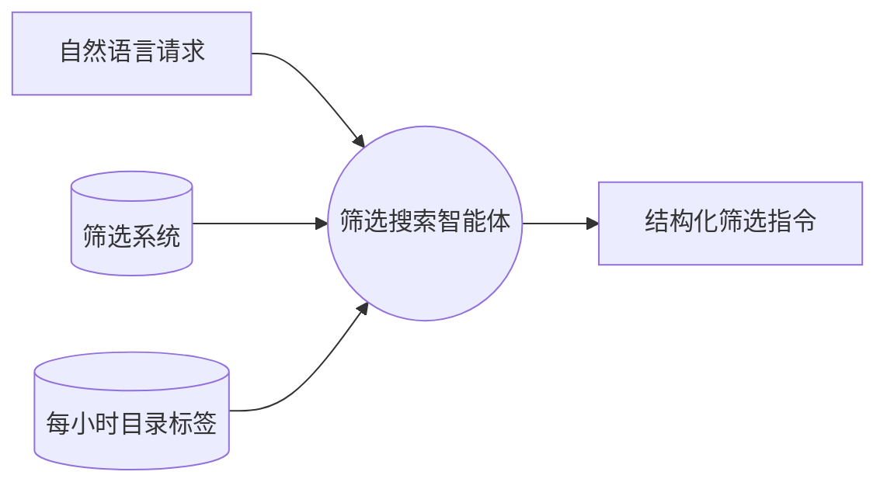

# 推出自主筛选搜索：说出你想要什么，智能体帮你找到

在一个有数千个智能体的市场中找到合适的那一个，过去意味着要先学会我们的筛选系统：商品类型、定价模式、行业、排除项、排序方式、日期范围，七种不同的控件，各有各的词汇。一旦熟悉了这些控件确实很有用，但对每一位刚来的访客来说，这本身就是一道门槛，因为他们只是想知道一件简单的事：哪里能找到好用的免费交易智能体？

今天，我们带来了一个更好的答案。[Swarms Marketplace 注册表](https://swarms.world/platform/registry)现已上线自主筛选搜索智能体。你只需用日常语言描述想找的东西，一个 AI 智能体会读取你的请求，将其转化为注册表的筛选系统，并当场为你逐一应用每一个筛选条件。

## 工作原理

在注册表的搜索框旁边，你会看到一个新的 AI 按钮。点击它，同一个搜索框就会切换到智能体模式。你输入的不再是关键词，而是意图，比如"这个月排名靠前的免费医疗类智能体，别给我看 x402 的垃圾信息"。

按下回车后，你的请求会被发送到运行在 Swarms Cloud 上的一个自主智能体，走的是与平台上每个已发布智能体相同的 [Agent Completions API](https://docs.swarms.ai)。这个智能体拥有一份完整的注册表筛选系统地图：四种商品类型、五种定价模式、排除类筛选、行业分类、四种排序方式，以及日期范围。它也理解这些筛选条件背后的含义，知道"便宜"指的是免费，"热门"意味着按近期一段时间的受欢迎程度排序，"别看垃圾信息"意味着排除数以千计的自动生成的 x402 商品列表。

关键在于，这个智能体不是在真空中猜测词汇。它每小时都会刷新一次对市场中商品实际标签的了解，哪些标签最受欢迎、被使用得最多。当你搜索"solana 狙击机器人"时，它会把你的请求映射到目录中真实存在的搜索词上，而不是编造出根本匹配不到任何结果的关键词。

智能体会返回一组结构化的筛选指令。这些指令会先经过我们服务器上的严格校验，确保即便模型出现异常行为，也不可能在页面中注入任何意料之外的内容。接下来才是有意思的部分：筛选条件会被逐个应用，并配有一行实时状态提示，讲述每一步操作。你会看到"正在设置商品类型：智能体"，接着是"正在设置定价：免费"，再接着是"正在设置行业：医疗"，与此同时，界面中对应的筛选标签会一个个弹出。智能体操作的正是你手动使用时会用到的那些控件，因此你可以检查它的每一步操作，移除任意一个筛选标签，或者手动调整结果。没有任何东西被隐藏起来。

## 使用步骤

1. 打开注册表页面 [swarms.world/platform/registry](https://swarms.world/platform/registry)。
2. 点击搜索框右侧的 AI 按钮。搜索框会切换到智能体模式，标志是双层边框和一个闪光图标。
3. 用一句话描述你想要的东西，可以随意一点：定价、商品类型、行业、时效性和质量偏好，智能体都能理解。
4. 按下回车。状态提示会显示"正在询问智能体"，与此同时你的请求正在被转化。
5. 观察筛选条件被逐一应用，实时讲述每一步，最后以类似"完成，已应用 5 个筛选条件"的总结收尾。
6. 用后续指令继续调整。再次点击 AI 按钮，输入"其实我只要付费的"。智能体会记住你之前的请求以及当前已应用的筛选条件，因此它会在现有状态上做修改，而不是从头开始。
7. 随时按下 Esc 键即可回到普通的关键词搜索。

## 实际效果

以下是这个智能体处理真实请求时的表现：

"热门医疗类智能体，别给我便宜货"会变成：仅限智能体，行业为医疗，排除免费商品，按过去一周的受欢迎程度排序。

"这个月排名靠前的免费交易类智能体，别给我看 x402 的垃圾信息"会变成：以"交易"为关键词搜索，仅限智能体，定价为免费，排除 x402 商品列表，按受欢迎程度排序，时间范围限定为过去一个月。

"营销类的付费提示词"会变成：仅限提示词，定价为付费，行业为营销。

"solana 机器人"会变成：仅限智能体，并以"solana"为关键词搜索。请注意智能体没有做的事：它没有把整句话都塞进搜索框，而是提取出其中唯一的主题词，其余部分都没有动。

## 当没有匹配结果时

任何筛选搜索最让人沮丧的结果，就是一个空页面。筛选搜索智能体会自己处理这种情况。如果它选定的筛选条件匹配不到任何商品，它就会开始放宽条件，从最不关键的条件开始：先把日期范围扩大到全部时间，然后去掉行业限制，再然后去掉关键词。每一步都会在状态提示中说明，比如"没有匹配结果，正在扩大到全部时间"，让你始终清楚发生了什么变化、为什么变化。一旦出现结果，它就会停止。像定价和排除条件这类承载你真实意图的筛选条件，永远不会被动。曾经的死胡同，现在有了一个体面的落脚点。

## 一个更自主的市场

这个功能的意义不止于便利。Swarms Marketplace 是智能体经济的所在地：数以千计的智能体、提示词和工具在这里被开发者以及其他智能体发布、交易、部署。我们一直认为，这种经济的基础设施本身也应当是智能体化的。

自主筛选搜索是这一理念一个朴素而真实的例子。解读你搜索请求的智能体，就是一个标准的 Swarms Cloud 智能体，构建在任何开发者今天都能调用的同一个公开 Agent Completions API 之上，配有系统提示词、结构化输出和服务器端校验。我们没有为此搭建一套专门的机器学习流水线，而是把一个智能体发布到了我们自己的基础设施上，并在我们自己的产品中给了它一份工作。市场中的发现功能，如今由市场本身所出售的这一类工作者来承担。

它也会与平台的其他部分产生叠加效应。创作者在发布商品时打上标签，智能体每小时学习一次这些标签，搜索开始匹配目录中真实存在的词汇。注册表筛选系统的每一次改进，都会自动转化为你能用日常语言提出的请求的改进。

自主筛选搜索现已面向每一位注册表访客上线，免费使用，无需任何配置。打开注册表，点击 AI 按钮，告诉这个市场你想要什么。剩下的交给智能体。

## 相关链接与资源

| 资源 | 说明 | 链接 |
| --- | --- | --- |
| Swarms Marketplace | 智能体经济的所在地 | [swarms.world](https://swarms.world) |
| 注册 | 创建你的免费账户 | [swarms.world/signin](https://swarms.world/signin) |
| 注册表 | 浏览每一个智能体、提示词和工具，并使用自主筛选搜索 | [swarms.world/platform/registry](https://swarms.world/platform/registry) |
| 发布商品 | 在市场上架你自己的智能体、提示词或工具 | [swarms.world/launch](https://swarms.world/launch) |
| API 密钥 | 获取 Swarms Cloud API 密钥 | [swarms.world/platform/api-keys](https://swarms.world/platform/api-keys) |
| Agent Completions API 文档 | 驱动筛选搜索智能体的同一个 API | [docs.swarms.ai](https://docs.swarms.ai) |
| Swarms Cloud | 在托管基础设施上运行智能体 | [cloud.swarms.world](https://cloud.swarms.world) |
| 社区 Discord | 获取帮助并分享你的成果 | [discord.gg/EamjgSaEQf](https://discord.gg/EamjgSaEQf) |
