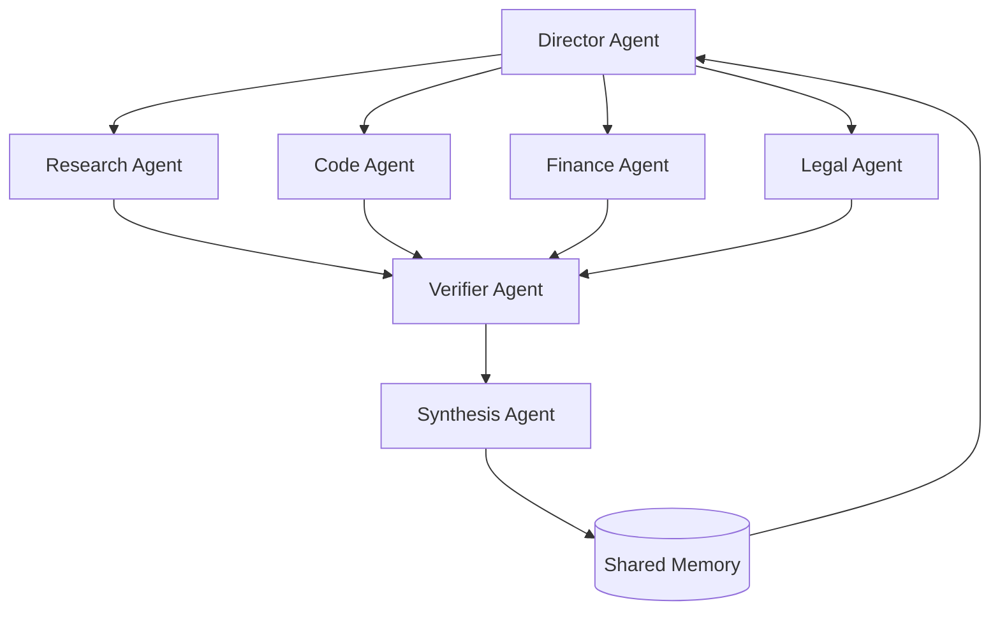

# 集体超级智能：为什么 CSI 将超越 AGI 和 ASI

整个 AI 行业都押注在同一个假设上：智能会以单一心智的形式扩展。把模型做得更大、训练得更久，最终就能达到 AGI（通用人工智能），也就是一个在通用性上比肩人类的单一人工心智。再往前推进，就是 ASI（超级人工智能），一个超越人类的单一心智。

我们认为这个框架从根本上是错的：不是因为模型不会变得更聪明，而是因为单一心智本就是错误的智能单位。人类历史上出现过的最强大的智能，从来都不是个体，而是集体。没有哪个人独自设计出了现代经济、独自发现了全部科学知识、或独自建造了互联网。在任何真正重要的尺度上，文明总是胜过天才。

机器也将遵循同样的规律。**集体超级智能（Collective Superintelligence，简称 CSI）**，即由大量专业化智能体组成的网络，彼此推理、协调、相互纠错，将在智能与能力上全面超越 AGI，同时创造远超其上的经济价值。而且与 AGI 不同的是，你不必等待它的出现，构建它所需的基础组件今天就已经存在。

## CSI 究竟是什么

集体超级智能不是"同一个聊天机器人的许多份拷贝"。它是一种架构：由异构的智能体组成，每个智能体专精于某一领域，通过明确的协调结构（层级、辩论、流水线、市场机制）连接在一起，拥有共享记忆和明确的分工。这个系统的智能，一半体现在单个智能体身上，另一半则体现在它们之间的*拓扑结构*中。

无论规模多大，单一模型终究是一个推理者，只有一个上下文、一套权重、一个失败域。而集体是一种完全不同性质的对象，它的胜出源于结构性原因，这是任何单模型规模扩张都无法弥补的。

## 五大结构性优势

### 1. 并行性：集体可以同时处理一切

单一模型（即便是超级智能模型）在本质上是串行的。它一次只能专注一个问题，其吞吐量受限于单一的推理流。把一万个问题排队丢给一个 AGI，你得到的只是一支非常聪明的队伍。

集体没有这样的天花板。一万个智能体可以同时推进一万项任务（研究市场、审查代码、监控基础设施、谈判合同），只在工作产生交集时才彼此协调。无法同时出现在多处的智能，在经济上必然输给能够做到这一点的智能。工作量是随智能体数量做水平扩展的，而不是随单一心智的规模做垂直扩展。

### 2. 推理能力：多个心智相互叠加，单一心智则会停滞

单一模型的推理，只是对单一视角的一次遍历。它会过早锚定，无法真正地自我质疑，其错误对它自身而言是不可见的，毕竟一套权重内部不存在"第二意见"。

集体的推理方式则不同。一个智能体提出方案，另一个发起挑战，第三个负责验证，第四个进行综合。多数投票机制能够抑制个别幻觉；辩论能够揭示隐藏假设；反思循环能在错误向下游传导、不断累积之前就将其拦截。这正是同行评审优于任何单一评审人、市场比任何单一交易者更聪明的底层机制：独立的视角加上结构化的聚合方式，能够得出任何单一参与者都无法独立触及的结论。集体的推理能力，并不是其成员能力的最大值，而是其多样性与协调结构的函数。

### 3. 容错性：没有单点故障

AGI 是终极的单点故障。一个心智产生幻觉、一个心智出现对齐偏差、一个心智离线，建立在它之上的一切都会静悄悄地、彻底地继承这个失败。

而集体的失败方式更像互联网：局部化、可被检测、可被恢复。一个智能体产出了糟糕的结果，验证者会将其捕获，任务随即被重新路由给另一个同伴；一个节点宕机，蜂群会重新分配它的工作。可靠性不再是一种你只能寄希望于模型具备的属性，而变成了你可以*工程化地*构建进拓扑结构中的属性：冗余、交叉校验、优雅降级。你无法在一个会彻底失败的系统之上构建文明级的基础设施，但可以在一个会像网络那样失败的系统之上构建它。

### 4. 记忆：分布式、持久化，且实际上没有上限

单一模型的工作记忆就是它的上下文窗口，而任何上下文窗口都不可能装下一整个企业。窗口之外的一切，都必须被压缩、被检索，或被遗忘。

集体的记忆则是架构层面的。每个智能体为自己所属的领域维护深度状态；共享记忆层承载着整个群体所知道的信息；RAG 系统和数据库则可以无限延伸其记忆的边界。集体的总记忆是所有成员记忆之*总和*，再加上它们彼此共享的一切。这些记忆自然地按照专业分工分片存储，就像一家公司的组织知识分散存在于员工、文档和系统之中，而非集中于某一个人的大脑。集体不会因为上下文窗口滚动而遗忘。

### 5. 专业化：专家在每一件事上都胜过通才

按定义，AGI 是一个通才：什么都会一点，但没有一项是绝对领先的。然而，我们所知的每一个高性能系统，都是由专家组成的。你不会想让心脏科医生来帮你起草法律合同。

在一个集体中，每个智能体都针对一件事进行了精细调优：某个领域的专业术语、某种监管制度、某个代码库、某个客户。在各自的领域内，专家个体比任何通才都更便宜、更快速、更精准，而组合方式则完成了剩下的工作。集体能够*同时*在每一项任务上都占据主导地位，因为"集体"从来都不是一个被拉伸去覆盖所有领域的单一心智，而是在拓扑结构中每一个恰当的位置，永远配备着恰当的专家。

## AGI 与 CSI：逐维度对比

| 维度 | AGI（单一心智） | CSI（多智能体协同） |
| --- | --- | --- |
| 吞吐量 | 串行：一次只处理一个问题 | 并行：同时处理成千上万项任务 |
| 推理方式 | 单一视角，无法自察 | 辩论、验证、聚合 |
| 失败模式 | 彻底、无声、相关联 | 局部、可检测、可恢复 |
| 记忆 | 单一上下文窗口 | 分布式，实际上没有上限 |
| 专业能力 | 万事通才 | 每件事都有专精 |
| 扩展方式 | 垂直：模型做得更大 | 水平：智能体更多，拓扑更优 |
| 可用性 | 一个研究里程碑 | 今天就可以部署 |

## 经济学：为什么 CSI 创造的价值远超以往

经济价值来自于被完成的工作，而工作的结构本身就是集体性的。一个经济体从来不是一项任务，而是数以百万计的、并发的、专业化的、相互依赖的任务。这种形态与蜂群式协作相匹配，而非与单一心智相匹配。

一个被定价为智能巅峰、供给稀缺的单一 AGI，本质上是一个你只能租用的瓶颈。而集体则是一个你可以持续做大的经济体：在需求增长的地方增加智能体，在利润最丰厚的地方进行专业化配置，把它们连接成流水线，让价值在每一个环节上不断叠加复利。边际产能的成本只是多一个智能体，而不是多跑一次训练。而且由于每个专家个体规模小、成本低，整个集体能够以商品化的单位经济成本，交付出超越人类水平的*系统级*性能。

这也正是智能体经济诞生的方式：智能体之间相互采购、相互销售、彼此构建，在开放市场中发现提示词、工具和其他智能体。一个网络的价值随参与者数量的平方增长；而一个心智的价值，无论多么深邃，充其量只能线性增长。

## ASI 也无法回避这一论证

常见的反驳是：ASI（一个比全人类总和还要聪明的单一心智）会让上述一切都变得无关紧要。但事实并非如此，原因很简单：**以上每一条论证都是结构性的，而非关于模型质量的论断。**无论某个时代最强的单一心智是什么样子，由处于同等水平的多个心智组成的协同集体，都必然更加强大：更并行、更容错、更专业化，拥有更多记忆。如果 ASI 真的出现，那么 ASI 最强的形态，也必然是*它们组成的集体*。能力的天花板永远在于网络，而不在于单个节点。CSI 并非 ASI 的竞争对手，而是任何超级智能一旦需要在现实世界中大规模行动时，必然会演化成的形态。

这里还存在一个现实层面的不对称：AGI 和 ASI 是预测，而 CSI 是一门工程学科。编排拓扑、智能体间通信、共享记忆、验证层，这些都是你今天就能构建、衡量、迭代改进的系统，并且会随着底层每一代新模型的进步而不断叠加复利。更强的模型不会让集体变得过时，只会让集体中的每一个节点变得更强。

## 今天就开始构建 CSI

这正是 Swarms 所依托的核心理念。我们技术栈中的每一部分，都是构建集体智能的基础组件：

- **[Swarms 框架](/framework)**：将 15 种以上的编排架构（层级化蜂群、混合智能体、群聊、图工作流、多数投票）作为一等公民原语提供，同时支持 Python 和 Rust。
- **Swarms Cloud**：一个托管运行时环境，让你无需管理基础设施即可部署和扩展蜂群系统。
- **[Marketplace 市场](https://swarms.world)**：在这里，专业化的智能体、提示词和工具汇聚成一个经济体：可发现、可组合、可交易。

通往 AGI 的竞赛，是一场构建单一心智的竞赛。而我们正在构建的是另一种东西：那个始终笑到最后的东西。

**我们正在招聘，一起构建 CSI。**欢迎加入我们的研究团队：[swarms.ai/hiring](/hiring)

加入 Swarms，让我们一起构建 CSI：[swarms.ai](https://swarms.ai) · [GitHub](https://github.com/kyegomez/swarms) · [Discord](https://discord.gg/EamjgSaEQf)
