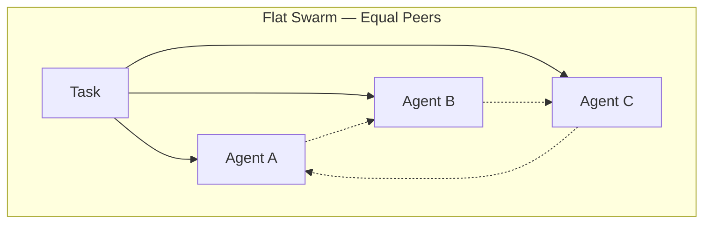
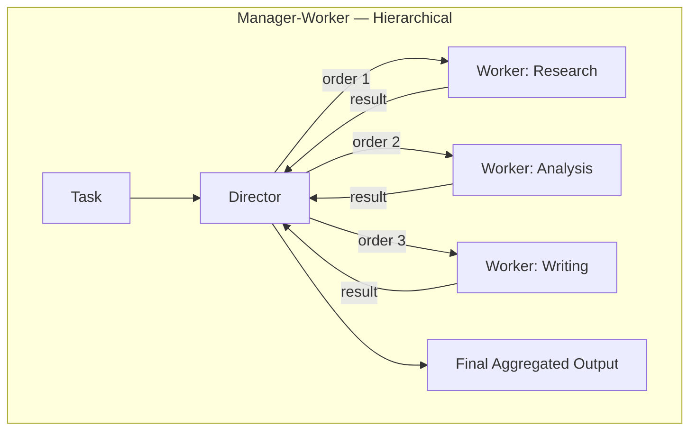
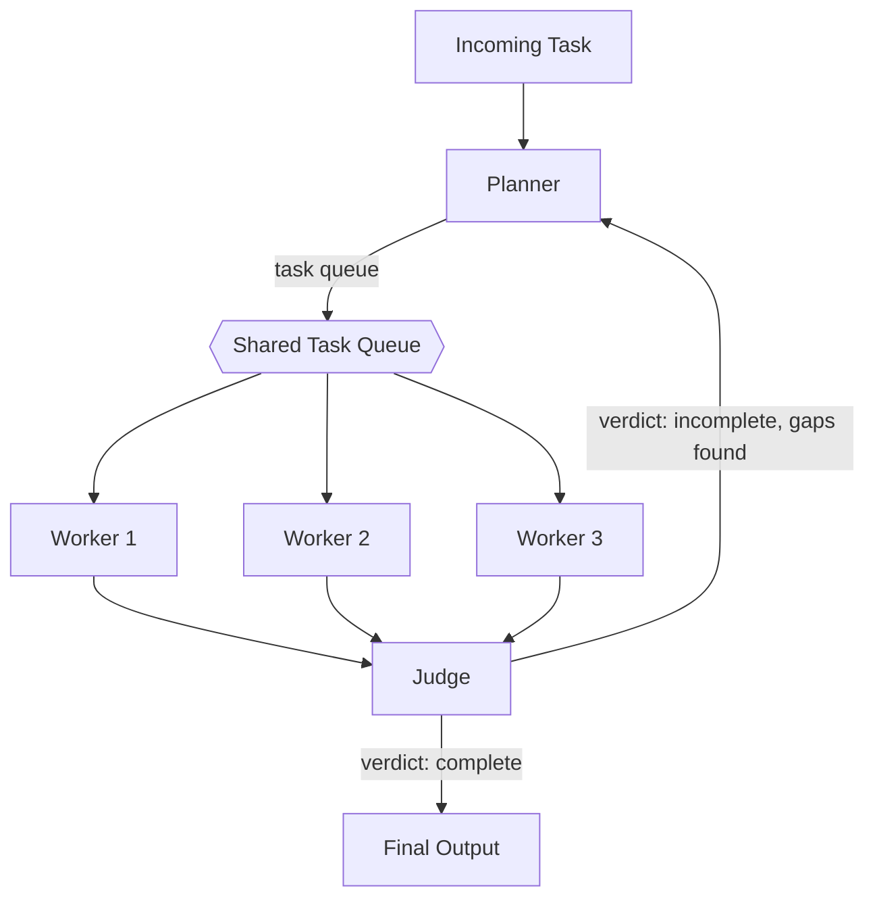

# 经理—执行者智能体架构：一份实用入门

给一个智能体一个宽泛、开放式的任务和一个很大的上下文窗口，它通常会尝试独自搞定一切：调研、分析、写作，全部在一次长时间运行中、以同一种"声音"完成。对于小任务，这样做没问题。但一旦任务包含多个需要不同专长、不同工具，或者真正需要独立执行的子问题，这种做法就会崩溃，因为单个智能体没办法同时处理问题的多条线索，也无法把"想清楚该做什么"和"实际去做"这两件事分开。

经理—执行者架构（Manager-Worker Architecture），有时也叫主管—执行者（Director-Worker）或层级模式（Hierarchical Pattern），通过把任务拆分成两种截然不同的角色来解决这个问题：一个负责规划与分配的智能体，以及一组负责执行的智能体。这篇文章讨论的是这种拆分——谁向谁汇报、任务如何在层级结构中流转的拓扑关系，而不是底层的消息传递机制。如果你想了解智能体之间实际传递结构化消息的细节，请参阅[《智能体间高级通信协议》](/blog/agent-communication-protocols)。本文假定那一层已经存在，重点探讨一个不同的问题：谁来决定要做哪些工作，以及由谁去做。

## 经理智能体到底做什么

"经理（Manager）"这个词承载了很多含义，值得说清楚它具体的职责。在 Swarms 的 `HierarchicalSwarm` 中，经理这一角色被称为**主管（Director）**，它有四项明确的职责：

1. **任务分解（Decomposition）。** 主管读取传入的任务，把它拆解成能够对应到可用执行智能体的具体子任务。
2. **任务分配（Delegation）。** 它把每个子任务分配给特定的执行智能体，产出的是一份结构化的计划，而不是含糊的指令。
3. **结果汇总（Aggregation）。** 执行智能体完成任务后，输出会返回给主管，而不是彼此之间传递。主管是唯一能看到全貌的智能体。
4. **评判（Judging，可选）。** 主管本身，或另设的评判智能体，可以评估汇总后的结果是否真正满足了原始任务的要求，如果不满足，可以再发起一轮。

具体来说，主管并不只是输出一段自由文本。它会生成一个结构化的 `SwarmSpec` 对象，其中包含一份 `plan`（用自然语言描述的整体策略），以及一组 `HierarchicalOrder` 对象，每一个都把某个具体执行智能体的名字与它被要求完成的具体任务配对起来。正是这种结构让整个模式变得可靠：任务分配是一个明确的、可检查的数据结构，而不是隐藏在提示词里的一种默认假设。

这和一群地位平等的智能体组成的扁平蜂群（Flat Swarm）有着实质性的不同。在 `ConcurrentWorkflow` 或轮询式讨论中，每个智能体看到的输入大致相同，并以平等的身份贡献自己的意见。没有哪个智能体单独负责判断问题真正应该如何分解，也没有一个统一的关口来检查最终输出是否符合最初的要求。经理—执行者拓扑结构补上的正是这一点：一个能纵览全局的角色，并对最终结果负责。

## 经理—执行者架构 vs. 扁平蜂群





在扁平蜂群中，每个智能体都要和其他所有智能体对话，没有谁对最终结果单独负责。在层级化蜂群中，执行智能体彼此之间完全不需要知道对方的存在，它们只需要知道自己被分配到的子任务。这是一种实实在在的简化：在层级化版本里新增第四个专职智能体，只需要从主管那里多拉一条边；而在扁平版本里新增第四个平级智能体，意味着已有的每一个智能体都可能需要考虑房间里多出的这一个声音。

## 实例演练：拆解一个研究任务

假设任务是"撰写一份关于企业级电动汽车充电行业的市场报告"。如果交给单个智能体，它会一口气产出一份未经区分的调研、分析和写作的混合体。而如果交给主管，任务会在一开始就被拆分：

```python
from swarms import Agent
from swarms.structs.hiearchical_swarm import HierarchicalSwarm

research_agent = Agent(
    agent_name="Research-Agent",
    agent_description="Gathers market data, competitor landscape, and regulatory context.",
    model_name="gpt-5.4",
    max_loops=1,
)

analysis_agent = Agent(
    agent_name="Analysis-Agent",
    agent_description="Analyzes gathered data for trends, risks, and opportunities.",
    model_name="gpt-5.4",
    max_loops=1,
)

writing_agent = Agent(
    agent_name="Writing-Agent",
    agent_description="Synthesizes research and analysis into a structured report.",
    model_name="gpt-5.4",
    max_loops=1,
)

swarm = HierarchicalSwarm(
    name="Market-Report-Team",
    description="Director-led research pipeline for market reports",
    agents=[research_agent, analysis_agent, writing_agent],
    max_loops=2,
    planning_enabled=True,
    parallel_execution=True,
)

result = swarm.run(
    task="Produce a market report on the enterprise EV charging industry."
)
```

在底层，`swarm.run()` 通过一次 `step()` 来驱动主管：主管读取任务，生成一个 `SwarmSpec`，其中包含类似"收集当前市场规模、主要参与者和监管背景"这样给调研智能体的子任务，以及"将调研结果综合成一份带有执行摘要的结构化报告"这样给写作智能体的子任务，并把它们作为 `HierarchicalOrder` 分派出去。由于默认 `parallel_execution=True`，相互独立的指令会并发执行而不是彼此等待，因此调研工作和任何独立的分析工作可以同时进行，而不必串行排队。

执行智能体完成各自狭窄的子任务后，把结果返回给主管，而不是返回给彼此，这一点很关键：写作智能体完全不需要去推断调研数据是如何收集来的，调研智能体也完全不需要知道后面还有一道写作工序。主管把这三份输出汇总起来，由于 `max_loops=2`，它可以先看一遍第一轮结果，判断分析部分内容单薄，然后发起第二轮指令，专门要求补齐这个缺口，之后再产出最终的综合报告。

## 加入评判者：规划者—执行者—评判者模式

对于质量控制比"主管简单回读自己手下执行智能体的输出"更重要的任务，Swarms 提供了一个相关模式，`PlannerWorkerSwarm`，它把整个循环拆成三个明确的阶段，而不是两个：规划者（Planner）把目标分解成一个按优先级排列的任务队列，执行智能体从这个共享队列中并发地领取并执行任务，另设的评判智能体（Judge）对汇总结果打分，并决定是否需要再来一轮。



评判智能体的输出是一个 `CycleVerdict`，它会明确说明一轮循环通过或未通过的原因：一个是否完成的标记、一个 0 到 10 的质量评分、一份已识别缺口的清单，以及给下一轮规划的后续指示。回传给规划者的是这样一份明确的判定结果，而不是一句含糊的"再试一次"。这里有一个值得注意的设计约束：执行智能体通过原子操作从队列中领取任务，彼此之间从不直接协调，文档中特别指出这是为了避免智能体之间发生死锁。所有的协调逻辑都放在规划者和评判者这两个角色里，执行智能体则保持简单，彼此之间不持有状态，这与前面那张图里"问题由下向上升级、而不是与同级横向解决"的思路是一致的。

## 什么时候值得引入这份复杂度

经理—执行者拓扑结构不是没有代价的。它增加了一个需要每一轮都运行、提示、并且（通常）为其付费的主管智能体，也为规划和汇总步骤增加了延迟，而单个智能体完全不需要这些步骤。当以下大多数条件成立时，这种模式才值得采用：

- **任务确实存在明显不同的子问题**，能从不同的系统提示词、工具或模型中受益，而不只是"重复做同一类事情"。
- **子任务可以独立运行**，因此并行分派真正能节省实际耗时，而不只是徒增开销。
- **最终输出需要对照最初的需求做一次检查**才能交付，而不是盲目信任链条中最后一个智能体恰好产出的内容。
- **工作的形态事先并不完全明确**，因此无法手写一个固定的执行序列，需要有角色在运行时决定计划。

如果以上都不成立，任务实际上就是"第一步产出第二步的输入"这么简单，那么一个普通的顺序工作流在推理上更简单，运行成本也更低。如果子任务是独立的，但不需要规划或汇总步骤，`ConcurrentWorkflow` 就能在不引入主管的情况下带来并行能力。经理—执行者模式真正物有所值的场景，是你需要一个单一的、负责任的角色来决定要做哪些工作、并评判结果是否足够好，而不仅仅是把更多智能体并行堆在一起。关于层级模式相对于顺序和并发工作流的更全面定位，可参阅[《智能体编排模式》](/blog/agent-orchestration-patterns)；至于更基础的问题——你是否真的需要不止一个智能体——可参阅[《单智能体 vs. 多智能体系统》](/blog/single-agent-vs-multi-agent)。

## 链接与资源

| 资源 | 链接 |
| --- | --- |
| HierarchicalSwarm 架构总览 | [docs.swarms.world/architectures/hierarchical-swarm](https://docs.swarms.world/architectures/hierarchical-swarm) |
| HierarchicalSwarm API 参考 | [docs.swarms.world/api/hierarchical-swarm](https://docs.swarms.world/api/hierarchical-swarm) |
| PlannerWorkerSwarm API 参考 | [docs.swarms.world/api/planner-worker-swarm](https://docs.swarms.world/api/planner-worker-swarm) |
| 智能体间通信协议 | [/blog/agent-communication-protocols](/blog/agent-communication-protocols) |
| 智能体编排模式 | [/blog/agent-orchestration-patterns](/blog/agent-orchestration-patterns) |
| 官方文档 | [docs.swarms.ai](https://docs.swarms.ai) |
| Discord 社区 | [discord.gg/VapjxpSyHC](https://discord.gg/VapjxpSyHC) |

---

*有问题或反馈？欢迎加入我们的 [Discord 社区](https://discord.gg/VapjxpSyHC)，或查阅[官方文档](https://docs.swarms.ai)。*
