# 从 LangGraph 迁移到 Swarms：一份实操指南

LangGraph 和 Swarms GraphWorkflow 用同一种方式描述智能体流水线：由有向边连接起来的节点。两者的差别在于节点是什么、状态如何在节点之间流动，以及执行一张图要付出多少开销。本指南先讲 GraphWorkflow 如何运行一张图，再把 LangGraph 的概念对应过去，然后用两者分别实现十四种常见模式，每种都有示意图、可运行代码，以及变化之处的说明。最后是逐项功能对比、成本模型、迁移清单和常见问题。

## 实测依据

[GraphWorkflow 系统论文](/zh/blog/graphworkflow-research-paper)把 GraphWorkflow 执行引擎与 LangGraph 1.0.4 正面对比，覆盖 5 种拓扑、10 到 200 个节点，共 15 组拓扑与规模配置。

| 测量项 | GraphWorkflow 相对 LangGraph 1.0.4 |
| --- | --- |
| 已编译图的执行，15 组配置的几何平均 | 快 7.0 倍 |
| 200 节点链式图 | 快 62.5 倍（0.29 毫秒对 18.15 毫秒） |
| 浅而宽的图 | 快 2.7 到 4 倍 |
| 图编译 | 快 21.6 到 31.3 倍 |
| 冷启动的构建、编译、执行全路径 | 快 7.9 倍 |

每个数字都是 9 次采样的中位数并带 95% 置信区间。完整测试工具、原始采样数据和分析流程[均已公开](https://github.com/The-Swarm-Corporation/GraphWorkflow-Paper/tree/main/benchmarks)，因此你可以在动手迁移任何一行代码之前，先在自己的硬件上跑一遍整套测试。测试中的每个节点都是空操作函数，所以测到的每一微秒都是框架开销，其中没有任何模型延迟。在真实流水线里，模型调用占据了绝大部分耗时；框架开销在高请求量、深图和冷启动时最为关键。

### 为什么差距随深度扩大

从 2.7 倍到 62.5 倍的跨度，直接来自两种架构的差异。

LangGraph 运行在 Pregel 风格的超步循环上，配合基于通道的状态、reducer 函数，以及每一步都会被查询的检查点钩子。这套机制在每次运行时重新推导，并摊到每个节点头上，无论你的工作流是否用到了环、条件边或持久化执行。论文把它在链式图上的成本定价为每个超步约 90 微秒，而一个单系数的按节点模型能以约每节点 107 微秒拟合 LangGraph 的整个测试网格，R 方达到 0.97。成本随步数增长，因此它会随深度累积。

GraphWorkflow 只编译一次。入口与出口从节点度数推断，拓扑分层用 Kahn 算法计算，邻接表一次遍历物化，然后固化出一份逐层执行计划，其中每个节点都已预先解析。运行循环随后只是扫过一个预先算好的列表，单节点层在调用线程上就地执行，省去一次队列交接。编译产物带显式失效机制地缓存，因此重复运行只会付一次编译成本。

浅图没有多少层可供摊销，收益因此有限。深图有上百层，而 LangGraph 要在每一层上付出超步开销。把那张 200 节点链式图跑一千次，累计编排开销大约是 GraphWorkflow 的 0.3 秒对 LangGraph 的 18.2 秒。

论文对适用范围说得很明确：这项对比覆盖的是静态 DAG。需要环或条件边的图，正是 LangGraph 每一步的机制换来 GraphWorkflow 所没有的能力的地方，下文的对比部分会为每种情况给出 GraphWorkflow 的做法。

## GraphWorkflow 如何工作

GraphWorkflow 是一张由智能体组成的有向无环图。

- **节点就是智能体。** 每个智能体的 `agent_name` 就是它的节点 ID，因此名称必须唯一。每个节点都有自己的 `system_prompt`、`model_name` 和生成参数。
- **边是字典。** `{"source": "A", "target": "B"}`，外加一个可选的自由格式 `metadata` 字典。每个 `source` 和 `target` 都必须与某个 `agent_name` 完全一致，否则请求返回 400。`["A", "B"]` 这类列表或元组简写会在请求校验阶段返回 422。
- **边界是显式的。** `entry_points` 列出执行开始的节点，`end_points` 列出执行结束的节点。文档建议始终同时设置两者。
- **编译是自动的。** 在 `auto_compile` 开启时（默认开启），图会在运行前被校验并编译成一份逐层执行计划。

图运行时，入口智能体从 `task` 开始。编译器把节点分成若干层，同一层中的每个节点并发运行。一个有多个父节点的节点，会等所有父节点都完成后才运行，它们的输出会加入它的上下文：分支并行运行，并在两条边汇入同一节点的地方重新汇合。节点接收的是其直接父节点的输出，所以如果后面的某个节点需要更早节点的产出，就从那个更早的节点画一条边过去。

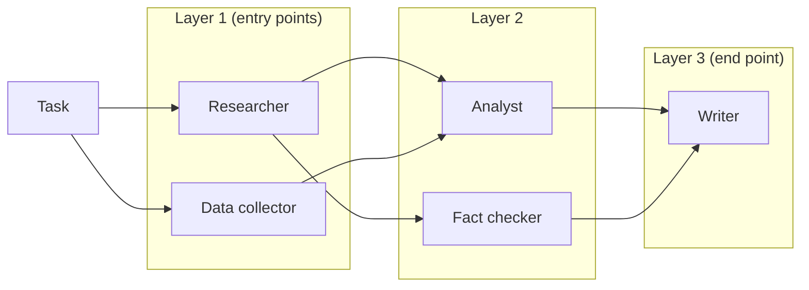

在这张图里，研究员和数据收集员一起运行；分析员和事实核查员在父节点完成后一起运行；写作者最后运行，上下文里包含前两者的输出。

### 请求

`POST https://api.swarms.world/v1/graph-workflow/completions`，用 `x-api-key` 请求头认证。

| 字段 | 类型 | 默认值 | 用途 |
| --- | --- | --- | --- |
| `name` | 字符串 | 无 | 工作流的标识 |
| `description` | 字符串 | 无 | 工作流的用途 |
| `agents` | AgentSpec 列表 | 必填 | 节点 |
| `edges` | 边字典列表 | 无 | `source`、`target`，以及可选的 `metadata` |
| `entry_points` | 字符串列表 | 无 | 执行开始处的智能体名称 |
| `end_points` | 字符串列表 | 无 | 执行结束处的智能体名称 |
| `task` | 字符串 | 无 | 工作流处理的输入 |
| `max_loops` | 整数 | 1 | 工作流的最大执行轮数 |
| `img` | 字符串 | 无 | 供视觉模型使用的可选图片 URL |
| `auto_compile` | 布尔值 | true | 运行前编译图 |
| `verbose` | 布尔值 | false | 详细日志 |

最常用的 AgentSpec 字段有 `agent_name`、`system_prompt`、`model_name`（默认 `claude-sonnet-5`）、`fallback_models` 和 `fallback_model_name`、`max_tokens`（默认 16,000）、`temperature`、`max_loops`、`reasoning_effort`，以及用来给节点接入某个 MCP 服务器工具的 `mcp_url`。

### 响应

每个节点的输出都会返回，以智能体名称为键，外加一个扁平的用量块：

```json
{
  "job_id": "graph-workflow-abc123xyz",
  "name": "Research-Analysis-Workflow",
  "description": "A simple sequential workflow for research and analysis",
  "status": "success",
  "outputs": {
    "ResearchAgent": "Research findings on AI trends...",
    "AnalysisAgent": "Analysis of research findings..."
  },
  "usage": {
    "input_tokens": 1250,
    "output_tokens": 3200,
    "total_tokens": 4450,
    "total_cost": 0.087325,
    "cost_per_agent": 0.02
  },
  "timestamp": "2024-01-15T10:30:45.123456+00:00"
}
```

### 套餐、限额与超时

Graph Workflow 端点面向 Pro、Ultra 和 Premium 套餐开放；免费档密钥会收到 403。高级密钥每分钟 2,000 次、每小时 10,000 次、每天 100,000 次请求，额度信息在 `X-RateLimit-*` 响应头中返回。模型调用让图的运行时间较长，因此请按图的规模设置客户端超时：文档建议简单工作流 300 秒，中等 600 秒，复杂的 900 秒或更长。

### 同一个引擎，在框架中

API 运行的正是基准测试所测的那个 `GraphWorkflow` 引擎，它也随开源框架一起发布（`pip install swarms`），可以在你自己的进程中运行图：

```python
from swarms import Agent, GraphWorkflow

wf = GraphWorkflow(auto_compile=True)
for name in ["research", "summarize", "critique", "editor"]:
    wf.add_node(Agent(agent_name=name, model_name="gpt-4.1", max_loops=1))

wf.add_edge("research", "summarize")
wf.add_edge("research", "critique")
wf.add_edge("summarize", "editor")
wf.add_edge("critique", "editor")

wf.set_entry_points(["research"])
wf.set_end_points(["editor"])

results = wf.run(task="Assess the market for solid-state batteries.")
print(results["editor"])
```

本指南其余部分都使用 API 形式。

### 所有示例共用的准备代码

三个小辅助函数让各个模式更易读。先定义一次：

```python
import os

import httpx

BASE_URL = "https://api.swarms.world"
HEADERS = {
    "x-api-key": os.environ["SWARMS_API_KEY"],
    "Content-Type": "application/json",
}


def agent(name, prompt, model="claude-sonnet-5", **extra):
    """One graph node."""
    return {
        "agent_name": name,
        "system_prompt": prompt,
        "model_name": model,
        "max_loops": 1,
        **extra,
    }


def edge(source, target, **metadata):
    """One directed edge, with optional metadata tags."""
    e = {"source": source, "target": target}
    if metadata:
        e["metadata"] = metadata
    return e


def run_graph(name, task, agents, edges, entry_points, end_points):
    """POST /v1/graph-workflow/completions and return the parsed JSON."""
    response = httpx.post(
        f"{BASE_URL}/v1/graph-workflow/completions",
        headers=HEADERS,
        json={
            "name": name,
            "task": task,
            "agents": agents,
            "edges": edges,
            "entry_points": entry_points,
            "end_points": end_points,
            "max_loops": 1,
            "auto_compile": True,
        },
        timeout=900.0,
    )
    response.raise_for_status()
    return response.json()
```

LangGraph 示例共用这段准备代码：

```python
from operator import add
from typing import Annotated, Literal

from langchain_openai import ChatOpenAI
from langgraph.graph import END, START, StateGraph
from pydantic import BaseModel
from typing_extensions import TypedDict

llm = ChatOpenAI(model="gpt-4.1")
```

## 概念对照

| LangGraph | GraphWorkflow | 说明 |
| --- | --- | --- |
| `StateGraph(State)` | `POST /v1/graph-workflow/completions` 的 JSON 请求体 | 无需声明状态 schema |
| `add_node("name", fn)` | `agents` 中的一项 | `agent_name` 是节点 ID；节点是带提示词和模型的智能体 |
| `add_edge("a", "b")` | `edges` 中的 `{"source": "a", "target": "b"}` | 只接受字典形式 |
| `add_edge(["a", "b"], "c")` | 两条指向 `c` 的边 | 有多个父节点的节点会等待全部父节点 |
| `START` | `entry_points` | 入口智能体从 `task` 开始 |
| `END` | `end_points` | 允许多个终点 |
| `.compile()` | `auto_compile: true`（默认） | 编译后的计划会被缓存 |
| `graph.invoke(inputs)` | POST 请求，输入放在 `task` 中 | |
| 状态键与 reducer | 以智能体名为键的 `outputs` | 每个节点把父节点的输出作为上下文 |
| `add_conditional_edges` | 在提示词中门控，或在你的代码里选择要提交的图 | 声明的每条边都会触发 |
| `Send`（map-reduce） | 在请求之前用 Python 生成节点 | 构造请求时列表长度已知 |
| 环与 `recursion_limit` | 展开的轮次，或在你的代码里重复运行 | GraphWorkflow 是无环的 |
| 检查点保存器与 `thread_id` | 你自己的存储，以 `job_id` 为键 | 每个请求都是无状态的 |
| `interrupt()` 与 `Command(resume=...)` | 两次图运行，中间是人工步骤 | |
| 把编译好的子图作为节点 | 一个返回智能体和边的 Python 函数 | 在提交前组合 |
| 每个节点一个聊天模型客户端 | 每个智能体一个 `model_name`，外加 `fallback_models` | 一把密钥覆盖所有厂商 |

简而言之：节点和边可以一对一平移，状态则直接消失，因为节点的输入由指向它的边决定。你的提示词可以原样沿用。

## 各种模式

下面每个模式都包含示意图、LangGraph 版本、GraphWorkflow 版本，以及变化之处的说明。

### 模式 1：线性流水线

研究喂给分析，分析喂给写作。

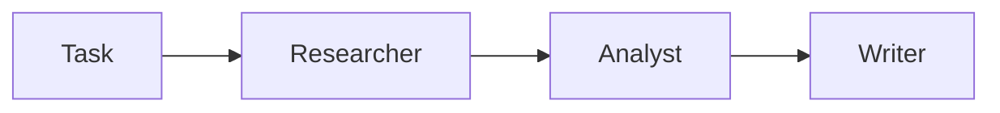

**LangGraph**

```python
class ChainState(TypedDict):
    task: str
    research: str
    analysis: str
    report: str


def research(state: ChainState):
    return {"research": llm.invoke(f"Research: {state['task']}").content}


def analyze(state: ChainState):
    return {"analysis": llm.invoke(f"Analyze:\n{state['research']}").content}


def write(state: ChainState):
    return {"report": llm.invoke(f"Write a brief from:\n{state['analysis']}").content}


builder = StateGraph(ChainState)
builder.add_node("research", research)
builder.add_node("analyze", analyze)
builder.add_node("write", write)
builder.add_edge(START, "research")
builder.add_edge("research", "analyze")
builder.add_edge("analyze", "write")
builder.add_edge("write", END)

graph = builder.compile()
print(graph.invoke({"task": "Assess the EV battery market"})["report"])
```

**GraphWorkflow**

```python
result = run_graph(
    "Research pipeline",
    "Assess the EV battery market",
    agents=[
        agent("Researcher", "Research the topic thoroughly and cite your sources."),
        agent("Analyst", "Analyze the research you receive and draw conclusions."),
        agent("Writer", "Write a one-page brief from the analysis you receive."),
    ],
    edges=[edge("Researcher", "Analyst"), edge("Analyst", "Writer")],
    entry_points=["Researcher"],
    end_points=["Writer"],
)
print(result["outputs"]["Writer"])
```

**变化之处：** 状态 schema、逐节点的 `llm.invoke`，以及 `START` 和 `END` 哨兵都消失了，每个节点的指令移进它的 `system_prompt`。

### 模式 2：扇出

一个节点产出初稿，多个节点并行处理它。每条分支都是一份交付物。

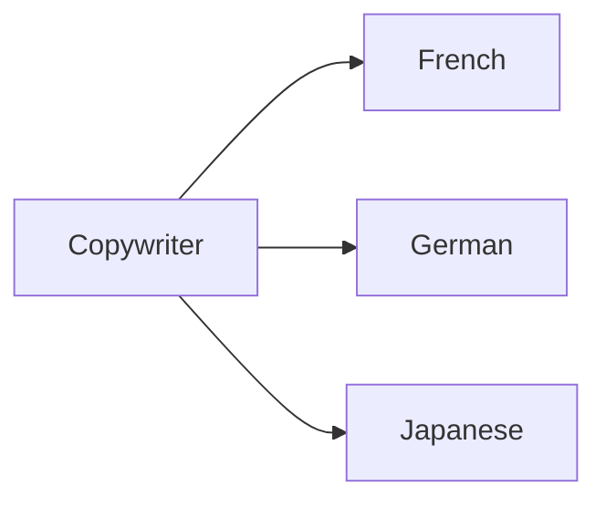

**LangGraph**

```python
class LocaleState(TypedDict):
    brief: str
    copy: str
    fr: str
    de: str
    ja: str


def copywriter(state: LocaleState):
    return {"copy": llm.invoke(f"Write launch copy for: {state['brief']}").content}


def translator(key: str, language: str):
    def node(state: LocaleState):
        return {key: llm.invoke(f"Translate into {language}:\n{state['copy']}").content}
    return node


builder = StateGraph(LocaleState)
builder.add_node("copywriter", copywriter)
builder.add_edge(START, "copywriter")
for key, language in [("fr", "French"), ("de", "German"), ("ja", "Japanese")]:
    builder.add_node(key, translator(key, language))
    builder.add_edge("copywriter", key)
    builder.add_edge(key, END)

graph = builder.compile()
out = graph.invoke({"brief": "A home battery that pays for itself in six years"})
print(out["fr"], out["de"], out["ja"])
```

**GraphWorkflow**

```python
languages = ["French", "German", "Japanese"]
translators = [
    agent(f"Translator-{lang}", f"Translate the copy you receive into {lang}. Keep the tone.", model="gpt-4.1-mini")
    for lang in languages
]

result = run_graph(
    "Localization fan-out",
    "Write launch copy for a home battery that pays for itself in six years.",
    agents=[agent("Copywriter", "Write short, concrete launch copy for the product.")] + translators,
    edges=[edge("Copywriter", t["agent_name"]) for t in translators],
    entry_points=["Copywriter"],
    end_points=[t["agent_name"] for t in translators],
)
for t in translators:
    print(result["outputs"][t["agent_name"]])
```

**变化之处：** 扇出就是为每个下游目标写一条边，它们共享同一个 `source`，每条分支都可以列为终点。分支可以使用比上游节点更便宜的模型。

### 模式 3：多入口扇入

几条相互独立的研究线同时开始，最终汇聚到一个综合节点。

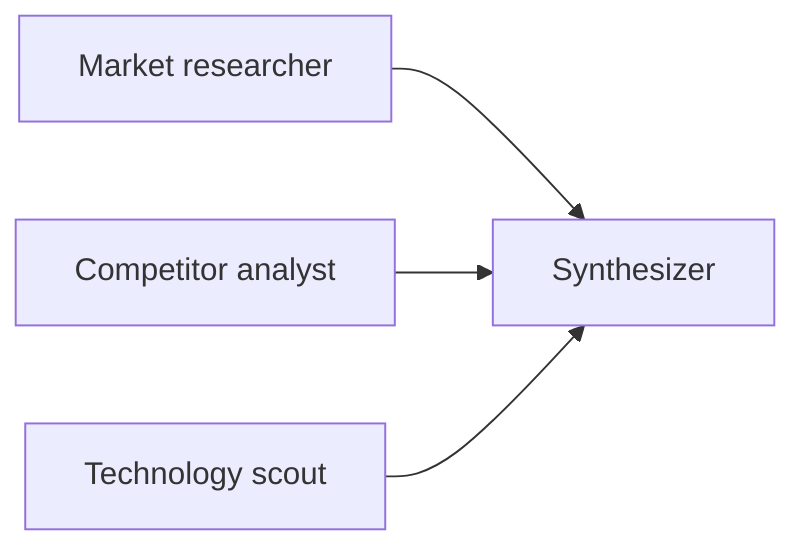

**LangGraph**

```python
class FanInState(TypedDict):
    topic: str
    notes: Annotated[list[str], add]
    report: str


def researcher(focus: str):
    def node(state: FanInState):
        return {"notes": [llm.invoke(f"Research {focus} for {state['topic']}").content]}
    return node


def synthesize(state: FanInState):
    return {"report": llm.invoke("Synthesize:\n\n" + "\n\n".join(state["notes"])).content}


builder = StateGraph(FanInState)
builder.add_node("synthesize", synthesize)
sources = {"market": "market trends", "competitors": "competitor strategies", "technology": "emerging technology"}
for name, focus in sources.items():
    builder.add_node(name, researcher(focus))
    builder.add_edge(START, name)
builder.add_edge(list(sources), "synthesize")
builder.add_edge("synthesize", END)

graph = builder.compile()
print(graph.invoke({"topic": "AI-powered SaaS"})["report"])
```

**GraphWorkflow**

```python
researchers = [
    agent("MarketResearcher", "Analyze market trends and identify opportunities."),
    agent("CompetitorAnalyst", "Analyze competitor strategies and market positioning."),
    agent("TechnologyScout", "Identify emerging technologies and innovations."),
]

result = run_graph(
    "Parallel research synthesis",
    "Strategic analysis of the AI-powered SaaS market",
    agents=researchers + [agent("StrategicSynthesizer", "Combine the research streams you receive into strategic insights.")],
    edges=[edge(r["agent_name"], "StrategicSynthesizer") for r in researchers],
    entry_points=[r["agent_name"] for r in researchers],
    end_points=["StrategicSynthesizer"],
)
print(result["outputs"]["StrategicSynthesizer"])
```

**变化之处：** LangGraph 需要一个 reducer（`Annotated[list, add]`），这样对同一个键的并行写入才会累积。在 GraphWorkflow 中，综合节点等待三个父节点完成，直接收到全部三份输出，不涉及任何 reducer。

### 模式 4：菱形（先扇出，再扇入）

一个研究员把结果交给两个并行的审阅者，编辑再把两者合并。

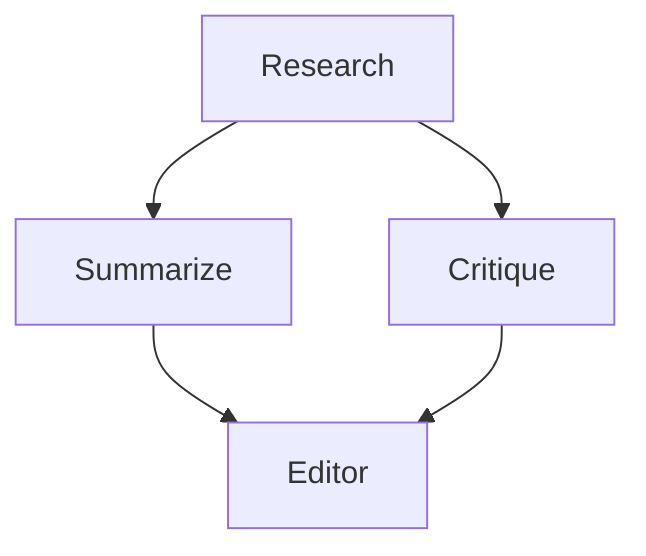

**LangGraph**

```python
class DiamondState(TypedDict):
    topic: str
    research: str
    reviews: Annotated[list[str], add]
    final: str


def research(state: DiamondState):
    return {"research": llm.invoke(f"Research {state['topic']}").content}


def summarize(state: DiamondState):
    return {"reviews": [llm.invoke(f"Summarize:\n{state['research']}").content]}


def critique(state: DiamondState):
    return {"reviews": [llm.invoke(f"Critique:\n{state['research']}").content]}


def editor(state: DiamondState):
    return {"final": llm.invoke("Write the final piece from:\n\n" + "\n\n".join(state["reviews"])).content}


builder = StateGraph(DiamondState)
for name, fn in [("research", research), ("summarize", summarize), ("critique", critique), ("editor", editor)]:
    builder.add_node(name, fn)
builder.add_edge(START, "research")
builder.add_edge("research", "summarize")
builder.add_edge("research", "critique")
builder.add_edge(["summarize", "critique"], "editor")
builder.add_edge("editor", END)

graph = builder.compile()
print(graph.invoke({"topic": "solid-state batteries"})["final"])
```

**GraphWorkflow**

```python
result = run_graph(
    "Diamond",
    "Assess the market for solid-state batteries.",
    agents=[
        agent("Research", "Research the topic and list the key facts with sources."),
        agent("Summarize", "Summarize the research you receive in ten bullets."),
        agent("Critique", "Find gaps, weak sources, and missing counterarguments in the research."),
        agent("Editor", "Write the final piece from the summary and the critique you receive."),
    ],
    edges=[
        edge("Research", "Summarize"),
        edge("Research", "Critique"),
        edge("Summarize", "Editor"),
        edge("Critique", "Editor"),
    ],
    entry_points=["Research"],
    end_points=["Editor"],
)
print(result["outputs"]["Editor"])
```

**变化之处：** 在两个框架中，这个形状都是四条边。GraphWorkflow 把 Summarize 和 Critique 放在同一层并发运行，编辑无需状态中的共享列表就能拿到两者的输出。

### 模式 5：分层全连接

每一层的每个节点都连向下一层的每个节点：收集员、分析员、校验员，最后是一个综合节点。这就是 Graph Workflow 文档中的三层结构。

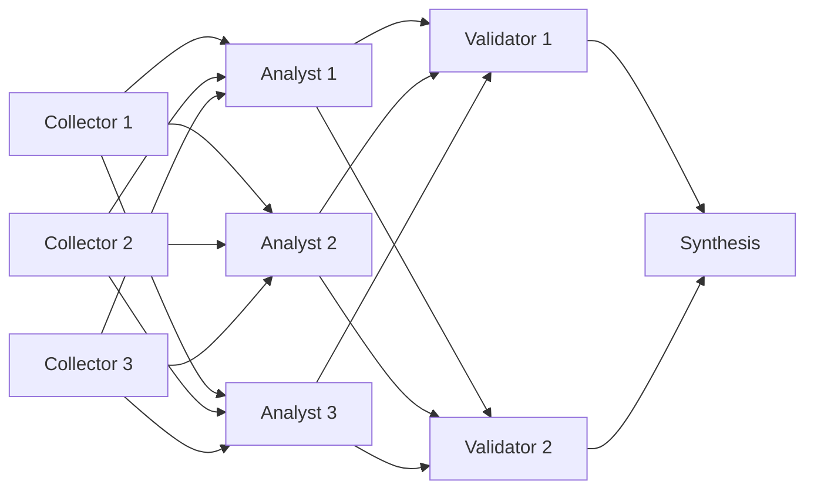

**LangGraph**

```python
class MeshState(TypedDict):
    topic: str
    data: Annotated[list[str], add]
    analyses: Annotated[list[str], add]
    validations: Annotated[list[str], add]
    report: str


def collector(i: int):
    def node(state: MeshState):
        return {"data": [llm.invoke(f"Collect data on {state['topic']} from source {i}").content]}
    return node


def analyst(i: int):
    def node(state: MeshState):
        return {"analyses": [llm.invoke(f"Analysis {i} of:\n" + "\n".join(state["data"])).content]}
    return node


def validator(i: int):
    def node(state: MeshState):
        return {"validations": [llm.invoke(f"Validation {i} of:\n" + "\n".join(state["analyses"])).content]}
    return node


def synthesis(state: MeshState):
    return {"report": llm.invoke("Final report from:\n" + "\n".join(state["validations"])).content}


builder = StateGraph(MeshState)
collectors = [f"collector_{i}" for i in range(1, 4)]
analysts = [f"analyst_{i}" for i in range(1, 4)]
validators = [f"validator_{i}" for i in range(1, 3)]
for i, name in enumerate(collectors, 1):
    builder.add_node(name, collector(i))
    builder.add_edge(START, name)
for i, name in enumerate(analysts, 1):
    builder.add_node(name, analyst(i))
for i, name in enumerate(validators, 1):
    builder.add_node(name, validator(i))
builder.add_node("synthesis", synthesis)
for a in analysts:
    builder.add_edge(collectors, a)
for v in validators:
    builder.add_edge(analysts, v)
builder.add_edge(validators, "synthesis")
builder.add_edge("synthesis", END)

graph = builder.compile()
print(graph.invoke({"topic": "renewable energy markets"})["report"])
```

**GraphWorkflow**

```python
collectors = [agent(f"DataCollector{i}", f"Gather data on the topic from source {i}.", model="gpt-4.1-mini") for i in range(1, 4)]
analysts = [agent(f"Analyst{i}", "Analyze the data you receive and extract key insights.") for i in range(1, 4)]
validators = [agent(f"Validator{i}", "Check the analyses you receive for accuracy and completeness.") for i in range(1, 3)]
synthesis = agent("SynthesisAgent", "Combine the validated analyses you receive into a final report.")


def all_to_all(sources, targets):
    return [edge(s["agent_name"], t["agent_name"]) for s in sources for t in targets]


result = run_graph(
    "Layered mesh",
    "Research renewable energy markets: collect, analyze, validate, synthesize.",
    agents=collectors + analysts + validators + [synthesis],
    edges=all_to_all(collectors, analysts) + all_to_all(analysts, validators) + all_to_all(validators, [synthesis]),
    entry_points=[c["agent_name"] for c in collectors],
    end_points=["SynthesisAgent"],
)
print(result["outputs"]["SynthesisAgent"])
print(result["usage"]["cost_per_agent"])  # 9 agents x $0.01
```

**变化之处：** 17 条边由一个辅助函数生成，编译器把这张网变成四层并发节点。由于每个节点的输出都在 `outputs` 中，运行结束后你可以审查任意一个分析员或校验员。

### 模式 6：多入口、多出口 DAG

三份相互独立的评审同时开始，整张图从它们的不同子集中产出两份交付物。

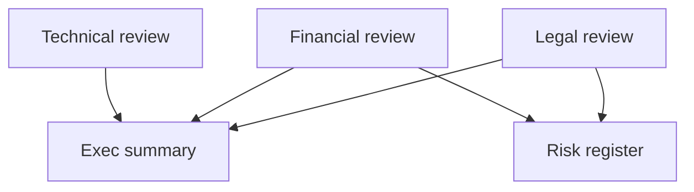

**LangGraph**

```python
class DealState(TypedDict):
    deal: str
    legal: str
    financial: str
    technical: str
    summary: str
    risks: str


def review(key: str, focus: str):
    def node(state: DealState):
        return {key: llm.invoke(f"{focus} review of this deal: {state['deal']}").content}
    return node


def summary(state: DealState):
    notes = f"{state['legal']}\n\n{state['financial']}\n\n{state['technical']}"
    return {"summary": llm.invoke(f"Executive summary:\n{notes}").content}


def risks(state: DealState):
    return {"risks": llm.invoke(f"Risk register:\n{state['legal']}\n\n{state['financial']}").content}


builder = StateGraph(DealState)
for key, focus in [("legal", "Legal"), ("financial", "Financial"), ("technical", "Technical")]:
    builder.add_node(key, review(key, focus))
    builder.add_edge(START, key)
builder.add_node("summary", summary)
builder.add_node("risks", risks)
builder.add_edge(["legal", "financial", "technical"], "summary")
builder.add_edge(["legal", "financial"], "risks")
builder.add_edge("summary", END)
builder.add_edge("risks", END)

graph = builder.compile()
out = graph.invoke({"deal": "Acquisition of a 40-person robotics startup"})
print(out["summary"], out["risks"])
```

**GraphWorkflow**

```python
result = run_graph(
    "Deal review",
    "Acquisition of a 40-person robotics startup",
    agents=[
        agent("Legal", "Review the deal for legal exposure."),
        agent("Financial", "Review the deal's valuation and financial risk.", model="gpt-4.1"),
        agent("Technical", "Review the target's technology and team.", model="gpt-4.1"),
        agent("ExecSummary", "Write a one-page executive summary from the reviews you receive."),
        agent("RiskRegister", "Build a risk register table from the reviews you receive."),
    ],
    edges=[
        edge("Legal", "ExecSummary"),
        edge("Financial", "ExecSummary"),
        edge("Technical", "ExecSummary"),
        edge("Legal", "RiskRegister"),
        edge("Financial", "RiskRegister"),
    ],
    entry_points=["Legal", "Financial", "Technical"],
    end_points=["ExecSummary", "RiskRegister"],
)
print(result["outputs"]["ExecSummary"])
print(result["outputs"]["RiskRegister"])
```

**变化之处：** 两份交付物和三份评审都在同一个 `outputs` 字典里返回，风险登记表只看到你连给它的那两份评审。

### 模式 7：对列表做 map-reduce

列表中每一项一个工作者，然后一个归并节点。在 LangGraph 中，列表在运行时通过 `Send` 展开；在 GraphWorkflow 中，列表在你用 Python 构造请求时展开。

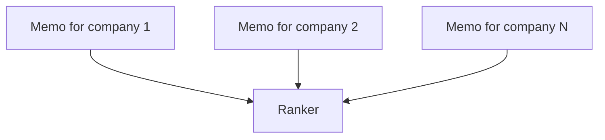

**LangGraph**

```python
from langgraph.types import Send


class MapState(TypedDict):
    companies: list[str]
    memos: Annotated[list[str], add]
    ranking: str


class MemoState(TypedDict):
    company: str


def fan_out(state: MapState):
    return [Send("write_memo", {"company": c}) for c in state["companies"]]


def write_memo(state: MemoState):
    memo = llm.invoke(f"One-paragraph investment memo on {state['company']}.").content
    return {"memos": [memo]}


def rank(state: MapState):
    return {"ranking": llm.invoke("Rank these companies:\n\n" + "\n\n".join(state["memos"])).content}


builder = StateGraph(MapState)
builder.add_node("write_memo", write_memo)
builder.add_node("rank", rank)
builder.add_conditional_edges(START, fan_out, ["write_memo"])
builder.add_edge("write_memo", "rank")
builder.add_edge("rank", END)

graph = builder.compile()
companies = ["CATL", "QuantumScape", "Solid Power", "Northvolt"]
print(graph.invoke({"companies": companies})["ranking"])
```

**GraphWorkflow**

```python
companies = ["CATL", "QuantumScape", "Solid Power", "Northvolt"]

mappers = [
    agent(
        f"Memo-{i}",
        f"Write a one-paragraph investment memo on {company}: moat, risks, recent news.",
        model="gpt-4.1-mini",
    )
    for i, company in enumerate(companies)
]
ranker = agent("Ranker", "You receive one memo per company. Rank the companies in a table and justify the order.")

result = run_graph(
    "Memo map-reduce",
    "Evaluate these battery companies as long-term investments.",
    agents=mappers + [ranker],
    edges=[edge(m["agent_name"], "Ranker") for m in mappers],
    entry_points=[m["agent_name"] for m in mappers],
    end_points=["Ranker"],
)
print(result["outputs"]["Ranker"])
```

**变化之处：** 每个入口都接收同一个 `task`，所以每个 mapper 负责的那一项要写进它自己的 `system_prompt`。构造请求时列表必须已知，这覆盖了常见情况（每个文档、每只股票、每个章节一个工作者）。如果需要由模型决定列表，就先运行一张小的规划图，再根据它的输出构造 map-reduce 图。

### 模式 8：模型集成（陪审团）

同一个问题并行交给三家不同厂商模型上的陪审员，再由一个裁判权衡他们的回答。不同家族的模型犯的错误不同，因此它们之间的分歧本身就是有用的信号。

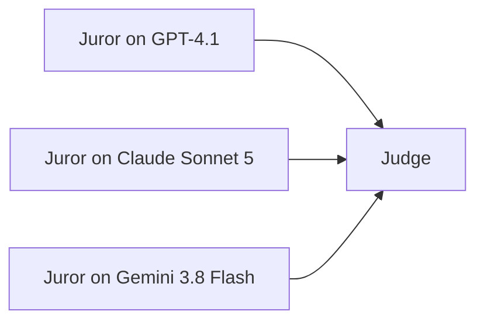

**LangGraph**

```python
from langchain_anthropic import ChatAnthropic
from langchain_google_genai import ChatGoogleGenerativeAI

jurors = {
    "gpt": ChatOpenAI(model="gpt-4.1"),
    "claude": ChatAnthropic(model="claude-sonnet-5").with_fallbacks([ChatOpenAI(model="gpt-4.1")]),
    "gemini": ChatGoogleGenerativeAI(model="gemini-3.8-flash"),
}


class JuryState(TypedDict):
    question: str
    verdicts: Annotated[list[str], add]
    ruling: str


def make_juror(name: str, model):
    def juror(state: JuryState):
        answer = model.invoke(f"Answer and justify: {state['question']}").content
        return {"verdicts": [f"{name}: {answer}"]}
    return juror


def judge(state: JuryState):
    return {"ruling": llm.invoke("Weigh these answers and rule:\n\n" + "\n\n".join(state["verdicts"])).content}


builder = StateGraph(JuryState)
builder.add_node("judge", judge)
for name, model in jurors.items():
    builder.add_node(name, make_juror(name, model))
    builder.add_edge(START, name)
builder.add_edge(list(jurors), "judge")
builder.add_edge("judge", END)

graph = builder.compile()
print(graph.invoke({"question": "Is this clause enforceable in California?"})["ruling"])
```

**GraphWorkflow**

```python
juror_prompt = "Answer the question and justify your answer. End with a one-line verdict."
jurors = [
    agent("Juror-GPT", juror_prompt, model="gpt-4.1", fallback_models=["gpt-4.1-mini"]),
    agent("Juror-Claude", juror_prompt, model="claude-sonnet-5", fallback_models=["gpt-4.1"]),
    agent("Juror-Gemini", juror_prompt, model="gemini-3.8-flash", fallback_models=["claude-sonnet-5"]),
]
judge = agent(
    "Judge",
    "You receive three independent answers. Note where they agree and disagree, then give a final ruling.",
    model="claude-opus-5",
)

result = run_graph(
    "Jury",
    "Is a 24-month non-compete clause enforceable for a California employee?",
    agents=jurors + [judge],
    edges=[edge(j["agent_name"], "Judge") for j in jurors],
    entry_points=[j["agent_name"] for j in jurors],
    end_points=["Judge"],
)
print(result["outputs"]["Judge"])
```

**变化之处：** 在 LangGraph 中，每家厂商都是单独的客户端包、API 密钥和账单。在 GraphWorkflow 中，`model_name` 只是每个节点上的一个字符串，一把密钥覆盖所有厂商（截至 2026 年 9 月 25 日，目录中共有 1,858 个模型 ID），`fallback_models` 为每个陪审员提供一个有序的备用列表，主模型出错时依次重试。

### 模式 9：交叉反驳的辩论与裁判

正方和反方并行陈述，各自反驳对方的开场陈述，裁判阅读双方的反驳。

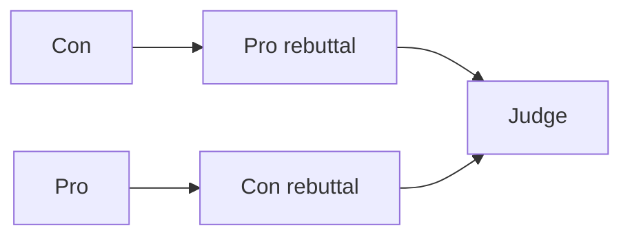

**LangGraph**

```python
class DebateState(TypedDict):
    motion: str
    pro: str
    con: str
    rebuttals: Annotated[list[str], add]
    verdict: str


def pro(state: DebateState):
    return {"pro": llm.invoke(f"Argue for: {state['motion']}").content}


def con(state: DebateState):
    return {"con": llm.invoke(f"Argue against: {state['motion']}").content}


def pro_rebuttal(state: DebateState):
    return {"rebuttals": ["PRO: " + llm.invoke(f"Rebut this, arguing for the motion:\n{state['con']}").content]}


def con_rebuttal(state: DebateState):
    return {"rebuttals": ["CON: " + llm.invoke(f"Rebut this, arguing against the motion:\n{state['pro']}").content]}


def judge(state: DebateState):
    return {"verdict": llm.invoke("Decide which side won:\n\n" + "\n\n".join(state["rebuttals"])).content}


builder = StateGraph(DebateState)
for name, fn in [("pro", pro), ("con", con), ("pro_rebuttal", pro_rebuttal), ("con_rebuttal", con_rebuttal), ("judge", judge)]:
    builder.add_node(name, fn)
builder.add_edge(START, "pro")
builder.add_edge(START, "con")
builder.add_edge("con", "pro_rebuttal")
builder.add_edge("pro", "con_rebuttal")
builder.add_edge(["pro_rebuttal", "con_rebuttal"], "judge")
builder.add_edge("judge", END)

graph = builder.compile()
print(graph.invoke({"motion": "Cities should ban gas-powered leaf blowers"})["verdict"])
```

**GraphWorkflow**

```python
result = run_graph(
    "Debate",
    "Motion: cities should ban gas-powered leaf blowers.",
    agents=[
        agent("Pro", "Argue for the motion in five strong points.", model="gpt-4.1"),
        agent("Con", "Argue against the motion in five strong points.", model="claude-sonnet-5"),
        agent("ProRebuttal", "You argue for the motion. Rebut the opposing argument you receive, point by point.", model="gpt-4.1"),
        agent("ConRebuttal", "You argue against the motion. Rebut the opposing argument you receive, point by point.", model="claude-sonnet-5"),
        agent("Judge", "You receive a rebuttal from each side of a debate. Decide which side argued better and explain why.", model="gemini-3.8-flash"),
    ],
    edges=[
        edge("Con", "ProRebuttal"),
        edge("Pro", "ConRebuttal"),
        edge("ProRebuttal", "Judge"),
        edge("ConRebuttal", "Judge"),
    ],
    entry_points=["Pro", "Con"],
    end_points=["Judge"],
)
print(result["outputs"]["Judge"])
```

**变化之处：** 交叉的边决定了每份反驳能看到什么，所以 ProRebuttal 只读取反方的开场陈述。把双方放在不同厂商上，再把裁判放在第三家，可以避免同一个模型家族自己和自己辩论。如果想让裁判也读到开场陈述，就加上 `Pro → Judge` 和 `Con → Judge`。

### 模式 10：规划者、工作者与审阅者

LangGraph 团队常用 `Command` 构建一个在运行时挑选下一个工作者的主管。当团队成员和各自的工作事先已知时，同样的工作可以用一张 DAG 完成：规划者写出计划，工作者并行完成各自的部分，审阅者对照计划检查结果。

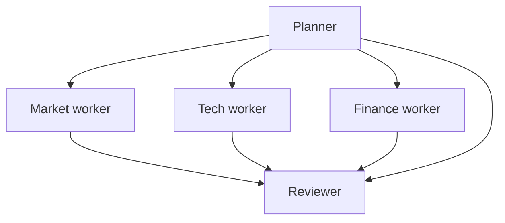

**LangGraph（主管）**

```python
from langgraph.types import Command


class TeamState(TypedDict):
    task: str
    notes: Annotated[list[str], add]


class Next(BaseModel):
    next: Literal["researcher", "analyst", "FINISH"]


def supervisor(state: TeamState) -> Command[Literal["researcher", "analyst", "__end__"]]:
    decision = llm.with_structured_output(Next).invoke(
        f"Task: {state['task']}\nWork so far: {state['notes']}\nWho acts next, or FINISH?"
    )
    return Command(goto=END if decision.next == "FINISH" else decision.next)


def researcher(state: TeamState) -> Command[Literal["supervisor"]]:
    note = llm.invoke(f"Research for: {state['task']}").content
    return Command(update={"notes": [note]}, goto="supervisor")


def analyst(state: TeamState) -> Command[Literal["supervisor"]]:
    note = llm.invoke(f"Analyze: {state['notes']}").content
    return Command(update={"notes": [note]}, goto="supervisor")


builder = StateGraph(TeamState)
builder.add_node("supervisor", supervisor)
builder.add_node("researcher", researcher)
builder.add_node("analyst", analyst)
builder.add_edge(START, "supervisor")

graph = builder.compile()
result = graph.invoke({"task": "Competitive analysis of the AI chip market"}, config={"recursion_limit": 12})
print(result["notes"][-1])
```

**GraphWorkflow**

```python
workers = [
    agent("MarketWorker", "You receive a research plan. Carry out only its market section."),
    agent("TechWorker", "You receive a research plan. Carry out only its technology section."),
    agent("FinanceWorker", "You receive a research plan. Carry out only its financial section."),
]

result = run_graph(
    "Planner and workers",
    "Competitive analysis of the AI chip market",
    agents=[agent("Planner", "Write a research plan with market, technology, and financial sections.", model="claude-opus-5")]
    + workers
    + [agent("Reviewer", "Check the three sections you receive against the plan, fix gaps, and write the final analysis.")],
    edges=[edge("Planner", w["agent_name"]) for w in workers]
    + [edge(w["agent_name"], "Reviewer") for w in workers]
    + [edge("Planner", "Reviewer")],
    entry_points=["Planner"],
    end_points=["Reviewer"],
)
print(result["outputs"]["Reviewer"])
```

**变化之处：** 主管在运行时决定顺序，并且可以反复调用工作者；DAG 在运行前就固定了团队和顺序，在一次运行中并发执行三个工作者，智能体数量已知，因此账单中按智能体计费的部分事先就能确定。`Planner → Reviewer` 这条边让审阅者拿到用来对照的计划。

### 模式 11：展开的反思循环

写作者起草，评审者评审，写作者修改。LangGraph 把这表达为一个带条件出口的环。GraphWorkflow 的图是无环的，所以把轮次展开成一个固定的序列。

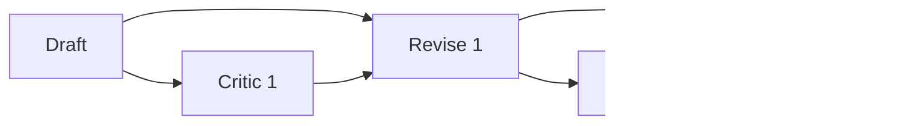

**LangGraph（环）**

```python
class LoopState(TypedDict):
    product: str
    draft: str
    feedback: str
    grade: str


class Feedback(BaseModel):
    grade: Literal["pass", "revise"]
    feedback: str


def generate(state: LoopState):
    prompt = f"Write a 120-word product description for {state['product']}."
    if state.get("feedback"):
        prompt += f"\nRevise using this feedback: {state['feedback']}"
    return {"draft": llm.invoke(prompt).content}


def evaluate(state: LoopState):
    result = llm.with_structured_output(Feedback).invoke(f"Grade this draft:\n{state['draft']}")
    return {"grade": result.grade, "feedback": result.feedback}


builder = StateGraph(LoopState)
builder.add_node("generate", generate)
builder.add_node("evaluate", evaluate)
builder.add_edge(START, "generate")
builder.add_edge("generate", "evaluate")
builder.add_conditional_edges(
    "evaluate",
    lambda state: END if state["grade"] == "pass" else "generate",
    ["generate", END],
)

graph = builder.compile()
print(graph.invoke({"product": "a home battery"}, config={"recursion_limit": 10})["draft"])
```

**GraphWorkflow（展开两轮）**

```python
result = run_graph(
    "Unrolled reflection",
    "Write a 120-word product description for a home battery.",
    agents=[
        agent("Draft", "Write the requested copy.", model="gpt-4.1"),
        agent("Critic1", "List the three biggest weaknesses of the copy you receive.", model="claude-sonnet-5"),
        agent("Revise1", "You receive a draft and a critique. Rewrite the draft to fix every weakness.", model="gpt-4.1"),
        agent("Critic2", "List any remaining weaknesses in the copy you receive. Be strict.", model="claude-sonnet-5"),
        agent("Final", "You receive copy and a critique. Produce the final copy with every issue fixed.", model="gpt-4.1"),
    ],
    edges=[
        edge("Draft", "Critic1"),
        edge("Draft", "Revise1"),
        edge("Critic1", "Revise1"),
        edge("Revise1", "Critic2"),
        edge("Revise1", "Final"),
        edge("Critic2", "Final"),
    ],
    entry_points=["Draft"],
    end_points=["Final"],
)
print(result["outputs"]["Final"])
```

**变化之处：** 每个修改节点都有两个父节点（它要修改的文本，以及对该文本的评审），因为节点只能看到其直接父节点的输出。轮数在图中是固定的，成本也因此固定。如果需要在得到某个判定时停止，就让最后一个节点以判定标记结尾，然后在你的代码里再次调用 `run_graph`，直到通过或达到你自己设定的轮数上限。

### 模式 12：通过门控实现条件路由

分类器决定由哪个专家来回答。LangGraph 用一条条件边选出一条分支。GraphWorkflow 没有条件边：声明的每条边都会触发，所以每条分支都会运行，不适用的分支回复 `SKIPPED`。

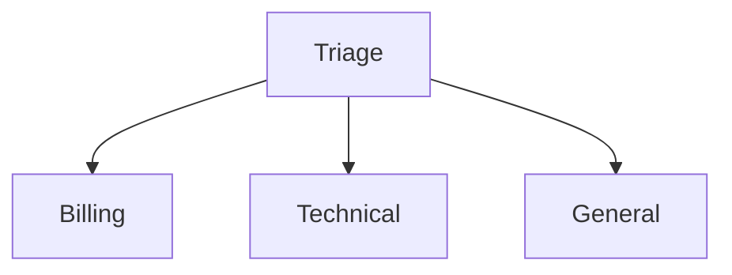

**LangGraph**

```python
class RouteState(TypedDict):
    ticket: str
    route: str
    reply: str


class Route(BaseModel):
    step: Literal["billing", "technical", "general"]


def classify(state: RouteState):
    return {"route": llm.with_structured_output(Route).invoke(f"Classify: {state['ticket']}").step}


def specialist(role: str):
    def node(state: RouteState):
        return {"reply": llm.invoke(f"As the {role} team, answer: {state['ticket']}").content}
    return node


builder = StateGraph(RouteState)
builder.add_node("classify", classify)
for role in ["billing", "technical", "general"]:
    builder.add_node(role, specialist(role))
    builder.add_edge(role, END)
builder.add_edge(START, "classify")
builder.add_conditional_edges("classify", lambda state: state["route"], ["billing", "technical", "general"])

graph = builder.compile()
print(graph.invoke({"ticket": "I was charged twice this month."})["reply"])
```

**GraphWorkflow**

```python
routes = {
    "Billing": "payments, invoices, refunds, or duplicate charges",
    "Technical": "bugs, API errors, or integration problems",
    "General": "anything else",
}

result = run_graph(
    "Gated support routing",
    "I was charged twice this month.",
    agents=[
        agent(
            "Triage",
            "Restate the customer's message, then end with exactly one line: ROUTE: BILLING, ROUTE: TECHNICAL, or ROUTE: GENERAL.",
            model="gpt-4.1-mini",
        )
    ]
    + [
        agent(
            name,
            f"You handle {scope}. If the input you receive does not end with ROUTE: {name.upper()}, "
            "reply with the single word SKIPPED. Otherwise, answer the customer.",
            model="gpt-4.1-mini",
        )
        for name, scope in routes.items()
    ],
    edges=[edge("Triage", name) for name in routes],
    entry_points=["Triage"],
    end_points=list(routes),
)
answer = next(v for v in result["outputs"].values() if str(v).strip() != "SKIPPED")
print(answer)
```

**变化之处：** 三个专家都会运行，也都会计费（token 加每个 0.01 美元），包括回复 `SKIPPED` 的那两个，所以请把被门控的分支放在小模型上，并保持提示词简短。如果跳过的分支成本较高，就在你的代码里路由：先做一次分类调用，再只提交所选分支对应的图。

### 模式 13：用 Python 片段组合子图

两个研究团队各自是一张小图，共同为一个写作者供稿。

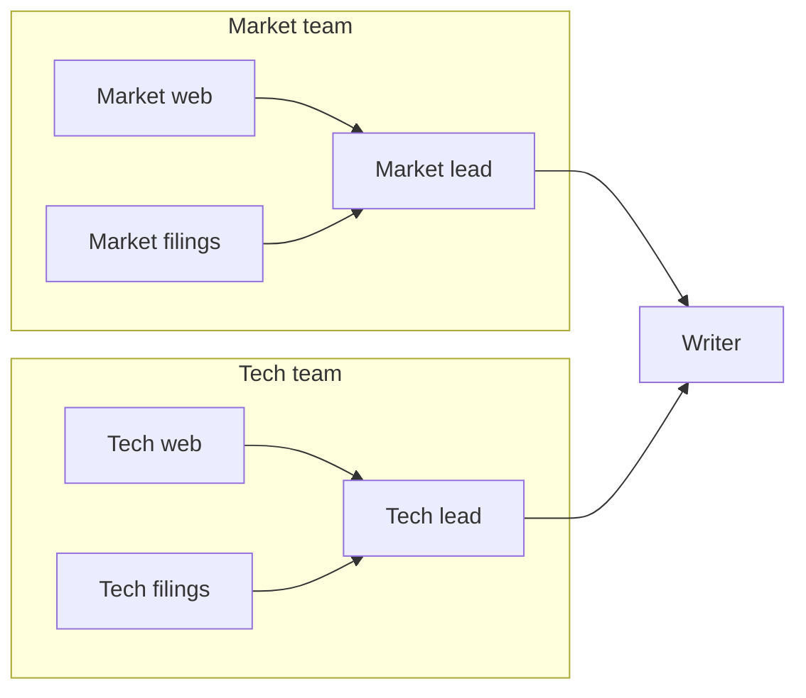

**LangGraph**

```python
class ResearchState(TypedDict):
    topic: str
    findings: Annotated[list[str], add]


def web(state: ResearchState):
    return {"findings": [llm.invoke(f"Web research on {state['topic']}").content]}


def filings(state: ResearchState):
    return {"findings": [llm.invoke(f"Filings research on {state['topic']}").content]}


team = StateGraph(ResearchState)
team.add_node("web", web)
team.add_node("filings", filings)
team.add_edge(START, "web")
team.add_edge(START, "filings")
team.add_edge("web", END)
team.add_edge("filings", END)
research_team = team.compile()


def write_report(state: ResearchState):
    return {"findings": [llm.invoke("Write the report:\n" + "\n\n".join(state["findings"])).content]}


parent = StateGraph(ResearchState)
parent.add_node("research_team", research_team)
parent.add_node("write", write_report)
parent.add_edge(START, "research_team")
parent.add_edge("research_team", "write")
parent.add_edge("write", END)

graph = parent.compile()
print(graph.invoke({"topic": "sodium-ion batteries"})["findings"][-1])
```

**GraphWorkflow**

```python
def research_team(prefix, focus):
    workers = [
        agent(f"{prefix}-web", f"Research {focus} using public web sources.", model="gpt-4.1-mini"),
        agent(f"{prefix}-filings", f"Research {focus} using filings and papers.", model="gpt-4.1-mini"),
    ]
    lead = agent(f"{prefix}-lead", f"Merge your team's {focus} research into one briefing.")
    return {
        "agents": workers + [lead],
        "edges": [edge(w["agent_name"], lead["agent_name"]) for w in workers],
        "entry": [w["agent_name"] for w in workers],
        "exit": lead["agent_name"],
    }


teams = [research_team("market", "the market"), research_team("tech", "the technology")]
writer = agent("Writer", "Write the final report from the team briefings you receive.")

result = run_graph(
    "Nested research",
    "Sodium-ion batteries",
    agents=[a for t in teams for a in t["agents"]] + [writer],
    edges=[e for t in teams for e in t["edges"]] + [edge(t["exit"], "Writer") for t in teams],
    entry_points=[n for t in teams for n in t["entry"]],
    end_points=["Writer"],
)
print(result["outputs"]["Writer"])
```

**变化之处：** 子图是一个返回智能体、边以及自身入口和出口节点的函数，组合子图就是列表拼接，并给名称加前缀以保证节点 ID 唯一。编译器看到的是展平后的图，因此两个团队的工作者会落在同一个并发层里。

### 模式 14：边元数据

给边打上优先级、审计标签或成本中心，让你自己的系统可以筛选和归属图的运行。

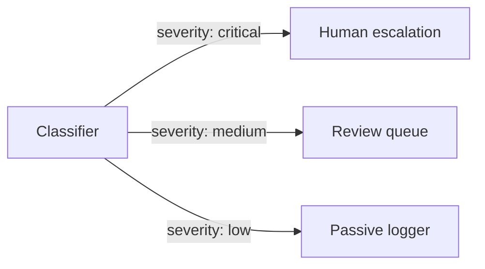

**LangGraph**

LangGraph 的边本身不携带数据。最接近的做法是在 config 中传入运行级别的标签和元数据，由你的追踪后端为整次运行记录：

```python
# graph: any compiled StateGraph, such as one from the patterns above
graph.invoke(
    {"ticket": "Suspicious login from a new country"},
    config={"tags": ["trust-and-safety"], "metadata": {"cost_center": "support"}},
)
```

**GraphWorkflow**

```python
edges = [
    edge("Classifier", "HumanEscalation", severity="critical", priority="p0", audit_tag="trust_and_safety", cost_center="support"),
    edge("Classifier", "ReviewQueue", severity="medium", priority="p2", cost_center="support"),
    edge("Classifier", "PassiveLogger", severity="low", priority="p4", cost_center="ops"),
]

result = run_graph(
    "Moderation",
    "Suspicious login from a new country, followed by a password change.",
    agents=[
        agent("Classifier", "Classify the event's severity as critical, medium, or low, and explain why."),
        agent("HumanEscalation", "If the classification you receive is critical, draft an escalation note. Otherwise reply SKIPPED."),
        agent("ReviewQueue", "If the classification you receive is medium, write a review ticket. Otherwise reply SKIPPED."),
        agent("PassiveLogger", "If the classification you receive is low, write a one-line log entry. Otherwise reply SKIPPED."),
    ],
    edges=edges,
    entry_points=["Classifier"],
    end_points=["HumanEscalation", "ReviewQueue", "PassiveLogger"],
)

edge_index = {(e["source"], e["target"]): e.get("metadata", {}) for e in edges}
for (source, target), meta in edge_index.items():
    print(target, meta.get("priority"), str(result["outputs"].get(target, ""))[:80])
```

**变化之处：** 元数据的键是自由格式的，并随每条边传递。响应不会把它们返回给你，所以请保留你提交的 `edges` 列表，并在你这边把它与 `outputs` 关联起来，就像上面的 `edge_index` 那样。用量按整个工作流汇总，所以按成本中心的归属也需要你根据这些标签自己计算。

## 两者的差异

| 能力 | LangGraph | GraphWorkflow 及实际做法 |
| --- | --- | --- |
| 环 | 支持，由 `recursion_limit` 限定 | 只支持无环图。展开固定轮数（模式 11），或在你的代码里再次调用这张图，直到判定通过。 |
| 条件边 | `add_conditional_edges` 与 `Command(goto=...)` | 声明的每条边都会触发。在提示词中门控分支，并接受它们都会运行和计费（模式 12），或在你的代码里选择要提交的图。 |
| 动态扇出 | `Send` 在运行时展开列表 | 在请求之前用 Python 生成节点（模式 7）；如果必须由模型选择列表，就先运行一张规划图。 |
| 有类型的状态与 reducer | 带 `operator.add` 等 reducer 的 `TypedDict` 状态 | 没有共享状态。每个节点把父节点的输出作为上下文；消费者需要结构化数据时，让终点节点输出 JSON。 |
| 检查点与持久化 | 检查点保存器和 `thread_id` 可以从任意一步恢复运行 | 每个请求都是无状态的，并一次运行到底。把 `outputs` 以 `job_id` 为键存进你自己的数据库。 |
| 人工参与 | `interrupt()`，再用 `Command(resume=...)` 恢复 | 拆成两次图运行：先运行到审核点，持久化 `outputs`，再把审核后的文本作为第二次运行的 `task`。 |
| 流式输出 | 多种流模式，例如 `values` 和 `updates` | 文档记载的响应是运行结束时返回的一个 JSON，包含每个节点的输出。 |
| 托管 | 你自己的 Python 进程（LangChain 也出售托管平台） | 向 Swarms 基础设施发一个 HTTPS 请求，或在你自己的进程中运行开源框架。 |
| 每个节点的模型 | 每家厂商一个客户端，各有密钥和账单 | 每个智能体一个 `model_name`，一把密钥覆盖目录中的所有厂商。 |
| 故障转移 | 每个客户端上的 `with_fallbacks` | 每个智能体的 `fallback_models`（有序）和 `fallback_model_name`。 |
| 边上的数据 | 没有；标签和元数据作用于整次运行 | 每条边上都有自由格式的 `metadata`。 |
| 定价 | 库本身免费；各家厂商按各自价格计费 | 所有模型统一为每百万输入 token 6.50 美元、每百万输出 token 18.50 美元，另加每个智能体 0.01 美元。需要 Pro、Ultra 或 Premium 套餐。 |
| 每次运行的成本 | 从各家厂商账单和你的追踪工具中拼接 | 每个响应中的 `usage.total_cost`。 |
| 编译与执行开销 | 每次运行都有逐超步的开销 | 据论文，平均执行快 7.0 倍，编译快 21.6 到 31.3 倍。 |

## 成本与可观测性

每个图响应都自带账单。`usage` 是一个扁平对象，包含 `input_tokens`、`output_tokens`、`total_tokens`、`total_cost` 和 `cost_per_agent`，其中 `total_cost` 就是这次运行的全部费用：输入和输出 token 费用加上按智能体计的费用。

所有模型费率相同：**每百万输入 token 6.50 美元，每百万输出 token 18.50 美元，图中每个智能体 0.01 美元。** 文档中的两智能体示例可以精确算出来：1,250 个输入 token（0.0081 美元）加 3,200 个输出 token（0.0592 美元）加两个智能体（0.02 美元），合计 0.0873 美元。模式 5 中的九智能体分层网络在 token 之外还有 0.09 美元的智能体费用。Swarms 的夜间 token 五折优惠不适用于图工作流。

三个习惯可以让图的成本保持可预测：

- **按节点选择模型规格。** 收集员、翻译、mapper 和被门控的分支很少需要前沿模型；裁判、规划者和最终写作者通常需要。
- **把被门控的分支算进去。** 声明的每条分支都会运行，所以一个带五个门控专家的路由器，每次请求都要为五个智能体付费。
- **限制输出长度。** `max_tokens` 默认每个智能体 16,000；只需要一段话的节点请调低。

在历史记录方面，每次图运行都会记录在你的账户日志中（`GET /v1/account/logs`），并可在 [cloud.swarms.world/history](https://cloud.swarms.world/history) 浏览，附带每次运行的成本和 CSV 导出。每个响应都会返回额度响应头（`X-RateLimit-Remaining-Minute`、`X-RateLimit-Remaining-Day`、`X-RateLimit-Reset`）。用量按工作流汇总；如果需要按团队或按功能归属，就给边打上 `cost_center` 标签（模式 14），然后在你这边拆分总额。

## 迁移清单

1. 列出每一张 LangGraph 图，以及它的节点、边和条件边。
2. 标出用到环、`interrupt()`、检查点保存器或 `Send` 的部分；这些需要上文所说的重新设计。先迁移其余部分。
3. 把每个节点变成一个智能体：`agent_name` 取自节点名，`system_prompt` 取自节点的提示词，`model_name` 取自它的客户端。
4. 把状态读取改写成关于上游上下文的指令（"你会收到研究笔记，用它们来……"）。
5. 把每个 `add_edge` 翻译成一个 `{"source", "target"}` 字典，把每个列表形式的边翻译成每个父节点一条边。
6. 用 `START` 之后的节点设置 `entry_points`，用 `END` 之前的节点设置 `end_points`。
7. 检查每个节点需要看到什么；如果某个节点需要的不只是其直接父节点的输出，就从更早的节点补一条边。
8. 用门控或你代码中的路由调用替换条件边，并展开循环或把循环移到外部。
9. 给最关键的节点加上 `fallback_models`，并把审阅者和裁判放在与被审阅节点不同的厂商上。
10. 按图的规模设置客户端超时（300、600，或 900 秒以上）。
11. 用相同输入运行两个版本，逐节点比较 `outputs`，并比较每次运行的 `usage.total_cost`，然后切换。

## 常见问题

**GraphWorkflow 可以包含环吗？**
不可以。GraphWorkflow 运行有向无环图，这也是编译一次即可执行的前提。展开固定轮数，或在你的代码里再次运行这张图，直到判定通过。

**如何表达条件边？**
声明的每条边都会在其源节点完成时触发。在提示词中门控分支，让不相关的分支回复 `SKIPPED`（它们仍会运行并计费），或者先做一次分类调用，再只提交所选分支对应的图。

**有多个父节点的节点会收到什么？**
它会等所有父节点都完成后运行，并把它们的全部输出加入上下文。入口智能体从 `task` 开始。

**API 接受哪些边格式？**
带 `source` 和 `target` 的字典，可以附带 `metadata`。列表和元组简写会在校验时返回 422，名称与任何 `agent_name` 都不匹配时返回 400。

**响应会包含中间结果吗？**
会。`outputs` 以智能体名为键包含每个节点的输出，所以运行结束后你可以检查任意节点。

**每个节点都可以使用不同的模型或厂商吗？**
可以。`model_name`、`fallback_models` 和 `fallback_model_name` 都按智能体设置，一把 Swarms API 密钥覆盖整个目录。

**用什么替代 LangGraph 的检查点保存器？**
你自己的存储。每个请求都是无状态的，并一次运行到底；每次运行都会记录在 `GET /v1/account/logs` 中。对于需要恢复的流程，把 `outputs` 以 `job_id` 为键持久化，再从它们开始下一次图运行。

**Graph Workflow 端点在免费档可用吗？**
不可用。它需要 Pro、Ultra 或 Premium 套餐；免费档密钥会收到 403。开源框架中的 `GraphWorkflow` 在本地运行，不需要套餐。

**一次迁移需要多长时间？**
一张线性或扇出的图通常一个下午就够了。围绕环、中断或复杂 reducer 逻辑构建的图耗时更长，因为这些部分需要上文所说的重新设计。

## 从哪里开始

一次迁移一张图，从你手上最线性的那张开始。把它写成 GraphWorkflow 请求，用真实输入与 LangGraph 版本并行运行，逐节点比较输出，并比较 `usage.total_cost`。接着处理一张扇入或菱形图，把环和中断留到最后。

如果你更习惯先画图，[工作流构建器](https://cloud.swarms.world/workflow-builder)是 GraphWorkflow 的无代码画布：把智能体作为节点摆好，画出边，运行这张图，再打开 Code 面板复制确切的请求。新账户注册即获免费额度。

继续阅读：框架层面的对比 [Swarms GraphWorkflow 与 LangGraph 对比](/zh/blog/swarms-graphworkflow-vs-langgraph)、完整基准方法 [GraphWorkflow 研究论文](/zh/blog/graphworkflow-research-paper)，以及 Graph Workflow API 所在的平台[什么是 Swarms Cloud？](/zh/blog/what-is-swarms-cloud)。

---

*有问题或反馈？欢迎加入我们的 [Discord 社区](https://discord.gg/VapjxpSyHC)，或查阅[文档](https://docs.swarms.ai)。*
