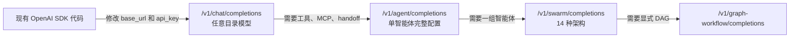
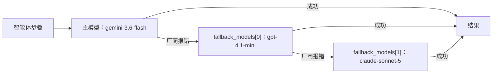

# OpenAI Agents SDK 与 Swarms 对比：2026 完整指南

OpenAI Agents SDK 是一个做得很好的库。它的 handoff 模型，也就是一个智能体像调用工具那样把控制权交给另一个智能体，是一个优雅的设计；它的 guardrail、session 和 tracing 也都设计得很用心。

Swarms 解决的是一个更大的问题。它既是一个开源多智能体框架（`pip install swarms`），也是一个托管 API，即 Swarms Cloud，可以在 **一把 API 密钥、一个统一价格之下接入各大厂商的 1,858 个模型**，运行单个智能体或整个 swarm。它还提供一个 **OpenAI 兼容端点**，已经基于 OpenAI SDK 写好的代码，只需改两个字符串就能迁移过来。

本文从选型时真正重要的每个维度对比两者：模型接入、OpenAI 兼容端点、handoff、编排、故障转移、定价、工具与 MCP、结构化输出、流式输出、记忆、可观测性和托管方式。下文中所有 Swarms 的数据都来自 2026 年 9 月 25 日对线上 API 的实测。

## 简短结论

- **选择 Swarms**：如果你想用任意实验室的任意模型，希望在一个请求内完成跨厂商审阅和故障转移，希望一张账单、一个价格，需要 14 种命名的多智能体架构外加图工作流和网格工作流端点，并且想通过 HTTP（或你已经在用的 OpenAI SDK）调用一个托管 API。
- **选择 Agents SDK**：如果你已经确定只用 OpenAI 模型，并且需要 OpenAI 的托管工具（基于向量库的文件检索、代码解释器、托管 shell）、实时语音智能体，或者希望内置的 guardrail 在你自己的 Python 进程里运行。
- **两者一起用**：保留你现有的 OpenAI SDK 客户端，把对话形态的调用指向 Swarms，再把需要一组智能体协作的调用迁到原生 swarm 端点。

## 一览表

| | OpenAI Agents SDK | Swarms |
|---|---|---|
| 它是什么 | 在你的进程内运行的开源库（Python 和 TypeScript） | 开源 Python 框架，加上托管 API Swarms Cloud |
| 默认模型路径 | OpenAI Responses API | 目录中 1,858 个模型任选，按智能体指定 |
| 非 OpenAI 模型 | 通过兼容 Chat Completions 的客户端，或 beta 阶段的 LiteLLM 与 any-llm 适配器，每家厂商各一把密钥、各一张账单 | 目录中所有厂商共用一把 Swarms 密钥 |
| OpenAI 兼容端点 | 它本身就是 OpenAI 客户端 | `POST /v1/chat/completions`，改两行即可切换 |
| Token 定价 | 各厂商按模型的标价 | 所有模型统一：每百万输入 $6.50，每百万输出 $18.50 |
| Handoff | 核心原语 | 任意智能体上的 `handoffs` 字段，每个目标可用不同模型 |
| 编排 | handoff、智能体即工具，以及你自己写的 Python | 14 种 `swarm_type`，外加 GraphWorkflow 和 BatchedGridWorkflow 端点 |
| 模型故障转移 | 可选开启，对同一模型重试 | `fallback_models`，跨厂商的有序列表，由服务端处理 |
| 内置工具 | 托管工具，要求 OpenAI Responses 模型 | `auto_search`、`web_scraper`、任意 MCP 服务器、自主循环工具 |
| 自定义函数工具 | 本地 Python 函数，由 SDK 执行 | 框架：本地 Python 函数；API：工具调用返回给你的应用执行 |
| 结构化输出 | `output_type` | `llm_args.response_format` |
| 记忆 | Sessions | agent completions 上的 `history` 字段 |
| Guardrail | 内置输入与输出 guardrail | 用智能体搭建审阅步骤（例如 `CouncilAsAJudge`） |
| 可观测性 | 内置 tracing，默认导出到 OpenAI | 每个响应自带成本明细、请求日志、Swarms Cloud 中的 Completion Logs |
| 客户端 | Python、TypeScript | Python、TypeScript、Go、Java、任意 OpenAI SDK，以及托管 MCP 服务器 |

下面逐行展开，并附代码。

## 两者分别是什么

### OpenAI Agents SDK

Agents SDK 是 OpenAI 用于构建智能体循环的开源框架。它的核心原语是 **agent**（带指令和工具的模型）、**handoff** 与 **agents as tools**（一个智能体委派给另一个的两种方式），以及 **guardrail**（与智能体并行运行的校验）。在此之上，它还提供用于记忆的 session、内置 tracing、MCP 支持、人工介入钩子、sandbox 智能体和实时语音流水线。

它运行在你的进程内。你安装它，写 Python 或 TypeScript，由你的代码执行整个循环：调用模型、运行工具、跟随 handoff。对于需要持久化的长时任务，它可以与 Temporal、Dapr、Restate、DBOS 等外部编排系统集成。

默认情况下，它通过 Responses API 调用 OpenAI 模型。

### Swarms

Swarms 有两层，共用同一套概念。

**Swarms 框架** 是一个开源 Python 库。`Agent` 接收系统提示词、来自任意厂商的 `model_name`，以及一组普通 Python 函数作为工具。`SequentialWorkflow`、`ConcurrentWorkflow`、`HierarchicalSwarm`、`GraphWorkflow` 等多智能体结构都是可以在本地组合的类。

**Swarms Cloud** 是位于 `api.swarms.world` 的托管 API。你用 JSON 描述智能体，平台负责运行。与本文对比相关的端点如下：

| 端点 | 作用 |
|---|---|
| `POST /v1/chat/completions` | 面向任意目录模型的 OpenAI 兼容对话补全 |
| `POST /v1/agent/completions` | 单个智能体，支持工具、MCP、handoff、子智能体、结构化输出 |
| `POST /v1/swarm/completions` | 多智能体 swarm，架构由 `swarm_type` 决定 |
| `POST /v1/graph-workflow/completions` | 智能体作为有向图中的节点 |
| `POST /v1/batched-grid-workflow/completions` | 每个智能体处理每个任务的网格执行 |
| `POST /v1/reasoning-agent/completions` | self-consistency 等推理架构 |
| `POST /v1/agent/batch/completions`、`/v1/swarm/batch/completions` | 大规模批量执行 |
| `GET /v1/models` | 以 OpenAI 列表格式返回模型目录 |

另外还有一个托管 MCP 服务器 `mcp.swarms.world`，Claude Code、Cursor 等 MCP 客户端可以直接用它运行智能体和 swarm。

最公平的读法是：作为库，Swarms 框架与 Agents SDK 一一对应；而 Swarms Cloud 这一层在 Agents SDK 那边没有对应物，它是一个替你运行整个多智能体系统的托管服务。

## 模型接入：OpenAI 优先，还是所有厂商

Agents SDK 可以调用其他实验室的模型。它提供三条路径：用 `set_default_openai_client` 配合自定义 `base_url` 接入任意 OpenAI 兼容端点、自定义 `ModelProvider`，以及为每个智能体单独设置 `model`。为了覆盖更多厂商，它还附带 LiteLLM 和 any-llm 适配器，OpenAI 自己把它们描述为 beta 阶段、尽力而为的集成。

摩擦体现在 OpenAI 官方文档列出的注意事项里：

- SDK 默认使用 Responses API，而 OpenAI 指出"许多其他 LLM 厂商仍不支持它"，所以非 OpenAI 模型要改走 Chat Completions 路径。
- Tracing 会上传到 OpenAI，没有 OpenAI 密钥时会报 401 错误，因此你要么关闭 tracing，要么单独保留一把只用于 tracing 的 OpenAI 密钥，要么自己写 trace processor。
- 结构化输出取决于厂商，文档提醒"有些模型厂商不支持结构化输出"。
- 所有托管工具（网页搜索、文件检索、代码解释器、图像生成、托管 MCP、托管 shell）都要求使用 `OpenAIResponsesModel`，所以在其他实验室的模型上都用不了。
- OpenAI 建议"每个工作流使用单一的模型形态"，因为 Responses 与 Chat Completions 两条路径支持的功能不同。

而且每多接一家厂商，就多一把 API 密钥、一个计费账户、一套速率限制和一张价目表。

在 Swarms 上，模型只是一个字符串。线上目录通过 `GET /v1/models` 返回 **1,858 个模型**，涵盖 OpenAI、Anthropic、Google、xAI、DeepSeek、Moonshot、Meta、Qwen 等，还包括经由 OpenRouter、AWS Bedrock、DeepInfra、Groq、Databricks 等网关的路由。一把密钥认证全部模型，一张账单覆盖全部模型，swarm 中每个智能体都可以指定不同的模型。

```python
from openai import OpenAI

client = OpenAI(api_key="YOUR_SWARMS_API_KEY", base_url="https://api.swarms.world/v1")

models = client.models.list()
print(len(models.data))  # 1858 on September 25, 2026
```

## OpenAI 兼容端点

如果你已经有 OpenAI 代码，这是试用 Swarms 最快的方式。Swarms 提供 `POST /v1/chat/completions`，请求和响应格式与 OpenAI ChatCompletion 一致，并接受 OpenAI SDK 默认发送的 `Authorization: Bearer` 请求头。只要改掉 API 密钥和 base URL，你现有的客户端就变成了 Swarms 客户端：

```python
from openai import OpenAI

client = OpenAI(
    api_key="YOUR_SWARMS_API_KEY",
    base_url="https://api.swarms.world/v1",  # the only structural change
)

response = client.chat.completions.create(
    model="gpt-4.1",
    messages=[
        {"role": "system", "content": "You are a senior financial analyst."},
        {"role": "user", "content": "What are the top risks in emerging market bonds right now?"},
    ],
    max_tokens=1024,
    temperature=0.3,
)

print(response.choices[0].message.content)
print(response.usage.total_tokens)
```

现在只改一个字符串就能切换实验室。客户端、外层的重试中间件、流式 UI 和错误处理全都保持不变：

```python
for model in ["gpt-4.1", "claude-sonnet-5", "claude-opus-5-5", "gpt-6-astra", "deepseek/deepseek-reasoner"]:
    r = client.chat.completions.create(
        model=model,
        messages=[{"role": "user", "content": "Summarize the case for LFP batteries in two sentences."}],
        max_tokens=200,
    )
    print(model, "->", r.choices[0].message.content)
```

原样保留的能力：

- **流式输出。** `stream=True` 返回 OpenAI chunk 格式的 Server-Sent Events，token 在智能体生成时实时转发。
- **多轮历史。** system、user、assistant 消息照常使用。
- **视觉输入。** `content` 数组中的图片部分支持 HTTPS URL 或 base64 data URI。
- **错误类。** 错误以 OpenAI 的错误格式返回，所以 `openai.RateLimitError`、`openai.AuthenticationError` 等照常工作。
- **用量统计。** 每个响应都包含 `prompt_tokens`、`completion_tokens` 和 `total_tokens`。
- **其他 SDK。** Swarms 文档提供了官方 OpenAI SDK（Python、TypeScript、Go）以及 Rust 的 `async-openai` 的可运行示例。

Swarms 增加了一个扩展参数 `max_loops`，让智能体在回答前对自己的输出进行多轮迭代。通过 `extra_body` 传入：

```python
response = client.chat.completions.create(
    model="gpt-4.1",
    messages=[
        {"role": "system", "content": "Write a solution, critique it, then output the corrected version."},
        {"role": "user", "content": "Implement longest_palindromic_substring(s: str) -> str."},
    ],
    max_tokens=2048,
    extra_body={"max_loops": 3},
)
```

通过这个端点的每次调用都运行在完整的 Swarms 智能体基础设施上，因此按同一统一价格计费、记录日志，并像原生调用一样出现在你的用量报告里。

这个端点面向对话形态的调用。工具调用、`response_format`、`logprobs` 和 `n > 1` 目前都不支持；需要工具和结构化输出时，请使用下文介绍的 `/v1/agent/completions`。这也回答了一个常见问题：Agents SDK 可以通过 `set_default_openai_client` 和 `set_default_openai_api("chat_completions")` 连接任意 Chat Completions 端点，但 SDK 的函数工具和 handoff 都是以工具调用实现的，所以把它指向这个端点只适合两者都不用的智能体。凡是用到工具的场景，应当直接调用 Swarms 的原生端点。

升级路径是渐进的，可以按产品功能逐个端点迁移：



## 同一个任务的两种写法

一条两智能体流水线：研究员收集材料，审阅者检查其中站不住脚的论断。审阅者和研究员运行在不同实验室的模型上，因为与作者同属一个模型家族的审阅者，也会共享它的盲区，往往恰恰在最该提出异议的地方点头同意。

先看 Agents SDK 的写法，Anthropic 模型通过 LiteLLM 适配器接入：

```python
# pip install "openai-agents[litellm]"
import os

from agents import Agent, Runner
from agents.extensions.models.litellm_model import LitellmModel

researcher = Agent(
    name="Researcher",
    instructions="Research the topic thoroughly and cite what you find.",
    model="gpt-4.1",
)

reviewer = Agent(
    name="Reviewer",
    instructions="Check the research for weak or unsupported claims.",
    model=LitellmModel(
        model="anthropic/claude-sonnet-5",
        api_key=os.environ["ANTHROPIC_API_KEY"],
    ),
)

research = Runner.run_sync(researcher, "Assess the EV battery supply chain")
review = Runner.run_sync(reviewer, research.final_output)
print(review.final_output)
```

它能跑，代码也很干净。但它需要一把 OpenAI 密钥和一把 Anthropic 密钥，产生两张账单、两套价目表，Anthropic 走的是 beta 适配器，tracing 发往 OpenAI（所以即使是 Anthropic 那一步也需要 OpenAI 密钥）。执行顺序写在你的 Python 里，任何一家厂商宕机，那一步就会失败，除非你自己写恢复逻辑。

下面是同一条流水线在 Swarms Cloud 上的写法，一次 HTTP 请求：

```python
import httpx

payload = {
    "name": "Cross-Vendor Review",
    "description": "Research on one vendor, review on another",
    "swarm_type": "SequentialWorkflow",
    "task": "Assess the EV battery supply chain",
    "agents": [
        {
            "agent_name": "Researcher",
            "description": "Gathers and cites source material",
            "system_prompt": "Research the topic thoroughly and cite what you find.",
            "model_name": "gpt-4.1",
            "fallback_models": ["claude-sonnet-5", "gemini-3.8-flash"],
            "max_loops": 1,
        },
        {
            "agent_name": "Reviewer",
            "description": "Audits the research for weak claims",
            "system_prompt": "Check the research for weak or unsupported claims.",
            "model_name": "claude-sonnet-5",
            "fallback_models": ["gpt-4.1", "gemini-3.8-flash"],
            "max_loops": 1,
        },
    ],
    "max_loops": 1,
}

r = httpx.post(
    "https://api.swarms.world/v1/swarm/completions",
    headers={"x-api-key": "YOUR_API_KEY"},
    json=payload,
    timeout=300.0,
)
result = r.json()
print(result["output"])
print(result["usage"]["billing_info"])
```

这一个 payload 里发生了三件事。研究员和审阅者运行在不同的实验室上。每个智能体都指定了一条跨其他厂商的有序后备链，所以任何一侧的厂商故障都会在请求内部被吸收。整个运行只有一把密钥、一张账单、一个价格。

我们在线上 API 上运行了这个 payload（给每个系统提示词加了篇幅限制）。它用时 **24.5 秒**，总成本 **$0.052**，其中 $0.02 是两个智能体的费用。审阅者证明了自己的价值：它指出研究员引用的 LFP 市场份额数据只依赖单一分析机构的来源，并要求用第二个来源交叉验证。

## 两个平台上的 handoff

Handoff 是 Agents SDK 的招牌功能，所以要说清楚：Swarms 同样支持。

在 Agents SDK 中，分诊智能体列出它可以交接的对象：

```python
from agents import Agent, Runner

billing = Agent(name="Billing", instructions="Resolve invoices, refunds, and plan changes.")
technical = Agent(name="Technical", instructions="Debug API errors and integration problems.")

triage = Agent(
    name="Triage",
    instructions="Answer simple questions yourself. Hand off billing and technical issues.",
    handoffs=[billing, technical],
)

result = Runner.run_sync(triage, "I'm getting 429 errors on 10 requests a minute.")
print(result.final_output)
```

在 Swarms 上，`handoffs` 是 `/v1/agent/completions` 中任意智能体的一个字段。每个交接目标都是完整的智能体配置，拥有自己的模型，所以运行在一家实验室上的分诊智能体，可以把任务交给运行在其他实验室上的专家：

```python
import httpx

payload = {
    "agent_config": {
        "agent_name": "Support-Triage",
        "system_prompt": (
            "Answer simple questions yourself. Hand off billing questions to "
            "Billing-Specialist and technical issues to Technical-Support."
        ),
        "model_name": "claude-sonnet-5",
        "max_loops": 1,
        "handoffs": [
            {
                "agent_name": "Billing-Specialist",
                "description": "Handles invoices, refunds, and subscription changes",
                "system_prompt": "Be precise with amounts and dates. Confirm changes before applying.",
                "model_name": "gpt-4.1-mini",
            },
            {
                "agent_name": "Technical-Support",
                "description": "Debugs API errors and integration problems",
                "system_prompt": "Ask for error messages and logs. Give step-by-step fixes.",
                "model_name": "gpt-4.1",
                "fallback_models": ["claude-sonnet-5"],
            },
        ],
    },
    "task": "I'm getting 429 errors on 10 requests a minute.",
}

r = httpx.post(
    "https://api.swarms.world/v1/agent/completions",
    headers={"x-api-key": "YOUR_API_KEY"},
    json=payload,
    timeout=120.0,
)
print(r.json()["outputs"])
```

Swarms 还提供了第二种委派方式，这在 SDK 里需要你自己实现：**动态子智能体**。把 `max_loops` 设为 `"auto"`，智能体就会获得 `create_sub_agent` 和 `assign_task` 两个工具。它在运行时判断任务需要多少个专家，创建它们，并发运行，再合并结果。Handoff 适合团队已知的场景，子智能体适合事先无法确定团队构成的任务。

| 委派方式 | Agents SDK | Swarms |
|---|---|---|
| 把控制权交给专家 | `handoffs=[...]` | 智能体配置中的 `handoffs` |
| 把另一个智能体当作工具调用 | `agent.as_tool()` | `HierarchicalSwarm` 的主管与工作者 |
| 运行时创建专家 | 自己写代码 | `max_loops: "auto"` 配合 `create_sub_agent` 和 `assign_task` |
| 每个专家使用不同实验室的模型 | 适配器加上每家厂商一把密钥 | 按智能体设置 `model_name` |

## 编排：handoff 对比 16 种架构

Handoff 只是一种组合原语。经理把工作分派给工作者、五个模型投票、由裁判裁决的辩论，这些在 Agents SDK 里都能做到，但需要你自己用 `asyncio.gather`、循环和胶水代码写出来。

在 Swarms 上，它们都是命名架构。线上 `GET /v1/swarms/available` 端点返回 14 个 `swarm_type`：

| `swarm_type` | 模式 | 适用场景 |
|---|---|---|
| `SequentialWorkflow` | 每个智能体接收上一个智能体的输出 | 先研究，再起草，再编辑 |
| `ConcurrentWorkflow` | 所有智能体并行处理同一任务 | 低延迟的独立分析 |
| `AgentRearrange` | 自定义流程：`->` 顺序执行，`,` 并行执行 | 顺序与并行混合的阶段 |
| `MixtureOfAgents` | 专家并行工作，聚合者综合 | 综合法律、财务、技术视角 |
| `HierarchicalSwarm` | 主管拆解、委派并审阅 | 带监督的经理与工作者结构 |
| `PlannerWorkerSwarm` | 规划者写子任务，工作者从队列领取 | 执行前需要显式规划 |
| `MultiAgentRouter` | 路由器把每个任务分给最合适的专家 | 多个领域智能体的统一入口 |
| `GroupChat` | 智能体对话，走向共同结论 | 头脑风暴与小组讨论 |
| `RoundRobin` | 智能体按固定顺序轮流发言 | 均衡、循环式的贡献 |
| `MajorityVoting` | 独立作答，多数胜出 | 分类和是否放行的判断 |
| `CouncilAsAJudge` | 评审团按多个维度打分，裁判裁决 | 评估和打分 |
| `LLMCouncil` | 小组审议，主席综合 | 需要多方意见的高风险问题 |
| `DebateWithJudge` | 正反双方辩论，裁判判定 | 对一个立场做压力测试 |
| `HeavySwarm` | 问题拆解、并行研究、综合 | 质量优先于延迟的深度分析 |

另外两种架构有独立端点：**GraphWorkflow**（`/v1/graph-workflow/completions`）用于显式有向图，**BatchedGridWorkflow**（`/v1/batched-grid-workflow/completions`）用于让每个智能体处理每个任务。切换拓扑只需改一个字段。

下面是一个跨厂商评审团。三家实验室的模型独立审查同一个函数，由共识智能体统一投票结果。第三位评审的主模型在 Google 上，后备模型在 OpenAI 上：

```python
payload = {
    "name": "Cross-Vendor Jury",
    "description": "Three model families vote on the same question",
    "swarm_type": "MajorityVoting",
    "task": (
        "Is this Python function safe to ship? "
        "def average(xs): return sum(xs) / len(xs). "
        "Answer SHIP or BLOCK on the first line, then one sentence of reasoning."
    ),
    "agents": [
        {
            "agent_name": "Reviewer-OpenAI",
            "system_prompt": "You are a strict senior code reviewer.",
            "model_name": "gpt-4.1",
        },
        {
            "agent_name": "Reviewer-Anthropic",
            "system_prompt": "You are a strict senior code reviewer.",
            "model_name": "claude-sonnet-5",
        },
        {
            "agent_name": "Reviewer-Google",
            "system_prompt": "You are a strict senior code reviewer.",
            "model_name": "gemini-3.6-flash",
            "fallback_models": ["gpt-4.1-mini"],
        },
    ],
}
```

我们运行时，Google 那条路由恰好在返回错误。第三位评审在同一个请求内切换到了 `gpt-4.1-mini`，三位评审都投了 BLOCK（空列表会触发 `ZeroDivisionError`），共识智能体对三份审查意见做了排序。总计：**8.4 秒，$0.039**。没有人写重试代码，调用方也完全没有感知到这次故障。

## 故障转移

Agents SDK 的重试需要主动开启，通过 `ModelSettings(retry=...)` 配置，重试的是同一个模型。它没有内置把失败调用转到另一家厂商的步骤。对于长时运行的容错，SDK 交给 Temporal、Dapr 这类持久化执行框架，由你来运维。

在 Swarms 上，每个智能体都可以设置 `fallback_models`，这是一个有序的模型列表，主模型出错时依次尝试；还可以用 `fallback_model_name` 在列表用尽后再兜底一次。它适用于单个智能体，也适用于 swarm 中的每个智能体，在服务端执行，后备模型可以来自完全不同的实验室：



实用的原则是：让每条后备链跨越不同厂商。与主模型同属一家实验室的后备模型，也共享同一个故障域。

## 定价

Agents SDK 本身免费开源。你为调用的模型向各家厂商付费，按各自标价计算，OpenAI 的托管工具另外计费。一个工作流里有三家厂商，你就要管理三张价目表、三张发票和三套速率限制，任何一家调价，你的单次运行成本就会跟着变。

Swarms Cloud 对所有模型统一收费：

| 项目 | 价格 |
|---|---|
| 输入 token | 每百万 $6.50，所有模型 |
| 输出 token | 每百万 $18.50，所有模型 |
| 智能体费用 | swarm、图工作流和网格工作流中每个智能体 $0.01 |
| 网页搜索（`auto_search`） | 每次搜索 $0.04 |
| 网页抓取 | 每次抓取 $0.15 |
| MCP 调用 | 每次调用 $0.10 |
| 图片输入 | 每张图片 $0.25 |
| 夜间模式 | 太平洋时间晚 8 点至早 6 点，swarm completions 的 token 费用五折 |

由于处处同价，把某一步从一家实验室的模型换成另一家，纯粹是质量和延迟上的决定。尝试另一个前沿模型不需要任何预算审批。

统一价格最容易做预算，在高端模型上更划算。如果某个工作负载主要是对一个小而便宜的模型的大量调用，迁移前请先把统一价格与该模型的标价比较一下。

每个 swarm 响应都自带成本明细，你不需要对账就能知道一次运行花了多少钱：

```json
"usage": {
  "input_tokens": 130,
  "output_tokens": 454,
  "total_tokens": 584,
  "billing_info": {
    "cost_breakdown": {
      "agent_cost": 0.03,
      "input_token_cost": 0.000845,
      "output_token_cost": 0.008399,
      "num_agents": 3,
      "night_time_discount_applied": false
    },
    "total_cost": 0.039244
  }
}
```

这段数据来自上面的评审团运行。

## 工具与 MCP

在 OpenAI 模型上，Agents SDK 的工具能力很强。`@function_tool` 可以把 Python 函数变成工具，由 SDK 在循环内本地执行。网页搜索、基于 OpenAI 向量库的文件检索、代码解释器、图像生成、托管 MCP 和托管 shell 等托管工具在 OpenAI 的服务器上运行，并且都只支持 Responses 模型。SDK 也能连接本地和远程 MCP 服务器。

Swarms 提供四种工具机制，可以在同一个智能体上组合使用：

| 机制 | 位置 | 作用 |
|---|---|---|
| Python 函数 | Swarms 框架，`tools=[...]` | 任何带类型注解和 docstring 的函数都能成为工具，本地执行 |
| 内置工具 | API，`tools_enabled` | `auto_search` 和 `web_scraper`，由平台执行 |
| MCP 服务器 | API，`mcp_url`、`mcp_urls`、`mcp_configs` | 通过 streamable HTTP、SSE 或 stdio 接入任意 MCP 服务器，支持 bearer、API key 或 OAuth 2.1 认证 |
| 自定义函数 schema | API，`tools_list_dictionary` | OpenAI 风格的函数 schema，模型发起的调用返回给你的应用执行 |

一个可以搜索网页、并使用两个 MCP 服务器上的工具的智能体，可以跑在任意实验室的模型上：

```python
payload = {
    "agent_config": {
        "agent_name": "Research-Assistant",
        "system_prompt": "Use search and your MCP tools to answer with current, cited information.",
        "model_name": "claude-sonnet-5",
        "max_loops": 3,
        "mcp_urls": [
            "https://your-first-mcp-server.example.com/mcp",
            {
                "url": "https://your-second-mcp-server.example.com/mcp",
                "authorization_token": "YOUR_MCP_TOKEN",
            },
        ],
    },
    "tools_enabled": ["auto_search"],
    "task": "What changed in the latest release of our SDK, and which customers does it affect?",
}
```

设置 `max_loops: "auto"` 后，智能体还会获得自主循环的工具：`create_plan`、`think`、文件操作，以及前面介绍的子智能体工具。你可以用 `selected_tools` 加以限制。

反过来也可以：位于 `mcp.swarms.world` 的 Swarms MCP 服务器让任意 MCP 客户端，包括 Claude Code、Cursor 和 Codex，都能把 Swarms 智能体和 swarm 当作工具来运行。

## 结构化输出

在 Agents SDK 中，把 `output_type` 设为一个 Pydantic 模型，最终输出就会按它校验。由于各厂商对结构化输出的支持不一，这在 OpenAI 模型上效果最好。

在 Swarms 上，可以在 `/v1/agent/completions` 中通过 `llm_args.response_format` 传入 JSON schema，或者在 `tools_list_dictionary` 中定义函数 schema，再从响应里读取结构化调用。同一个请求可以用在目录中任何支持 JSON schema 输出的模型上。

## 流式输出

Agents SDK 用 `Runner.run_streamed()` 流式输出，它会产出原始模型增量，以及工具调用、handoff 等更高层的运行事件。

Swarms 在三个层级支持流式输出。OpenAI 兼容端点返回标准 SSE chunk。单个智能体用 `streaming_on: true` 流式输出。整个 swarm 用 `"stream": true` 以类型化的 SSE 事件流式输出：开始、输出片段、带成本明细的用量事件，以及结束。对于 `SequentialWorkflow` 和 `AgentRearrange`，每个 token 都带有 `agent` 字段，所以 UI 可以把每个智能体的输出渲染在各自的面板里，即使 `AgentRearrange` 在并行运行多个智能体也可以。

## 记忆与状态

Agents SDK 提供 **session**，这是一个持久化记忆层（支持 SQLite 等后端），会自动在多次运行之间保存对话历史。

Swarms API 的每个请求都是无状态的。你可以在 `/v1/agent/completions` 的 `history` 字段、OpenAI 兼容端点的 `messages` 数组，或 `GroupChat` 等对话型 swarm 的 `messages` 中传入之前的轮次。这样存储留在你自己的数据库里，遵循你自己的保留策略，代价是每一轮多一行记录代码。

## Guardrail 与审阅

Guardrail 是 Agents SDK 的真正强项：输入和输出检查与智能体并行运行，一旦触发就能提前终止运行。

Swarms 没有叫这个名字的原语。审阅由智能体搭建，这与跨厂商检查天然契合。`CouncilAsAJudge` 按多个维度给输出打分，并由裁判模型给出裁决；`MajorityVoting` 在独立模型意见一致之前会阻止决策；`SequentialWorkflow` 中的最后一个审阅智能体可以在草稿离开系统前将其驳回。这些审阅者都可以运行在与被检查智能体不同的实验室上。

## 可观测性与成本追踪

Agents SDK 内置的 tracing 非常适合调试，默认导出到 OpenAI 控制台。使用非 OpenAI 模型时，你仍然需要一把 OpenAI 密钥来做 tracing，或者写一个把 trace 发往别处的自定义 processor。

Swarms 在平台上记录每一次请求：

- 每个 swarm 响应都包含 `execution_time`、token 计数和完整的 `billing_info` 成本明细。
- `GET /v1/account/logs` 返回你的请求历史，`GET /v1/usage/costs` 给出支出明细，`GET /v1/account/credits` 显示余额。
- 响应会带回速率限制头（`X-RateLimit-*`），让你在触发 429 之前主动限流。
- Swarms Cloud 中的 [Completion Logs](/zh/blog/completion-logs-swarms-cloud) 在控制台展示每次运行的输入、输出和成本。

## 规模、托管与客户端

Agents SDK 在你运行 Python 或 Node 的任何地方运行。扩容、排队、跨重启的重试和部署都需要你自己搭建，持久化方面可以借助 Temporal 这类集成。

Swarms Cloud 是托管服务。一个 swarm 最多可容纳 2,000 个智能体，批量端点可以在一次调用中处理大量智能体或 swarm 任务，付费套餐把速率限制提升到每分钟 2,000 次请求。官方客户端覆盖 Python、TypeScript、Go 和 Java；而有了 OpenAI 兼容端点，任何语言的 OpenAI SDK 都能用于对话形态的调用。

## 可以自己验证的性能

Swarms 的图引擎只编译一次工作流，之后复用冻结的执行计划，不会在每次运行时重新推导执行顺序。这一说法背后有一篇[已发表的系统论文](/zh/blog/graphworkflow-research-paper)，以及一套开放的基准测试：五种拓扑，10 到 200 个节点，15 种配置，每项取 9 次采样的中位数，并给出 95% 置信区间。对比基线是 LangGraph，目前使用最广泛的智能体图引擎：

| 测量项 | GraphWorkflow 相对 LangGraph 的结果 |
|---|---|
| 编译后的图执行 | 几何平均 7.0 倍 |
| 200 节点链 | 62.5 倍（0.29 毫秒对 18.15 毫秒） |
| 浅而宽的图 | 2.7 到 4 倍 |
| 图编译 | 快 21.6 到 31.3 倍 |
| 冷启动的构建、编译、执行路径 | 快 7.9 倍 |

[完整的测试框架和原始数据都已公开](https://github.com/The-Swarm-Corporation/GraphWorkflow-Paper/tree/main/benchmarks)，你可以在自己的硬件上复现每一个数字。

## 什么情况下 Agents SDK 更合适

有些团队应该选择 Agents SDK，值得具体说明：

- 你只用 OpenAI 模型，并且需要 OpenAI 的托管工具，尤其是基于向量库的文件检索、代码解释器和托管 shell。
- 你在基于 OpenAI 实时模型构建实时语音智能体。
- 你希望在自己的进程内直接使用现成的 guardrail 和 session 原语。
- 你已经在运行 Temporal 或类似的持久化执行平台，并希望把智能体循环放在里面。

如果这符合你的项目，SDK 是个好工具。如果你的项目会比任何一家实验室在排行榜上的领先期更长久，请继续往下读。

## 从 Agents SDK 迁移到 Swarms

大多数概念可以直接对应：

| Agents SDK | Swarms |
|---|---|
| `Agent(name, instructions, model)` | `agent_name`、`system_prompt`、`model_name` |
| `handoffs=[...]` | 智能体配置中的 `handoffs` |
| `agent.as_tool()` | `HierarchicalSwarm`，或 `max_loops: "auto"` 下的子智能体 |
| `@function_tool` | 框架中的 `tools=[your_function]`；API 上的 `tools_list_dictionary` 或 MCP 服务器 |
| 托管网页搜索 | `tools_enabled: ["auto_search"]` |
| `output_type` | `llm_args.response_format` |
| `Runner.run_streamed()` | 智能体上的 `streaming_on`，或 swarm 上的 `stream` |
| Sessions | agent completions 上的 `history`，或 `messages` |
| `ModelSettings(retry=...)` | 跨厂商的 `fallback_models` |
| Tracing | 每个响应中的 `billing_info`、`/v1/account/logs`、Completion Logs |
| 你自己写的编排代码 | `swarm_type`，一个字段 |

实用的迁移顺序：先把对话形态的调用迁到 OpenAI 兼容端点（每处改两行），再把你用代码编排多个智能体的调用迁到 `/v1/swarm/completions`，一次迁一个产品功能。

## 常见问题

**OpenAI Agents SDK 只能用 OpenAI 模型吗？**
不是。它可以通过兼容 Chat Completions 的客户端，以及 beta 阶段的 LiteLLM 和 any-llm 适配器调用其他厂商。但它围绕 OpenAI 的 Responses API 设计，托管工具、默认 tracing 和部分结构化输出功能都依赖 OpenAI 模型。

**可以用 OpenAI Python SDK 调用 Swarms 吗？**
可以。设置 `base_url="https://api.swarms.world/v1"` 并使用你的 Swarms API 密钥即可。对话补全、流式输出、多轮历史、视觉输入和 `client.models.list()` 都能正常工作，`model` 字段接受目录中 1,858 个模型的任意一个。

**Swarms 的 OpenAI 兼容端点支持工具调用吗？**
目前不支持。需要工具、MCP 服务器、handoff 和结构化输出时，请使用 `/v1/agent/completions`，它接受同样的模型名称。

**可以把 Agents SDK 跑在 Swarms 之上吗？**
对于不使用函数工具和 handoff 的智能体，可以，通过 `set_default_openai_client` 加上 Chat Completions API 设置即可。使用工具或 handoff 的智能体应当直接调用 Swarms 的原生端点。

**Swarms 的定价与直接调用厂商相比如何？**
Swarms 对所有模型统一收取每百万输入 token $6.50、每百万输出 token $18.50，多智能体端点另收每个智能体 $0.01。在高端前沿模型上低于标价，任何场景下都更容易做预算；如果只是直接调用单个小模型，按它自己的标价可能更便宜。

**Swarms 开源吗？**
Swarms 框架在 [GitHub](https://github.com/kyegomez/swarms) 上开源。Swarms Cloud 是替你运行智能体和 swarm 的托管 API。

## 结论

基于 Swarms 构建。

前沿一直在移动，而你无法决定下一个推动它的是哪家实验室。每个团队迟早都会遇到同样的三件事：更好的模型在另一家实验室发布，你的厂商遭遇一个糟糕的下午，你的成本结构发生变化。在一个与厂商无关的层上，每件事的代价只是改一个字符串。在一个 OpenAI 优先的 SDK 上，每件事的代价是适配器、额外的密钥和重试代码，而且往往发生在最不方便的时候。

从最小的一步开始。把你现有的 OpenAI 客户端指向 `https://api.swarms.world/v1`，用三家实验室的模型运行同一个提示词，比较结果。然后拿一条你已经在跑的流水线，把审阅者放到和作者不同的厂商上，读一读两份输出。

- 在 [cloud.swarms.world/models](https://cloud.swarms.world/models) 浏览完整模型目录。
- 在 [cloud.swarms.world/playground](https://cloud.swarms.world/playground) 无需写代码即可运行上面的跨厂商 payload。
- 在 [docs.swarms.ai](https://docs.swarms.ai) 阅读完整的 API 参考。
- 延伸阅读：[Swarms GraphWorkflow 与 LangGraph 对比](/zh/blog/swarms-graphworkflow-vs-langgraph)、[智能体编排的三种形态](/zh/blog/agent-orchestration-patterns)，以及 [2026 多智能体框架对比](/zh/blog/multi-agent-framework-comparison-2026)。

新账户注册即送免费额度，所以这个实验除了十分钟之外不花你任何成本。
