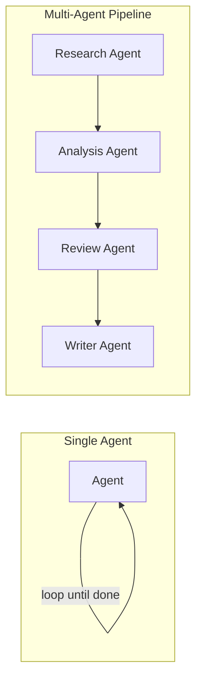

# 单智能体 vs. 多智能体：什么时候一个 AI 不够用

团队在采用智能体式AI（Agentic AI）时最常犯的错误，不是"建得太少"，而是"建得太多"。一个单独的智能体，只要配备合适的工具和足够大的上下文窗口，其实已经能完成相当惊人的工作量：读取文件、调用 API、查询数据库、搜索网页，并在一个循环中对结果进行推理，直到任务完成。当一个配备两个工具的单一智能体就足以胜任时，却搭建一个五智能体的层级架构，只会平白增加延迟、成本和故障面，却没有带来任何实际收益。本文提供了一套简单直接的判断框架，以 Swarms 的 `Agent` 单独能做到的事情作为基准线，并给出真正意味着你已经超出单智能体能力范围的具体信号。

## 单个智能体本身已经能做什么

Swarms 的 `Agent` 并不是一个裸的"提示词进、回复出"包装器。它组合了三样东西：用于推理和决策的 LLM、一组它可以调用的工具，以及贯穿整个对话的记忆。具体来说，单个智能体已经原生支持：

- **工具使用。** 通过函数调用（Function Calling）访问外部 API、查询数据库、进行文件操作、网页抓取和搜索，以及你注册为工具的任何自定义业务逻辑。智能体会自行判断是否需要使用工具，以及需要传入什么参数。
- **循环执行。** 执行过程运行在一个可配置的循环中，从单次执行（`max_loops=1`）到完全自主运行（`max_loops="auto"`），在后一种模式下，智能体会持续调用工具，把结果重新纳入记忆，并不断推进，直到自行判断任务已经完成。
- **记忆。** 短期对话历史，加上由向量数据库支撑、用于 RAG 的长期记忆，并具备自动的上下文窗口管理机制，确保长时间运行的任务不会在不知不觉中丢失早期上下文。
- **多模态输入、流式输出与备用模型。** 一个智能体可以同时处理图像和文本，可以流式输出部分响应，并能在主模型失败或报错时自动切换到备用模型。

单单一个进程、一份提示词、一条记忆线程，就已经能覆盖如此多的场景。如果你的任务是单一专长、边界清晰的,并且在一个连续的上下文中进行推理是很自然的做法，那么单个智能体往往就是最正确也最经济的答案。仅仅因为多智能体听起来更"高大上"就想采用它，正是这套框架要检验和纠正的直觉。

## 真正表明你已经超出单智能体能力范围的信号

多智能体架构只有在以下情形之一真正成立时,才配得上它所带来的额外开销，而不是在此之前：

**1. 任务确实需要截然不同的专业能力或角色。** 一份系统提示词只能代表一种视角。如果一项任务确实同时需要安全审查者的思维方式和性能审查者的思维方式，而这两种人设对同一段代码可能给出相互冲突的建议，那这就是一次角色拆分，而不仅仅是子任务拆分。拆分智能体能让每一个都拥有更聚焦、更犀利的提示词，而不是让一份提示词试图面面俱到。

**2. 任务可并行化，且延迟至关重要。** 如果五项相互独立、互不依赖彼此输出的研究或文档提取工作需要完成，那么让一个智能体依次循环处理它们，肯定要比五个智能体（或一个并发工作流）同时运行慢得多。这是一个吞吐量层面的论点，而不是质量层面的论点。

**3. 你需要故障隔离。** 在单个智能体中，一次糟糕的工具调用、一个产生幻觉的中间结果，或一次上下文污染，都可能污染同一线程中下游的所有后续工作。把一条流水线拆分成各自拥有独立作用域上下文的多个智能体，意味着提取环节的故障不会连带污染格式化环节；你可以单独检查、重试或替换某一个阶段，而不必重跑整个流程。

**4. 上下文窗口压力。** 单个智能体的上下文会不断累积一切内容：最初的任务、每一次工具调用及其结果、每一个中间推理步骤。在足够长的流水线上，较早但仍然高度相关的信息，会开始与最近但相关性较低的工具输出争夺有限的上下文空间。把各阶段拆分成独立的智能体，意味着每一个都只携带它自己那项工作实际需要的上下文，而不是背负所有其他环节的完整历史。

**5. 生成与审查需要分离。** 编写了一段代码、一份计划或一份文档的智能体，并不擅长评判自己的产出；它天然倾向于相信自己刚刚生成的内容是正确的。一个从未参与撰写草稿、也没有为其辩护的动机的独立审查或评判智能体，能够发现自我审查这一环节可靠地会遗漏的问题。

如果以上五条都不成立，增加更多智能体通常只会增加协调开销：更多的往返通信、更多任务描述在智能体之间传递时被曲解走样的环节，以及更多在没有带来相应质量提升的情况下，让成本和延迟悄悄攀升的表面积。

## 一个看似需要多智能体、实则不需要的任务

设想这样一个任务："总结这张客户支持工单，在我们的内部知识库中查找相关政策，然后起草一份回复。"由于它包含三个动词，很容易让人想把它拆分成一个摘要智能体、一个知识库查询智能体和一个起草智能体。但对照前面那五条信号来看：这里没有真正的角色冲突（一个胜任的、以客服为导向的人设就能完成全部三个步骤），没有并行空间（查询依赖于摘要，起草又依赖于查询结果，所以本来就没有任何环节能够并发运行），没有实质性的故障隔离收益（如果摘要出错，无论是哪个智能体产出的，整个工单回复都会出错），没有上下文压力（一张工单加一次知识库查询，数据量很小），也没有对抗性审查的需求。这就是一个配备了知识库搜索工具、`max_loops` 设置为一个较小数值的单一智能体。在这里把它拆成三个智能体，只会多出两次额外的网络往返，以及两个让工单上下文被进一步稀释的环节。

## 一个真正需要多智能体的任务

现在设想这样一个任务："接收这份新提出的功能需求，产出一份技术设计文档，分别独立地对其进行安全性审查和性能审查，然后由另一个独立的智能体综合这两方面的反馈，最终定稿这份文档。"在这里，前面那些信号真正成立了：安全审查和性能审查是截然不同的专业能力，二者的优先级可能相互冲突（信号 1）；这两项审查互不依赖，因此可以同时进行（信号 2）；一次糟糕或过于激进的安全审查不应该干扰性能审查的独立产出（信号 3）；而且关键在于，审查者绝不能是撰写设计文档的那个智能体，否则他们的审查意见会天然偏向于认可自己的草稿（信号 5）。这自然地对应到这样一种结构：两个独立的审查者构成一个并发工作流，其结果再输入到一个用于定稿的层级式或顺序式步骤中，这更接近于[管理者/工作者智能体架构（Manager/Worker Agent Architecture）](/blog/manager-worker-agent-architectures)所要解决的问题。

## 简述各种架构

一旦这些信号指向了多智能体方向，Swarms 提供了多种内置架构，而无需你手写编排逻辑：**顺序工作流（Sequential Workflow）**用于线性、有依赖关系的步骤；**并发工作流（Concurrent Workflow）**用于应当并行运行的独立工作；**智能体重排（Agent Rearrange）**用于自定义的、混合顺序/并行的流程模式；**智能体混合（Mixture of Agents）**用于并行的多个专家，其输出会被汇总为一份综合结果；**层级式蜂群（Hierarchical Swarm）**用于带有精修循环的总监/工作者式协作；**图工作流（Graph Workflow）**用于带有分支汇合的基于 DAG 的执行；**群聊（Group Chat）**用于智能体之间辩论式、对话式的问题求解；**重量级蜂群（Heavy Swarm）**用于多阶段的深度研究；以及**蜂群路由器（Swarm Router）**用于在运行时动态选择策略。关于每种架构各自适用于什么场景的完整介绍，请参阅[什么是多智能体系统](/blog/what-is-a-multi-agent-system)。如果这些内置模式都无法精确匹配你的协调逻辑，Swarms 也支持基于三个基本组件——一个智能体结构、一个负责编排它们的蜂群容器，以及一个用于持久化的共享对话系统——完全从零构建自定义架构，因此你并不会被限定在预置列表之内。

## 如何决策：一份检查清单

在给任务增加第二个智能体之前，按顺序思考以下问题：

1. **一个工具配备到位、且 `max_loops` 设置得足够高的智能体，是否有可能端到端地独立完成这个任务？** 如果是,先把它构建出来并实测，而不要预先假设它行不通。
2. **这项任务是否需要针对同一输入的两种或以上真正相互冲突的专家视角？** 如果不需要，一份更犀利的系统提示词通常胜过角色拆分。
3. **是否存在真正可以并行运行的独立工作，而不只是感觉上相互独立、实则顺序执行的步骤？** 如果各步骤严格依赖彼此的输出，并行化不会带来任何收益。
4. **把某一阶段的故障与其他阶段隔离开来，是否真的会改变你在生产环境中的运维方式？** 如果无论故障出现在哪里，整个任务都会失败，那么隔离并不是瓶颈所在。
5. **单个智能体的上下文窗口是否真的承受着压力**，较早的相关信息是否被工具输出挤占，**还是说这只是一种假设性的担忧？**
6. **正确性是否依赖于一个对被审查草稿没有既得利益的审查者？** 由生成输出的同一个智能体进行自我批评，其效果明显弱于独立审查。

如果你对第 2 条到第 6 条中至少一条的回答是"是"，那么多智能体架构就配得上它带来的复杂度。如果都不是，就直接上线单智能体方案——它会更快、更省成本、也更容易调试，等到生产环境中真正出现某个信号时，你随时可以再拆分它，而不必基于纯粹的猜测提前动手。

## 相关链接与资源

| 资源 | 链接 |
| --- | --- |
| 多智能体架构总览 | [docs.swarms.world/architectures/overview](https://docs.swarms.world/architectures/overview) |
| 智能体概念 | [docs.swarms.world/concepts/agents](https://docs.swarms.world/concepts/agents) |
| 自定义架构 | [docs.swarms.world/concepts/custom-architectures](https://docs.swarms.world/concepts/custom-architectures) |
| 什么是多智能体系统 | [/blog/what-is-a-multi-agent-system](/blog/what-is-a-multi-agent-system) |
| 管理者/工作者智能体架构 | [/blog/manager-worker-agent-architectures](/blog/manager-worker-agent-architectures) |
| 官方文档 | [docs.swarms.ai](https://docs.swarms.ai) |
| Discord 社区 | [discord.gg/VapjxpSyHC](https://discord.gg/VapjxpSyHC) |

---

*对于哪种架构最适合你的任务还有疑问？欢迎加入我们的 [Discord 社区](https://discord.gg/VapjxpSyHC)，或查阅[官方文档](https://docs.swarms.ai)。*
