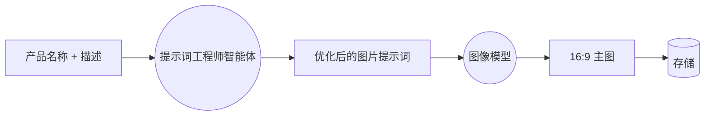
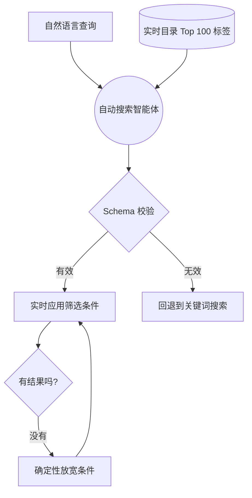
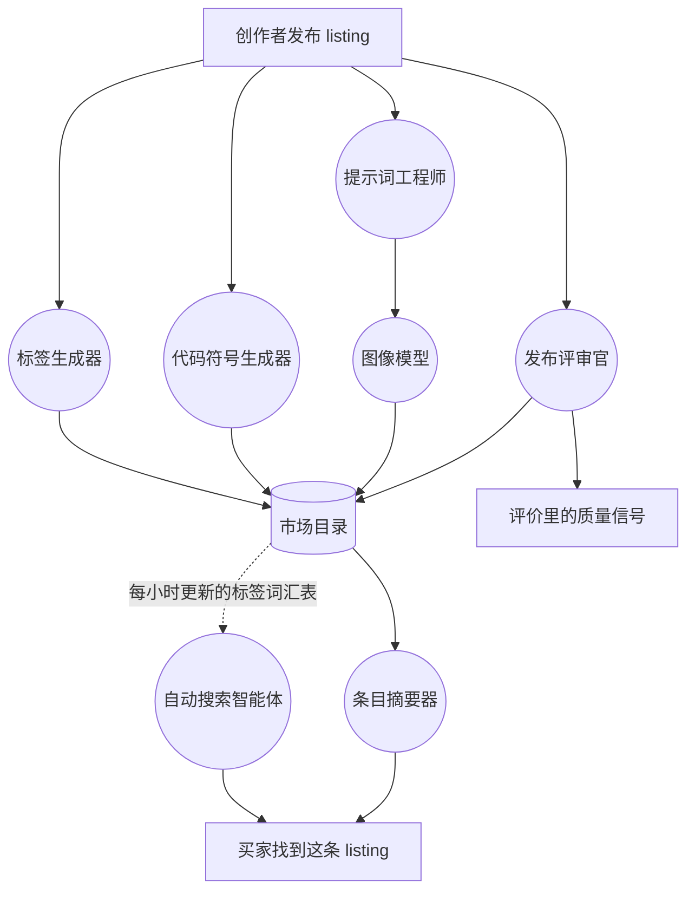

# 运行 Swarms 市场的微智能体们

Swarms 市场卖的是自主智能体。如果这个市场本身不是由智能体搭建起来的，那才奇怪。

过去几个月里，我们一直在悄悄地用小型专用智能体替换市场里的各种琐碎工作。不是一个试图包办一切的大型助手，而是一组各自把一件事做好的窄专家：给代币起名字、写摘要、给 listing 打标签、渲染主图、把一句话翻译成数据库查询。它们每一个都从某个人的日常里，拿掉了一个表单字段、一个决策，或者一个空白文本框。

这篇文章是一份完整的清单：每个智能体具体做什么，它们如何串联在一起，以及这种模式最终加起来意味着什么。

## 什么才算是一个微智能体

一个微智能体具备三个特征。它只做一件事。它使用的是专门为这项工作挑选的模型，而不是一个通用的默认模型。它能优雅降级，也就是说，当它失败时，它所支撑的功能依然能用，只是少了一点帮助。

第三个特征在生产环境里最要紧，本文也会反复回到这一点。一个 95% 的时候产出优秀结果、另外 5% 的时候把页面搞坏的智能体，比压根没有这个智能体还要糟糕。下面介绍的每一个智能体，都对「当模型什么有用的东西都没返回时会发生什么」这个问题给出了明确答案。

## 发布类智能体

这一类智能体在你创建 listing 的过程中运行。过去，发布一个智能体意味着要填好名称、描述、标签列表、代码符号（ticker）和一张图片。五个决策，其中四个是大多数人根本不想做的。

### 标签生成器

标签决定了你的 listing 能不能被找到，也是发布表单里被跳过次数最多的字段。大多数人随手写上「ai, tool, useful」就往下走了，这对谁都没帮助。

输入名称和描述，点一下按钮，标签生成器会给出 5 到 16 个 kebab-case 格式的标签。有意思的是我们对它施加的约束：我们明确告诉这个智能体，自己决定要生成多少个标签，不要为了凑数量而塞进一堆弱标签，同时它会参照一份填充词黑名单：`ai`、`tool`、`helper`、`useful`、`amazing`。它还被要求混合不同类别，所以你得到的是行业标签、智能体类型标签和能力标签的组合，而不是五个意思相近的同义词。

模型返回的所有内容，在进入你的表单之前都要经过一个严格的客户端解析器。括号和引号会被剥离，列表按逗号或换行符拆分，每个候选项都会用 slug 格式规则校验，重复项会被丢弃，超过 30 个字符的也会被扔掉。一个行为异常的模型没办法把垃圾内容塞进你的标签字段。

### 代码符号生成器

如果你要发布一个代币化智能体，就需要一个代码符号（ticker）。这是一个被压缩进两到十个字符里的、真正意义上的命名难题，也是大多数人卡壳的一步。

这个 ticker 智能体的提示词把它设定为一位资深加密品牌策略师，会返回三到五个候选项。让输出真正有用的关键要求是：每个候选项都必须使用**不同的推导策略**：首字母缩写、语音压缩、吉祥物、合成词、主题联想。这样你得到的是几个真正不同的选项，而不是同一个缩写的五种变体。提示词里的指导原则是：一个了解这个项目的读者，应该能在两秒之内把代码符号对应回项目本身。

输出会经过两份黑名单的检查。一份用来拒绝像 TOKEN、COIN、AGENT、BOT 这样的泛用符号。另一份用来拒绝和 23 个主流代码符号（比如 BTC、ETH、SOL）冲突，这样你发布的代币就不会用一个让每个交易所 listing 和报价机器人都会搞混的符号。

如果模型返回的是一段散文而不是 JSON，一个兜底提取器会对原始文本做分词，照样把候选项提取出来。这种情况很少发生，而且就算发生了，你也完全看不到。

### 图片生成器

这是我们能举出的最清晰的智能体链条例子，因为它是两个智能体依次执行，各自做着对方做不了的工作。

大多数人不擅长给图像模型写提示词。不是因为他们没有审美，而是因为图像模型需要一种非常特定的输入：密集的视觉描述、明确的光线和构图、以及说明清楚的宽高比。一段产品描述完全不是这回事。

所以第一个智能体扮演的是提示词工程师。它读取你的产品名称和描述，写出一段像样的图片提示词：风格方向、配色方案、光线、构图、留白。它知道最终输出会显示在一个 16:9 的主图容器里，所以会为宽画幅构图，并给出一个清晰的中心主体。第二个智能体则是接收这段提示词并渲染出图片的图像模型。

Banner 模式每次请求生成两张图片供你挑选，Logo 模式只生成一张。Banner 模式还带有一份负面约束清单，因为一张带有乱码 AI 文字的宣传图，比压根没有图片还要糟糕。

这里的失败处理有三层，值得说清楚，因为它展示了「优雅降级」在实践中到底是什么样子。如果提示词工程师没有返回任何可用内容，这个接口会回退到一个由你的产品信息拼出来的模板提示词，你依然能拿到一张图片。如果存储上传失败，图片会以内联方式直接返回，由客户端重新上传。如果图像生成本身失败了，请求会返回成功状态并附带一条错误信息，而不是服务器错误，这样页面显示的是一段清楚的说明，而不是崩溃。

### 发布评审官

任何市场都会面对的最难问题是质量。开放发布正是让一个市场值得逛的原因，同时也是让它被塞满不值得买的东西的原因。人工审核一旦过了最初的几千条 listing 就撑不住了。星级评分只有在有人已经把钱浪费掉之后才起作用。

所以我们做了一个评审官（judge）。它会读取完整的提交内容，名称、描述和完整正文，以 0.5 分为增量，给出 0.0 到 5.0 之间的评分，并附上一段书面理由，而不只是一个孤零零的数字。这段理由和分数本身同等重要：一个会解释自己的拒绝是反馈，一个不解释的拒绝只是一堵墙。

它的设计里有两个细节值得拎出来说。

第一个是，门槛会随着你的诉求而变化。免费 listing 需要达到 2.5 分。付费 listing 需要达到 3.5 分。为一样东西收钱，是比免费提供它更高的主张，这个门槛就体现了这一点。评审官还被限制只能输出严格的结构化结果，一个由分数加理由组成的 schema，理由被限制在大约 40 个词以内，所以它给出的判定永远既能被机器读取，也能被人读懂。

第二个是它的兜底方案，也是这篇文章里最有意思的一个兜底设计。如果评审官联系不上，系统既不会直接放行，也不会直接拒绝，而是回退到**声誉**上：它会查看你是否发布过被真实买家评为四星或以上的 listing，让有良好履历的创作者凭借自己的过往记录通过。一次模型故障不应该惩罚一个拥有五十个好评智能体的人。发布免费内容的新创作者同样会被放行，因为一条糟糕的免费 listing 代价很低，而挡住一个第一次发布的创作者代价很高。

评审官的结果还会直接输入评价系统。它的评估会作为一条评价被写入市场，所以一个自动化的质量判断，会成为和人工评分共同构成的那个公开信号的一部分，而不是数据库里一个隐藏的分数。

质量评分是我们在发布环节里计算成本最高的一步，而它恰好落在延迟最容易被察觉的地方：点击「发布」到钱包弹出签名请求之间的那几秒钟。我们能把一条 listing 评估得多彻底，和能多快让你完成发布流程，这两者之间的张力，正是我们在更大范围推广这项功能时正在着力解决的问题。评得好并不难，评得好又不让你等待，才是真正的难题。

## 发现类智能体

这一类智能体在人们浏览时运行，也是变化最快的一类。

### 条目摘要器

智能体的 listing 往往很长。一条好的 listing 可能包含完整的系统提示词、配置和代码示例。当你已经决定要用它的时候，这正是你想要的；而当你还在判断值不值得关心它的时候，这恰恰是你不想要的。

Summary 标签页会运行一个摘要器，读取整条 listing，产出两到四句朴素的第三人称摘要。它通过检查 listing 实际包含的内容，来判断自己面对的是哪一类 listing，所以一条带代码、付费接口和 MCP URL 的 listing，和一条纯提示词的 listing，得到的描述方式是不一样的。

这是我们所有智能体里防御性设计做得最重的一个，原因值得说明一下。它读取的是用户提交的内容，而这些内容本身经常**就是一段提示词**，是专门写来指挥语言模型的。要给一个卖提示词的市场做摘要，就意味着经常要把专门设计来劫持模型行为的文本喂给这个摘要器。

所以 listing 正文被包裹在明确的分隔符里，标记为数据而不是指令，系统提示词里明确禁止摘要器代入 listing 里的人设，分隔符之后还会重复一次提醒。此外还有一道回声防护：如果返回的摘要里包含我们自己脚手架代码的片段，我们会直接拒绝存储它。一段试图劫持摘要器的提示词，得到的结果是没有摘要，而不是一条被劫持的摘要。

摘要会缓存 12 小时，所以第一个打开这个标签页的人承担生成成本，之后的每个人都能立即读到现成结果。

### 注册表自动搜索

[注册表](https://swarms.world/platform/registry)有七个筛选控件：条目类型、定价模式、排除项、行业、排序方式、日期范围和关键词。一旦学会就很强大，对其他所有人来说则是一堵墙。

自动搜索让你可以跳过这一切。用大白话描述你想要什么，一个智能体会把你的句子翻译成筛选状态，然后当着你的面逐个应用这些筛选条件，并附带一行讲解当前状态的文字。

有两个设计细节，让它比一个朴素的实现方式好用得多。

第一，这个智能体的词汇表会根据实时目录刷新。它每小时都会重新计算市场 listing 上实际挂着的、最常见的 100 个标签，并注入到提示词里。当你搜索某个具体的东西时，它会把你的用词映射到目录里真实存在的术语上，而不是凭空发明一些什么都匹配不到的关键词。目录本身在教这个智能体它自己包含什么。

第二，它的输出在触及页面之前，会先经过一个严格 schema 的校验。智能体负责提议，schema 负责裁决。一个返回了意料之外筛选值的模型，没办法把这个值注入到你的会话里。

零结果时的恢复机制被刻意设计成**不是**一个智能体。如果筛选条件什么都匹配不到，客户端会按固定顺序逐步放宽条件：先放宽日期范围，再放宽行业，最后放宽关键词，一旦出现结果就立刻停止，并讲解每一步。我们把这部分写成了纯粹确定性的代码，因为它需要够快、够可预测，而且不产生成本。不是一个智能体产品里的每个问题都应该靠再加一次模型调用来解决，知道在哪里停下来，本身也是设计的一部分。

### Yuki

Yuki 是市场的客服智能体，出现在每个页面的角落，也可以在 [swarms.world/yuki/chat](https://swarms.world/yuki/chat) 全屏使用。

Yuki 回答的是关于市场如何运作的问题：定价模式、发布流程、代币化、某个设置在哪里。它会逐词流式输出回答，并且被提供了一份站点地图，以及关于你当前所在页面的上下文，所以在一个 listing 页面上问「我该怎么买这个？」，得到的会是针对这条 listing 的回答，而不是一段泛泛的说明。

Yuki 被刻意设计成我们运行的所有智能体里自主性最低的一个。它没有任何工具，不能调用其他智能体，也不能代替你采取行动。它所知道的一切，都是在对话开始之前在服务端组装好的。这是一个刻意的约束：一个能采取行动的客服智能体，就是一个可能采取错误行动的客服智能体，而一个自信满满却做错了动作的失败模式，比一句自信满满却说错了的话要糟糕得多。

## 它们如何组合在一起

这些智能体彼此独立，但它们的输出会以我们并没有完全规划过的方式，互相喂养。

值得注意的循环沿着那条虚线展开。标签生成器在发布时写下标签，这些标签成为目录的一部分，自动搜索智能体每小时都会从这个目录里重新构建自己的词汇表。于是一个智能体的输出，悄悄变成了另一个智能体的提示词上下文，发布做得越好，搜索也跟着变得越好，而这一切并没有人特意把两者连接起来。

这就是复利效应在一个智能体系统里的样子。不是某一个智能体变得更聪明，而是一个智能体的「废气」，变成了另一个智能体的输入。

## 这一切加起来意味着什么

拿发布流程来说。过去发布一个代币化智能体，需要你写一段描述、想出一份标签列表、想出一个代码符号、再找到或做出一张图片。今天，这四件事里有三件各自只需要点一下按钮，只有第四件才是真正需要你亲自动手的。

拿发现来说。过去要找到某一类特定的智能体，需要学会七个筛选控件。今天只需要一句话。

拿评估来说。过去判断一条 listing 值不值得花时间，意味着要读完一整墙的配置。今天只需要读三句话。

这些都不是什么惊天动地的功能。单独拿出来看，每一个都只是省掉了几分钟的麻烦。但合在一起，它们改变了到底哪些人能够使用这个市场，而这才是真正的重点所在。衡量一个智能体产品的标准，不是任何单个智能体有多厉害，而是有多少工作已经悄悄不再是你的了。

## 接下来

我们正在把质量评估进一步往前推，让评审官对一条 listing 了解到的更多信息，在买家花钱之前就能被看到，同时不给发布流程增加一秒钟的延迟。我们也在把自动搜索从「翻译筛选条件」延伸到真正意义上的推荐，并且正在为 Yuki 赋予经过谨慎限定范围的、超出对话本身的能力。

你可以在 [swarms.world/micro-agents](https://swarms.world/micro-agents) 上看到目前完整的阵容，也可以直接到[市场](https://swarms.world)里亲自试用。

## 结语

这个市场正在以一种从外部很难察觉的方式变得越来越自主，因为这里的进步看起来不像是一个新功能的出现，而像是一个字段的消失。

Swarms 市场并没有在某一个瞬间突然变得「智能体化」。先是一个没人想填的标签字段，然后是一个没人想去想的代码符号，接着是一张没人想去找的图片，再然后是七个没人想学的筛选控件。每一个都被交给了一个小型智能体，而这个智能体唯一的工作就是解决那一个问题。留给创作者的，是那部分本来就真正属于他们的东西：知道自己做了什么，以及它为什么值得被使用。

这就是前进的方向。不是打造一个包办一切的智能体，而是让越来越多的智能体各自把一件事做到彻底，彻底到这件事根本不再感觉像是「工作」。今天一个创作者发布内容时要做的决策，从曾经的十几个变成了四个。今天一个买家只需要用一句话描述自己想要什么，而不用去学一套筛选系统。他们谁都不会去想背后涉及了哪些智能体，而这正是我们能拿到的、证明这套设计走对了方向的最有力信号。

如果你也在搭建类似的东西，有三件事对我们的帮助超过其他一切。把每个智能体做得足够小，小到你能用一句话描述它的工作。针对每项具体工作挑选模型，而不是所有事情都用同一个默认模型。以及，在上线之前就想清楚失败时会发生什么，因为人们真正信任的智能体，是那些悄悄失败的智能体。

这个市场卖的是自主智能体。而它自己，也正越来越多地运行在这些智能体之上。
