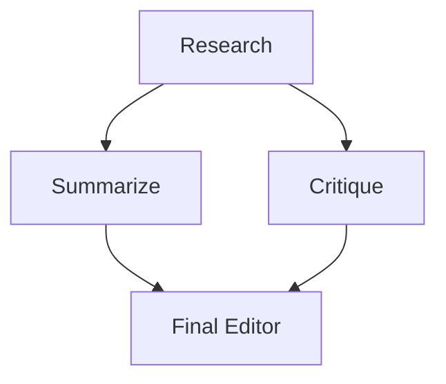

# Swarms GraphWorkflow 对比 LangGraph：构建智能体图的更简洁、更快速的方式

绝大多数有实际复杂度的多智能体系统本质上都是一张图：部分步骤按顺序执行，部分步骤并行展开，它们的输出最终在汇合节点收束。有两套框架把这张图显式表达了出来：**LangGraph** 与 **[Swarms `GraphWorkflow`](https://docs.swarms.ai/docs/documentation/multi-agent/graph_workflow#graphworkflow)**。当你真正坐下来用它们分别搭建同一条流水线时，工作量的差距非常明显。

本文用两套框架各实现同一个工作流：一个研究节点并行扇出到**摘要器**和**批评者**，两者再共同汇入**终稿编辑**。这种扇出/扇入的形态是智能体系统中最常见的非线性模式，也正是两套框架在易用性和性能上分道扬镳的地方。



## 用 LangGraph 实现这张图

LangGraph 把工作流建模为状态机。你需要声明一个带类型的状态 schema，把每个节点写成读取该状态并返回部分更新的函数，用字符串名称添加节点和边，最后编译。以下是这张扇出/扇入图的实现：

```python
import operator
from typing import Annotated, TypedDict

from langchain_openai import ChatOpenAI
from langgraph.graph import StateGraph, START, END

llm = ChatOpenAI(model="gpt-4o-mini")

# Parallel branches both write to `notes`, so it needs a reducer or
# LangGraph raises InvalidUpdateError on the concurrent write.
class State(TypedDict):
    task: str
    research: str
    notes: Annotated[list, operator.add]
    final: str

def research(state: State):
    out = llm.invoke(f"Research: {state['task']}").content
    return {"research": out}

def summarize(state: State):
    out = llm.invoke(f"Summarize:\n{state['research']}").content
    return {"notes": [f"SUMMARY: {out}"]}

def critique(state: State):
    out = llm.invoke(f"Critique:\n{state['research']}").content
    return {"notes": [f"CRITIQUE: {out}"]}

def final(state: State):
    out = llm.invoke(f"Write the final brief from:\n{state['notes']}").content
    return {"final": out}

builder = StateGraph(State)
builder.add_node("research", research)
builder.add_node("summarize", summarize)
builder.add_node("critique", critique)
builder.add_node("final", final)

builder.add_edge(START, "research")
builder.add_edge("research", "summarize")
builder.add_edge("research", "critique")
builder.add_edge("summarize", "final")
builder.add_edge("critique", "final")
builder.add_edge("final", END)

graph = builder.compile()
result = graph.invoke({"task": "Assess the EV battery market", "notes": []})
print(result["final"])
```

它能跑通。但看看你必须记在脑子里的东西：

- 一个每个节点都要读写的 **`TypedDict` 状态 schema**。
- `notes` 上那个 **`Annotated[list, operator.add]` 归约器（reducer）**。这是最扎手的地方：两个并行分支都要写 `notes`，如果没有归约器，LangGraph 会抛出 `InvalidUpdateError: multiple nodes writing to the same key`。新用户第一次搭建扇入时必然会撞上这个报错，而且修复方式并不直观。
- **`START` 和 `END`** 哨兵常量、一个显式的 `.compile()` 步骤，以及每个节点内部手写的 `llm.invoke()` 调用。
- 你还得在 invoke 调用里把 `notes` 初始化为 `[]`，因为 schema 不会替你做这件事。

它们全都是摩擦成本，而且是在你写下第一行真正的智能体逻辑之前就要先付的。

## 用 Swarms 实现这张图

Swarms 的做法是**把智能体当作节点，把依赖关系当作边**。没有独立的状态 schema，没有归约器，也没有手工搭的 LLM 管道。`Agent` 本身就知道该如何运行自己，而图会自动把每个节点的输出传给它的后继节点。

```python
from swarms import Agent, GraphWorkflow

def node(name, prompt):
    return Agent(
        agent_name=name,
        system_prompt=prompt,
        model_name="gpt-4o-mini",
        max_loops=1,
    )

research = node("Research", "Research the given topic thoroughly.")
summarize = node("Summarize", "Summarize the research into key points.")
critique = node("Critique", "Critique the research and flag weak claims.")
final = node("Final", "Write the final brief from the summary and critique.")

wf = GraphWorkflow(name="Analysis", auto_compile=True)

for agent in (research, summarize, critique, final):
    wf.add_node(agent)

wf.add_edge(research, summarize)
wf.add_edge(research, critique)
wf.add_edge(summarize, final)
wf.add_edge(critique, final)

result = wf.run(task="Assess the EV battery market")
print(result["Final"])
```

整个程序就这么多。两者的差异是结构性的，而非表面功夫：

- **没有状态 schema。** 你的节点就是智能体，它们的配置*本身*就是角色定义。你描述的是每个智能体是什么，而不是状态如何在一堆字典之间流转。
- **永远不需要归约器。** 摘要器和批评者都汇入终稿编辑，Swarms 会自动把它们的输出合并进汇合节点。`InvalidUpdateError` 这一类 bug 在这里根本不存在。
- **智能体是一等的边端点。** `wf.add_edge(research, summarize)` 直接接收智能体对象，因此不存在需要来回同步的字符串节点名，也没有 `START`/`END` 常量。
- **`auto_compile=True`** 会替你校验并准备好这张图，不用再记着单独执行编译步骤。
- **`run()` 返回一个以智能体名称为键的字典**，所以 `result["Final"]` 就是编辑的输出，同时所有中间结果也都在里面，随时可供检查。

本文中的每个代码示例都在当前版本的框架上实际运行过，上面这段 Swarms 代码可以端到端执行完毕，并返回 `{"Research", "Summarize", "Critique", "Final"}`。

## 默认并行：性能这一面

易用性是看得见的差异，性能差异则藏在引擎盖之下。

Swarms `GraphWorkflow` 会计算图的**拓扑代（topological generations）**，也就是彼此之间没有依赖关系的节点层，并把每一层放到线程池（`ContextThreadPoolExecutor`）上并发执行。在上面这条流水线里，`summarize` 和 `critique` 互不依赖，因此它们会**同时**运行，而不是一前一后。这不需要你做任何配置，它就是默认行为。

下面是实测效果。为了让数字反映的是调度而不是 LLM 本身，这里用了一个每节点固定耗时 0.5 秒的桩模型：一个根节点扇出到三个独立分支，再汇回一个汇合节点。

```
5 nodes, 3 parallel branches @ 0.5s each
sequential would be:  ~2.5s
Swarms actual:         1.52s   ← the three branches overlapped
```

根节点（0.5 秒）、三个重叠执行的分支（合计 0.5 秒，而不是 1.5 秒）、汇合节点（0.5 秒），加起来约 1.5 秒，而不是 2.5 秒。当扇出更宽时，比如十个互相独立的研究智能体，差距会随分支数量线性拉大。由于智能体运行是 I/O 密集型的（它们的时间几乎都花在等待模型 API 上），等待期间 GIL 会被释放，因此线程池带来的是真正的并行重叠。

LangGraph 同样可以并行执行分支，但这份并行需要你自己去挣：状态归约器之所以存在，恰恰是因为并发写入是一个必须提前设计规避的隐患，而并行度则要通过图的结构和配置去调优。Swarms 把安全的并行路径变成了*默认*路径：互相独立的工作会自动重叠执行，而且根本不存在可能写错的共享状态。

`GraphWorkflow` 还免费附赠两项优化：编译后的图会被**缓存**，重复运行可以跳过重新编译；当扇出宽度超出你希望同时执行的规模时，可以用 `max_parallel_nodes` 来约束资源占用。

## 用 Swarms Cloud 一次 API 请求跑完整张图

上面所有内容都跑在你自己的机器上。当你准备上线时，你不需要托管任何服务、不需要管理线程池，也不需要维持一个常驻进程。**Swarms Cloud 会把完全相同的这张图作为一次 API 请求执行完毕**，并在一个 JSON 响应中返回每个节点的输出，外加 token 用量和费用。

你的服务器上不需要安装任何框架，也没有任何基础设施需要照看。你只要 `POST` 一份对这张图的描述（有哪些智能体、有哪些边），平台就会完成编译，在托管算力上并行运行互相独立的分支，然后把结果发回给你。下面是把同样的 research → summarize + critique → final 这张图放进一次调用：

```python
import httpx

headers = {
    "x-api-key": "YOUR_API_KEY",
    "Content-Type": "application/json",
}

workflow = {
    "name": "Analysis",
    "task": "Assess the EV battery market",
    "agents": [
        {"agent_name": "Research",  "system_prompt": "Research the given topic thoroughly.",           "model_name": "gpt-4.1"},
        {"agent_name": "Summarize", "system_prompt": "Summarize the research into key points.",         "model_name": "gpt-4.1"},
        {"agent_name": "Critique",  "system_prompt": "Critique the research and flag weak claims.",      "model_name": "gpt-4.1"},
        {"agent_name": "Final",     "system_prompt": "Write the final brief from summary and critique.", "model_name": "gpt-4.1"},
    ],
    "edges": [
        {"source": "Research",  "target": "Summarize"},
        {"source": "Research",  "target": "Critique"},
        {"source": "Summarize", "target": "Final"},
        {"source": "Critique",  "target": "Final"},
    ],
    "entry_points": ["Research"],
    "end_points": ["Final"],
    "auto_compile": True,
}

response = httpx.post(
    "https://api.swarms.world/v1/graph-workflow/completions",
    headers=headers,
    json=workflow,
    timeout=300.0,
)

result = response.json()
print(result["outputs"]["Final"])
print(f"Total tokens: {result['usage']['total_tokens']}, cost: ${result['usage']['token_cost']:.4f}")
```

一次请求，你拿回的是：

```json
{
  "job_id": "graph-workflow-abc123xyz",
  "status": "success",
  "outputs": {
    "Research": "Research findings on the EV battery market...",
    "Summarize": "Key points...",
    "Critique": "Weak claims flagged...",
    "Final": "Final brief..."
  },
  "usage": {
    "input_tokens": 1250,
    "output_tokens": 3200,
    "total_tokens": 4450,
    "token_cost": 0.0400,
    "cost_per_agent": 0.02
  },
  "timestamp": "2026-07-27T10:30:45.123456+00:00"
}
```

这就是完整的生产部署故事：**没有服务器、没有编排代码、不用操心扩缩容**，只有同样的那张有向图，在托管基础设施上执行，按 token 计费，并把每次运行的成本一并返回给你。各个分支依然并行运行，只不过运行它们的机器不再归你所有。同一个端点既能跑本文这个四节点的图，也能跑包含数十个智能体的多层流水线，而且任何能发 HTTP 请求的语言都可以调用它。

想运行上面这张图，先到 [cloud.swarms.world](https://cloud.swarms.world) 注册并获取 API 密钥，然后把它填进 `x-api-key` 请求头即可。API 上的 Graph Workflow 在 Pro、Ultra 和 Premium 套餐中可用。完整的 schema、视觉能力支持以及边的元数据，请查阅 [GraphWorkflow 完整参考文档](https://docs.swarms.ai/docs/documentation/multi-agent/graph_workflow#graphworkflow)。

## 你真正要优化的是什么

Swarms 围绕你真正想做的那件事来设计：**把智能体接成一张图然后快速跑起来，不必先上一门状态管理课。** 对于研究流水线、评审与批评循环、扇出式分析和分阶段报告生成，`GraphWorkflow` 用一小部分代码量就能把你从想法带到可运行的系统，而且默认就会并行执行其中互相独立的部分。

状态 schema、归约器和哨兵常量并不是你付出代价换来的功能，它们只是框架没能替你吸收掉的额外负担。而这里的每一行，都是你在智能体真正开始干活之前，就必须先写出来、调试通、并长期维护下去的代码。

## 归结起来

同一张图，两套框架：

| | LangGraph | Swarms `GraphWorkflow` |
|---|---|---|
| 状态 schema | 必须提供 `TypedDict` | 不需要，智能体即节点 |
| 并行扇入 | 手动归约器（`Annotated + operator.add`） | 自动完成，无需归约器 |
| 边的端点 | 字符串节点名 | 直接使用智能体对象 |
| 编译步骤 | 显式 `.compile()` | `auto_compile=True` |
| LLM 接线 | 每个节点手写 `llm.invoke()` | 由 `Agent` 处理 |
| 并行执行 | 支持，但需要为此设计结构 | 默认行为，按拓扑分层 |
| 托管部署 | 自行托管 | 在 Swarms Cloud 上一次 API 请求 |
| 本例代码行数 | 约 45 行 | 约 20 行 |

Swarms `GraphWorkflow` 是通往一张正确且并行的智能体图的更短路径。你只需描述这些智能体*是什么*，以及它们之间*如何依赖*，编译、调度、并行和结果收集都交给框架处理：既可以在本地跑，也可以在上线时变成 Swarms Cloud 上的一次 API 调用。

## 结论

本文这张扇出/扇入图在 LangGraph 中约 45 行，在 Swarms 中约 20 行，而这 25 行的差距几乎全部是基础设施：一个状态 schema、一个归约器、几个哨兵常量、一次编译调用，以及每个节点里的 `llm.invoke()`。Swarms 通过让智能体直接成为节点，把这一层彻底抹掉，于是你写下的所有代码都只关乎你的问题本身。

故事的另一半，是那些你不用开口就能拿到的东西。由于 `GraphWorkflow` 按拓扑代进行调度，互相独立的分支默认就会在线程池上重叠执行，这让上面基准测试中原本需要 2.5 秒的串行流水线缩短到了 1.52 秒。并行不是一个需要你主动开启再慢慢调参的特性，它就是这个框架本来运行的形态。

而当你要上线时，同一张图会变成 Swarms Cloud 上的一次 API 请求：没有服务器要运维，每次运行的成本还会一并返回给你。你不需要为生产环境再维护第二套实现，也没有额外的编排层需要运营。

判断这件事最快的方式就是亲手跑一遍。用 `uv add swarms` 安装，把上面那段二十行的示例粘贴进去，换成你自己的智能体和提示词，然后看着互相独立的分支同时执行，而且没有任何样板代码。

## 常见问题

**使用 GraphWorkflow 需要定义状态 schema 吗？**
不需要。智能体就是节点，边就是依赖关系，因此没有 `TypedDict` 需要声明，也没有共享状态字典需要费心设计。每个节点的输出会自动传递给它的后继节点。

**当两个并行节点汇入同一个下游节点时会发生什么？**
Swarms 会替你把它们的输出合并进汇合节点。没有归约器需要配置，因此 `InvalidUpdateError: multiple nodes writing to the same key` 这一类 bug 不会出现。

**这个并行是真的并行吗，GIL 会不会挡住它？**
是真的。智能体运行属于 I/O 密集型，几乎所有时间都花在等待模型 API 上，而等待期间 GIL 会被释放，因此线程池带来的是实打实的重叠执行。上文的基准测试实测为 1.52 秒，对照的串行基线是 2.5 秒。

**可以限制同时运行的节点数量吗？**
可以。当扇出宽度超过你希望同时执行的规模时，在 `GraphWorkflow` 上设置 `max_parallel_nodes` 即可，例如用来控制在服务商的速率限制之内。

**必须自己编译这张图吗？**
不用。传入 `auto_compile=True`，框架会替你完成校验和准备工作。编译后的图还会被缓存，因此重复运行可以跳过重新编译。

**怎样读取中间输出，而不只是最终结果？**
`run()` 返回一个以智能体名称为键的字典。在上面的示例中，`result["Final"]` 是编辑的输出，而 `result["Research"]`、`result["Summarize"]` 和 `result["Critique"]` 也都可以取用，便于检查或记录日志。

**不同节点可以使用不同的模型吗？**
可以。`model_name` 是在每个 `Agent` 上单独设置的，因此你可以在同一张图里给摘要器配一个便宜快速的模型，给终稿编辑配一个更强的模型。

**GraphWorkflow 支持环和条件路由吗？**
`GraphWorkflow` 是围绕有向无环图设计的，这已经覆盖了扇出、扇入和分阶段流水线。如果需要迭代式打磨，可以给那个要反复修改自己产出的智能体调高 `max_loops`，或者换用 Swarms 的其他架构，例如 `HierarchicalSwarm` 或 `GroupChat`，它们都能处理多轮对话和由管理者主导的控制流，同时不必放弃"智能体即节点"这一简洁模型。

**把一条流水线移植过来，大概能删掉多少代码？**
如果是扇出/扇入流水线，绝大部分都能删掉。本文这个例子从约 45 行降到约 20 行，而消失的全是基础设施：状态 schema、归约器、哨兵常量、编译调用，以及每个节点里的 `llm.invoke()`。你的提示词和智能体角色设定则可以原样搬过来。

## 相关链接与资源

| 资源 | 链接 |
| --- | --- |
| GraphWorkflow 参考文档 | [docs.swarms.ai/docs/documentation/multi-agent/graph_workflow](https://docs.swarms.ai/docs/documentation/multi-agent/graph_workflow#graphworkflow) |
| Swarms Cloud（获取 API 密钥） | [cloud.swarms.world](https://cloud.swarms.world) |
| Concurrent Workflow 文档 | [docs.swarms.world/architectures/concurrent-workflow](https://docs.swarms.world/architectures/concurrent-workflow) |
| Sequential Workflow 文档 | [docs.swarms.world/architectures/sequential-workflow](https://docs.swarms.world/architectures/sequential-workflow) |
| 架构总览 | [docs.swarms.world/architectures/overview](https://docs.swarms.world/architectures/overview) |
| Agent 类参考文档 | [docs.swarms.ai](https://docs.swarms.ai) |
| 可运行示例 | [github.com/kyegomez/swarms/examples](https://github.com/kyegomez/swarms/tree/master/examples) |
| Swarms GitHub 仓库 | [github.com/kyegomez/swarms](https://github.com/kyegomez/swarms) |
| 智能体编排模式 | [智能体编排模式](/blog/agent-orchestration-patterns) |
| Discord 社区 | [discord.gg/VapjxpSyHC](https://discord.gg/VapjxpSyHC) |

---

*有问题或反馈？欢迎加入我们的 [Discord 社区](https://discord.gg/VapjxpSyHC)，或查阅 [官方文档](https://docs.swarms.ai)。*
