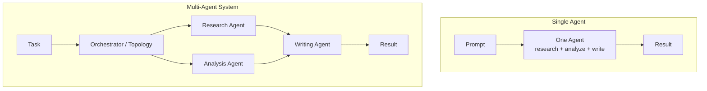

多智能体系统（Multi-Agent System）是由一组相互独立的 AI 智能体组成的系统，每个智能体都有自己的角色、指令，往往还有各自的模型，它们通过一套明确的结构进行沟通与协调，共同完成单个智能体难以独立胜任的任务。与其用一个提示词（Prompt）让模型在同一次运行中完成研究、分析、写作和事实核查，不如把工作拆分给多个专职智能体，再由一层编排逻辑决定它们的运行顺序、各自能看到什么信息，以及如何把各自的输出汇合成最终结果。这么做的意义不在于智能体数量越多越好，而在于让系统的结构去匹配任务本身的结构。

这个定义讲清楚了机制，但更值得追问的是：这种模式为什么会存在，以及它到底在什么情况下真正优于直接调用一个非常强的单一模型。

## 为什么单次 LLM 调用会遇到天花板

对于目标单一、上下文有限的任务——比如总结这份文档、给这张工单分类、起草这封邮件——单个提示词发给单个模型的效果通常很好。但一旦任务包含多个相对独立、且各自需要不同关注方式的子目标，这种做法就开始吃力了。

如果让一个智能体去调研某个市场、分析调研结果，再写出一份精美的报告，你实际上是在要求一个系统提示词、一个上下文窗口同时承载调研指令、分析的严谨性和文笔的质量。实践中，这往往会产生一种"平均化"的结果：调研显得有点浅，因为模型同时还要顾及行文语气；写作显得有点生硬，因为模型手里还攥着一堆原始数据。上下文窗口里塞满了无关的中间推理过程，纠错也无处发生（没有单独的环节能在调研智能体的错误传递给写作智能体之前把它拦下来），也没办法在任务中不需要最强模型的部分换用更便宜或更快的模型。

多智能体系统通过任务分解来解决这个问题。调研智能体的整套系统提示词、上下文和工具集都可以围绕"查找并整理信息"来构建。分析智能体只会看到干净的调研输出，而不必接触收集信息的过程。写作智能体只看结论，不看原始数据。每个智能体负责的事情更窄，这意味着提示词更短、更聚焦，相关上下文更小，也多了一个环节，可以让人类或另一个智能体在工作流转到下游之前先审查一遍。

## 多智能体系统由什么构成

抛开各个框架各自的术语，多智能体系统其实可以归结为四个要素：

- **智能体（Agents）。** 最基本的工作单元。在 Swarms 框架中，`Agent` 被定义为"最基础的构建模块"，它把 LLM（推理能力）、工具（外部函数与 API）、记忆（对话历史与上下文）整合为一个自主实体。每个智能体都有一个定义其角色的系统提示词、自己的模型选择、自己的循环次数，因此可以独立于系统中其他任何智能体进行调优。
- **角色（Roles）。** 每个智能体真正负责的内容。角色不只是一个标签，而是一条边界："研究员"智能体的系统提示词不应该同时去规定最终格式，"审阅者"智能体的职责是评审输出，而不是从零生成内容。清晰的角色边界，正是防止多智能体系统退化成"拆分成多次 API 调用的一个巨大、松散的提示词"的关键。
- **通信（Communication）。** 一个智能体的输出如何变成另一个智能体的输入。这可以简单到把一个智能体的文本回复直接传给下一个智能体的提示词，也可以复杂到像群聊模式那样，维护一份共享的消息日志，供对话中的每个智能体读取。这种交接的具体机制——传递什么、总结什么、丢弃什么——在实践中非常关键；我们在[《智能体间高级通信协议》](/blog/agent-communication-protocols)一文中对此有详细探讨。
- **编排与拓扑结构（Orchestration and Topology）。** 决定哪个智能体在何时运行、接收什么输入、结果如何汇聚的那一层。这才是系统真正的架构，也是大多数人说"多智能体系统设计"时真正指代的部分。Swarms 对此有直接的定义：一个 swarm 是"多个智能体协同工作以完成复杂任务的集合"，延伸来看，就像单个智能体把 LLM、工具与记忆整合在一起一样，swarm 把具有不同专长、不同视角、不同能力的多个智能体整合在一起，用来解决单个智能体无法独自解决的问题。

## 常见拓扑结构一览

编排层可以按几种反复出现的固定形态来搭建。Swarms 把每一种都实现为一个独立、有明确名称的构件，这也让我们能具体地、而不是抽象地看清这个模式空间：

- **顺序型（Sequential）。** 智能体按固定顺序依次运行，每一个都建立在前一个的输出之上：A 产出的内容由 B 消费，B 产出的内容再由 C 消费。Swarms 称之为 `SequentialWorkflow`。
- **并发型（Concurrent）。** 多个智能体针对同一输入并行运行，各自贡献独立的视角，再把结果汇总回来。Swarms 的 `ConcurrentWorkflow` 就是专为此设计的。
- **图 / DAG 型（Graph / DAG）。** 顺序型的更一般版本：智能体构成一个有向图而非一条直线，支持严格顺序无法表达的分支与"扇入 / 扇出"模式。Swarms 将其实现为基于图的工作流执行，这也正是 [Swarms Cloud 工作流构建器（Workflow Builder）](/blog/workflow-builder-swarms-cloud)让你可视化组合的同一套模型。
- **层级型（Hierarchical）。** 由一个主管或经理智能体协调一组专职的执行智能体，负责分配子任务并整合结果，而不是让每个智能体都直接与其他所有智能体对话。Swarms 的 `HierarchicalSwarm` 遵循的正是这种"主管—执行者"模型。
- **智能体混合型（Mixture of Agents）。** 若干"专家"智能体从不同角度并行处理同一输入，再由一个专门的聚合智能体把这些输出综合成一个答案。Swarms 将其实现为 `MixtureOfAgents`。
- **群聊型（Group Chat）。** 智能体共同参与一个共享对话线程，能够看到并回应其他智能体说过的话，适合那些更受益于辩论或来回讨论、而非严格交接的任务。Swarms 的 `GroupChat` 构件正是为此而生。
- **动态 / 任意路由型（Dynamic / Arbitrary Routing）。** 有些系统根本不适合固定形态：下一个运行哪个智能体，取决于前面产出内容的具体情况。Swarms 的 `AgentRearrange` 专门支持这种自定义的非线性流程模式，而 `SwarmRouter` 构件则可以针对给定任务动态选择使用上述哪种架构。

这些拓扑结构没有哪一种是普遍意义上的"最优"。一个每个阶段都严格依赖上一阶段的文档处理流水线，天然适合顺序型；一组同时检查同一处代码改动的安全性、风格和正确性的专家评审小组，天然适合并发型，如果需要把结果综合起来，则更适合智能体混合型；一个子调查数量无法预知的大型研究任务，天然适合层级型，因为主管智能体可以随着需求的逐步明确动态创建执行者，而不必一开始就把整张图画好。

## 多智能体系统实际用在哪里

这并不是一个纸上谈兵的架构模式；只要任务存在能从不同专长或不同模型中受益的自然子目标，它就会出现：

- **研究与综合。** 调研智能体收集并整理信息，分析智能体从中得出结论，写作智能体产出最终报告，每个阶段都使用适合其具体工作的提示词和模型。
- **文档与数据流水线。** 提取智能体从非结构化输入中抽取结构化数据，校验智能体依据业务规则进行检查，格式化智能体产出最终结果，每一步都可以独立检查、独立替换。
- **多视角评审。** 同一份工作成果——代码、文档或设计——由多个专职智能体（安全评审、风格评审、正确性评审）并行审查，再由一个汇总智能体把这些结论整合成一条建议。
- **带升级机制的客户对接工作流。** 一线智能体直接处理常规请求，把超出其能力范围的问题交给能力更强或更专精的智能体，这与人类客服团队分诊、升级问题的方式如出一辙。
- **开放式、探索性任务。** 当工作的确切形态事先无法确定时，主管智能体可以在运行时动态创建并分配子智能体，而不必要求整条流水线提前手工画好，这对那些范围要到做到一半才逐渐清晰的研究或调查任务尤其有用。

## 需要权衡的取舍

多智能体系统不是没有代价的。流水线里每多一个智能体，就多一份延迟（更多串行的 LLM 调用）、多一份成本（处理的总 token 数更多），而一个分解得很糟糕的系统——角色相互重叠，或者智能体之间传递的是嘈杂、未经过滤的上下文——最终效果可能还不如一次提示词写得好的单次调用。是否走向多智能体架构，应该由任务本身的结构来决定：存在能从不同提示词、不同模型或独立验证中受益的清晰子目标，是一个好的信号；而一个说到底"就是一件事，把它做好"的任务，通常并不需要。

## 链接与资源

| 资源 | 链接 |
| --- | --- |
| Swarms 概念文档：智能体 | [docs.swarms.world/concepts/agents](https://docs.swarms.world/concepts/agents) |
| Swarms 概念文档：Swarm | [docs.swarms.world/concepts/swarms](https://docs.swarms.world/concepts/swarms) |
| 架构总览 | [docs.swarms.world/architectures/overview](https://docs.swarms.world/architectures/overview) |
| 工作流构建器深度解析 | [/blog/workflow-builder-swarms-cloud](/blog/workflow-builder-swarms-cloud) |
| 智能体通信协议 | [/blog/agent-communication-protocols](/blog/agent-communication-protocols) |
| 官方文档 | [docs.swarms.ai](https://docs.swarms.ai) |
| Discord 社区 | [discord.gg/VapjxpSyHC](https://discord.gg/VapjxpSyHC) |

---

*有问题或反馈？欢迎加入我们的 [Discord 社区](https://discord.gg/VapjxpSyHC)，或查阅[官方文档](https://docs.swarms.ai)。*
