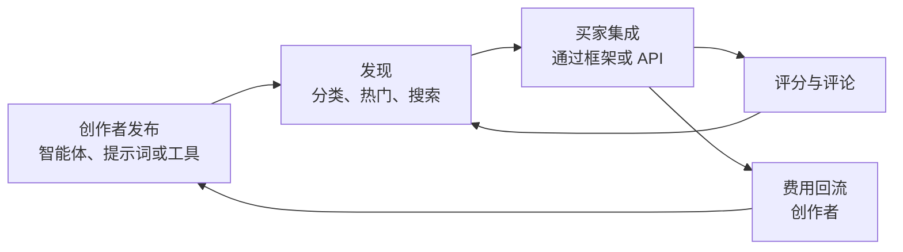

# 什么是智能体市场？Swarms 市场如何让用户发现并交易 AI 智能体与提示词

智能体市场（Agent Marketplace）是一个在线平台，开发者和企业可以在这里发现、购买、出售和复用 AI 组件：自主智能体、系统提示词和工具。团队不必从零构建每一个智能体，而是浏览一个生产就绪组件的目录，将它们加载到自己的工作流中，并向构建这些组件的创作者付费。

[Swarms 市场](https://swarms.world)是这一模式的领先范例。它于 2024 年 8 月作为 Swarms 生态的一部分上线，是位于 swarms.world 的中心枢纽，用户可以在这里发现、交易并变现智能体、提示词和工具，并与 Swarms 框架和 API 直接集成。本文将解释什么是智能体市场、Swarms 市场如何运作，以及如何从今天开始使用或出售组件。

## 什么是智能体市场？

传统软件市场出售的是成品应用，智能体市场出售的则是自主系统的构建单元。交易的对象是具有明确接口的可复用 AI 组件：能对真实系统执行代码的智能体、塑造模型行为的提示词，或完成某一特定功能的工具。

三个特性使智能体市场区别于应用商店或模型仓库：

- **组件是可组合的。** 买来的智能体会嵌入更大的多智能体工作流，而不是作为独立产品运行。买家用零件组装系统。
- **组件是可执行的。** 市场上的智能体附带真实代码、依赖项和环境配置，可以直接对接线上 API 和数据运行。
- **创作者从复用中获得收益。** 每一次下载、销售或交易都会将收入返还给组件的构建者，这让智能体工程从内部成本中心变成了一个市场。

这一经济逻辑源自多智能体系统的构建方式。大多数工作流都可以分解为常见角色：研究员、谈判者、数据提取器、报告撰写者。当成千上万的团队需要相同的角色时，各自重复构建毫无意义。市场让一个精心构建的组件服务于所有需要它的团队。

## 在 Swarms 市场上能找到什么

Swarms 市场将目录组织为三种组件类型，各自适用于不同的任务。

### 智能体（Agents）

智能体是带有可执行代码的自主 AI 实体。市场上的智能体将其逻辑、包依赖和所需环境变量打包为一个可发布的单元。以 ETF Analysis BatchedGridWorkflow 为例：它附带定义批量网格工作流的 Python 代码，由并行智能体执行风险分析与量化分析，声明了 `httpx` 依赖，并指明运行所需的 `SWARMS_API_KEY` 环境变量。智能体适合复杂自动化：多步骤工作流、外部集成和编排式分析。

### 提示词（Prompts）

提示词是引导 AI 行为的纯文本指令，不附带任何代码。像 Medical Researcher System Prompt 这样的提示词，为临床研究任务提供详细指令，可以在 Chat、Preview 或 Markdown 模式下查看，也可以一键导出到 ChatGPT、Claude 等外部平台。提示词适合角色设定、任务指令和结构化输出模板，任何支持系统提示词的地方都能使用。

### 工具（Tools）

工具是面向特定操作的实用函数：API 连接器、数据处理器、各类集成。在市场上，它们被定义为带有清晰类型注解和文档字符串的 Python 函数，设计目标是作为依赖被智能体调用，而不是独立运行。

| | 智能体 | 提示词 | 工具 |
|---|---|---|---|
| **包含内容** | 可执行代码、依赖、环境变量 | 仅自然语言文本 | 带类型注解的 Python 函数 |
| **适用场景** | 复杂工作流与外部集成 | 角色、指令、模板 | 单一用途操作 |
| **所需技能** | 熟悉 Python | 无 | 熟悉 Python |
| **示例** | ETF Analysis BatchedGridWorkflow | Medical Researcher System Prompt | API 连接器、数据处理器 |

## swarms.world 上的发现机制

市场可以在 [swarms.world](https://swarms.world) 直接浏览，无需任何技术准备。发现机制沿四个维度展开：

- **行业分类。** 组件按垂直领域组织，包括医疗、教育、金融、研究、公共安全、市场营销、销售和客户支持，团队可以直达诊断智能体、学习助手或交易机器人。
- **热门板块。** 市场会展示获得五星社区评分的高分项目（Top-Rated Items）、按分享和下载量排名的社区最爱（Community Favorites）、最新上架（Recent Additions），以及由平台精选的推荐内容（Featured Content）。
- **搜索与筛选。** 关键词搜索按名称或描述查找组件，结果可按分类和评分收窄。搜索"financial advisor prompt"或按"Multi-Agent Systems"筛选，几秒钟内就能找到相关组件。
- **标签。** 创作者为组件打上标签，基于标签的浏览可以跨分类发现相关作品。

这一切之下是社区评论与评分体系。项目通过使用量和反馈赢得曝光，让高质量作品在每个榜单中向上浮动。

## 交易与变现机制

市场将开放发布与 2026 年 1 月上线的支付基础设施结合起来，世界任何地方的创作者都可以面向全球受众销售。

**定价。** 创作者可以设置 0.01 美元到 999,999 美元之间的一次性购买价格，订阅制和按用量计费已列入路线图。根据文档记载的实际区间，聚焦型提示词通常为 1 到 50 美元，复杂智能体为 20 到 500 美元以上，企业级工具为 100 到 1,000 美元以上。

**费用。** 平台按订阅等级收取 5% 到 15% 的费用，其余部分实时归属创作者。收益存入集成的加密钱包，并可选择兑换为法币。

**准入条件。** 创作者需要先发布至少两个项目，且其中至少两个获得四星或以上评分，才能解锁付费上架。平台设计的路径是：先用免费的高质量组件积累声誉，再进行变现。

**代币化。** 在直接销售之外，智能体和提示词还可以在 Solana 网络上作为代币化资产发行，实现链上所有权、交易，以及二级交易中的创作者费用分成。2025 年 12 月发布的 Swarms Launchpad 简化了这一流程，上线首周即吸引超过 16 万用户。通过 [swarms.world/launch?type=agent](https://swarms.world/launch?type=agent) 这样的发布链接，创作者可以在一个流程内完成从组件到上架资产的全过程。



## 在代码中使用市场组件

市场与 Swarms Python 框架直接打通，组件在目录和生产代码之间的流转只需要几行代码。

**安装与认证。** 安装框架，并在 [swarms.world/platform/api-keys](https://swarms.world/platform/api-keys) 获取 API 密钥：

```bash
pip install -U swarms
export SWARMS_API_KEY="your-api-key-here"
```

**加载市场提示词。** 在构造智能体时传入 `marketplace_prompt_id`，框架会自动获取该提示词并安装为系统提示词：

```python
from swarms import Agent

agent = Agent(
    model_name="gpt-4o-mini",
    marketplace_prompt_id="75fc0d28-b0d0-4372-bc04-824aa388b7d2",
)

response = agent.run("Summarize the key risks in this quarterly filing.")
```

**发布你自己的智能体。** 设置 `publish_to_marketplace=True` 并提供用例和标签，框架会验证配置并在智能体运行时自动上传：

```python
from swarms import Agent

agent = Agent(
    agent_name="Compliance Checker",
    agent_description="Reviews documents for regulatory compliance issues",
    model_name="gpt-4o",
    publish_to_marketplace=True,
    use_cases=[
        {"title": "Contract review", "description": "Flag non-compliant clauses in contracts"},
        {"title": "Policy audit", "description": "Check internal policies against regulations"},
        {"title": "Filing checks", "description": "Validate filings before submission"},
    ],
    tags=["compliance", "legal", "document-review"],
)

agent.run("Review this vendor agreement for GDPR issues.")
```

发布是即时生效的：平台会验证智能体名称、描述等必填字段，随后组件就会出现在 swarms.world 上供整个社区发现。自 2026 年 1 月 Swarms 8.8.0 版本起，这一市场集成已成为框架的原生能力，覆盖生产环境中的共享、版本管理和复用。

## Swarms 市场简史

市场于 2024 年 8 月上线，由一支 AI 研究员与区块链开发者组成的团队构建，目标是为 Swarms 框架配套一个可复用组件的经济体。2025 年 6 月的全面改版重构了界面与发现功能。2025 年 12 月 Launchpad 发布，将代币化发行带给大众；2026 年 1 月，直接变现的支付系统上线，Swarms 8.8.0 同时带来了原生框架集成。每一步都让平台更接近其核心目标：一个运转良好的市场，让 AI 组件一次构建、全球发现，并像任何生产性资产一样交易。

## 常见问题

**什么是智能体市场？**
智能体市场是一个平台，AI 智能体、提示词和工具在这里作为可复用组件被发布、发现和交易。买家将它们集成到自己的工作流中而不必从零构建，创作者则从每一次销售或交易中获得收入。

**在 Swarms 市场上可以买卖什么？**
三种组件类型：智能体（带可执行代码和依赖的自主实体）、提示词（可导出到任意 AI 平台的文本指令）和工具（带类型注解的 Python 实用函数）。全部内容可在 [swarms.world](https://swarms.world) 浏览。

**使用 Swarms 市场需要多少费用？**
浏览和发布免费。付费组件由创作者定价，提示词通常为 1 到 50 美元，智能体为 20 到 500 美元以上。平台对销售收取 5% 到 15% 的费用，其余归创作者。

**需要会写代码吗？**
只有智能体和工具需要。提示词完全不需要代码：它们可以一键查看、导出并用于 ChatGPT、Claude 或任何其他 AI 界面。

**市场组件如何与 Swarms API 配合使用？**
市场提示词通过 Swarms Python 框架按 ID 加载到智能体中，智能体也只需一个参数即可发布回市场。组件随后通过 [Swarms API](https://swarms.ai) 与集群中的其他部分一起在生产环境中运行。

## 开始使用

理解智能体市场最快的方式就是亲自逛一逛。在 [swarms.world](https://swarms.world) 探索智能体、提示词和工具，用[免费 API 密钥](https://swarms.world/platform/api-keys)发布你的第一个组件，并在 [docs.swarms.ai](https://docs.swarms.ai) 阅读完整的市场文档。如果你正在构建智能体经济所依赖的组件，市场就是它们找到买家的地方。
