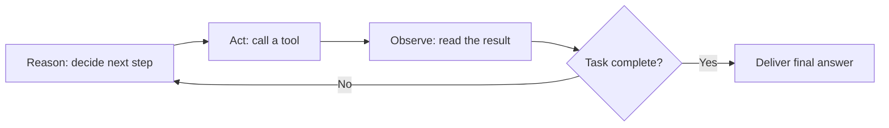

# 什么是 AI 智能体？大语言模型、工具、记忆与循环结构

"智能体（Agent）"已经成为 AI 领域被滥用得最严重的词。厂商把聊天机器人叫做智能体，把调用两次 API 的脚本也叫做智能体。这个词承担了太多营销任务，以至于它原本精确的工程含义几乎已经消失。

这个工程含义值得被找回来，因为它非常精确。一个智能体恰好由四个部分构成：

1. **LLM（大语言模型）**：推理核心。
2. **工具（Tools）**：作用于外部世界的能力。
3. **记忆（Memory）**：能够跨越单次提示而持续存在的状态。
4. **循环结构（Looping Structure）**：推理、行动、观察不断重复，直到任务完成的循环。

去掉其中任何一项，剩下的就是别的东西：一个聊天机器人，一条流水线，一个搜索引擎。把这四项全部组合起来，才得到大家真正在谈论的东西：一个你可以交给它*目标*而不是具体指令的系统。

## 组成部分一：LLM，推理核心

每个智能体的中心都是一个大语言模型（LLM）。它负责读取任务、形成计划、决定下一步该做什么，并解读返回的结果。架构中的其他一切部分，存在的意义都是为了给这个核心提供更好的信息，并执行它做出的决定。

在实践中，有两个特性很关键：

- **LLM 是决策者，不是数据库。** 它在智能体中的职责不是知道一切，而是根据任务、记忆和最近一次的观察结果，决定下一步该做什么。知识存在于工具和记忆中，判断力存在于模型中。
- **核心是可替换的。** 一个搭建良好的智能体应当是模型无关的。同一个智能体定义应当能够在 GPT、Claude、Gemini 或本地模型上运行，并且升级到下一代模型时无需重写代码。智能体的智能水平会随着每一次模型发布而免费提升。

## 组成部分二：工具，智能体的双手

单靠 LLM 只能生成文本。工具（Tools）才是把文本转化为实际结果的部分：搜索网页、查询数据库、读写文件、调用内部 API、执行代码、发送消息。

从机制上看，一个工具其实就是一个带有描述性接口的函数。模型会看到这个函数的名称、参数以及它的作用；当模型判断调用这个函数是正确的下一步时，它会生成一次结构化调用，由运行时执行，并把结果反馈回来。像 MCP（Model Context Protocol）这样的标准，把这一点进一步推进，让任意智能体无需自定义集成，就能连接到整套工具服务器。

工具决定了智能体的*行动范围*。没有工具的智能体只能提供建议，拥有工具的智能体才能真正做事。

## 组成部分三：记忆，持续存在的状态

一个纯粹的 LLM 在对话结束的瞬间就会遗忘一切，即便在对话内部，它也只能记住上下文窗口所能容纳的内容。智能体需要更多，通常分为两层：

- **短期记忆**是当前任务的工作状态：目前已经执行的步骤、工具返回的结果，以及中间结论。它存在于上下文中，正是它让第 7 步和第 2 步保持一致。
- **长期记忆**能够跨任务、跨会话存活：向量数据库和 RAG 层让智能体可以按需回忆过去的项目、学到的偏好以及领域文档，即使这些内容早已滚出了上下文窗口。

记忆是区分"会不断进步的智能体"和"每天早上都从零开始的智能体"的关键。从系统层面看，记忆也正是智能体的身份不断积累的地方：它见过什么、决定过什么、学到过什么。

## 组成部分四：循环结构，让它具备自主性

前三个组成部分是原材料，循环结构才是架构本身。它是大多数讲解都会跳过的部分，却是"到底是什么让智能体成为智能体"这个问题的真正答案。

聊天机器人的生命周期只有一次：输入提示，输出答案。智能体的生命周期是一个循环：



模型推理下一步该做什么，通过工具采取行动，观察结果，更新自己的记忆，然后*再次做出决定*，每一次迭代都基于此前发生的一切。API 调用失败了？换一种方式重试。搜索没有结果？重新组织查询。子任务完成了？转向下一个。没有人在步骤之间重新提示这个系统，是循环结构自己在推动。

循环结构让智能体得以*自主*运作。自主性并不是更大的模型带来的某种神秘属性，它是一种控制结构：能够持续推进、根据刚发生的事情做出调整，并在目标达成时停下来，而不是在输出结束时停下来。在实践中，循环结构也承载着安全护栏：迭代次数上限、预算上限，以及决定何时退出的完成检查。

## 什么不是智能体

这个定义的价值，恰恰体现在它排除了哪些东西：

- **聊天机器人**拥有 LLM，也许还有记忆，但没有工具，也没有循环结构。它只会回答，不会行动。
- **一次性工具调用**（询问模型、运行一个函数、返回结果）拥有 LLM 和工具，但没有循环结构。它无法从糟糕的第一步中恢复。
- **固定流水线**（提示 A 的输出喂给提示 B，提示 B 的输出再喂给提示 C）有结构，但没有决策。路径永远不会改变，所以本质上没有任何东西在被"决定"。

这些都不是低劣的系统，它们往往正是合适的选择。但它们的行为方式与智能体有本质区别，因为它们无法在任务执行过程中做出调整。

## 动手构建一个

在 [Swarms 框架](/framework)中，这四个组成部分直接映射到 `Agent` 类上：

```python
from swarms import Agent

agent = Agent(
    agent_name="Research-Agent",
    model_name="gpt-4o",              # the LLM core, swappable
    system_prompt="You are a meticulous research assistant.",
    tools=[web_search, read_pdf],      # plain Python functions
    max_loops=5,                       # the looping structure
)

result = agent.run(
    "Find the three most cited papers on multi-agent systems "
    "from the last year and summarize each in two sentences."
)
```

`model_name` 就是推理核心，`tools` 是智能体可以调用的普通 Python 函数，记忆是内置的且可通过 RAG 扩展，`max_loops` 则限定了"推理，行动，观察"这一循环的边界。把 `max_loops` 设为 1，你得到的是一个一次性助手；给它足够的空间去迭代，它就成为了一个智能体。

## 从单个智能体到多智能体

单个智能体是原子。真正有趣的化学反应，始于把多个专业化的智能体连接成协作结构：流水线、层级结构、辩论机制，以及能够互相推理和验证彼此工作的智能体群。这正是[多智能体系统](/blog/what-is-a-multi-agent-system)的起点，也是通往[集体超级智能](/blog/what-is-collective-superintelligence)之路的起点。

但这一切都建立在这个四要素的基础之上：用 LLM 来思考，用工具来行动，用记忆来记住，用循环结构来持续推进，直到任务完成。

**我们正在招募人才来构建 CSI。** 加入我们的研究团队：[swarms.ai/hiring](/hiring)

立即开始构建：[swarms.ai](https://swarms.ai) · [GitHub](https://github.com/kyegomez/swarms) · [Discord](https://discord.gg/EamjgSaEQf)
