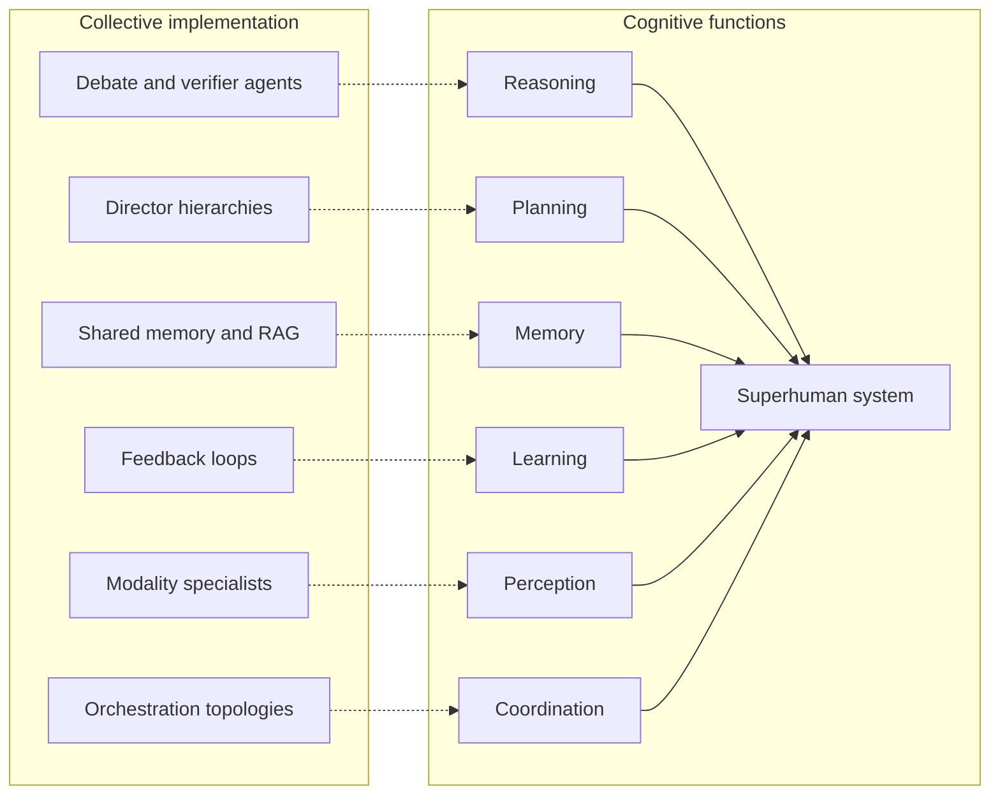

# 什么是认知超级智能？

"超级智能"这个词被用得很随意。有时它指的是一个写邮件比你更好的聊天机器人，有时它指的是科幻小说里那种近乎神明的机器。这两种理解，对真正在构建 AI 系统的人来说都没什么用。

认知超级智能（Cognitive Superintelligence）是一个更精确的概念。它描述的是这样一种系统：它超越最优秀的人类思维，不是在某一项任务上，也不是在某一个基准测试上，而是在推理、规划、学习、记忆、感知和协调这些核心认知功能本身上全面超越。智能不是一个单一的旋钮，而是一组彼此独立的能力。当一个系统在整套能力上同时达到超人类水平时，你得到的就是超级智能。

这篇文章将严谨地定义这个术语，把它与 AGI（通用人工智能）、ASI（超级人工智能）区分开来，拆解真正重要的认知功能，并解释为什么我们认为，最早出现的认知超级智能系统将是由专业化智能体组成的集体，而不是某一个体量巨大的单一模型。

## 定义

**认知超级智能是这样一种系统：它的表现在每一项核心认知功能上，都同时且持续地超越最优秀的单个人类，以及最优秀的人类组织。**

这句定义里的每个词都有其含义：

- **每一项核心功能。** 在国际象棋或蛋白质折叠上超越人类，只是狭义超级智能。认知超级智能要求整套能力都到位：推理、规划、记忆、学习、感知和协调，缺一不可，且要同时具备。
- **最优秀的人类组织，而不只是个人。** 地球上真正的认知前沿，从来不是某个天才，而是一个研究实验室、一家公司、一个市场。一个能打败某个人、却打不过一支运转良好的团队的系统，谈不上真正意义上的超级智能。
- **同时。** 一个需要重新配置才能从法律推理切换到财务规划的系统，并不具备通用认知能力，它只是拥有可替换的狭义认知模块。
- **持续。** 一旦上下文被填满就性能衰退，或者在高负载下悄无声息地失效，这样的认知达不到超级智能的门槛。所谓超人类，指的是在生产环境中的超人类表现，而不是演示环节里的超人类表现。

## 它与 AGI、ASI 有何不同

我们熟悉的那个阶梯是：狭义 AI，然后是 AGI，然后是 ASI。这个阶梯描述的是*单个心智有多聪明*。认知超级智能是另一种衡量方式：它描述的是*这个系统在认知的各项功能上究竟能做到什么*，而且它并不关心这个系统究竟是一个心智，还是许多个心智的集合。

| 术语 | 主张的内容 | 分析单位 |
| --- | --- | --- |
| 狭义 AI | 在某一项任务上超越人类 | 单个模型 |
| AGI | 人类水平的通用性 | 单个心智 |
| ASI | 在所有方面都超越人类 | 单个心智 |
| 认知超级智能 | 在每一项认知功能上都超越人类 | 系统本身，无论其中包含多少个心智 |

这个区分很重要，因为"单一心智"这种框架偷偷带入了一个假设：通往超级智能的路径，就是把一个模型做得更大。但超人类认知的定义里，并没有任何地方要求必须是单一模型，它要求的是超人类的*功能*，而功能是可以被工程化实现的。

## 认知的六项功能

如果超级智能意味着在整个认知能力栈上超越人类，我们就应该明确说清楚，这个能力栈究竟包含什么。

1. **推理。** 从证据中得出正确结论，发现矛盾之处，并知道什么时候一个结论其实站不住脚。真正难的部分不是生成一连串的思考过程，而是对其进行验证。
2. **规划。** 把目标拆解成步骤，在各种约束条件下对步骤排序，并在世界发生变化时重新规划。规划的质量，正是有用的工作与看似合理实则空转的活动之间的分水岭。
3. **记忆。** 在跨会话、跨项目、跨年份的时间尺度上，记住发生过什么、学到了什么、以及做过哪些决定。人类组织靠文档、数据库和制度来解决这个问题。单一模型靠一个上下文窗口来解决它，也就是说，它其实并没有解决。
4. **学习。** 从反馈中持续改进，而不需要从头重新训练。一个重复昨天错误的系统，无论基准测试分数多高，都算不上认知超级智能。
5. **感知。** 摄入每一种重要的模态信息：文本、代码、图像、表格、遥测数据、市场数据。感知是认知的输入带宽。
6. **协调。** 最被低估的一项功能。拆分工作、化解分歧、把局部结果汇聚成一个连贯的整体。人类历史上每一项大规模成就，本质上都是协调的成就。任何不具备协调能力的系统，其认知能力都无法扩展到超出单一注意力线程的范围。

请注意这份清单揭示的一个事实：人类在这些功能中的任何一项上，都不是靠个体单打独斗达到巅峰表现的，我们是*靠组织制度*实现的。同行评审是工程化的推理，项目管理是工程化的规划，图书馆是工程化的记忆，市场是工程化的协调。地球上最好的认知能力，本身就已经是集体性的。

## 为什么最早的认知超级智能将是一个集体

这个观察直接指向了架构选择。通往超人类认知，存在两条候选路径：

**路径一：把单一模型不断做大，直到它在所有方面都达到超人类水平。** 这条路径在每一步都在与物理规律和经济规律对抗。一个上下文窗口决定了记忆的上限，一条推理流决定了吞吐量的上限，一套权重意味着单一的故障域、单一的视角，以及没有内部的第二意见。即便模型本身变得极其出色，建立在它之上的*系统*，依然继承了所有这些天花板。

**路径二：从许多专业化智能体出发，把每一项认知功能显式地工程化出来。** 推理变成提议者、批评者与验证者之间的辩论。规划变成一个总监智能体，在层级结构中把目标层层拆解。记忆变成永不翻篇的共享存储与 RAG 层。学习变成对提示词、工具和路由策略的更新，而不是对权重的重新训练。感知变成为每一种模态配备的专业智能体。协调本身就变成了编排的拓扑结构。

在路径二上，超人类的功能不再是一种寄希望于涌现的期待，而是一个工程目标。你可以测量推理层的错误率、记忆层的召回率、规划器的重新规划延迟，并对每一项分别进行改进。这正是[集体超级智能（Collective Superintelligence，CSI）理论](/blog/collective-superintelligence)的核心：天花板永远在于网络本身，而不在于某个节点。认知超级智能是一个构建良好的集体所*拥有*的属性；集体超级智能，是你*获得*它的方式。

## 你要如何一眼认出它

基准测试不会替你宣布认知超级智能的到来，因为基准测试考察的只是实验室条件下的狭窄切片。真正的检验标准是经济性和可运营性：

- 系统能够端到端地完成跨越数周、跨越多个领域的项目，达到的质量水平，是最优秀的人类团队无论花多少钱都无法企及的。
- 随着工作量增加，它的错误率反而*下降*，因为验证能力会随着智能体集群的规模一起扩展。
- 它记得住过往每一次交互中所有相关的信息，并且它的表现会随着这些记忆的积累而肉眼可见地持续复利式增长。
- 移除其中任何一个组件，系统的表现是优雅地退化，而不是直接崩溃。

当一个系统满足了这些条件，再去争论它是不是"真正"的超级智能，就会变得像争论一个市场是不是"真的"比某个交易员更聪明一样学究气十足。结果本身，就已经回答了这个问题。

## 正在为此打造的基础设施

Swarms 技术栈中的每一个基础组件，都对应着这六项功能中的一项：面向协调与规划的[15 种以上的编排架构](/framework)，面向推理的多智能体辩论与多数投票机制，面向记忆的共享存储与 RAG 集成，以及一个[开放的智能体市场](https://swarms.world)，在这里，面向感知和各类专业领域技能的智能体都可以被发现和组合使用。

认知超级智能不是一个只能等待其降临的预言，而是一个需要被工程化实现的系统属性，要一项功能接着一项功能、一个智能体接着一个智能体地去构建。而这，正是我们正在做的事情。

**我们正在招聘，一起构建 CSI。**欢迎加入我们的研究团队：[swarms.ai/hiring](/hiring)

和我们一起开始构建：[swarms.ai](https://swarms.ai) · [GitHub](https://github.com/kyegomez/swarms) · [Discord](https://discord.gg/EamjgSaEQf)
