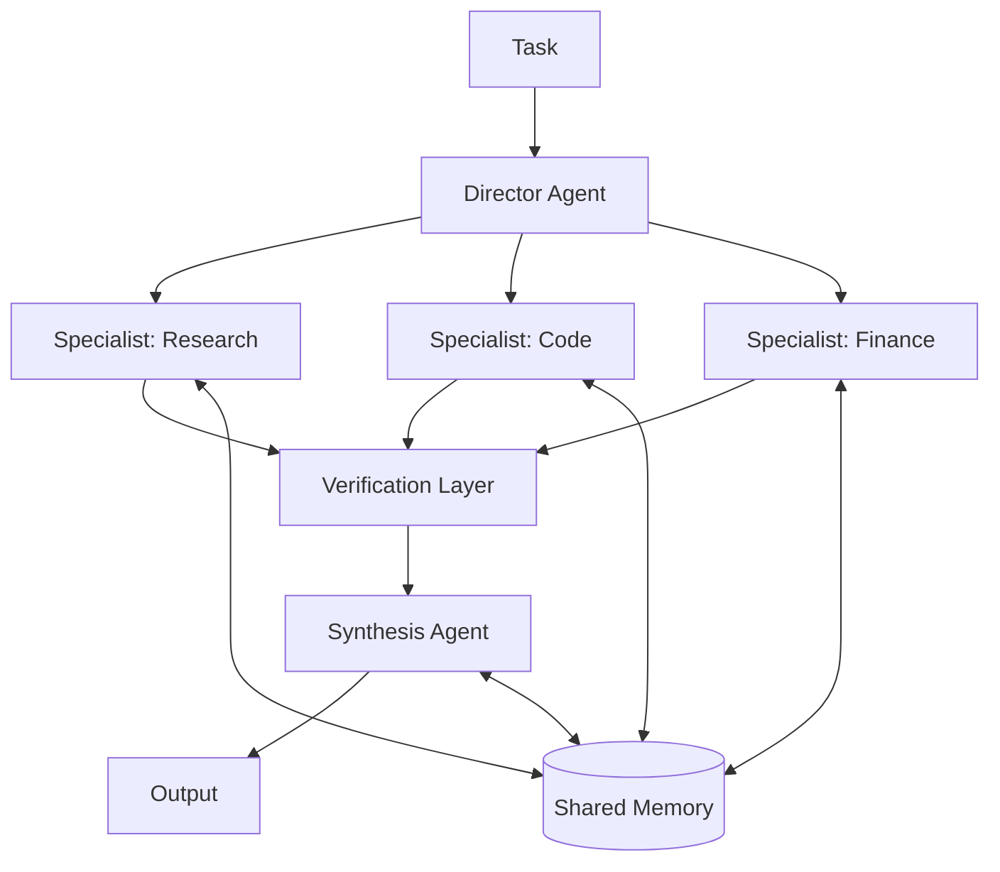

# 什么是集体超级智能？

如果你问十个人"超级智能"是什么意思，你会得到十个版本的同一幅画面：一个庞大无比的人工大脑，比任何人类都聪明，安放在某个数据中心里。这幅画面塑造了整个人工智能竞赛。但我们认为，这也是一幅错误的画面。

集体超级智能（Collective Superintelligence，简称 CSI）是一种不同的构想。CSI 不是一个具有超人智慧的单一头脑，而是一个由众多专业化 AI 智能体组成的*网络*，其综合智能不仅超越任何单一模型，也超越任何可能被构建出来的单一头脑。智能并不存在于某一个智能体之中，而是存在于整个系统之中：分工、辩论、验证、共享记忆，以及将成千上万个智能体凝聚为一个连贯整体的协调结构。

本文是一份定义性指南：CSI 是什么、由哪些部分构成、与 AGI（通用人工智能）和 ASI（超级人工智能）有何区别、它究竟如何产生超越人类的成果，以及该如何着手构建它。若想了解 CSI 为何终将胜出的完整论证，请阅读姊妹篇文章：[集体超级智能：为什么 CSI 将超越 AGI 和 ASI](/blog/collective-superintelligence)。

## 定义

**集体超级智能是由众多专业化 AI 智能体构成的系统，这些智能体通过明确的协调结构和共享记忆彼此连接，其综合能力在实际工作中，能够可持续地、大规模地超越任何单一模型或单一头脑。**

这个定义的关键之处在于智能"存在于何处"。在 AGI 的框架中，智能是某个单一模型的属性，而围绕它的系统只是管道。在 CSI 的框架中，系统本身*就是*智能。一群经过正确编排的中等规模专业智能体，能够产生连最大的单一模型也无法比拟的推理能力、记忆能力和吞吐量，原因和一家医院能胜过世界上最好的医生独自行医是一样的。

这并不是什么新现象，反而是我们所知最古老的现象之一。市场、科学乃至文明本身都是集体智能：这些系统产出的成果（价格、理论、城市）都超越了任何单一参与者所能创造甚至完全理解的范围。CSI 有意地将同样的架构应用于机器智能，靠的是工程设计，而非自然演化。

## 集体由什么构成

CSI 是一种具体的架构，包含四类组成部分。缺少其中任何一类，你得到的只是一个演示，而不是一个真正的集体。

1. **专业化智能体。** 这是最基本的单元。每个智能体都针对一项狭窄的工作进行调优：一个领域、一项技能、一种模态。例如合同条款审查员、Rust 性能审计员、市场数据摘要员。在各自领域内，专业智能体比任何通用型智能体都更便宜、更精准，而集体则能同时继承它们各自的能力巅峰。
2. **协调结构。** 这是把众多智能体连接成一个系统的拓扑结构：在层级结构中，由一个总控智能体（director）拆解目标并进行任务分派；在流水线结构中，每个阶段都在前一阶段的基础上不断打磨；在辩论结构中，提议者与批评者在得出结论前互相争论；在投票结构中，各个独立的智能体相互检验彼此的结论。拓扑结构是一种设计选择，而系统的大部分智能正是由此而来。
3. **共享记忆。** 这是超越任何单一上下文窗口寿命的存储层：向量数据库、RAG 层，以及每个智能体都可以读写的知识库。正是共享记忆让一个集体能够无限期地记住每一个项目、每一次决策和每一个错误。
4. **验证层。** 这些智能体的全部工作就是检查其他智能体：事实核查员、输出校验器、对抗性批评者。验证机制正是把众多容易犯错的"工作者"转化为一个可靠系统的关键，其原理与同行评审能把容易犯错的科学家转化为可靠科学是一样的。

## 它与 AGI 和 ASI 有何不同

我们熟悉的那把"阶梯"是这样的：先是狭义 AI，然后是 AGI，再然后是 ASI。这把阶梯上的每一级衡量的都是同一件事：*单一头脑*究竟有多聪明。而 CSI 并不是这把阶梯上的一级，它完全是另一个维度，因为它把分析的基本单位从"头脑"变成了"系统"。

| 术语 | 主张的内容 | 分析单位 | 现状 |
| --- | --- | --- | --- |
| 狭义 AI | 在单一任务上超越人类 | 单一模型 | 已经实现 |
| AGI | 达到人类水平的通用能力 | 单一头脑 | 一种预测 |
| ASI | 在所有方面都超越人类 | 单一头脑 | 一种预测 |
| CSI | 综合能力超越任何单一头脑 | 网络 | 一门工程学科，现在就可以构建 |

这张表带来两个推论。第一，CSI 并不与模型的进步相竞争，而是消费这种进步。每一个发布的更强模型，都会让集体中的每一个节点变得更强，因此集体能够在 AGI 竞赛所产生的进步之上不断复利式增长。第二，即便 ASI 真的到来，CSI 也不会因此失去意义。一个单一的超级智能头脑，终究仍是串行的，仍是单一的故障域，仍然只有一种视角。无论未来的头脑有多聪明，它的最强配置都是由许多这样的头脑组成的协调集体。天花板永远在于网络，而不在于节点。

## 额外的智能从何而来

把一个系统称为"超级智能"是一个很强的论断，因此有必要机械地、逐一拆解这种"盈余"智能究竟从何而来。一个集体通过四种具体机制超越其中最强的单个成员：

- **聚合。** 独立的智能体会犯下彼此独立的错误。投票和共识机制能够抵消这些不相关的错误，这正是为什么一个集成系统的错误率可以被压低到远低于其中任何单个成员的水平。一个模型的幻觉，会成为集体中被投票否决的异常值。
- **认知分工。** 无论人类还是人工智能，都没有哪一个单一头脑能同时在所有领域都保持巅峰专业水平。而集体则无需如此：它会把每一个子任务路由给专门为此调优的智能体，因此系统层面的表现逼近的是每个专业领域的*最高水平*，而不是通用型智能体的平均水平。
- **对抗式打磨。** 经受住攻击考验的想法，比仅仅被提出来的想法更加牢靠。集体内部"提议者，批评者，验证者"式的循环，以机器的速度应用同行评审的逻辑，在错误造成后果之前就将其拦截。
- **并行搜索。** 一个集体可以同时探索多种假设、设计或策略，并保留其中最好的结果。而单一头脑无论多么出色，一次也只能探索一条路径。搜索的广度，是唯一一种只有群体才能拥有的智能形式。

这些机制没有一个是空想推测，它们如今都已经在生产环境中的多智能体系统里切实运作。当这些机制被有意地、大规模地整合到一起时，你得到的就是 CSI。

## 它在实践中是什么样子

抛开那些宏大的术语，一个真正运作的集体是可以被识别、也可以被衡量的：

- 一个任务到达后，会被总控智能体拆解成一张由子任务组成的图，每个子任务都被路由给相应的专业智能体。
- 各个专业智能体并行工作，并在此过程中不断读写共享记忆。
- 每一个具有实际影响的输出，都必须先经过验证，然后下游环节才能依赖它。
- 故障是局部性的：一个糟糕的输出会被捕获并重新路由，一个失效节点的工作会被重新分配，整个系统会优雅降级，而不是彻底崩溃。
- 系统的表现会不断*复利式增长*：每完成一个项目，都会丰富共享记忆，而这份记忆又会被未来的每一个项目所汲取。

当一个系统能够端到端地完成跨多个领域的工作，其质量是任何单一模型都无法企及的，并且它的可靠性会随着规模的扩大而*不断提升*（因为验证能力会随着集群一起增长）时，你就知道自己看到的是真正的 CSI，而不是套了几层壳的聊天机器人。

## 如何着手构建它

CSI 不是一个你只需等待其问世的产品，而是一种需要通过工程手段构建出来的系统属性，而构建它所需的每一个基础组件，如今都已经存在于 Swarms 技术栈之中：

- **[Swarms 框架](/framework)**：提供 15 种以上的协调结构（层级化群集、智能体混合、群聊、图工作流、多数投票）作为一等基础组件，支持 Python 和 Rust，并集成了共享记忆与 RAG。
- **Swarms Cloud**：一个托管运行时，让你无需管理基础设施即可部署和扩展群集。
- **[市场（Marketplace）](https://swarms.world)**：在这里可以发现、组合和交易各种专业化智能体、提示词和工具，它们是每一个集体的原材料。

从小处着手：即使在今天，三个智能体加一个验证器，在实际工作中的表现也胜过单个智能体。然后逐步扩展拓扑结构、加深记忆层，让这个集体不断复利式成长。

**我们正在招募人才，共同构建 CSI。** 加入我们的研究团队：[swarms.ai/hiring](/hiring)

与我们一起开始构建：[swarms.ai](https://swarms.ai) · [GitHub](https://github.com/kyegomez/swarms) · [Discord](https://discord.gg/EamjgSaEQf)
